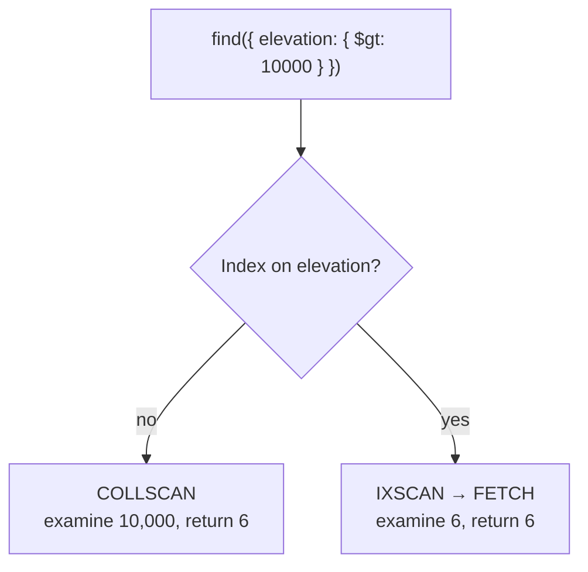

Every query so far has worked on ten thousand documents without complaint. Ten million is a different situation, and the tool for seeing which one you are in is the same idea as `16-Scaling-Reads`, wearing different names.

# Seeing what a query actually did

```text
  > db.weatherdata.find({ elevation: { $gt: 10000 } }).explain("executionStats")
```

> [!important] **`explain("executionStats")` runs the query and reports how**, rather than returning the documents. It is `EXPLAIN` from the relational world, and reading it is the whole skill.

Three fields carry almost all the information:

| Field | Meaning |
|---|---|
| **`winningPlan.stage`** | The strategy chosen |
| **`totalDocsExamined`** | How many documents were read |
| **`nReturned`** | How many were returned |

## The number that matters

```text
  executionTimeMillis: 4
  totalDocsExamined: 10000
  nReturned: 6
```

> [!important] **Ten thousand documents were read to return six.** That ratio is the finding, and it is a far better signal than the timing — on ten thousand documents the query completes in a few milliseconds regardless, and the same ratio on ten million is an outage.

> [!warning] **Do not judge by `executionTimeMillis` on a small dataset.** The same query timed at 145 ms, then 30 ms, then 0 ms on consecutive runs — caching and load make it noise. **`totalDocsExamined` is stable and honest.**

## The plan

```text
  winningPlan: { stage: 'COLLSCAN' }
```

> [!important] **`COLLSCAN` is a collection scan** — every document read and tested one at a time. Linear search, the same thing a full table scan is in a relational database, and the same thing an index exists to avoid.

# Creating an index

```text
  > db.weatherdata.getIndexes()
  [ { v: 2, key: { _id: 1 }, name: '_id_' } ]
```

> [!info] **`_id` is indexed automatically** on every collection, which is why finding a document by `_id` is fast without anyone arranging it.

```text
  > db.weatherdata.createIndex({ elevation: 1 })
  elevation_1
```

`1` is ascending, `-1` descending — the same convention as `sort`.

Running the query again:

```text
  winningPlan: { stage: 'FETCH', inputStage: { stage: 'IXSCAN' } }
  totalDocsExamined: 6
  nReturned: 6
```

> [!important] **`IXSCAN` is an index scan, and `totalDocsExamined` fell from 10,000 to 6.** The index was walked to find which documents match, then exactly those were fetched. **Ten thousand reads became six.**



> [!info] The two stages are not one. **`IXSCAN` finds the matching entries in the index; `FETCH` retrieves the documents they point at.** Two steps, exactly as a secondary index works in InnoDB.

> [!important] It will not always be this clean. A query returning 15 documents may examine a hundred, because the index narrows rather than pinpoints. **Reading a hundred instead of ten million is still the entire win.**

# Kinds of index

**Single field**, as above.

**Compound**, over several fields:

```text
  > db.weatherdata.createIndex({ elevation: 1, "airTemperature.value": 1 })
```

> [!important] Everything in `16-Scaling-Reads/03-Composite-Indexes` applies unchanged — **field order matters, and the index serves the prefixes of its key.** A dotted path indexes a nested field, which relational databases have no equivalent for.

**Text**, for searching words inside strings:

```text
  > db.weatherdata.createIndex({ type: "text" })
```

**Geospatial**, for coordinates — `2dsphere` for points on a globe, `2d` for a flat plane. They exist because proximity is a question a B-tree cannot answer: nearest to me is not a range on any single ordered value.

## The text index trap

Creating it changes nothing on the query you were already running:

```text
  > db.weatherdata.find({ type: "SAO" }).explain("executionStats")
  winningPlan: { stage: 'COLLSCAN' }
  totalDocsExamined: 10000
```

> [!warning] **The index exists and is ignored.** A text index does not accelerate equality matching. It is not the same structure as a B-tree index on the same field, and an ordinary filter cannot use it.

It works only through the operator built for it:

```text
  > db.weatherdata.find({ $text: { $search: "SAO" } }).explain("executionStats")
  winningPlan: { stage: 'TEXT_MATCH', ... IXSCAN }
  totalDocsExamined: 6
```

> [!important] **A text index requires `$text` and `$search`.** With them, six documents examined; without them, ten thousand. **Nothing warns you** — the query works, returns correct results, and is slow for a reason no error mentions.

> [!info] This is the third instance of the same failure shape in these notes, after `@Table(indexes = ...)` under `ddl-auto: validate` and `spring.redis.host` on Boot 4. **An index that exists is not an index that is used**, and only `explain` tells you which you have.

# Indexes as an idea, restated

> [!important] An index is a **separate data structure maintained alongside the data**, arranged so a query can be answered without reading everything. B-trees for ordered values, tries for string prefixes, and others besides — chosen for the question being asked.

Which fields deserve one is the same judgement as before: the ones your queries actually filter and sort on, weighed against the write cost of every index on every insert.

> [!info] Sorting benefits too, and measurably. A `sort` on an unindexed field took 96 ms; with an index on that field, 45 ms — because the index already holds the values in order and there is nothing left to sort.
