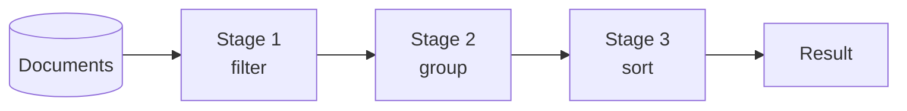

`find` retrieves documents. Some questions are not about retrieving documents at all — total sales per product, average order value per day, the highest scorer in each group. Answering those means computing across many documents and returning something none of them contained.

# The relational equivalent, and why a new mechanism

SQL answers these with `GROUP BY`, aggregate functions and `HAVING`. MongoDB has no `GROUP BY`.

> [!important] An **aggregation pipeline** is a sequence of stages, each transforming a stream of documents and passing the result to the next. The output of stage one is the input to stage two, and so on until what emerges is the answer.



> [!important] The name is literal. **A pipeline is stages joined end to end**, in the Unix sense — each does one thing to what it receives. That is what makes it more capable than `GROUP BY`: a query can filter, then group, then compute, then sort, then filter again on the computed value.

# The shape

```text
  db.collection.aggregate([ <stage>, <stage>, ... ])
```

An array, and the order is the execution order.

## Two stages, worked through

The documented example: **total quantity of medium-sized pizzas, by pizza name.**

```text
1  db.orders.aggregate([
2    { $match: { size: "medium" } },
3    { $group: { _id: "$name", totalQuantity: { $sum: "$quantity" } } }
4  ])
```

**Line 2 — `$match`** keeps only medium pizzas. It is `find`'s filter, using the same operators, appearing as a stage.

**Line 3 — `$group`** collects the survivors by name and sums their quantities.

Two things in that line are new:

> [!important] **`_id` in a `$group` stage means what to group by**, not the document's identifier. `"$name"` — with the dollar prefix — refers to the value of the `name` field. It is the `GROUP BY` column.

> [!important] **`$sum` is an accumulator**, computing across every document in a group. `$avg`, `$max`, `$min` and `$count` are the others in constant use.

Output:

```text
  [
    { _id: 'Cheese', totalQuantity: 50 },
    { _id: 'Vegan', totalQuantity: 10 },
    { _id: 'Pepperoni', totalQuantity: 20 }
  ]
```

> [!important] **None of those documents exists in the collection.** They were computed. That is the difference between aggregation and everything else in this folder — `find` returns documents you stored, aggregation returns documents it derived.

## Longer pipelines

```text
1  db.orders.aggregate([
2    { $match: { date: { $gte: ISODate("2026-01-01") } } },
3    { $group: {
4        _id: "$date",
5        totalOrderValue: { $sum: { $multiply: ["$price", "$quantity"] } },
6        averageQuantity: { $avg: "$quantity" }
7    } },
8    { $sort: { totalOrderValue: -1 } }
9  ])
```

Filter by date, group by date computing two figures, then order by one of the computed figures.

> [!important] **Line 8 sorts on `totalOrderValue`, which did not exist before line 3.** Each stage sees what the previous produced, not the original documents — which is why a pipeline can do things a single `GROUP BY` cannot.

> [!info] **`$match` early is the optimisation that matters.** A filter in the first stage reduces what every later stage handles, and can use an index; the same filter after a `$group` cannot. Putting it first is both faster and usually what you meant.

# The simple ones you have already used

> [!important] `distinct()` and `countDocuments()` are **single-purpose aggregation methods** — aggregations with the pipeline pre-written.

`distinct("type")` groups by `type` and returns the group keys. `count` groups everything and counts.

| | Single-purpose methods | Pipelines |
|---|---|---|
| Syntax | **One call** | An array of stages |
| Capability | One fixed operation | **Anything composable** |
| When | The question is exactly count or distinct | Everything else |

# What does not change

> [!warning] **Aggregation does not modify anything.** A pipeline reads documents and returns computed results; the collection is untouched — unless it ends in a `$merge` or `$out` stage, which explicitly writes the output somewhere.

> [!important] And the earlier rule still holds. **A `$match` on an unindexed field is still a collection scan**, now with grouping work stacked on top of it. `explain` works on `aggregate` exactly as it does on `find`, and it is worth running on any pipeline that will meet real data.
