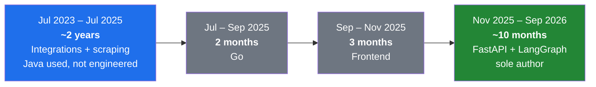
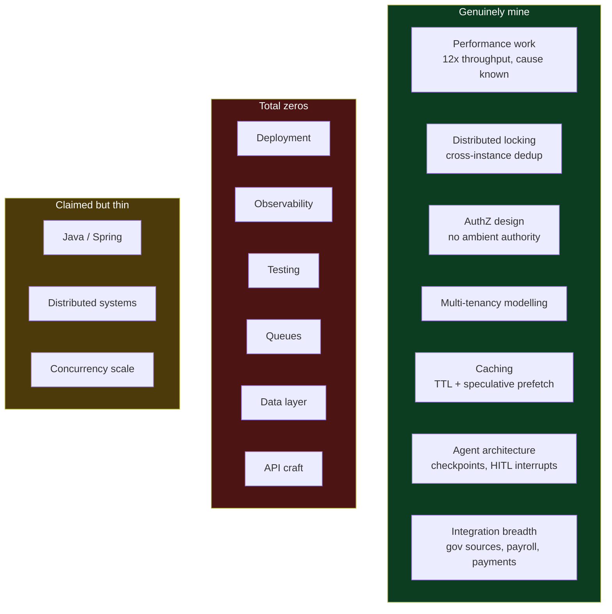

# Current Standing — Self-Reported Skill Audit

2026-09-03

> [!abstract] What this file is
> An honest audit of where my backend skills actually stand at 3 years 2 months of experience, built from a question-and-answer pass over my own resume. Nothing here is verified against code yet — every answer below is what I reported about myself. The code-verified version comes next, in a separate file, once the repos are read.

---

## The verdict

The resume presents a backend engineer. **There is no backend engineer under it.** That is not a harsh reading — it is what nine direct questions produced, and six of them came back as total zeros.

What is actually under the resume is an **integrations engineer who became an AI application engineer**. Both of those are real and both are mine. Neither is what the resume header claims.

The split between skills I lack and skills I am underselling landed at roughly **70% real gap, 30% underselling**.

---

## The real timeline

The resume says Software Engineer from January 2024 to now. That is true but it hides the shape of the work.

Two of those blocks are five months of context-switching with no depth attached. The deep work is the two years of integrations and the ten months of AI. Everything else on the resume is decoration over those two blocks.

---

## The nine-area audit

### 1 · Deployment and infrastructure

**The bar at 3-4 years:** Docker, a CI/CD pipeline I configured myself, cloud compute, environments, secrets and config management.

**What I answered:**

> Never did it. We had a DevOps guy and everything was already configured. I would make changes, merge them into release, take that branch name, use Jenkins which was also already configured, and deploy. The 2-3 steps were the same every time, only the branch name changed.

**The read:** I am a Jenkins button-presser. I have used a pipeline and never built or debugged one. If asked what happens between merge and running container, I have no answer. Total gap.

### 2 · Observability

**The bar:** structured logging, correlation IDs, dashboards I built, alerts I set, and one story about debugging production from telemetry.

**What I answered:**

> Never touched it in Java, it was already configured. Sometimes errors would come and I would open Grafana and check logs from a dashboard. Never created a dashboard. For the logs I was told to type my service name and I would get my service's logs, and that is what I followed. For LangSmith I added one config line, set langsmith = true, and traces started appearing on the free app. One or two users a day would come and I would watch what they typed. That is it.

**The read:** I am a log consumer, not an instrumenter. Typing a service name into a box someone else wired up is not observability experience, and a single config flag plus watching two users is not either. Total gap.

### 3 · Testing

**The bar:** unit and integration tests as a default habit, plus a clear sense of what gets mocked and what gets spun up.

**What I answered:**

> At my internship I would test a function or two, normal expected output from one function. That is it. Even function testing stopped after that.

**The read:** This is the most dangerous zero on the list, because it is asked in nearly every interview and it is the cheapest one to close. Right now the question of how I would test something has no honest answer from my history. Total gap.

### 4 · Async and messaging

**The bar:** a broker in production — Kafka, SQS, RabbitMQ, Celery — plus background jobs, retries, dead-letter handling, at-least-once semantics.

**What I answered:**

> Never worked on it at all. I have read about Kafka at a basic level going through high level design case studies.

**The read:** Book knowledge. It passes a definition question and fails the second follow-up — what happens on redelivery, how the consumer is made idempotent, what lands in the dead-letter queue. The resume's `worker-pool concurrency` is in-process work distribution, which is a different thing and must never be presented as message-queue experience. Total gap.

### 5 · Java and Spring depth

**The bar, given the resume header:** Spring beyond wiring — JPA and transaction boundaries, dependency injection and profiles, executors and CompletableFuture, some JVM awareness.

**What I answered:**

> I did integration only, for about 2 years. Wrote classes and interfaces and functions and that is about it. Then Go for 2 months, then frontend for 3 months, then a year on FastAPI and LangChain. Very shallow knowledge overall.

**The read:** Java is the loudest claim on the resume and has the thinnest evidence behind it — one bullet, and even that reads as a preposition rather than a thing I built. Two years of using Java as a tool for integration work is not two years of Java engineering. My own word for it was shallow, and that is accurate.

### 6 · Data layer

**The bar:** schema design decisions, index choices, migrations including zero-downtime ones, transaction and isolation reasoning, query optimization from EXPLAIN.

**What I answered:**

> I have never touched the DB layer.

**The read:** The most consequential zero of all nine, because designing a schema for a described problem is a standing item in almost every backend loop. Two years at the company with MySQL and DynamoDB on the resume and no data layer work at all.

This directly exposes the `Databases and Storage: MySQL, DynamoDB, S3, Redis` line. What is likely true underneath it:

- **Redis** — real and earned. Cache with TTL, distributed locking across instances.
- **DynamoDB** — probably the LangGraph checkpointer, meaning a saver I configured rather than a table I designed. To be confirmed from the repo.
- **MySQL and S3** — reads and writes through layers someone else built.

### 7 · API design craft

**The bar:** idempotency, pagination, versioning, a coherent error taxonomy, backward compatibility.

**What I answered:**

> Normal GET and POST APIs inside a controller. Never idempotent, never paginated. I know versioning but never did it.

**The read:** I have CRUD controllers and the vocabulary for everything above them, with no design decision behind any of it. This is close to a pure bucket-three gap — I know the words and have never made the call. Partial gap, and a cheap one to convert.

### 8 · Scale

**The bar:** load numbers, concurrency, uptime pressure, and the architectural choices that pressure forces.

**What I answered:**

> We never had the scale. The AI product I built has only 5-6 users per day asking one or two queries. I work in a small startup with 8 employees and very close to zero scale.

**The read, with one correction in my own favour:** For the AI product this is correct and I should never let a scale question near it. Five users a day is a demo.

But writing off scale entirely is wrong. **The verification pipeline moved 300K records a day and onboarded 1,500 sellers a day.** That is genuine volume, and the Redis per-record locking mattered precisely because of it.

The precise framing, which survives probing: **I have data-volume experience, not concurrency-and-uptime experience.** Batch throughput, not live load.

### 9 · Scope and ownership

**The bar by year three:** led something, wrote a design doc, reviewed others' code, carried a pager, broke work down for someone else.

**What I answered:**

> The whole agentic AI HRMS bot code was written by me, but the deployment and all of that was not handled by me.

**The read:** This is not a gap — it is the clearest thing I am underselling. Sole authorship of a shipped production system at 3 years is a strong signal, and the resume currently hides it behind wording that sounds like team membership.

---

## Coverage map

---

## What I am genuinely underselling

Only two things, and both sit in the AI work.

> [!important] Sole authorship
> I wrote the entire agentic HRMS bot myself, backend through agent layer. The resume says I built the backend of a production AI assistant platform, which reads like I was one of several people on a team. Sole authorship of a shipped product at 3 years is a real signal and it is currently invisible.

> [!important] The authorization design
> No ambient authority, subject and field-level access control, caller credentials carried through for tenant isolation. This is above my years and well above my company's scale — I built it because I reasoned it through, not because volume forced my hand. It is the most impressive thing on the page and it is stated too quietly.

---

## The environmental read

Deployment, observability and testing were **structurally unavailable** at an 8-person startup with a dedicated DevOps engineer and five users a day. Nobody was going to hand me the pipeline, and nothing was going to force me to build a dashboard.

That is an explanation and not an excuse. The gap is identical from a hiring manager's side either way, and saying we had a DevOps guy is a sentence that ends interviews. What it does tell me is that these gaps are about **exposure rather than aptitude**, which changes how fast they can close.

And one fact follows from it that matters more than everything above: **I own the entire AI codebase.** Tests, Docker, a queue, structured logging, idempotency, pagination — every single zero on this list can be built into my own repo, by me, without anyone's permission and without needing scale I do not have.

---

## Strategic conclusion

Against other 3-4 year candidates for a **Java backend** role I lose, and it is not close. No ops, no tests, no queues, no data layer, no concurrency scale, shallow Spring.

Against candidates for an **AI engineering** role my last ten months are competitive, and the field is young enough that nobody has four years of it either. Agent orchestration, checkpointed state, human-in-the-loop interrupts and real authorization design are current, scarce, and mine.

This confirms rather than challenges the lane already chosen: **backend engineer who owns the AI layer.** The nine answers above are evidence for that decision, not against it.

---

## Side note — the two resume files

Two files sit in Downloads, identical except for the five AI bullets:

- `Laxit_Rana_Resume_latest.html` — 13:47, the more technical variant. Names DynamoDB checkpointing, TTL-based Redis cache, NDJSON, JWT, tool registry, permission-scoped agent, fuzzy ranking.
- `Laxit_Rana_Resume.html` — 13:54, newest by timestamp. Same claims softened into plainer prose with the technology names removed.

The newer file is the weaker one. Concrete nouns are proof of work — a phrase like TTL-based Redis cache over flaky upstream HRMS APIs is something only the person who built it writes, while holding latency through caching is something a product manager could write. The 13:47 file reads roughly a year more experienced than the 13:54 file.

---

## Open items

- [ ] Read the repos and produce the code-verified version of this audit in a separate file
- [ ] Settle the DynamoDB question — designed table, or configured LangGraph checkpointer
- [ ] Confirm whether any tests exist anywhere in the codebase
- [ ] Check whether the authorization design in code matches how strongly the resume states it
- [ ] Find every resume claim with no code behind it
- [ ] Rewrite the resume once the code-verified picture is in — fixes deliberately deferred until then
