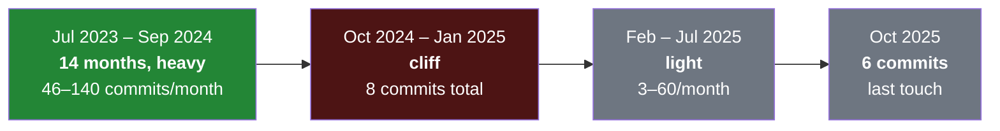
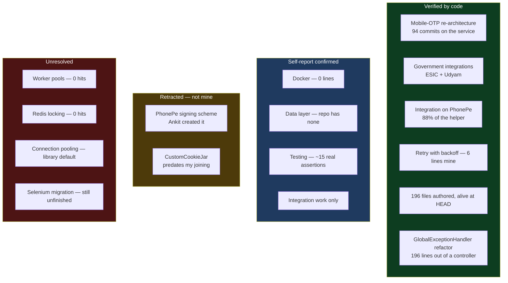

# Repo Audit — webdata-service

2026-09-03 · `/Users/home/Documents/repute/webdata-service`

> [!abstract] What this file is
> The code-verified counterpart to [[01-Self-Reported-Skill-Audit]]. Everything here comes from git history and reading the source, not from what I remember doing. Where the code disagrees with my self-report, the code wins and the correction is written down.

---

## Headline numbers

| | |
|---|---|
| My commits | **1,271** across 3 git identities, every one after 2023-07-26 |
| Rank in repo | **3rd of ~15 contributors** (Akash ~2,071, Ankit ~1,607, me 1,271) |
| Lines | **+35,431 / −15,257**, net **+20,174** |
| Files touched | **421** |
| Files I created from scratch | **234** main `.java` files |
| First / last commit | 2023-07-26 → 2025-10-28 |

The volume is real. I am not a peripheral contributor to this codebase — I am one of its three main authors, and I wrote 234 of its files from nothing.

---

## The shape of the work



My real depth on this repo is **14 months**, not the two years I estimated. October 2024 has zero commits and the following three months have eight between them.

Every file I own follows one pattern — a `Service` plus a `Helper` per vendor: PhonePe, Workline, Blinkit, Porter, OlaCabs, ESIC, PeopleStrong, BharatPe, Swiggy, Rapido, Paytm, OneCognizant, MyWipro, Udyam, Zomato, Zepto, Loadshare, HGS, Darwinbox, Zoho, Excelity, WalletHr, UniverseOnTheMove.

My statement that I did integration only is **exactly correct**. There is no other kind of work under my name here.

---

## Resume claims, checked against the code

### Verified — the mobile-OTP re-architecture

> Re-architected a payments partner's authentication from web credentials to mobile-OTP, raising verification completion 27% → 80%

**The authorship is as strong as it gets.**

- `PhonePeMobileHelper.java` — **407 of 463 lines mine (88%)**, 45 commits
- `PhonePeMobileService.java` — **181 of 252 lines mine (72%)**, 94 commits, my single most-touched file
- OTP handling appears across 167 files repo-wide

The percentages are business metrics I cannot verify from source, but the work behind them is unambiguously mine.

### Verified — government sources

> Integrated government sources (EPFO, ESIC)

`EsicService` (29 commits), `EsicApiHelper` (21), `EsicProfileHelper` (14), `UdyamVerificationHelper` (20), `UdyamVerificationService` (14). ESIC and Udyam are confirmed and substantially mine.

### Consistent — seller onboarding

> Onboarded 1,500+ sellers daily through a Spring Boot integration with a leading UPI business-payments provider

The Spring Boot stack is confirmed, PhonePe is the UPI provider, and `seller/helper/paytm/` is mine. The daily count is a business metric with no code equivalent.

### The problem claim

> [!warning] Three of the four mechanisms in my biggest bullet have no evidence in this repository
> The bullet reads: raising daily throughput 25K → 300K (12×) by switching from Selenium to a direct-HTTP design, with **worker-pool concurrency**, **connection pooling**, and **Redis-based per-record locking** to eliminate duplicate processing across instances.
>
> Searched across all of `src/main/java`:
>
> - **Worker-pool concurrency — zero hits.** No `ExecutorService`, no `ThreadPoolExecutor`, no `CompletableFuture`, no `@Async`, no `synchronized`, no `ReentrantLock`, no `parallelStream`. Not one concurrency primitive in the entire service.
> - **Redis per-record locking — zero hits.** No `RedisTemplate`, no `Jedis`, no `Redisson`. Redis does not appear in this codebase at all.
> - **Connection pooling — weak.** `OkHttpClient` in 18 places, but no `PoolingHttpClientConnectionManager`, no `setMaxTotal`, no `setDefaultMaxPerRoute`. OkHttp pools connections by default, so this is a library behaviour rather than a decision I made.
> - **Selenium to direct-HTTP — partial.** I touched 41 Selenium files and 38 OkHttp files. Selenium is still present in 85 files and 16 `pom.xml` references. I worked on both sides of a migration that is still unfinished; I cannot claim I performed it.

There are two possible explanations and they need different responses. Either these mechanisms live in a **separate orchestrator repo** that schedules this service, in which case the bullet is fine but is describing work from a repo I have not shown yet — or they are not mine, in which case the bullet has to be rewritten before anyone reads it.

**This is the single highest-priority item to resolve.** A bullet naming four specific mechanisms invites a follow-up on each one, and right now three of them have nothing behind them.

---

## Corrections to my self-report

### I was right about testing — and I initially thought the repo disagreed

The repo has 74 test files, 342 `@Test` methods and roughly 220 assertions. I have commits on 32 test files, including 36 commits on `CommonUtilsTest.java`. That looked like it contradicted my claim of testing a function or two and then stopping.

**Blame settled it in favour of my self-report.** Assertion lines by author:

| File | My assertions | Other authors' assertions |
|---|---|---|
| `CommonUtilsTest.java` | 8 | akash 41, Nitesh 7, ankit 6, pawan 2 |
| `ValidationUtilsTest.java` | **0** | akash 70, ankit 1 |
| `BaseHelperTest.java` | **7 (all of them)** | 0 |

I own 140 lines of `CommonUtilsTest.java` — more than any other single author — but almost none of them are assertions. They are `System.out.println` loops over string arrays. Those methods carry `@Test` and can never fail.

Across the 29 of my test files that still exist, **17 contain zero assertions**. Every vendor test — BharatPe, Darwinbox, Loadshare, OlaCabs, OneCognizant, Porter, Swiggy, Workline — has none. Three more (MyWipro 14 methods, PhonePe 15, UniverseOnTheMove 12) carry exactly one assertion each, which makes them harnesses with a token check attached.

**Verdict: roughly 15 real assertion lines in 27 months and 1,271 commits.** My self-report was accurate. What I wrote were manual runners for eyeballing third-party responses, not tests.

One thing this does add: I edited files that contained 111 real assertions by a colleague. I have been sitting next to a testing culture for over a year without adopting it. That is worse than never having seen tests, not better.

### I was right about Docker, exactly

`Dockerfile` line ownership: **18 lines Nitesh Agrawal, 4 lines Ankit, 0 lines me.** I have never committed to it. There is no `Jenkinsfile` and no `.github/workflows` anywhere in the repo, which confirms the pipeline lived entirely outside my reach.

### I was right about the data layer, and the reason is bigger than I knew

> [!important] This service has no persistence layer at all
> Searching the entire `src/main` tree for repository, entity or DAO classes returns **zero files**. Not zero files of mine — zero files, full stop.
>
> So my fourteen heaviest months were spent in a codebase where there was no data layer to touch. This was not avoidance or bad luck in task allocation. The opportunity did not exist.

That reframes the gap: it is environmental, like the deployment and observability gaps, rather than a choice I made.

---

## Upgrades — things I have and did not claim

### I have written retry-with-backoff

I described myself as having no resilience patterns. The code says otherwise.

`@Retryable` and `@Backoff` appear 16 times each repo-wide. Blame on `PhonePeMobileHelper.java` puts **all six annotation lines under my name**, committed 2025-02-17, along with the `RetryContext` and `RetrySynchronizationManager` usage that goes with them.

The annotation is fully parameterised, not copied boilerplate:

```java
@Retryable(retryFor = {HrmsExtractionBrokenException.class},
        backoff = @Backoff(delay = 1000, multiplier = 2, maxDelay = 5000),
        ...)
```

That is exponential backoff with a multiplier and a ceiling, scoped to one specific exception type, with `@Recover` fallbacks behind it. I picked those numbers.

This is a textbook bucket-three item from [[01-Self-Reported-Skill-Audit]] — I built it, I just never had the vocabulary to put it on a resume or defend it in an interview.

### I have built an API error taxonomy

The repo has 28 custom exception classes. I created three of them, including **`GlobalExceptionHandler.java`** — a Spring `@ControllerAdvice` that centralises how errors surface at the API boundary.

This one is better than a created file. The commit that added it, 2024-06-19, is titled **adding global exception handler making controller code leaner**, and its diff is:

```
controller/hrms/HRMSController.java     | 229 +++------------------
exception/GlobalExceptionHandler.java   | 219 ++++++++++++++++++++
2 files changed, 252 insertions(+), 196 deletions(-)
```

I pulled 196 lines of scattered error handling out of a controller and centralised it, and I wrote the reason in the commit message. I then extended it twice — a default case on 2024-06-20 and account-not-exist handling on 2024-07-11.

I said I had never done error taxonomy. This is precisely that, done deliberately, with a stated design rationale. The file no longer exists at HEAD, but the authorship and the refactor are both in history.

The exception set I work inside is genuinely well-designed and semantic rather than generic: `RetryableHttpServiceException`, `AccountBlacklistedException`, `AccountNotExistException`, `HrmsExtractionBrokenException`, `InvalidCredentialException`, `UserFeedbackException`. Each name encodes a distinct recovery strategy.

### I am an author, not an editor

**234 main `.java` files created from scratch, 196 of which still exist at HEAD.** Use 196 as the defensible number. I did not spend fourteen months adjusting other people's code.

---

## Retracted — the protocol reverse engineering is not mine

> [!warning] An earlier version of this file credited me with reverse-engineering PhonePe's mobile protocol. That was wrong, and I caught it.
> The reasoning behind the error: `PhonePeMobileHelper.java` is 88% my lines and it calls into fingerprinting, checksum signing and cookie-jar code. Owning the calling file was treated as owning the capability. It is not the same thing, and blaming the crypto files directly settles it.

| File | Ankit | Me |
|---|---|---|
| `PhonepeChecksumGenerator.java` — the signing scheme | **123 lines, created it 2023-11-20** | 5 lines |
| `CustomCookieJar.java` | **35 lines, created it 2022-05-27** | **0 lines** |
| `generateDeviceFingerprint()` | the method signature | 2 lines — a constant and a UUID concat |

`CustomCookieJar.java` was created in May 2022, **more than a year before I joined the company**. It could never have been mine.

The checksum generator landed on 2023-11-20 and my two fingerprint lines landed on 2023-11-24, four days later. That sequence reads as Ankit doing the protocol work and me implementing the integration on top of it — which is exactly what I said happened.

**What is actually mine on PhonePe: the integration built on someone else's signing layer.** That is still 88% of a 463-line helper, 94 commits on the service, and a working OTP re-architecture. It is a real accomplishment. It is not protocol reverse engineering, and I must not let it be described that way.

> [!important] The rule this proves
> Line ownership of a file does not transfer ownership of every capability the file uses. Before any capability goes on the resume, blame the file that **implements** it, not the file that **calls** it. This is the failure mode the whole audit exists to catch, and it caught one on the first repo.

---

## Code quality read

From `PhonePeMobileHelper.java`, my most-owned production file.

**Holds up well:**

- Endpoint paths extracted to `static final` constants, never inlined at call sites
- Builder-pattern DTOs with a dedicated request and response model per endpoint
- Semantic custom exceptions rather than generic throws
- Spring dependency injection, `@Component` stereotypes
- Response bodies explicitly closed
- Retry with backoff and `@Recover` fallbacks
- Debug payloads routed to storage for later inspection

**Would get flagged in review:**

- `sendOtp` declares **nine checked exceptions** in its signature — the caller cannot reasonably handle that list
- Field injection via `@Autowired` on fields rather than constructor injection, which makes the class hard to test without Spring
- `String methodName = "sendOtp";` hand-written at the top of methods instead of using the logging framework
- Two `phonePeMobileController.java` files at different paths, one with a lowercase class name — leftover duplication

This is competent, working, mid-level integration code. It is not sloppy, and it is not architecturally ambitious either.

---

## Scope and ownership, verified

Ankit owns the refactoring commits and the Dockerfile edits. Akash owns the utility layer and its tests. **I own the vendor integrations** — a well-defined, self-contained lane inside someone else's architecture.

That is an accurate picture of a solid mid-level individual contributor. It does not support any claim of leading, architecting, or setting direction on this service, and nothing in the history suggests otherwise.

---

## What this repo settles



---

## Open items

- [ ] **Find the repo holding the worker pool and Redis locking**, or rewrite that bullet. Highest priority.
- [ ] ~~Surface protocol reverse engineering~~ — retracted, it is Ankit's work
- [ ] Re-check every future capability claim against the file that implements it, never the file that calls it
- [ ] Promote retry-with-backoff and the `GlobalExceptionHandler` refactor from forgotten to claimable — both survived re-verification and are stronger than first written
- [ ] Correct the internal timeline: 14 months of depth on this repo, not 24
- [ ] Confirm EPFO specifically, since only ESIC and Udyam surfaced in the top files
- [ ] Next repo audit goes in `03-`
