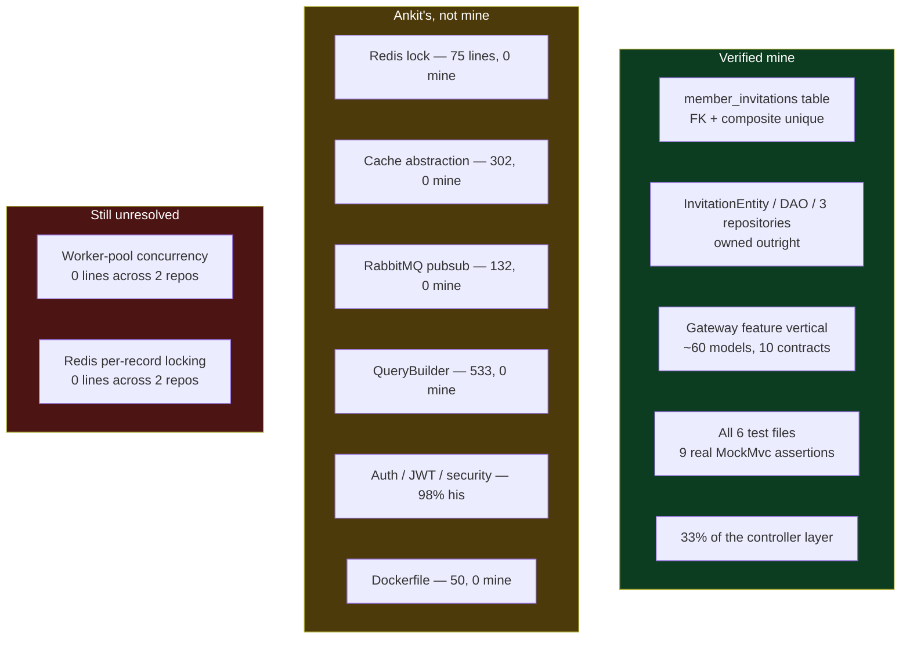

# Repo Audit — instaverify-backend

2026-09-03 · `/Users/home/Documents/repute/instaverify-backend`

> [!abstract] What this file is
> Second code-verified audit, following [[02-Repo-Audit-webdata-service]]. Every capability claim here was checked against the file that **implements** it, never the file that calls it — the rule that came out of the retraction in the last audit. Two of my own first-pass readings were wrong and were corrected before this file was written.

---

## Headline numbers

| | |
|---|---|
| My commits | **104 of 123 — 85% of the repository** |
| Contributors | 3 total: me (104), Ankit (26) |
| Lines | **+7,448 / −1,244**, net **+6,204** |
| Files created | **101** main `.java` files of 249 |
| Window | 2025-09-01 → 2025-11-03, about **two months** |
| Stack | Spring Boot, MySQL, Redis, RabbitMQ, DynamoDB, S3, SNS, Razorpay, Playwright, JWT |

This is the repo where I look most dominant on paper. It is also the repo that most needs the ownership rule applied, because the commit count is misleading.

---

## The central finding

> [!important] 85% of the commits, and almost none of the architecture
> Ankit made 26 commits to my 104. Those 26 commits contain the entire infrastructure layer. My 104 contain features built on top of it.

Blame by package, whole-file line counts:

| Package | Ankit | Me | Reality |
|---|---|---|---|
| `external/lock` — the Redis lock | **75** | **0** | not mine |
| `external/cache` — cache abstraction | **302** | **0** | not mine |
| `external/pubsub` — RabbitMQ | **132** | **0** | not mine |
| `events` | **42** | **0** | not mine |
| `tasks` | **104** | **0** | not mine |
| `QueryBuilder.java` | **533** | **0** | not mine |
| `BaseDAOHelper.java` | **143** | **0** | not mine |
| `Dockerfile` | **50** | **0** | not mine |
| `auth` — JWT, filters, security | 480 | 12 | 2% mine |
| `framework` | 457 | 58 | 11% mine |
| `paymentGateway` | 291 | 100 | 26% mine |
| `controllers` | 473 | 233 | 33% mine |
| `database` | 1,535 | 381 | 20% mine |

**Commit count is not ownership.** Ankit's 26 commits are large foundational drops; my 104 are smaller feature and fix commits. Anyone auditing this repo by `git shortlog` would conclude I built it. Anyone auditing it by `git blame` concludes I built features inside it.

This is the same shape as [[02-Repo-Audit-webdata-service]]: **capable feature work inside someone else's architecture.** Two repos, same pattern, and it is now a documented fact about how I work rather than an impression.

---

## This does not rescue the disputed resume bullet

> [!warning] The Redis lock in this repo is Ankit's, and the dates do not work anyway
> I went looking here for the worker-pool concurrency and Redis-based per-record locking claimed on my resume. This repo does have a Redis lock — `external/lock/RedisLockService.java` — and it is **75 lines, 100% Ankit, 0 lines mine**.
>
> It also cannot be the source of that bullet on timing. The bullet describes the verification and ingestion platform of 2024–2025; this repo starts 2025-09-01.

Two repos audited, and the worker-pool and Redis-locking claims still have **zero supporting lines under my name anywhere**. That bullet needs either a third repo that contains them or a rewrite. It cannot be left as written.

---

## Correction — I have done data-layer work

I said, word for word, that I have never touched the DB layer. **That is wrong, and this repo disproves it.**

| File | Ankit | Me |
|---|---|---|
| `domain/entity/InvitationEntity.java` | 0 | **98 — all of it** |
| `domain/repository/InvitationRepository.java` | 0 | **22 — all of it** |
| `domain/repository/UserRepository.java` | 0 | **21 — all of it** |
| `domain/repository/OrganizationRepository.java` | 0 | **17 — all of it** |
| `domain/dao/InvitationDAO.java` | 10 | **153** |

I own all three repository classes outright, the entire Invitation entity, and 94% of the Invitation DAO.

And it goes further than the Java. I wrote 30 lines of `scripts/db.sql`, and they are not boilerplate — this table is mine:

```sql
create table if not exists member_invitations
(
    id                varchar(64)  not null primary key,
    organization_id   varchar(64)  not null,
    name              varchar(255) not null,
    email             varchar(128) not null,
    invite_code       varchar(128) not null,
    user_type         varchar(16)  not null,
    status            varchar(16)  not null,
    invited_by        varchar(64)  not null,
    expires_at        datetime     not null,
    created_at        datetime default current_timestamp not null,
    updated_at        datetime default current_timestamp null on update current_timestamp,
    foreign key (`organization_id`) references `organizations` (`id`),
    unique(organization_id, email)
);
```

That is real schema design with decisions in it:

- A **foreign key** to `organizations`, so invitations cannot orphan
- A **composite unique constraint** on `(organization_id, email)`, which is a deliberate integrity rule preventing the same person being invited twice to one organisation
- Column widths chosen per purpose rather than defaulted — 64 for identifiers, 128 for email, 16 for enum-like fields
- `expires_at` modelled explicitly, so invitation expiry is data rather than logic
- `on update current_timestamp` for audit trails

**Honest scope:** one table, designed properly, with the matching entity, DAO and repository behind it — a complete vertical slice of one feature. The persistence framework it runs on, `QueryBuilder.java` at 533 lines, is entirely Ankit's.

So the accurate sentence is not that I have never touched the data layer. It is that **I have modelled one table end to end and never designed a schema at system scale.** Those are very different claims and only the second one is a real gap.

---

## Correction — my testing is thin, not absent

My first read of this repo was that it had zero assertions. **Re-checking with a broader search across all assertion styles proved that wrong**, which is exactly why the re-check rule exists.

**All six test files are mine** — 619 lines, essentially no Ankit.

| File | `@Test` | assertions | verdict |
|---|---|---|---|
| `GatewayControllerTest.java` | 6 | **6** | real |
| `PaymentOrderControllerTest.java` | 2 | **2** | real |
| `PaymentOrderDataServiceTest.java` | 1 | **1** | real |
| `AuthServiceTest.java` | 3 | 0 | harness |
| `PaymentOrderServiceTest.java` | 3 | 0 | harness |
| `GatewayServiceTest.java` | 8 | 0 (+1 `@Disabled`) | harness |

**23 test methods, 9 assertions.** Half the files still carry the harness pattern from the last repo.

But the three that are real are more than I gave myself credit for: they use `@SpringBootTest` with MockMvc `andExpect` chains, which is genuine Spring integration testing against the controller layer — not a print loop. I have written that, and it is the correct technique.

Revised position: **I have written Spring Boot integration tests with real assertions. There are nine of them.** Thin, but the skill is not zero and the method is right.

---

## Confirmed again — Docker and queues

**Docker: 50 lines, 100% Ankit, zero mine.** Created in his initial commit 2025-09-01. Second repo, same result.

**Queues: confirmed zero, and this one stings.** `external/pubsub/rabbitMQ/RabbitMQPubSub.java` plus a `PubSub` interface and factory exist in this repo — 132 lines, all Ankit. I spent two months in a codebase with a working message broker in it and never wrote a line against it. The opportunity was on disk this time, which makes it a different kind of gap from the deployment one.

---

## What I actually built here

101 files created, grouped by what they are:

- **~60 files are DTOs and models** — `models/core/gateway` (23), `models/gateway` (11), plus document models for aadhaar, PAN, address, employment, penny-drop and photo verification. Many files, low complexity each.
- **10 files** of integration contracts for the gateway
- **6 service helpers**, 2 domain services, 1 database service
- **3 repository classes**, owned outright
- **2 controllers**, plus a third of the controller layer by line
- **2 logger framework files**
- **All 6 test files**

The honest summary: I built the **identity-verification gateway feature vertical** — its data shapes, its contracts, its controllers, its data access, and its tests — on infrastructure Ankit had already laid down.

That reframes the 101-files number. It is real, but it is mostly data-shape classes rather than logic, and it should be described that way if it is described at all.

---

## Ownership map



---

## Running corrections to the self-report

| Item | Self-report | Code says |
|---|---|---|
| Data layer | never touched it | **wrong** — one table designed with FK and composite unique, entity + DAO + 3 repositories owned |
| Testing | stopped after a function or two | **understated** — 9 real MockMvc assertions across 3 files, all 6 test files mine |
| Retry / backoff | no resilience patterns | **wrong** — parameterised `@Retryable` with exponential backoff, verified in repo 1 |
| Error taxonomy | never did it | **wrong** — `GlobalExceptionHandler` refactor, 196 lines out of a controller, verified in repo 1 |
| Docker | never | **confirmed** — 0 lines in both repos |
| Queues | never | **confirmed** — 0 lines, though a broker sat in this repo the whole time |
| Ownership / architecture | wrote the whole AI bot myself | **unverified here** — in both audited repos I own features, not architecture |

---

## Open items

- [ ] **Third repo, or rewrite the throughput bullet.** Worker pools and Redis locking now have zero lines across two audited repos. This is the last chance for it to be true.
- [ ] Promote the `member_invitations` schema work — it is small but it is genuinely defensible and currently disowned
- [ ] Promote the MockMvc integration tests — nine assertions is thin but the technique is correct
- [ ] Audit the Xarvis repo next, where the sole-authorship claim actually lives. **That claim is the one thing the resume rests on that two repos have now failed to support**, so it must be verified rather than assumed
- [ ] Next audit goes in `04-`
