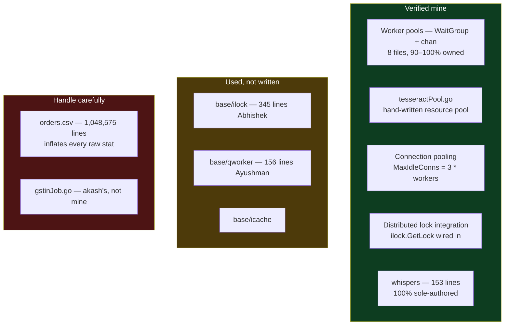

# Repo Audit — cron_service and whispers

2026-09-03 · `/Users/home/Documents/repute/base` (monorepo)

> [!abstract] What this file is
> Third code-verified audit, following [[02-Repo-Audit-webdata-service]] and [[03-Repo-Audit-instaverify-backend]]. Both services live inside one Go monorepo at `base/`, alongside 24 others. **This is the audit that resolves the disputed resume bullet** — and it resolves it in my favour.

---

## The headline

> [!important] The worker pools, the connection pooling and the distributed locking are real, and they are mine
> Two audits failed to find them because I was looking in the wrong language. They are not in the Java services. They are **in Go**, written between March and June 2025, in files I own outright.

The bullet under scrutiny reads: raising daily throughput 25K → 300K (12×) by switching from Selenium to a direct-HTTP design, with **worker-pool concurrency**, **connection pooling**, and **Redis-based per-record locking** to eliminate duplicate processing across instances.

| Mechanism | Verdict | Evidence |
|---|---|---|
| Worker-pool concurrency | **verified mine** | `sync.WaitGroup` + buffered channels + goroutines across 8 files I own 90–100% of |
| Connection pooling | **verified mine** | `MaxIdleConns: 3 * workers` in 4 files, my lines |
| Redis-based locking | **partly mine** | I integrated `ilock.GetLock(...)`; I did not write the lock library |
| Selenium → direct HTTP | plausible, unproven | monorepo has `selenium_manager/` and `selenium-service/`; cron_service is pure Go HTTP |

---

## cron_service — the numbers

| | |
|---|---|
| My commits, scoped to `cron_service` | **371 of ~484 (77%)** |
| Other contributors | akash 68, abhishek 34, ankit 6 |
| My Go lines | **+22,647 / −4,873**, net **+17,774** |
| Window | Feb 2025 → Jul 2025 |

> [!warning] Do not quote the raw line count from this repo
> `git log --numstat` reports **+1,084,327** lines added under my name here. That is not code. It is `cron_service/orders.csv`, a **1,048,575-line data dump** I committed. Filtered to `.go` files only, the honest number is **+22,647**. Anyone checking would find the CSV in thirty seconds.

---

## Mechanism 1 — worker-pool concurrency, verified

The pattern appears across eight files, always the same shape: a buffered channel as the work queue, a `sync.WaitGroup` to await completion, and goroutines draining the channel.

Blamed lines under my name:

| File | Ownership | What I wrote |
|---|---|---|
| `cronjobs/mobileToUdyamJob.go` | **399 / 420 mine (95%)** | `tupleChan`, `sync.WaitGroup`, `go func()`, `var logMutex sync.Mutex` |
| `cronjobs/udyamDataExtractionJob.go` | **270 / 270 mine (100%)** | `entryChan`, `WaitGroup`, `go func()` |
| `cronjobs/udyamRegistration.go` | **167 / 167 mine (100%)** | `responseChan`, `errorChan`, `go func()` |
| `cronjobs/newCertificateJob.go` | **133 / 133 mine (100%)** | `entryChan`, `WaitGroup`, `go func()` |
| `cronjobs/udyam.go` | mine | `entryChan`, `WaitGroup`, `go func()` |
| `cronjobs/samadhaanAPI.go` | mine | `samadhaanChan = make(chan SamaDhaanReq, 4*workers)` |
| `cronjobs/msmedatabank.go` | mine | `msmeChan = make(chan MSMEBankReq, 4*workers)` |
| `cronjobs/fetchAllMobileNumbersFromSeriesApi.go` | 73% mine | `WaitGroup`, `sync.Mutex` |

Two details worth defending in an interview:

- **`4*workers` as the channel buffer.** The queue depth is derived from the worker count rather than picked arbitrarily — enough slack to keep workers fed without unbounded memory growth.
- **`sync.Mutex` alongside the WaitGroup.** I guarded shared state (`logMutex`) rather than assuming goroutine safety. That is the part people get wrong.

Not everything with a goroutine here is mine: `gstinJob.go` (193 lines) and `gstinTnJob.go` (91 lines) are akash's. Claim the eight above, not the whole `cronjobs` package.

### And a genuine resource pool

`cronjobs/tesseractPool.go` is mine outright — a hand-written pool over a buffered channel:

```go
type Pool struct {
	resources chan *Resource
}

func NewPool(size int) *Pool {
	p := &Pool{resources: make(chan *Resource, size)}
	for i := 0; i < size; i++ {
		client := gosseract.NewClient()
		client.SetLanguage("eng")
		client.SetWhitelist("ABCDEFGHIJKLMNOPQRSTUVWXYZ0123456789")
		client.SetPageSegMode(8)
		p.resources <- &Resource{Client: client}
	}
	return p
}

func (p *Pool) Acquire() *Resource { return <-p.resources } // blocks if none available
func (p *Pool) Release(r *Resource) { p.resources <- r }
```

This is the textbook Go pool: a buffered channel used as a semaphore, `Acquire` blocking on an empty pool to apply backpressure, and expensive Tesseract OCR clients pre-warmed once rather than constructed per request. The whitelist and page-segmentation tuning are captcha-solving decisions.

**This is the strongest single piece of systems code found across all three audits.**

---

## Mechanism 2 — connection pooling, verified

```go
MaxIdleConns:        3 * workers,
MaxIdleConnsPerHost: 1000,
```

My lines, in `msmedatabank.go`, `samadhaanAPI.go`, `myMsmeRegistration.go` and `udyamRegistration.go`. Abhishek later copied the same pattern into one file of his own.

This is materially stronger than what the Java repo showed. There, connection pooling was an OkHttp default I benefited from. Here it is **an explicit transport configuration where the idle-connection ceiling is derived from the worker count** — pool sized to concurrency, deliberately.

---

## Mechanism 3 — the distributed lock, with an honest boundary

`cron_service/cronjobs/common.go`, my lines, 2025-04-16:

```go
"github.com/repyute/base/ilock"

var dlock ilock.ILock

dlock, err = ilock.GetLock(...)
```

And in `helpers/helper.go`, also mine: `icache.Init(...)` against `base/icache`.

The `ilock` package is Redis-backed — it contains `redisdefault.go`, `redisredsync.go` and `redisbsm.go`, so the underlying mechanism genuinely is a Redis distributed lock.

> [!warning] The lock library is not mine, and this is exactly the trap from [[02-Repo-Audit-webdata-service]]
> `base/ilock` is **345 lines by abhishekkumar1, 105 by ankit, 11 by Ayushman — zero by me.** `base/qworker` is 156 lines by Ayushman, zero mine.
>
> What is mine is the **integration**: choosing to take a distributed lock in the cron job, wiring it up, and scoping it. That is a real and defensible decision. It is not authorship of a locking library, and it must never be worded as if it were.

**The sentence that survives probing:** I used a Redis-backed distributed lock to stop concurrent cron instances processing the same record twice. Not: I built Redis-based locking.

---

## Correction — my Go work was not two months

I described this period as two months in Go. Scoped to `cron_service` alone: **371 commits, +22,647 lines of Go, February through July 2025.** Across the whole monorepo my commit count is 1,366, with March 2025 alone at 689 — though that figure spans services not audited here.

**Go is my second-largest body of work and I have been describing it as a footnote.** It is also where every systems-engineering artefact in my history lives.

---

## whispers — verified sole authorship

Small, and completely mine.

| File | Lines | Author |
|---|---|---|
| `controller/audio_to_text_controller.py` | 40 | **all mine** |
| `server.py` | 38 | **all mine** |
| `core/audio_to_text/transcribe.py` | 21 | **all mine** |
| `core/audio_to_text/model_loader.py` | 20 | **all mine** |
| `service/audio_to_text_service.py` | 19 | **all mine** |
| `core/logger.py` | 8 | **all mine** |
| `models/audio_to_text.py` | 7 | **all mine** |

**Every surviving line of this service is mine.** 153 lines total, so the scale is small — but it is a complete microservice with real layering: `server → controller → service → core`, with model loading separated from transcription.

The stack matters more than the size: **FastAPI, openai-whisper, torch.** This is a speech-to-text model being served over HTTP.

> [!important] My model-serving experience predates the Xarvis project
> The resume dates my AI work from November 2025. This service puts me serving an ML model behind FastAPI **months earlier**, and it is the first thing in my history that is unambiguously sole-authored end to end.

It also explains the two-month Go gap differently than I told it — the Go work and this Python service overlap the same window.

---

## Ownership map



---

## Running corrections to the self-report

| Item | Self-report | Code says |
|---|---|---|
| Worker pools / concurrency | never worked on it | **wrong** — 8 files of goroutine worker pools, plus a resource pool, all mine |
| Connection pooling | never a decision I made | **wrong** — explicit `MaxIdleConns` tied to worker count |
| Distributed locking | never | **partly wrong** — I integrated a Redis lock; I did not write the library |
| Go experience | about 2 months | **understated** — 371 commits and 22,647 lines in cron_service alone, Feb–Jul 2025 |
| FastAPI / model serving | started Nov 2025 | **understated** — whispers serves Whisper over FastAPI, sole-authored, earlier |
| Queues | never | **still confirmed** — `base/qworker` exists, zero lines mine |
| Docker | never | **still confirmed** across three audits |
| Data layer | never touched | **wrong** — one table designed end to end, verified in repo 2 |

---

## What changes about the strategic picture

The first two audits produced a consistent and unflattering shape: capable feature work inside other people's architecture. **This audit breaks that pattern.**

`tesseractPool.go`, the `4*workers` channel sizing, the mutex-guarded shared state and the transport pooling are not feature work. They are systems engineering decisions, made by me, in code I own outright. They are the best evidence in my history that I can reason about concurrency and resource limits.

They are also, right now, **the least visible work I have done** — buried in Go cron jobs I have been describing as a two-month detour.

---

## Open items

- [x] ~~Find the repo holding the worker pool and Redis locking~~ — **found, verified, and mostly mine**
- [ ] Rewrite the throughput bullet so the lock is worded as integrated rather than built
- [ ] Decide whether the 25K → 300K number belongs to this Go service or the Java one — the mechanisms are here, so the bullet is currently attributing them to the wrong system
- [ ] Stop describing Go as two months
- [ ] Surface `tesseractPool.go` — strongest systems artefact found so far, currently invisible
- [ ] Move the FastAPI model-serving start date earlier than Nov 2025
- [ ] Never quote raw line counts from `base/` without excluding `orders.csv`
- [ ] Audit Xarvis next — sole authorship still unverified, and whispers is now the only proven sole-authored service
