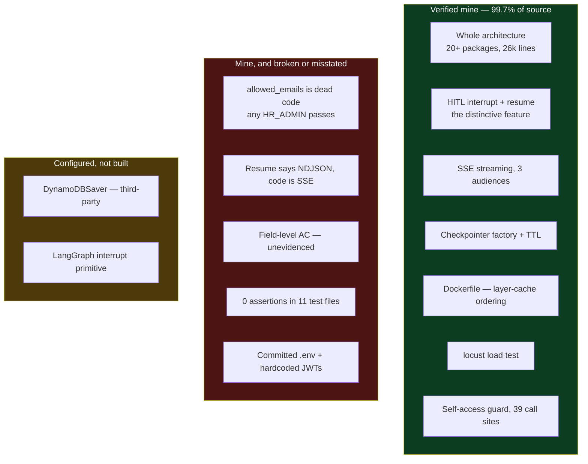

# Repo Audit — Xarvis

2026-09-03 · `/Users/home/Documents/repute/jarvis/xarvis` · branch `refactor`

> [!abstract] What this file is
> Fourth and most important code-verified audit, following [[04-Repo-Audit-cron-service-and-whispers]]. This is the repo the resume rests on. **The sole-authorship claim is verified.** The strongest resume bullet has a bug in it.

---

## The headline — sole authorship is real

| | |
|---|---|
| Commits | **626 of 691 mine (91%)** |
| **Lines of source** | **25,734 of 25,789 mine — 99.7%** |
| Other authors | Abhishek Kumar: **55 lines**, across 17 files |
| Scale | 597 Python files, 26,469 lines |
| Window | Nov 2025 → Aug 2026, ten months |

> [!important] This is the one claim that survived every test
> In [[03-Repo-Audit-instaverify-backend]] I had 85% of commits and owned almost none of the architecture. Here I own the commits **and** the lines. Every package — `orchestration`, `graph_pipeline`, `checkpointing`, `streaming`, `tools`, `middleware`, `llm`, `context`, `infra` — is mine.
>
> Sole authorship of a 26,000-line production system is the strongest single fact in my history, and it is now verified rather than asserted.

---

## The authorization bullet has a live bug

The resume's best line reads: the assistant holds **no ambient authority** — subject and field-level access control blocks out-of-scope requests at runtime.

The guard is `src/xarvis/tools/helpers/tool_access_helper.py`, 48 lines, 34 mine. It is called from **39 sites**, so the pattern genuinely is pervasive. But the admin branch does not do what it looks like it does:

```python
if logged_in_user.role == "ROLE_HR_ADMIN" or logged_in_user.role == "HR_ADMIN":
    allowed_emails = {
        "benaifer.palsetia@igi.org", ...eight hardcoded addresses...
    }
    if logged_in_user.email and logged_in_user.email.lower():
        return True
    else:
        return False
```

> [!warning] The allowlist is never checked
> `allowed_emails` is built and then never read — `grep` finds no other reference to it anywhere in the source. The condition below it, `if logged_in_user.email and logged_in_user.email.lower()`, is true for **any non-empty email string**, because `.lower()` on a non-empty string is always truthy.
>
> **Any caller holding the `HR_ADMIN` role passes this guard.** The allowlist is decoration.

**I already found this myself.** `src/xarvis/orchestration/TODO.md` line 410 records it in my own words — that the set is dead and any `HR_ADMIN` passes. That matters: it means I can speak to it as something I caught rather than something an interviewer caught for me. It is still live in the code.

What does work is the non-admin path:

```python
if target_id is not None:
    return logged_in_user.employee_id == target_id
```

That is a correct self-access guard, and it is the real security property of this system.

### What the bullet should say instead

Two problems, separate from the bug:

- **Field-level access control is not evidenced.** Searching for field masking, projection, redaction or allowed-field logic turns up two incidental files and nothing that implements it. Subject-level access is real; field-level should come out until something backs it.
- **This is not RBAC.** It is audience segregation plus a self-access guard. Calling it access control is fine. Calling it role-based access control invites a question the code cannot answer.

**The defensible sentence:** every tool call is gated by a caller-versus-target identity check, wired at 39 call sites, so an employee can only ever resolve their own record.

---

## Multi-tenancy and RBAC — one cut is right, the other is wrong

On 2026-09-03 I said both the multi-tenancy and the RBAC claims on the old resume were false, because the system only has an email list. **Half of that is correct.**

### RBAC — correct to cut

There are **4 `role ==` comparisons and 7 `ROLE_HR_ADMIN` references** in 26,000 lines. That is a binary admin-versus-employee split, not a role and permission system, and the admin side of it is the dead allowlist above. Calling it RBAC was an overclaim and it should stay cut.

The accurate word is **audience segregation** — role selects which tool set you are handed, and nothing finer than that.

### Multi-tenancy — wrong to cut, it is real

> [!important] Do not remove this claim. It is implemented, and it is implemented well.

| Evidence | Count |
|---|---|
| `company_id` in source | **479 occurrences** |
| `hrms_id` in source | **350 occurrences** |

It is not decoration. Three places prove it:

**1. Tenant identity is a required part of the session model.** In `services/schema/user_session_data.py`, `UserData` declares `company_id`, `hrms_id` and `hrms_name` as **non-optional fields**, alongside a per-session `hrms_base_url` — so every tenant's calls route to their own HRMS host.

**2. Tenant identity is propagated and logged.** `middleware/request_context.py` carries `hrms_id` and `company_id` into request context, and `middleware/request_context_filter.py` injects both onto every log record. Logs are tenant-tagged by construction.

**3. The storage key is tenant-scoped.** This is the decisive one — `infra/cache/employee_data/dynamo_employee_data_cache.py`:

```python
def _pk(self, hrms_id: str, company_id: str, employee_id: str) -> str:
```

**The DynamoDB partition key is composed of HRMS, company and employee.** Cached data from one company cannot collide with another's, because they cannot share a key. The HRMS → company → employee hierarchy the old resume described is literally the primary key of the cache.

**The defensible sentence:** tenant identity is carried from the token through request context into logging and into composite storage keys, so cached employee data is physically partitioned per HRMS and company.

> [!warning] The correction instinct now cuts both ways
> Across [[01-Self-Reported-Skill-Audit]] and four repo audits, six of nine self-reported zeros turned out to be non-zero. Now, having been shown one overclaim, the reflex is to cut a claim that is true and well-implemented.
>
> **Under-claiming and over-cutting are the same error.** Both replace what the code says with a feeling about it. Every future add and every future cut goes through blame or grep first.

---

## Workflow prediction — status, and why the bullet must change

Recorded 2026-09-03: **the workflow prediction work is incomplete and stalled, and the company is winding down.**

That does not make the design work worthless — the eight workstream documents and the identity-resolution approach are real thinking I can talk through. But the resume's present-continuous framing, extending the platform into workflow prediction, promises momentum that will not exist.

Reframe it as **design work completed** rather than an initiative in flight, or cut it. Do not leave a bullet implying active development on a system at a company that has closed, because the first question is how it is going.

---

## Corrections to my self-report

### I have written Docker — this is the third self-reported zero that was not zero

`Dockerfile` blame: **16 lines mine, 12 Abhishek's.** He wrote the skeleton — `FROM`, `WORKDIR`, `EXPOSE`, `COPY . .`. Mine are the substantive ones:

```dockerfile
ARG ENV=stg
RUN apt-get install -y --no-install-recommends build-essential ffmpeg
COPY pyproject.toml requirements.txt ./          # deps copied before source
RUN pip install --no-cache-dir -r requirements.txt
COPY src/ src/
RUN mv .env.python.${ENV} .env
CMD ["python", "-m", "xarvis"]
```

Copying `requirements.txt` before `src/` is **deliberate layer-cache ordering** — dependencies only reinstall when they change, not on every source edit. That is the main Docker optimisation there is, and I made it. A build arg selecting the environment file is real build parameterisation too.

**Revised position:** I have never owned a deployment pipeline, and I have written a working, cache-aware Dockerfile. Those are different claims and only the first is a gap.

### Tests — the worst of the three repos

11 test files, **132 lines total, 13 test functions, and a broad search across every assertion style returns nothing.** No `assert`, no `pytest`, no `Mock`, no `patch`, no `fixture`.

The sample is worse than absent — `TestApiHelper.setup_method` points at the live `app.hralign.repute.net` host with a hardcoded bearer token and calls the real API.

Across three audited repos the pattern is now fully established: webdata-service ~15 real assertions, instaverify 9, Xarvis **0**. On my largest and most recent system, in ten months, I wrote no test that can fail.

The one exception is real and worth keeping — `locust.py` is a genuine load test:

```python
class ChatUser(HttpUser):
    wait_time = between(1, 2)
    def on_start(self):
        response = self.client.post("/api/v1/session")
        assert response.status_code == 200
```

27 lines, streaming chat requests under concurrent users. It is the only assertion in the repo and the only performance testing anywhere in my history.

### The resume says NDJSON. The code is SSE.

The technical resume variant claims progress streamed as **structured NDJSON**. The implementation is **Server-Sent Events** — `sse_events.py`, `EventSourceResponse`, `text/event-stream`. The string `ndjson` appears only in planning markdown, never in code.

> [!warning] This is a factual error, not a wording preference
> A reviewer asking how the streaming works and hearing SSE has caught a resume that does not match its own codebase. Fix the word.

### DynamoDB checkpointing — the open question from [[01-Self-Reported-Skill-Audit]] is settled

```python
from langgraph_dynamodb_checkpoint import DynamoDBSaver
```

`DynamoDBSaver` is a third-party package. What is mine is `checkpointing/factory.py` — a ~50-line pluggable factory switching on `CHECKPOINTER_MODE` between in-memory and DynamoDB, with TTL wired through from the environment.

**Claim the factory and the TTL, not the saver.** My suspicion in the first audit was correct.

One defect to fix while I am here: `_create_redis_checkpointer()` raises `NotImplementedError("Postgres checkpointer is not yet implemented.")` — wrong backend named in the message.

---

## Verified without qualification

**The human-in-the-loop interrupt.** `from langgraph.types import interrupt`, a `HitlInterrupt` model, `selected_id = interrupt(...)` in the admin name-resolution tool, and `admin_streaming_service.py` translating `__interrupt__` chunks back out to the client. Pause on ambiguity, resume the same checkpointed thread on selection. Entirely mine, and it is the most distinctive thing in the codebase.

**The architecture itself.** Twenty-plus packages with clean separation — `graph_pipeline`, `orchestration`, `streaming` split by audience, `tools/factory`, `context`, `middleware`, `checkpointing`. Whatever else is true, this is a designed system rather than an accreted one, and I designed all of it.

---

## Workflow prediction — documents, not a system

The bullet says I am extending the platform into workflow prediction. The directory contains:

- **8 design documents** — `ws1-vocabulary`, `ws2-capability`, `ws3-identity`, `ws4-trace-store`, `ws5-models`, `ws6-serving`, plus two overviews
- **1 Python file** — `recon/fetch_career_history.py`
- Sample career JSON under `recon/data/`

The present-continuous wording on the resume is honest and should stay exactly as it is. What I must know going in: **the evidence is a design spine and a recon script.** I can defend the vocabulary, the identity-resolution approach and the trace-store design. I cannot defend an implementation, and there is no model.

---

## Security issues to fix in my own repo

> [!warning] Credentials are committed to git history
> - **Three environment files are tracked**: `.env.python.dev`, `.env.python.prod`, `.env.python.stg` — including production.
> - **Two test files contain hardcoded bearer tokens** against the live HRMS host. The one I read decodes to a real `ROLE_HR_ADMIN` session with a full scope list and a company identifier. It expired in January 2026, but it is permanent in history.
> - **Eight real employee email addresses** are hardcoded in `tool_access_helper.py`.

Rotating a secret does not remove it from git history — this needs history rewriting or, at minimum, rotation of anything those files contain. It is also the kind of thing that surfaces badly if this repo is ever shown to an interviewer.

---

## Ownership map



---

## Running corrections after four audits

| Item | Self-report | Code says |
|---|---|---|
| Sole authorship of the AI bot | wrote the whole thing | **verified — 99.7% of 25,789 lines** |
| Docker | never | **wrong, third time** — 16 lines, cache-aware ordering |
| Testing | stopped early | **confirmed worst here** — 0 assertions in 11 files |
| Load testing | never mentioned | **exists** — `locust.py`, only assertion in the repo |
| Worker pools / pooling | never | **wrong** — verified in Go, repo 3 |
| Data layer | never touched | **wrong** — one table end to end, repo 2 |
| Retry / backoff, error taxonomy | never | **wrong** — verified repo 1 |
| Queues | never | **still confirmed** across four repos |
| Observability | never | **still confirmed** — no metrics or tracing found here |
| Multi-tenancy | claimed it was false | **wrong to cut** — 479 `company_id` / 350 `hrms_id`, tenant-scoped DynamoDB partition key |
| RBAC | claimed it was false | **correct to cut** — 4 role comparisons total; it is audience segregation |

Six of nine self-reported zeros in [[01-Self-Reported-Skill-Audit]] turned out to be non-zero. **My instinct is to under-report, consistently and by a wide margin.** That is now a measured fact across four repositories, not an impression.

---

## Open items

- [ ] **Fix the dead `allowed_emails` check** — a live authorization hole under my strongest resume bullet
- [ ] Remove `field-level` from the access-control bullet until something implements it
- [ ] Change NDJSON to SSE on the resume
- [ ] Reword the checkpointing claim to the factory and TTL, not the saver
- [ ] Rotate the committed credentials and purge them from history
- [ ] Fix the `NotImplementedError` naming Postgres in the Redis branch
- [ ] Write the first real test suite on the system I own outright — nothing blocks this but me
- [ ] **Keep multi-tenancy on the resume** — verified in code, worded as composite tenant-scoped keys
- [ ] Keep RBAC cut; say audience segregation instead
- [ ] Reframe workflow prediction as completed design work, not an initiative in flight
- [ ] All four audits are done. Next file is the rewrite: `06-Resume-Rewrite.md`
