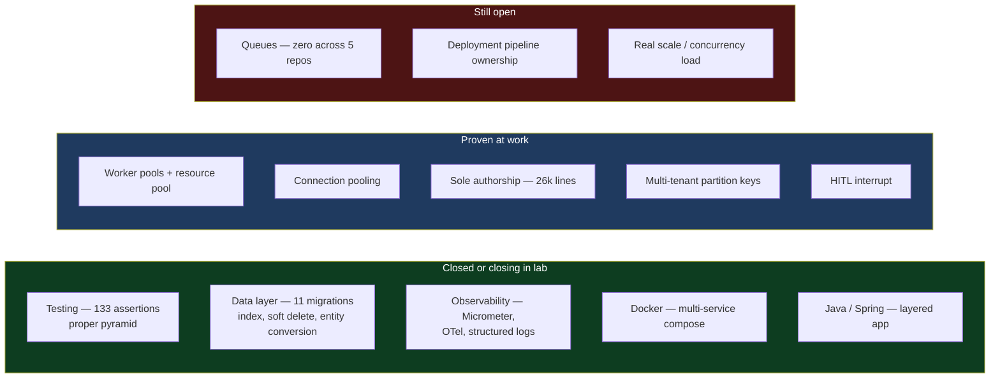

# Repo Audit — lab (side project)

2026-09-03 · `~/Desktop/projects/lab` · read-only audit

> [!abstract] What this file is
> Fifth audit, and the only one covering work outside the company. I described this repo as mostly copy-paste from a course with Claude Code helping on configuration. **The code does not read that way, and the numbers are the most important in this whole folder.**

---

## The number that matters

| Source | Real assertions |
|---|---|
| webdata-service — 27 months | ~15 |
| instaverify-backend — 2 months | 9 |
| Xarvis — 10 months, 26k lines | **0** |
| **`lab` — six days** | **133** |

**Six days of side project produced five and a half times more test assertions than three years of paid work.**

Test code here is **1,853 lines against 1,618 lines of main code**. The tests are larger than the application.

---

## The gaps this closes

Six of the nine zeros in [[01-Self-Reported-Skill-Audit]] are addressed directly.

### Testing — the pyramid, done correctly

| File | `@Test` | assertions | mocks |
|---|---|---|---|
| `OrderServiceTest.java` | 24 | **40** | 70 |
| `ProductServiceTest.java` | 14 | 26 | 24 |
| `ReviewServiceTest.java` | 11 | 19 | 24 |
| `CategoryServiceTest.java` | 7 | 11 | 12 |
| `ProductRepositoryTest.java` | 1 | 8 | — |
| `CategoryRepositoryTest.java` | 5 | 7 | — |
| `OrderRepositoryTest.java` | 5 | 7 | — |
| `OrderProductsRepositoryTest.java` | 4 | 7 | — |
| `ReviewRepositoryTest.java` | 4 | 6 | — |
| `CategoryControllerTest.java` | 1 | 2 | 4 |

**77 test methods, 133 assertions, 134 mock usages.**

The layering is textbook and it is the part that matters more than the count:

- **`@DataJpaTest`** × 5 — repository slice tests against a real persistence context with H2
- **`@ExtendWith`** × 4 with Mockito — service unit tests with collaborators mocked
- **`@WebMvcTest`** × 1 — controller slice without booting the world
- **`@SpringBootTest`** × 1 — one full-context test

That is the test pyramid: fast mocked unit tests at the base, slice tests in the middle, one full boot at the top. **Nothing in three years of professional code shows this shape.** It is the single clearest evidence that the testing gap is closable.

### Data layer — versioned migrations telling a real story

Eleven Flyway migrations under `db/migrations`, and the sequence is a schema actually evolving rather than a schema dumped once:

```
V1  create_products_table          V7  convert_order_products_to_entity
V2  create_categories_table        V8  add_soft_delete
V3  add_category_to_products       V9  update_rating_and_quantity
V4  create_orders_table            V10 add_reviews_table
V5  create_order_products_table    V11 add_product_price_index
```

Three of these are genuine modelling decisions, not scaffolding:

- **V3** adds a relationship to an existing table after the fact
- **V7** converts a join table into a first-class entity — the decision you make when a many-to-many grows attributes of its own
- **V11** adds an index deliberately, as a separate versioned change

Plus audit columns (V6) and soft delete (V8). **This is the answer to never having touched the data layer**, and it is a better answer than the single table found in [[03-Repo-Audit-instaverify-backend]].

### Observability — instrumented, not just docker-composed

The stack is running in `docker-compose.yml`:

- `grafana/otel-lgtm` — Loki, Grafana, Tempo, Mimir
- `elasticsearch` + `kibana` + `logstash`, 8.17.1

And critically, **the application is wired to it** rather than merely sitting next to it:

```
spring-boot-starter-actuator
micrometer-registry-prometheus
spring-boot-starter-opentelemetry
opentelemetry-logback-appender-1.0
logstash-logback-encoder
```

Metrics exported through Micrometer to Prometheus, structured JSON logs through the Logstash encoder, traces through OpenTelemetry. This is the exact gap where the honest self-report was typing a service name into a box someone else had built. **Here the box is mine.**

### Java and Spring, Docker, performance

- **Java/Spring** — 44 main classes across `controllers`, `services`, `repositories`, `dtos`, `adapters`, `config`, `exceptions`, `schema`. A layered Spring application, which the professional Java work never demonstrated.
- **Docker** — a real multi-service compose file, plus `spring-boot-docker-compose` for dev lifecycle.
- **Performance** — `PerformanceLab.postman_collection.json`, and the project is literally named PerformanceLab.

---

## What this does not close

> [!warning] Be precise about what is still missing, and about what a course project proves
> - **Queues remain the standing zero.** No Kafka, RabbitMQ or SQS in the build. Four professional repos and this one, all with nothing. It is the last untouched item from the original nine.
> - **Six days and 1,618 lines of main code.** This is a lab, not a product. No users, no traffic, no operational history.
> - **Course-derived and assisted.** Code existing in a repository does not prove the author can explain it under questioning.

That last point is the one that matters, and my own rule already covers it: **every claim must survive two minutes of probing or be cut.** Applied here it means the risk is not that the work is fake — the layering is too coherent for that. The risk is putting `Flyway`, `Micrometer` and `@DataJpaTest` on a resume and then not being able to answer why `@DataJpaTest` rolls back by default, what Micrometer does that a log line does not, or why V7 converted a join table into an entity.

**The fix is comprehension, not more code.** The code is already ahead of the understanding, which is the correct problem to have and the cheap one to solve.

---

## Gap status after five audits



---

## The strategic read

The environmental argument in [[01-Self-Reported-Skill-Audit]] was that deployment, observability and testing were structurally unavailable at an eight-person startup with a dedicated DevOps engineer and five users a day. That was true.

**This repo proves the argument was also an expiry date, not a permanent condition.** In six days, alone, the three gaps that were supposedly unavailable are substantially addressed — with better technique than the professional codebases show.

Given the company is winding down, this is now the highest-leverage work available. It is also the only work where the ceiling is set by me rather than by what the job happens to require.

Two things would finish it: **add a queue** — it is the last untouched zero and this is the natural place for it — and **be able to defend every dependency in `build.gradle` out loud.**

---

## Open items

- [ ] Add a broker to `lab` — Kafka or RabbitMQ, with a consumer, retries and a dead-letter path. Last remaining zero.
- [ ] Self-quiz on the stack already present: why `@DataJpaTest` rolls back, what Micrometer adds over logging, why V7 converted the join table, what Flyway does on a checksum mismatch
- [ ] Decide what goes on the resume from here — the technique is real, but only claim what survives two minutes of questions
- [ ] Next file is the rewrite: `07-Resume-Rewrite.md`
