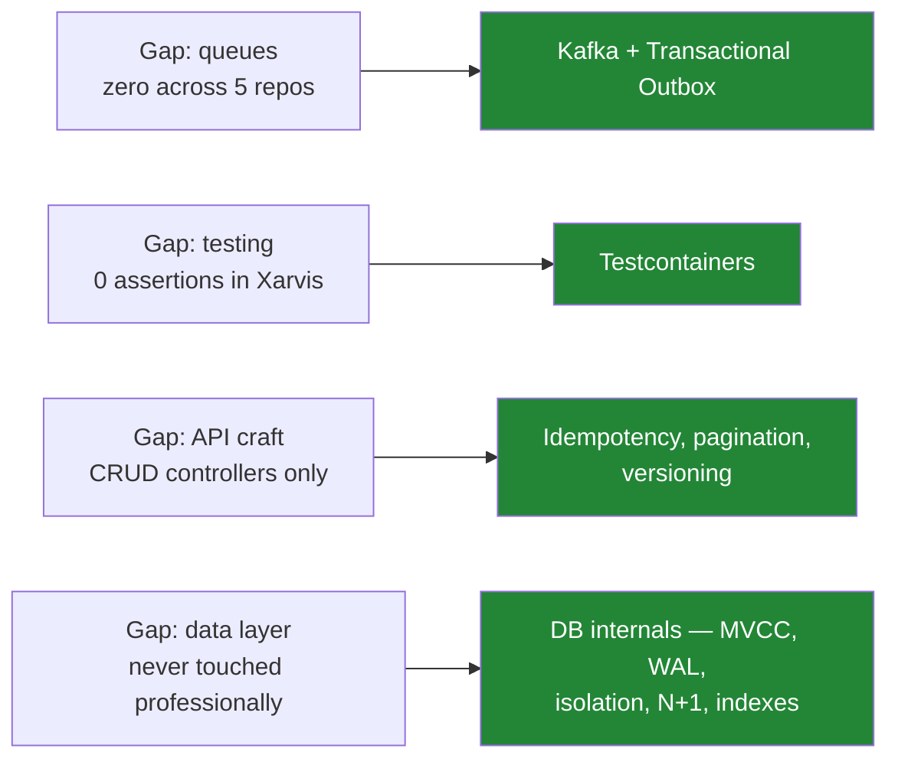

# Course Strategy and Lab 2

2026-09-03

> [!abstract] What this file is
> A decision, not a summary. The Spring Boot course syllabus is genuinely advanced and covers far more than I can absorb before I need to interview. This file picks the subset worth doing, names what to skip and why, and settles how any of it can honestly appear on a resume given none of it happens at work.

---

## The verdict on the course

The syllabus is real. CQRS, transactional outbox with Debezium CDC, event sourcing, SAGA, Testcontainers, WAL and MVCC internals, Resilience4J, sharding and replication — this is a senior curriculum, not a todo-app tutorial. It also maps unusually well onto the gaps found across five repo audits.

**But it cannot be completed before I need a job, and finishing it is not the goal anyway.** Two problems have to be handled first.

### Problem 1 — the flagship projects are clones

Uber Backend. Airbnb Booking. Payment Wallet. Quora Clone. Hotel Management.

Those are the five most recognisable tutorial shells in existence. A reviewer never sees the CQRS inside — they read Uber clone and file it as coursework. The advanced content is invisible from outside the repository.

`lab` is better positioned than any of the course's flagship projects for one reason: **PerformanceLab is not named after a company**, so it does not trip the pattern match.

### Problem 2 — this syllabus can build a resume that fails on contact

The audits established the starting point: zero queues, zero deployment ownership, zero assertions in the largest production codebase, no professional data layer. Dropping CQRS, event sourcing, SAGA, Debezium, gRPC, service mesh and sharding on top of that produces a keyword list that **steers senior interviewers directly at the questions I cannot answer**.

> [!important] The two-minute rationale test
> For every topic, ask whether the reason it exists is one sentence I can hold under pressure.
>
> **Transactional outbox passes.** Why not just publish after the commit? Because the publish can fail after the commit succeeded, and now the database and the broker disagree. Thirty seconds, finished.
>
> **Event sourcing fails.** The follow-up is the snapshotting strategy, or how event schemas evolve across two years. No course supplies that — only operating one does.
>
> Prefer patterns with a tight rationale. Skip the ones whose hard questions are operational.

---

## The subset — four items

Each one closes a gap that was verified in code, and each one gets asked in interviews.

**1 · Kafka with the transactional outbox pattern.** The last untouched zero from [[01-Self-Reported-Skill-Audit]], and the outbox carries the tight rationale above. Build the failure story, not the wiring — the wiring is a weekend and proves nothing.

**2 · Testcontainers.** `lab` already has the correct test pyramid built on H2. Swapping to real MySQL and Kafka in tests is what makes it credible rather than academic, and dialect differences between H2 and MySQL surface genuine bugs.

**3 · REST craft — idempotency, pagination, versioning, `@ControllerAdvice`.** Audited gap seven. Cheap, constantly asked, and partly muscle memory already since I built a `GlobalExceptionHandler` at work.

**4 · Database internals — MVCC, WAL, isolation levels, N+1, index types.** Audited gap six. These are interview questions more than implementation work, which makes the return per hour the highest on this list.

---

## The skip list

CQRS · Event Sourcing · SAGA orchestration and choreography · Kafka Streams · gRPC and Protobuf · service mesh and Kong · sharding and replication implementation.

Three reasons, all of which apply to every item:

- At three years these are claims I cannot defend past the second follow-up
- They are rarely used at the companies hiring at my level
- Each costs weeks that the runway does not have

Sharding, replication and consistency models still matter — **learn them as discussion material for high-level design rounds, not as implementations.** That is where they get asked anyway.

---

## The lane tension, stated honestly

My chosen lane is backend engineer who owns the AI layer. This is a **Java enterprise backend** course. Every hour spent on Kafka Streams and gRPC is an hour not spent on evaluation and retrieval work, and the ten months of agent engineering is the scarcer and more current asset.

The four-item subset is chosen specifically to survive that tension: **an AI platform needs queues, tests, observability and data modelling exactly as much as a payments system does.** The exotic distributed-systems material only pays inside a specific enterprise-Java role I am not otherwise positioned for.

---

## How any of this goes on a resume

The honest constraint: none of it happens at work, and there is no way to use Kafka on the company's projects at all.

### Wire, then break — not wire, then study

The understanding phase never arrives on its own. It gets wired, it works, and attention moves on. **Replace it with wire, then break.** Deliberately failing the thing is the understanding pass, and it produces the resume line at the same moment.

### Four rules

1. **Build verbs, not ownership verbs.** `Built`, `implemented`, `measured`, `verified` describe a build. `Owned`, `operated`, `scaled`, `ran in production` claim production. The first set overstates nothing and experienced readers register the distinction instantly.
2. **Name the mechanism, not the technology.** Kafka is a claim about experience. A consumer with idempotency keys and a dead-letter path is a claim about a specific thing I wrote. The second is smaller and far harder to knock down.
3. **Carry something that broke or something measured.** Anyone can follow a video to wire Kafka up. Almost nobody kills it deliberately and reports what happened. A failure story cannot be produced by watching a tutorial.
4. **Put it under Projects.** That section already tells the reader this is personal work, so the honesty burden is far lower than it feels.

### The phrasing, concretely

Weak and probeable:

> Kafka, RabbitMQ, event-driven microservices, Redis caching, Testcontainers

Strong and self-scoping:

> Built an order-events pipeline on Kafka using a **transactional outbox**; verified no event loss by killing the publisher between database commit and broker acknowledgement

> Added a consumer with **idempotency keys and a dead-letter path**; forced mid-batch failure to confirm at-least-once redelivery and duplicate suppression

> Replaced H2 with **Testcontainers-backed MySQL and Kafka** in the integration suite, catching two bugs the H2 dialect had been hiding

> Added read-through Redis caching; **p99 on the listing endpoint fell from X ms to Y ms at N concurrent users**, with a short lock on miss to prevent stampede

Every one of those is narrower than event-driven microservices, and every one is dramatically harder to attack.

### The answer when asked directly

The question will come: have you run Kafka in production?

> No — this was a lab I built. I wired the outbox, then killed the publisher mid-flight to see what actually happens, which is where the idempotency keys came from.

That costs almost nothing. Interviewers accept lab work that is honestly labelled; what ends interviews is a bluff unravelling on the second question. And the natural follow-up — what did you see when it duplicated — is one I can answer, because I broke it myself.

---

## Deployment — what a free EC2 box does and does not buy

> [!warning] Deploying to EC2 does not make it production
> Production means someone depends on it: real users, uptime that matters, data that cannot be lost, and consequences when it breaks. A box with no users has none of that, and claiming production collapses on the first question — how many users, and what happened when it went down.

**Deploy it anyway**, for the capability rather than the vocabulary. It buys four things:

- **The deployment gap closes.** Provisioning, security groups, ports, TLS, a domain, keeping containers up — that is the gap. The word production was never the missing piece.
- **Latency numbers become real.** p99 measured on localhost is meaningless. On a real box with real network hops, the measurements start meaning something.
- **CI/CD becomes possible at all.** GitHub Actions to build and deploy needs somewhere to deploy to. The pipeline gap only unlocks after this step.
- **A clickable link on the resume**, which is rare and disproportionately effective.

### The trick that manufactures operational experience without users

Point a load generator at it and **leave it running for two or three weeks.**

Without a single real user this produces memory growth to diagnose, disks filling with logs, container restarts, connection-pool exhaustion, and JVM heap behaviour under sustained load. Every one is an incident debugged with my own instrumentation.

> Ran under continuous synthetic load for three weeks; traced steadily climbing heap to an unbounded cache and capped it

This is the closest honest thing to operational experience available without customers, and it is worth more than the entire CQRS module.

### Safe vocabulary

**Fine:** deployed to EC2 · self-hosted on AWS · running behind nginx · deployed via GitHub Actions.
**Not fine:** in production · serving users · production traffic.

### Practical constraint before wasting a weekend

**The current stack will not fit on the AWS free tier.** A t2 or t3 micro is 1 GB of RAM. Elasticsearch alone realistically wants 2 GB, plus Logstash around 1 GB, plus Kibana, Kafka, MySQL, Redis and the application — 5 to 6 GB minimum.

Realistic options, in preference order:

1. **A cheap VPS instead of AWS free tier** — Hetzner at roughly €4 a month gives 4 GB, which actually runs the thing
2. **Kafka on Confluent Cloud free credits** rather than self-hosted, which also matches how companies really run brokers
3. **App plus MySQL plus Redis on the small box, telemetry to Grafana Cloud's free tier**, which accepts Prometheus metrics and Loki logs directly

Fighting a 1 GB box teaches nothing except that 1 GB is small.

---

## Lab 2 — the shape it should take

> [!important] Do not build another clone
> I have real domain knowledge in HRMS, verification and identity resolution that almost no candidate has. An event-driven service in a domain I actually know reads as an engineer solving a problem. The identical code shaped as an Uber clone reads as a student finishing a module.

That domain knowledge also has a shelf life now that the company is winding down, so it should be used while it is still fresh.

The target shape: **a queue-backed, instrumented, deployed service in a domain I understand**, carrying the four subset items — outbox and consumer, Testcontainers, proper REST semantics, and a data model with deliberate indexing.

---

## Open items

- [ ] Pick the lab 2 domain from HRMS, verification or identity resolution — no clones
- [ ] Kafka plus outbox, with a deliberate failure and the story written down
- [ ] Swap H2 for Testcontainers in `lab`, and record what the dialect difference exposes
- [ ] Idempotency, pagination and versioning on the existing endpoints
- [ ] Study pass on MVCC, WAL, isolation levels, N+1 and index types — interview material, not implementation
- [ ] Deploy to a 4 GB VPS, not the AWS free tier
- [ ] Run continuous synthetic load for three weeks and record every incident
- [ ] Rewrite the resume once numbers exist: `08-Resume-Rewrite.md`
