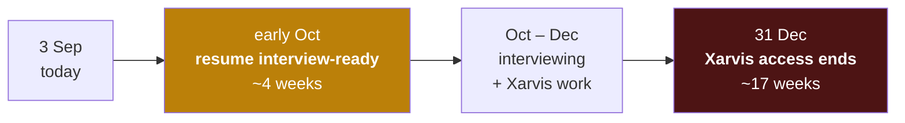

# Action Plan to 31 December

2026-09-03 · **17 weeks of Xarvis access remaining**

> [!abstract] What this file is
> The plan, ordered by what expires. Access to Xarvis ends 31 December 2026 unless the company survives. That single fact reorders everything in [[07-Course-Strategy-And-Lab-2]], because some work can only ever be done inside that repository and the rest can be done anywhere, forever.

---

## The organising principle: perishability, not value

The instinct is to rank work by how much it teaches. That is wrong now. **Rank it by whether it survives 31 December.**

| Perishable — needs the repo or the traces | Non-perishable — doable anywhere, any time |
|---|---|
| Evaluations on real production traces | The Spring `lab` and its second version |
| Fixing the authorization hole | Kafka, Testcontainers, REST craft, DB internals |
| Instrumenting a live agent system | DSA and contest practice |
| Writing the first Xarvis test suite | A public shareable artifact |
| Any measurement against real traffic | Everything in the deep-learning half of the course |

> [!important] The traces are the most perishable asset I own
> Ten months of real user conversations through an agent system. After 31 December they are gone and cannot be reconstructed. **No lab, no side project and no course can manufacture a production trace corpus.** Everything else on this page can wait; that cannot.

---

## Two deadlines, not one

Indian hiring runs four to eight weeks from application to offer, so applications need to go out in October to land before the company closes. **The resume has to be ready in about four weeks, not four months.**

That looks impossible next to a seventeen-week work plan, and it is not, for one reason: **the resume rewrite does not depend on any new work.** Five audits already found more than enough that was undersold — 99.7% sole authorship of 26,000 lines, worker pools and a hand-written resource pool, connection pooling tied to worker count, tenant-scoped partition keys, Docker layer-cache ordering, parameterised retry with backoff, a `GlobalExceptionHandler` refactor, and 133 test assertions in `lab`. All of it verified, none of it currently on the page.

**Rewrite from what is already true. Let the next three months make it better.**

---

## What can and cannot leave with me

> [!warning] Company code and employee data do not leave. Knowledge and method do.
> Xarvis is company IP and its traces contain real HR data — salaries, leave records, personal details of named employees.
>
> **Do not extract:** source code, raw traces, customer or employee records, anything with PII in it.
>
> **Do keep:** my own understanding, the methodology I develop, aggregate numbers, an anonymised failure taxonomy, and architecture notes I write myself.

This is why evaluation work is the right choice under a deadline. **Evals produce a narrative artifact rather than a code artifact.** A sentence like — I hand-labelled 200 production traces, bucketed the failures into six categories, built a binary pass/fail set and aligned an LLM judge to 89% against my own labels — needs no repository to tell, survives the shutdown intact, and cannot be bluffed by someone who only did a course.

The `Xarvis-Archaeology/` notes already in this vault are exactly the right instinct. **Extend them before access ends** — they are the part that comes with me.

---

## The work, in perishability order

### 1 · Evaluations on real traces — module 23

The highest-value and most perishable item, and the one my own plan already names as the number one signal in AI engineering.

Trace-by-hand on production traces, failure bucketing, binary pass/fail evaluations, LLM-as-judge prompts, judge alignment, the three gulfs model, RAGAS.

**Produces:** a failure taxonomy, an eval set, and a judge-alignment number. All three are portable, none contains PII, and no course project can imitate them.

### 2 · Security and least-privilege tool design — module 24

There is a live authorization hole in Xarvis: `allowed_emails` is dead code and any caller with the `HR_ADMIN` role passes a guard wired into 39 call sites. Module 24 covers exactly this — least-privilege tool design, schema validation, human-in-the-loop, and prompt-injecting your own agent.

Do this early regardless of the resume. **It is a real vulnerability in a system holding real HR data**, and I already found it myself, which is the part that makes it a good story rather than an embarrassing one.

**Produces:** the repair of the strongest and currently broken resume bullet, plus a genuine security narrative — found it, understood why the check was vacuous, fixed it, tested the agent against injection.

### 3 · The first Xarvis test suite

Eleven test files, 132 lines, zero assertions, and a hardcoded production JWT pointing at the live HRMS. Worst finding of all five audits, on the largest system I own.

Repo-dependent, so it expires. Also cheap — `lab` already proved 133 assertions in six days is achievable.

**Produces:** closes the single worst line in the whole audit, and removes the credential from the test file while I still can.

### 4 · Observability and tracing — module 22

Langfuse, LangSmith, Braintrust, OpenLLMetry, OpenTelemetry GenAI semantic conventions. Tracing model calls, tools, retrieval and agent workflows.

Needs a live system with traffic, so it expires too. Currently LangSmith is one config flag and eyeballing two users a day.

**Produces:** real instrumentation experience inside my own domain, and the numbers that make every other claim measurable.

### 5 · Async queues — module 10, deliberately last

Python RQ with Redis on Docker, FastAPI enqueue/poll/dequeue, worker orchestration and horizontal scaling. This closes the last remaining zero from [[01-Self-Reported-Skill-Audit]].

It ranks last **only because it is the least perishable of the five** — a queue can be built in `lab` in January just as well as in Xarvis in November. Everything above it cannot.

---

## The course is a live cohort — so nothing gets skipped

Correction to [[07-Course-Strategy-And-Lab-2]]: this is a **live six-month cohort, two months already done**. The schedule is not mine to reorder and attendance is not optional. Skipping modules was never the available choice.

**What is mine to control is depth, and what I claim afterwards.** Three tiers:

| Tier | Modules | What I do |
|---|---|---|
| **Build** | 22 Observability · 23 Evaluations · 24 Security and least-privilege · 10 Async queues | Apply directly to Xarvis. These earn resume lines. |
| **Follow** | 9 RAG and RAGAS · 19 Streaming, retries, idempotency · 21 Prompt caching and cost · 18 MCP | Do the exercises, do not build on them yet. They survive December and belong to the public product later. |
| **Attend** | AutoGen and CrewAI · LangFlow · A2A · Ollama · graph memory · all of Part 2 | Watch, take notes, build nothing, claim nothing. |

The tier-three material is not worthless — it is context, and sitting through it costs nothing beyond the session. **The discipline is that attending a module is not the same as earning a claim.** Nothing from tier three goes near a resume, and if it comes up in an interview the honest answer is that I covered it in a cohort and have not built with it.

One piece of Part 2 is worth genuine attention as reading: **module 32 — KV cache, paged attention, quantization, mixture of experts, speculative decoding.** These surface as discussion in AI engineering interviews, and I already do speculative prefetch, so the vocabulary attaches to something real I built.

---

## The scheduling conflict — this is the important part

> [!warning] The modules I need most may arrive after my access ends
> Two months into a six-month cohort puts me somewhere around module 10 to 12 of 26 in Part 1. At roughly five modules a month, **evaluations, observability and security land around month five — November or December.** Part 2 is explicitly month six, so January.
>
> Xarvis access ends **31 December**. The three modules that matter most to me arrive with weeks to spare at best, and cohorts slip.

**So I do not wait for the cohort to reach them.**

Modules 22, 23 and 24 get self-studied ahead of schedule, starting now. The trace corpus expires on a fixed date and the syllabus does not bend around that. When the cohort reaches those sessions in November or December, they become reinforcement of work already done rather than the starting gun.

This is the single most consequential scheduling decision in this file. Everything else can follow the cohort's pace. **Evaluations cannot.**

---

## The non-perishable track, kept alive at low intensity

These do not stop, but they do not compete with the Xarvis work for the good hours either.

- **DSA** — 1500 after 30 contests, already sufficient to pass rounds. Maintain, do not chase the rating.
- **The Spring `lab`** — Testcontainers, REST craft and DB internals from [[07-Course-Strategy-And-Lab-2]]. All portable to January.
- **A public shareable artifact** — only matters if Xarvis turns out to be unshowable, and that can be built after December.

---

## Order of operations

1. **Now → 2 weeks:** rewrite the resume from verified facts only. Nothing new required.
2. **Now → 4 weeks, in parallel:** fix the authorization hole and rotate the committed credentials. Live issues, cheap, and it repairs the best bullet.
3. **Weeks 2 → 12:** evaluations on real traces. The centrepiece. Extend `Xarvis-Archaeology/` as it goes.
4. **Weeks 4 → 14, interleaved:** the Xarvis test suite, then observability instrumentation.
5. **October onward:** applications out, interviewing while employed.
6. **After December:** queues, Testcontainers, the public artifact, everything portable.

---

## Open items

- [ ] Rewrite the resume from verified facts — `09-Resume-Rewrite.md`, this is the urgent one
- [ ] Fix `allowed_emails`; test the agent against prompt injection while fixing it
- [ ] Rotate the three committed `.env` files and the two hardcoded JWTs
- [ ] Start the trace-labelling pass — target a first failure taxonomy within four weeks
- [ ] Extend `Xarvis-Archaeology/` continuously; it is the artifact that survives
- [ ] Confirm what may be spoken about publicly versus what is confidential, before interviewing
- [ ] Keep DSA ticking, do not chase 1850
- [ ] **Self-study modules 22, 23 and 24 ahead of the cohort** — they land around November and the traces expire 31 December
- [ ] Attend tier-three sessions without building on them, and claim nothing from them
