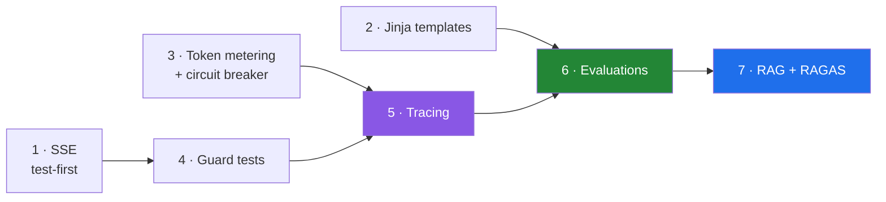

# Xarvis Build Plan — September and October

2026-09-03 · scope: **admin and employee agents only** · onboarding agent out of scope

> [!abstract] What this file is
> The operational plan that follows from [[08-Action-Plan-To-December]]. Everything here happens inside Xarvis, which I own outright at 99.7% of the source. One system, one thread — the consolidation is the point, because six features across six repos is what the last three years already looked like.

---

## The constraint

I am on the bench, so this **is** the job rather than something competing with it. The daily log shows 7 to 9 focused hours held consistently, which across September and October is roughly **360 to 400 hours**.

Xarvis access ends **31 December**. Everything that needs the repository or the production traces has to happen before then; everything portable can wait for January.

> [!warning] Out of band — this week, regardless of the ordering below
> Two live authorization holes in a system holding real HR data:
>
> - **`allowed_emails` is dead code.** The set is built and never read, and the condition beneath it is true for any non-empty email, so **any caller with the `HR_ADMIN` role passes** a guard wired into 39 call sites.
> - **Thread ownership is never verified.** The `session_id` and `thread_id` fusion currently hides this, but it becomes exploitable the moment they are decoupled.
>
> Both are hours, not days. Get at least one reviewed by Ankit or Abhishek — a fix someone else confirmed is worth more than the same fix alone, and code review is a gap the audits flagged.

---

## Table 1 — Build

Starting from SSE. Everything from item 1 onward is built **test-first**, so the pytest suite accumulates as a by-product instead of becoming a separate project nobody gets to.

| # | Build | What it produces | Why it earns the slot | Est. |
|---|---|---|---|---|
| **1** | **SSE — design doc, then rewrite** | Event taxonomy, `id:` and `retry:`, heartbeat, cancellation on client disconnect, error signalling after `200 OK`, distributed stream limiting | I want to actually understand it, and every LLM product streams this way. Frame builders are pure functions, which makes this the natural pytest entry point | 40–60h |
| **2** | **Jinja prompt templates** | Prompts become versioned, addressable artifacts instead of strings in code | Required at work, and it is the prerequisite for A/B-ing prompt versions against an eval set. Also gives stable prefixes for caching | 15–20h |
| **3** | **Token metering and quota windows** circuit breaker folded in | Tokens per request, cost per query, cost per tenant, weekly and monthly resets, provider fallback | Required at work, and it produces **the numbers the resume is missing**. Rate limiting and the breaker story come along for free | 50–70h |
| **4** | **Guard and authorization test suite** | Tests over `extract_user_fields`, `has_tool_access`, registry integrity, quota-window boundaries | Pure functions and security-relevant. Closes the worst single finding across all five audits — zero assertions in ten months | 40–60h |
| **5** | **Tracing and instrumentation** | Structured spans across intent, subject, field extraction, tool selection, execution, HITL interrupts | **Prerequisite for evaluations.** Traces cannot be labelled if they were never captured properly. Currently this is one LangChain flag | 30–40h |
| **6** | **Evaluations** | Failure taxonomy, golden set, LLM-as-judge prompts, a judge-alignment number | 40% of the interview loop, and the trace corpus expires 31 December. **Largest single allocation, deliberately** | 80–100h |
| **7** | **RAG as a tool, plus RAGAS** | Policy-document retrieval, chunking strategy, hybrid search, reranking, retrieval evaluations | Xarvis has zero retrieval and it is named explicitly in the 40%. Evaluated from day one because item 6 already exists | ~50h |

**Roughly 315 to 410 hours** against 360 to 400 available. It fits, with no room for a second thing.

---

## Why this order

Three dependencies drive everything:

- **Jinja before evaluations**, because a prompt has to be a versioned artifact before two versions can be compared.
- **Tracing before evaluations**, because labelling needs structured spans rather than raw output.
- **Evaluations before RAG**, because retrieval built first gets evaluated later, which means never. Built second, chunk size and reranking are measured from the first day.

The metering work also feeds tracing — building per-request token accounting is building half a metrics pipeline whether or not it gets called that.

---

## Table 2 — Design only, build if time permits

| Design | Why deferred | What to produce |
|---|---|---|
| **Multi-chat conversation index** | Schema, session migration, frontend coordination and merge approval at a company that closes on 31 December. Weeks of work. | PK `user_id`, SK `thread_id`, a GSI for sort-by-recency, retention policy against checkpoint TTL, cost trade-off at scale |
| **SSE resumption** | A replay buffer is real storage design, and it overlaps with state the checkpointer already persists | The decision written out — replay frames versus resume from checkpoint, and the reasoning either way |
| **Distributed stream limiting** | Needs Redis; the in-process `defaultdict` is correct enough at current scale | Where the counter lives once there is more than one worker, and the atomicity problem two concurrent requests create |
| **Multi-provider LLM gateway** | The circuit breaker in item 3 already carries most of the story | Routing, health checks, fallback policy, cost-aware provider selection |
| **Prompt caching** | Needs the stable prefixes that item 2 delivers | Where the cacheable prefix boundary sits, and what it would actually save |
| **CI/CD and deployment** | Not mine at Xarvis — Abhishek owns the Dockerfile and the infrastructure | Build it on `lab` in January instead, where I own everything |

> [!important] The second table is not a consolation prize
> System design is 30% of the interview loop. **A design I can walk through on a whiteboard scores the same as shipped code**, costs a fraction of the hours, and unlike the code it leaves with me on 31 December.
>
> Being able to say here is an architectural limitation I found in my own production system and here is how I would fix it is a stronger answer than most candidates have, and it comes from writing rather than building.

---

## Working rules, because the bench provides no structure

The risk of bench time is not hours. It is that **nothing forces a finish** — no sprint, no deadline, no reviewer waiting. That is exactly how eight things end up at 70%, which is a precise description of what five audits found.

- **One thread at a time, in order.** Do not start tracing until the test suite runs green.
- **A weekly artifact.** Something exists on Friday that did not exist on Monday: a test file, a labelled batch of traces, a design document, a number.
- **Log outputs the way I already log hours.** The time discipline is genuinely good; point it at what came out, not just what went in.
- **Extend `Xarvis-Archaeology/` as I go.** Those notes are the part that survives December.

---

## What each item is worth in an interview

| Build | The answer it unlocks |
|---|---|
| SSE | Why SSE over WebSocket, how resumption works, what kills a stream in production, how to stop burning tokens for a client that left |
| Token metering | Fixed versus sliding window versus token bucket, atomic counters under concurrency, and what happens when a quota is crossed mid-stream |
| Circuit breaker | Why retry and a breaker solve opposite failures, the three states, and why a 429 is not a 500 |
| Guard tests | How you test a security boundary, and the two authorization holes I found in my own code |
| Tracing | Why traditional logs are not enough for agentic systems, and what a span should contain |
| Evaluations | How to build a golden set, run an LLM judge, align it to human labels, and catch regressions before production |
| RAG | How to chunk, when a reranker earns its place, and how you know retrieval is any good |

---

## Open items

- [ ] Fix `allowed_emails` and add the thread-ownership check — this week, reviewed by someone
- [ ] Confirm HR policy documents exist to index, before counting on the RAG use case
- [ ] Write the SSE design document before writing any SSE code
- [ ] Pull resume metrics out of production before access ends — tenant count, tool count, requests per day, distinct workflows
- [ ] Decide deliberately whether SSE v1 includes resumption, rather than discovering halfway that it does
- [ ] Keep extending [[../Xarvis-Archaeology/TODO-Beyond-Xarvis]] and the archaeology notes
