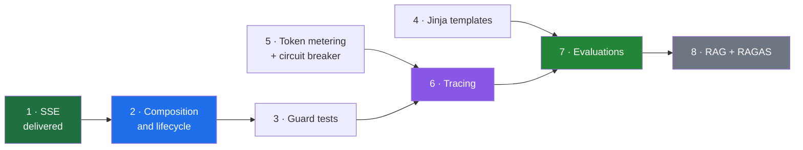

# Xarvis Build Plan — September and October

2026-09-03 · scope: **admin and employee agents only** · onboarding agent out of scope

> [!abstract] What this file is
> The operational plan that follows from [[08-Action-Plan-To-December]]. Everything here happens inside Xarvis, which I own outright at 99.7% of the source. One system, one thread — the consolidation is the point, because six features across six repos is what the last three years already looked like.

---

## The constraint

I am on the bench, so this **is** the job rather than something competing with it. The daily log shows 7 to 9 focused hours held consistently, which across September and October is roughly **360 to 400 hours**.

Xarvis access ends **31 December**. Everything that needs the repository or the production traces has to happen before then; everything portable can wait for January.

> [!warning] Out of band — ~~this week~~ · one fixed, one still standing · re-checked 2026-09-12
> Two live authorization holes in a system holding real HR data:
>
> - ~~**`allowed_emails` is dead code.**~~ **Fixed.** It is now `is_allowed_admin()` in `services/constants/admin_access.py`, enforced at both call sites, with denials logged. The vacuous condition is gone. Note it does **not** close [[TODO/07-Staging-Auth-Gap]] — the canned staging user's email is on the list.
> - **Thread ownership is still never verified directly**, and the fusion still hides it: `thread_id` is read from the signed session cookie rather than the request body, so a client cannot currently name someone else's thread. That is protection by construction, not by check, and it becomes exploitable the day the two are decoupled. What *was* added is adjacent and worth having — `chat.py::pending_interaction` now refuses a HITL answer aimed at a question that is no longer pending, with a 409.
>
> Get the next one reviewed by Ankit or Abhishek — a fix someone else confirmed is worth more than the same fix alone, and code review is a gap the audits flagged.

---

## Table 1 — Build

Starting from SSE. Everything from item 1 onward is built **test-first**, so the pytest suite accumulates as a by-product instead of becoming a separate project nobody gets to.

| #     | Build                                                              | What it produces                                                                                                                               | Why it earns the slot                                                                                                                                        | Est.    |
| ----- | ------------------------------------------------------------------ | ---------------------------------------------------------------------------------------------------------------------------------------------- | ------------------------------------------------------------------------------------------------------------------------------------------------------------ | ------- |
| **1** | ~~**SSE — design doc, then rewrite**~~ · **DONE 2026-09-11**        | Event taxonomy, heartbeat, cancellation on client disconnect, error signalling after `200 OK`. Shipped as [[TODO/03-Stream-Contract]], live on admin and employee | Landed with the reader and writer split, the LangGraph upgrade and both CVEs closed. `id:` and `retry:` were decided against rather than skipped, and distributed stream limiting is still open | done    |
| **2** | ~~**Composition and lifecycle**~~ · **DONE 2026-09-13 · committed 2026-09-15** [[TODO/08-Composition-And-Lifecycle]] | Typed context into tools and nodes via `ToolRuntime[TurnContext]`, every tool a plain LangChain `@tool` function, `require_session` on a protected router, a 21-field `Services` container, `create_session` split into three raising steps; the startup route check, session warmup and employee prefetch removed | **Was the reason there were no tests, and is not any more.** A tool declared one of seven inputs; it now declares both of two, and one is called from a test with a hand-built context. Verified by a golden-master harness against a frozen copy of the old tree: 18 intended differences, everything else byte-identical, plus 12 live turns against real Gemini | done |
| **3** | **Guard and authorization test suite** ← **next**                  | Tests over `has_tool_access`, `write_turn`, the session dependency, catalog integrity, and every mounted route refusing a request with no session cookie                                                                          | Pure functions and security-relevant. Closes the worst single finding across all five audits — zero assertions in ten months. **Start with the access rule**, which is now directly callable, rather than with `write_turn` | 40–60h  |
| **4** | **Jinja prompt templates**                                         | Prompts become versioned, addressable artifacts instead of strings in code                                                                     | Required at work, and it is the prerequisite for A/B-ing prompt versions against an eval set. Also gives stable prefixes for caching                         | 15–20h  |
| **5** | **Token metering and quota windows** circuit breaker folded in | Tokens per request, cost per query, cost per tenant, weekly and monthly resets, provider fallback                                              | Required at work, and it produces **the numbers the resume is missing**. Rate limiting and the breaker story come along for free. Per-lap usage already reaches the `done` frame, so the measurement exists | 50–70h  |
| **6** | **Tracing and instrumentation**                                    | Structured spans across intent, subject, field extraction, tool selection, execution, HITL interrupts                                          | **Prerequisite for evaluations.** Traces cannot be labelled if they were never captured properly. Currently this is one LangChain flag                       | 30–40h  |
| **7** | **Evaluations**                                                    | Failure taxonomy, golden set, LLM-as-judge prompts, a judge-alignment number                                                                   | 40% of the interview loop, and the trace corpus expires 31 December. **Largest single allocation, deliberately**                                             | 80–100h |
| **8** | **RAG as a tool, plus RAGAS**                                      | Policy-document retrieval, chunking strategy, hybrid search, reranking, retrieval evaluations                                                  | Xarvis has zero retrieval and it is named explicitly in the 40%. Evaluated from day one because item 7 already exists                                        | ~50h    |

**Roughly 265 to 340 hours** of remaining work against 360 to 400 available. Items 1 and 2 are delivered.

> [!success] Item 2 landed on 2026-09-13, and it found a live bug on the way through
> Moving authentication off the middleware and onto a router dependency revealed that **every authentication refusal had been reaching the client as a 500, not a 401** — Starlette does not run exception handlers for an exception raised inside middleware, so the `HTTPException(401)` became an unhandled error. The frontend was written for the 401 and had never seen one. Six kinds of bad session, all fixed as a side effect. Details in [[TODO/08-Composition-And-Lifecycle]].

> [!important] Reordered 2026-09-12 — wiring before tests, tests before measurement
> The original order put the test suite fourth and treated it as a matter of sitting down and writing tests. It is not. A tool reads six things out of a global object and declares none of them, so a test has to construct a context variable and a thirty-key dictionary before it can assert that an employee cannot read another employee's salary.
>
> **So item 2 is not new scope, it is the invoice for item 3.** Evaluations and metering move behind both, on the same argument in reverse: measuring a system is cheap once it can be instantiated in a test and expensive while it cannot.

---

## Why this order

Four dependencies drive everything:

- **Composition before tests**, because a test that has to fake a global to reach a tool is a test nobody writes. This is the dependency the first version of this plan missed, and it is why item 3 sat unstarted while four other items shipped.
- **Jinja before evaluations**, because a prompt has to be a versioned artifact before two versions can be compared.
- **Tracing before evaluations**, because labelling needs structured spans rather than raw output.
- **Evaluations before RAG**, because retrieval built first gets evaluated later, which means never. Built second, chunk size and reranking are measured from the first day.

The metering work also feeds tracing — building per-request token accounting is building half a metrics pipeline whether or not it gets called that.

---

## Table 2 — Design only, build if time permits

| Design | Why deferred | What to produce |
|---|---|---|
| **Multi-chat conversation index** | Schema, session migration, frontend coordination and merge approval at a company that closes on 31 December. Weeks of work. | PK `user_id`, SK `thread_id`, a GSI for sort-by-recency, retention policy against checkpoint TTL, cost trade-off at scale |
| **SSE resumption** | A replay buffer is real storage design, and it overlaps with state the checkpointer already persists | The decision written out — replay frames versus resume from checkpoint, and the reasoning either way |
| **Distributed stream limiting** | Needs Redis; the in-process `defaultdict` is correct enough at current scale | Where the counter lives once there is more than one worker, and the atomicity problem two concurrent requests create |
| **Multi-provider LLM gateway** | The circuit breaker in item 3 already carries most of the story | Routing, health checks, fallback policy, cost-aware provider selection |
| **Prompt caching** | Needs the stable prefixes that item 2 delivers | Where the cacheable prefix boundary sits, and what it would actually save |
| **CI/CD and deployment** | Not mine at Xarvis — Abhishek owns the Dockerfile and the infrastructure | Build it on `lab` in January instead, where I own everything |

> [!important] The second table is not a consolation prize
> System design is 30% of the interview loop. **A design I can walk through on a whiteboard scores the same as shipped code**, costs a fraction of the hours, and unlike the code it leaves with me on 31 December.
>
> Being able to say here is an architectural limitation I found in my own production system and here is how I would fix it is a stronger answer than most candidates have, and it comes from writing rather than building.

---

## Working rules, because the bench provides no structure

The risk of bench time is not hours. It is that **nothing forces a finish** — no sprint, no deadline, no reviewer waiting. That is exactly how eight things end up at 70%, which is a precise description of what five audits found.

- **One thread at a time, in order.** Do not start tracing until the test suite runs green.
- **A weekly artifact.** Something exists on Friday that did not exist on Monday: a test file, a labelled batch of traces, a design document, a number.
- **Log outputs the way I already log hours.** The time discipline is genuinely good; point it at what came out, not just what went in.
- **Extend `Xarvis-Archaeology/` as I go.** Those notes are the part that survives December.

---

## What each item is worth in an interview

| Build | The answer it unlocks |
|---|---|
| SSE | Why SSE over WebSocket, how resumption works, what kills a stream in production, how to stop burning tokens for a client that left |
| Token metering | Fixed versus sliding window versus token bucket, atomic counters under concurrency, and what happens when a quota is crossed mid-stream |
| Circuit breaker | Why retry and a breaker solve opposite failures, the three states, and why a 429 is not a 500 |
| Guard tests | How you test a security boundary, and the two authorization holes I found in my own code |
| Tracing | Why traditional logs are not enough for agentic systems, and what a span should contain |
| Evaluations | How to build a golden set, run an LLM judge, align it to human labels, and catch regressions before production |
| RAG | How to chunk, when a reranker earns its place, and how you know retrieval is any good |

---

## Open items

- [ ] Fix `allowed_emails` and add the thread-ownership check — this week, reviewed by someone
- [ ] Confirm HR policy documents exist to index, before counting on the RAG use case
- [ ] Write the SSE design document before writing any SSE code
- [ ] Pull resume metrics out of production before access ends — tenant count, tool count, requests per day, distinct workflows
- [ ] Decide deliberately whether SSE v1 includes resumption, rather than discovering halfway that it does
- [ ] Keep extending [[../Xarvis-Archaeology/TODO-Beyond-Xarvis]] and the archaeology notes
