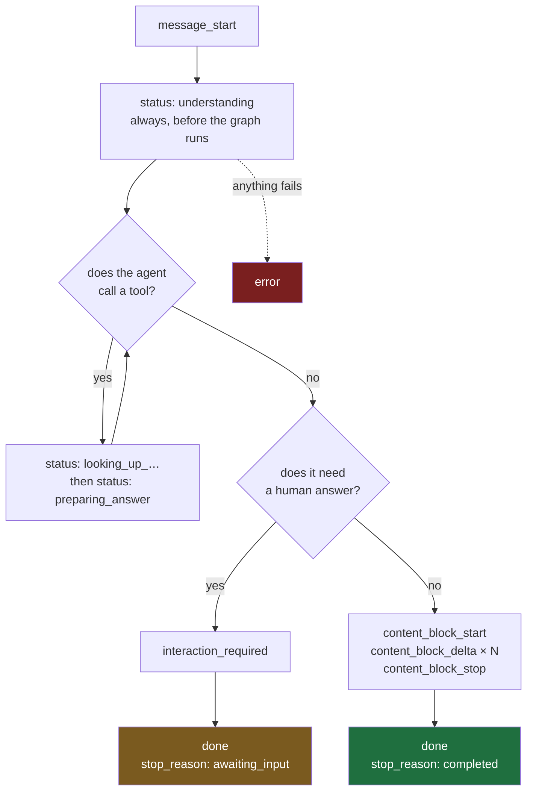

# 03 — Stream Contract

Frontend-facing · version **v1** · **live on the admin and employee agents since 2026-09-11** · onboarding out of scope

> [!abstract] What this is
> The wire contract between the Xarvis backend and any client that renders a chat turn. It describes every frame the server can send, the order they arrive in, and what the client is required to do with each one. It says nothing about how the server produces them, which is deliberate — the backend is being upgraded and rewritten behind this document and none of that should reach this page.
>
> Anything not written here is not part of the contract. If the client needs it, it gets added here first.

---

## Transport

| | |
|---|---|
| Method | **POST**, one request per turn |
| Response | `Content-Type: text/event-stream` |
| Status code | **always 200**, from the first byte, regardless of what happens later |
| Framing | Server-Sent Events — `event:` name, `data:` JSON, blank line terminates a frame |
| Keep-alive | comment frames every 15 seconds, lines beginning with `:` |
| Reconnection | **none** — the client POSTs, so `EventSource` is not in use, `retry:` is not sent, and `Last-Event-ID` is not honoured. A dropped stream loses the turn. |

> [!important] The status code is fixed before anything can go wrong
> Once the first byte of a 200 response has left the server, there is no way to change it to a 500. **Every failure therefore arrives as a frame, not as an HTTP status.** A client that only handles errors in a `catch` around the fetch will silently show a blank answer when the backend fails.

---

## The envelope

Every frame carries the same three fields plus its own payload.

```
event: content_block_delta
data: {"role": "assistant", "type": "content_block_delta", "content": {"block_id": "t1", "text": "Priya"}, "seq": 11}

```

| Field | Meaning |
|---|---|
| `event:` | the SSE event name, always equal to `type` |
| `role` | always `assistant`. Inherited from the older envelope and kept so one shape covers every frame |
| `type` | the frame type, duplicated inside `data` so a client can switch on either |
| `content` | **the payload, always nested.** Every frame's own fields live in here, never at the top level |
| `seq` | strictly increasing integer from 0, never repeated, never skipped |

> [!important] The payload is nested, and earlier drafts of this page showed it flat
> Every example below was written before the frames existed and put each frame's fields at the top level of `data`. **The server has never done that.** A client reading `data.block_id` finds nothing; it is `data.content.block_id`. All examples corrected 2026-09-11 against frames captured from a running server.

`seq` exists so the client can detect a gap and so ordering is provable rather than assumed. It is not a resumption token — there is no resumption.

---

## Lifecycle



Rules that hold for every stream:

- `message_start` is always the first frame.
- **Exactly one terminator arrives: `done` or `error`.** Never both, never neither.
- `status` may appear any number of times, at any point before the terminator.
- Content blocks are bracketed — no `_delta` without a preceding `_start`, no `_start` without a matching `_stop`, unless `error` cut the stream short.
- Blocks do not interleave. One block closes before the next opens.
- **A stream that ends without a terminator is a failure**, and the client must treat it as one. This is the only way to tell a finished answer from a dropped connection.

---

## Frames

### message_start

Opens the turn. Carries the identifiers the client needs for logging and for answering a question later.

```
event: message_start
data: {"role": "assistant", "type": "message_start", "content": {"run_id": "531bfe06-037a-423e-897d-a776297a1996", "thread_id": "xarvis-local", "audience": "admin"}, "seq": 0}

event: status
data: {"role": "assistant", "type": "status", "content": {"code": "understanding"}, "seq": 1}

event: status
data: {"role": "assistant", "type": "status", "content": {"code": "looking_up_payroll"}, "seq": 2}

event: status
data: {"role": "assistant", "type": "status", "content": {"code": "preparing_answer"}, "seq": 3}

event: content_block_start
data: {"role": "assistant", "type": "content_block_start", "content": {"block_id": "t1", "block_type": "text"}, "seq": 4}

event: content_block_delta
data: {"role": "assistant", "type": "content_block_delta", "content": {"block_id": "t1", "text": "### Employee 1069\n\nThe annual Cost to Company (CTC) for employee **1069** is **133,036.0**."}, "seq": 5}

event: content_block_stop
data: {"role": "assistant", "type": "content_block_stop", "content": {"block_id": "t1"}, "seq": 6}

event: done
data: {"role": "assistant", "type": "done", "content": {"stop_reason": "completed", "usage": {"input_tokens": 13209, "output_tokens": 824}, "iterations": 2}, "seq": 7}

```

| Field | Notes |
|---|---|
| `run_id` | one turn. Quote this in any bug report — it is the key into server logs. |
| `thread_id` | the conversation. Stable across turns. Required when answering an `interaction_required`. |
| `audience` | `admin` or `employee`. Only `admin` can ever receive an `interaction_required`. |

### status

What the agent is doing right now, in product terms.

```
event: status
data: {"role": "assistant", "type": "status", "content": {"code": "looking_up_leave"}, "seq": 2}
```

**`code` is a closed vocabulary.** The server never sends a free-text label, an internal tool name, or arguments.

| Code | Meaning |
|---|---|
| `understanding` | reading the request. **Always the first status of a turn**, sent before the agent has done anything |
| `looking_up_profile` | personal, address, contact, identity, dependent, marriage or bank details |
| `looking_up_payroll` | salary or tax details |
| `looking_up_leave` | leave balance, leave history, monthly summary, or who is on leave on a date |
| `looking_up_attendance` | attendance and shift details |
| `looking_up_work` | work details, company details, career progression or separation |
| `looking_up_team` | manager, reportees, hierarchy or span of control |
| `searching_directory` | finding employees by name, department, joining or leaving date, or salary band |
| `checking_dates` | current time, today's date, or date arithmetic |
| `preparing_answer` | a tool returned and the model is composing. **Sent on every tool completion** |
| `working` | fallback. A tool with no mapping resolves here, and it deliberately says nothing |

> [!important] This table is generated from the implementation, not from intent
> An earlier version of this document listed `looking_up_employee`, `checking_policy` and `updating_record`. **The server has never been able to send any of them**, and it sends six codes that were not listed. A client built against that table would have rendered the fallback wording for most of a turn. Corrected 2026-09-11 against `sse_events.py`.
>
> `understanding` and `preparing_answer` are the two that do not come from a tool name. They are sent from lifecycle position — one before the graph runs, one when a tool returns — because on a real turn the model produces no text at all until very late, and these are the only frames that can occupy that time.

> [!note] Rendering rules for status
> A `status` frame **replaces** the previous one. It is transient UI chrome, not conversation content — it must not enter the transcript, must not be persisted, and must disappear once the first `content_block_start` arrives.
>
> The client owns the wording. The server sends `looking_up_leave`; the string shown to the user is a frontend concern, which means copy and localisation change without a backend deploy.

An unrecognised `code` renders as the `working` wording. New codes will be added; that must never break a client.

### content blocks

The answer, and anything else that belongs in the main body. A turn's content is a **sequence of blocks**. Each one opens, may produce deltas, and closes.

```
event: content_block_start
data: {"role": "assistant", "type": "content_block_start", "content": {"block_id": "t1", "block_type": "text"}, "seq": 4}

event: content_block_delta
data: {"role": "assistant", "type": "content_block_delta", "content": {"block_id": "t1", "text": "### Sonali Ravi Khade (ID: 1069)\n\n**Sonali Ravi Khade** has an annual CTC of **\u20b91,33,036.00**."}, "seq": 5}

event: content_block_stop
data: {"role": "assistant", "type": "content_block_stop", "content": {"block_id": "t1"}, "seq": 6}
```

**The event name says a block opened; `block_type` says what kind.** That split is the whole point. When an answer needs to carry a Form 16, a photo or a video, each new kind costs one new value in a field — not three new event names and a new branch in three switch statements. It is also how both major providers do it, for the same reason.

| `block_type` | Status |
|---|---|
| `text` | **the only kind the server can send today** |

> [!important] No other kind is listed, deliberately
> Documents, images and video are the reason the naming is generic, and none of them exist yet. A kind appears in that table on the day a writer can produce it. The status vocabulary on this page was once published with three codes the server could not send, and a client built against it rendered a fallback for most of a turn.

**Rules that hold for every block:**

- **Accumulate deltas by `block_id`**, in arrival order. Concatenation is exact — the server does not send whitespace the answer does not contain and does not repeat text already sent.
- **Never concatenate across blocks.** Two text blocks with something between them are two parts of the answer, not one string. A client keeps an ordered list, not a buffer.
- **A block need not produce any deltas.** A document is a finished artifact: it opens with its attributes and closes. Only `text` streams.
- **A client that does not recognise a `block_type` ignores that block** and renders the rest of the answer. That is far easier than surviving an unknown event name, which is precisely why the kind is a field.
- Blocks do not interleave. One closes before the next opens.

> [!note] Reasoning is a block type, not its own frame family
> The model's own account of what it is doing would arrive as `block_type: "reasoning"` — rendered in a collapsed panel, never in the answer body, and never persisted.
>
> **It is not implemented.** No reasoning block has ever been sent and the server cannot currently produce one. A client that ships a reasoning panel today is shipping a panel that can never fill. When it lands, this note is deleted, not edited.

### interaction_required

The agent has paused and needs the user to choose. **Admin only.**

> [!important] This frame keeps its existing name and payload
> An earlier draft of this document called it `question` with a reshaped payload. That was changed: renaming it would have broken the working HITL rendering in the client for no benefit, and the disambiguation pause is the most valuable behaviour in the system. **The name and the shape are exactly what they are today.**

```
event: interaction_required
data: {"role":"assistant","type":"interaction_required","content":{"interaction_id":"xarvis-local:ask_human:c969e014","action":"ASK_HUMAN","variant":"selection_with_input","description":"Which area would you like a summary for?","options":[{"value":"Work & Profile Summary","label":"Work & Profile Summary"}]}}
```

| Field | Notes |
|---|---|
| `interaction_id` | echo it back when answering |
| `action` | echo it back when answering |
| `variant` | `selection`, `input`, `selection_with_input`, `multi_select`, `multi_select_grouped` |
| `description` / `title` | display as written |
| `options[].value` | opaque. Send it back exactly; never parse it |
| `options[].label` | what the user picks between |

An `interaction_required` is followed by `done` with `stop_reason: awaiting_input`. **The stream then ends.** The turn is paused, not finished, and nothing further arrives on that connection.

To answer, the client POSTs to the same `/api/v1/chat` endpoint with a different body:

```
{"type":"hitl_response","selected_value":"Work & Profile Summary","agent":"hr_assistant",
 "interaction_meta":{"interaction_id":"...","action":"ASK_HUMAN"}}
```

The response is a fresh SSE stream with its own `message_start` and its own `seq` counting from 0. The conversation continues on the same `thread_id`.

### done

The terminator for a turn that did not fail. **Carries metadata, never content.**

```
event: done
data: {"role": "assistant", "type": "done", "content": {"stop_reason": "completed", "usage": {"input_tokens": 13126, "output_tokens": 930}, "iterations": 2}, "seq": 7}
```

| `stop_reason` | Meaning |
|---|---|
| `completed` | the answer is finished |
| `awaiting_input` | paused on an `interaction_required`, waiting for the user |
| `cancelled` | the turn was stopped |

There is no final-answer field. **The answer was complete when the last `content_block_stop` arrived.** A client that waits for `done` before rendering has thrown away the entire benefit of streaming.

### error

The terminator for a turn that failed, at any point after the response began.

```
event: error
data: {"role": "assistant", "type": "error", "content": {"code": "upstream_unavailable", "message": "A system Xarvis depends on did not respond. Please try again in a moment.", "partial_output": "discard", "retryable": true}, "seq": 3}
```

| Field | Notes |
|---|---|
| `code` | closed vocabulary, safe to branch on |
| `message` | user-safe text, safe to display as written |
| `partial_output` | `keep` or `discard` — what to do with text already on screen |
| `retryable` | whether resending the same turn is sensible |

| Code | Meaning |
|---|---|
| `upstream_unavailable` | a system Xarvis depends on did not respond |
| `not_permitted` | the caller may not see what was asked for |
| `rate_limited` | too many requests |
| `timeout` | the turn took too long |
| `internal` | anything else |

**`partial_output` exists because an error can arrive after half an answer has rendered.** `discard` means what is on screen is misleading and should be removed. `keep` means it is accurate as far as it goes. The client must honour it rather than guessing.

An unrecognised `code` is treated as `internal`.

---

## What the client must implement

- **Parse SSE over `fetch` and a `ReadableStream`.** `EventSource` cannot POST, so it is not an option here. Frames are separated by a blank line; a line beginning with `:` is a comment and is discarded.
- **Discard comment frames silently.** They arrive roughly every 15 seconds and exist only to keep the connection alive through proxies.
- **Accumulate `content_block_delta` by `block_id`**, in arrival order, and keep blocks as an ordered list rather than one string.
- **Render `status` as replaceable chrome**, outside the transcript.
- **Render `reasoning` collapsed and separate** from the answer, and correctly when it never arrives.
- **Treat a stream that ends without `done` or `error` as a failure.**
- **Ignore unknown `type` values without crashing.** New frame types will be added and old clients must survive them.

## What the client must not do

- **Do not inspect content to decide where it goes.** Placement is determined by frame type, always. If a frame's type does not say where it belongs, that is a bug in this document and should be raised rather than worked around.
- **Do not put `status` into the transcript**, and do not persist it.
- **Do not persist `reasoning`.**
- **Do not assume the connection can be resumed.** There is no replay buffer and no `Last-Event-ID` handling. A dropped stream means the turn is lost and must be resent.
- **Do not parse `options[].id` or `interrupt_id`.** They are opaque and their format will change.

---

## Migration from the current frames

**Done on 2026-09-11.** There is no transitional period and no way to ask for the old frames — a client that has not moved sees nothing it recognises.

> [!warning] The frontend is migrating from `prod`, not from the intermediate state
> An earlier version of this section said the server currently sends `progress` and `terminal_response`. That was true of an intermediate commit on the `refactor` branch and has never been true of `prod`, which is what the production frontend actually talks to.
>
> **Prod does not send SSE at all.** It sends newline-delimited JSON, and its frame names are different again. The real migration is in the appendix at the bottom of this page, and it is a transport change, a request-body change and a vocabulary change at once — not a rename.

Onboarding is unchanged and still sends its own frames followed by the legacy `[DONE]`.

> [!note] The transitional `done.text` field was never built
> An earlier version of this section specified `done` carrying the complete answer for one release, so a client could ship delta handling without ship-day coordination. That path was not taken — the decision was to move both sides at once — so `done` carries metadata only, exactly as its own section says.

---

## Open, and needed back from the frontend

- ~~The resume endpoint path and method~~ — settled: same `/api/v1/chat`, with a `hitl_response` body.
- Whether SSE parsing is hand-rolled or uses a library, since that determines who handles comment frames and buffering.
- Whether a stop button is wanted in v1. It is not in this contract; adding it means a new endpoint and a `cancelled` path, and it is cheaper to decide now than to retrofit.
- ~~Confirmation that the existing typing animation is removed rather than bypassed~~ — **the advice has reversed, keep it for now.** That bullet assumed tokens would be streaming. They are not: the answer arrives as a single `content_block_delta` carrying the whole thing, because the node returns a finished message. Until token streaming lands, the animation is the only thing making an answer feel progressive, and removing it would make the product feel worse rather than better. Revisit when a turn produces more than one delta.

> [!important] The server moved on 2026-09-11 and there is no way back
> The admin and employee agents now send only the frames in this document. A client still switching on `progress` and `terminal_response` receives nothing it recognises and will render an empty turn. This was a deliberate choice to move both sides at once rather than run two vocabularies, so the frontend change is not optional and is not staged.
>
> The measurement behind the priorities here, taken against `gemini-3.6-flash` on a real two-lap turn: **3845ms total, of which 3761ms produced no answer text at all.** `status` frames cover that 97.8%. The content block covers the remaining 31ms. If only one of the two is implemented first, implement `status`.

---

# Appendix — migrating the frontend from `prod`

Written 2026-09-11 by reading `prod` and `refactor` side by side. The production frontend talks to `prod`; everything above this line describes `refactor`. This appendix is the difference.

> [!warning] This is three changes at once, not a rename
> The transport changes, the request body changes, and the frame vocabulary changes. A client that only updates its parser will receive `422` on every request, because the body shape moved too.

## What does not change

The URL. `POST /api/v1/chat` on both branches, same session cookie, same auth. Nothing about how a request is authenticated moves.

## 1. Transport: newline-delimited JSON becomes Server-Sent Events

```
  prod        Content-Type: application/x-ndjson
              one JSON object per line, split on \n, JSON.parse each line
              (one call site emits \n\n, so empty lines must be skipped)

  refactor    Content-Type: text/event-stream
              event: <name>
              data:  <json>
              <blank line ends the frame>
              lines beginning with : are keep-alive comments, discard them
```

Prod has no keep-alive, so a long turn behind a proxy could be cut. SSE sends a `: ping` comment every fifteen seconds and FastAPI sets `X-Accel-Buffering: no` and `Cache-Control: no-cache` automatically, so proxy buffering and idle timeouts stop being the client's problem.

## 2. The request body changes shape

```
  prod       {"message": "what is the CTC of 1069?", "agent": "hr_assistant"}
             {"message": "1069", "agent": "hr_assistant", "is_resume": true}

  refactor   {"type": "chat", "message": "what is the CTC of 1069?", "agent": "hr_assistant"}
             {"type": "hitl_response", "agent": "hr_assistant", "selected_value": "1069",
              "interaction_meta": {"interaction_id": "xarvis-local:employee_select:priya",
                                   "action": "EMPLOYEE_SELECT"}}
```

`type` is a discriminator and is required. A resume is no longer a flag on a normal message — it is its own body, and it echoes back `interaction_id` and `action` exactly as they arrived on the `interaction_required` frame. Do not parse or construct those values.

## 3. Frame by frame

Every `data` payload nests its fields under `content`. See the envelope section above; this is the mistake most likely to cost an afternoon.

| What it is | prod | refactor |
|---|---|---|
| turn opens | nothing | `message_start` with `run_id`, `thread_id`, `audience` |
| the agent is working | `step_update` with model-written or synthesised English | `status` with a code from a closed vocabulary. The client owns the wording |
| the answer | `final_response` with the whole text | `content_block_start` with a `block_type`, then `content_block_delta`, then `content_block_stop`, accumulated by `block_id` |
| a question for the user | `single_selection` with `content` and `values` | `interaction_required` with `interaction_id`, `action`, `variant`, `options` |
| a failure | `final_response` with markdown and `metadata.error_type` | `error` with `code`, `message`, `partial_output`, `retryable` |
| turn ends | nothing | `done` with `stop_reason`, `usage`, `iterations` |
| another turn already running | HTTP 429 mid-flight | removed. The client is expected to prevent double submits |

**Failures stop being answers.** On prod an error arrives as a `final_response` carrying markdown and emoji, so the client renders it as a normal assistant message. On refactor it is a typed terminator with plain text, and `partial_output` says whether to keep or discard anything already on screen. That is a rendering change, not only a parsing one.

## 4. A real turn, captured

A tool-calling question, verbatim from a local run on 2026-09-11. Blank lines between frames are part of the protocol.

```
event: message_start
data: {"role": "assistant", "type": "message_start", "content": {"run_id": "c410cb9e-d438-4862-a930-c86424a29375", "thread_id": "xarvis-local", "audience": "admin"}, "seq": 0}

event: status
data: {"role": "assistant", "type": "status", "content": {"code": "understanding"}, "seq": 1}

event: status
data: {"role": "assistant", "type": "status", "content": {"code": "looking_up_leave"}, "seq": 2}

event: status
data: {"role": "assistant", "type": "status", "content": {"code": "preparing_answer"}, "seq": 3}

event: content_block_start
data: {"role": "assistant", "type": "content_block_start", "content": {"block_id": "t1", "block_type": "text"}, "seq": 4}

event: content_block_delta
data: {"role": "assistant", "type": "content_block_delta", "content": {"block_id": "t1", "text": "### Sonali Ravi Khade (ID: 1069)\n\n**Sonali Ravi Khade** (**ID: 1069**) has an annual Cost to Company (CTC) of **₹1,33,036.00**."}, "seq": 5}

event: content_block_stop
data: {"role": "assistant", "type": "content_block_stop", "content": {"block_id": "t1"}, "seq": 6}

event: done
data: {"role": "assistant", "type": "done", "content": {"stop_reason": "completed", "usage": {"input_tokens": 13126, "output_tokens": 930}, "iterations": 2}, "seq": 7}

```

Note the answer text: markdown with real newlines escaped as `\n` inside the JSON string. Any `JSON.parse` handles that — but a hand-rolled splitter that looks for a newline in the raw bytes will cut this frame in half, which is the failure mode prod's NDJSON never had because its payloads were flatter.

## 5. A pause and its resume

```
event: status
data: {"role": "assistant", "type": "status", "content": {"code": "searching_directory"}, "seq": 2}

event: interaction_required
data: {"role": "assistant", "type": "interaction_required", "content": {"interaction_id": "xarvis-local:employee_select:priya", "action": "EMPLOYEE_SELECT", "variant": "selection", "options": [{"value": "1051", "label": "..."}, {"value": "1189", "label": "..."}, {"value": "1225", "label": "..."}, {"value": "NONE", "label": "None of these"}]}, "seq": 4}

event: done
data: {"role": "assistant", "type": "done", "content": {"stop_reason": "awaiting_input", "usage": {"input_tokens": 7392, "output_tokens": 118}, "iterations": 2}, "seq": 5}

```

**The stream then ends.** The turn is paused, not finished. Answering it is a new POST with a `hitl_response` body, and the reply is a fresh stream with its own `run_id` and its own `seq` counting from zero.

## 6. The order to build it in

1. **SSE parsing and the envelope.** Nothing else works until `data.content` is being read rather than `data`.
2. **The request body.** Both shapes, or every call returns 422.
3. **`status`.** On a measured two-lap turn, 3761ms of 3845ms produced no answer text at all. Status frames cover that 97.8%; text covers the remaining 31ms. If only one lands first, make it this one.
4. **`content_block_delta` accumulated by `block_id`**, never assigned, into an ordered list of blocks rather than one string. One delta of one block arrives today; token streaming makes it many deltas, and a Form 16 or an image makes it many blocks. An assignment shows only the last fragment, with no error.
5. **`done` and `error` as terminators.** A stream that ends without one is a failure and must be shown as one.
6. **`interaction_required` and the resume body.**
