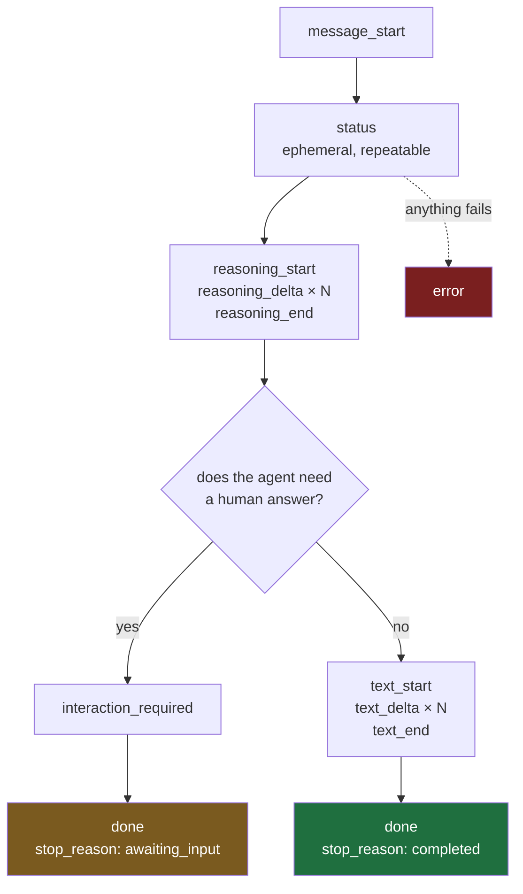

# 03 — Stream Contract

Frontend-facing · version **v1-draft** · 2026-09-08 · scope: **admin and employee agents**, onboarding out of scope

> [!abstract] What this is
> The wire contract between the Xarvis backend and any client that renders a chat turn. It describes every frame the server can send, the order they arrive in, and what the client is required to do with each one. It says nothing about how the server produces them, which is deliberate — the backend is being upgraded and rewritten behind this document and none of that should reach this page.
>
> Anything not written here is not part of the contract. If the client needs it, it gets added here first.

---

## Transport

| | |
|---|---|
| Method | **POST**, one request per turn |
| Response | `Content-Type: text/event-stream` |
| Status code | **always 200**, from the first byte, regardless of what happens later |
| Framing | Server-Sent Events — `event:` name, `data:` JSON, blank line terminates a frame |
| Keep-alive | comment frames every 15 seconds, lines beginning with `:` |
| Reconnection | **none** — the client POSTs, so `EventSource` is not in use, `retry:` is not sent, and `Last-Event-ID` is not honoured. A dropped stream loses the turn. |

> [!important] The status code is fixed before anything can go wrong
> Once the first byte of a 200 response has left the server, there is no way to change it to a 500. **Every failure therefore arrives as a frame, not as an HTTP status.** A client that only handles errors in a `catch` around the fetch will silently show a blank answer when the backend fails.

---

## The envelope

Every frame carries the same three fields plus its own payload.

```
event: text_delta
data: {"type":"text_delta","seq":11,"block_id":"t1","text":"Priya"}

```

| Field | Meaning |
|---|---|
| `event:` | the SSE event name, always equal to `type` |
| `type` | the frame type, duplicated inside `data` so a client can switch on either |
| `seq` | strictly increasing integer from 0, never repeated, never skipped |

`seq` exists so the client can detect a gap and so ordering is provable rather than assumed. It is not a resumption token — there is no resumption.

---

## Lifecycle



Rules that hold for every stream:

- `message_start` is always the first frame.
- **Exactly one terminator arrives: `done` or `error`.** Never both, never neither.
- `status` may appear any number of times, at any point before the terminator.
- `reasoning` and `text` blocks are bracketed — no `_delta` without a preceding `_start`, no `_start` without a matching `_end`, unless `error` cut the stream short.
- Blocks do not interleave. One block closes before the next opens.
- **A stream that ends without a terminator is a failure**, and the client must treat it as one. This is the only way to tell a finished answer from a dropped connection.

---

## Frames

### message_start

Opens the turn. Carries the identifiers the client needs for logging and for answering a question later.

```
event: message_start
data: {"type":"message_start","seq":0,"run_id":"run_01HZ8Q2K4N","thread_id":"th_9f31c0","audience":"admin"}
```

| Field | Notes |
|---|---|
| `run_id` | one turn. Quote this in any bug report — it is the key into server logs. |
| `thread_id` | the conversation. Stable across turns. Required when answering an `interaction_required`. |
| `audience` | `admin` or `employee`. Only `admin` can ever receive an `interaction_required`. |

### status

What the agent is doing right now, in product terms.

```
event: status
data: {"type":"status","seq":3,"code":"looking_up_employee"}
```

**`code` is a closed vocabulary.** The server never sends a free-text label, an internal tool name, or arguments.

| Code | Meaning |
|---|---|
| `understanding` | reading the request |
| `looking_up_employee` | fetching an employee record |
| `looking_up_leave` | leave balance or history |
| `looking_up_payroll` | salary or payslip data |
| `checking_policy` | consulting an HR policy document |
| `updating_record` | performing a write |
| `preparing_answer` | composing the response |
| `working` | fallback, meaning is deliberately unspecified |

> [!note] Rendering rules for status
> A `status` frame **replaces** the previous one. It is transient UI chrome, not conversation content — it must not enter the transcript, must not be persisted, and must disappear once `text_start` arrives.
>
> The client owns the wording. The server sends `looking_up_employee`; the string shown to the user is a frontend concern, which means copy and localisation change without a backend deploy.

An unrecognised `code` renders as the `working` wording. New codes will be added; that must never break a client.

### reasoning

The model's own account of what it is doing. Streamed, persistent, collapsed by default.

```
event: reasoning_start
data: {"type":"reasoning_start","seq":4,"block_id":"r1"}

event: reasoning_delta
data: {"type":"reasoning_delta","seq":5,"block_id":"r1","text":"The request names Priya but two"}

event: reasoning_delta
data: {"type":"reasoning_delta","seq":6,"block_id":"r1","text":" employees match, so I need to ask."}

event: reasoning_end
data: {"type":"reasoning_end","seq":7,"block_id":"r1"}
```

| | |
|---|---|
| Where it renders | a visually distinct, collapsed-by-default panel — never the main answer body |
| Persistence | **transient.** Render it live, do not write it into stored history |
| Availability | the channel is wired but may carry nothing. A turn with no reasoning block is normal and not an error |

> [!important] This channel may be silent for entire releases
> Reasoning output is controlled by a server-side configuration flag. The client must render correctly when a turn produces no reasoning block at all, because that is the expected state until the flag is enabled.

### text

The answer. This is the only frame type whose content belongs in the main body.

```
event: text_start
data: {"type":"text_start","seq":10,"block_id":"t1"}

event: text_delta
data: {"type":"text_delta","seq":11,"block_id":"t1","text":"Priya"}

event: text_delta
data: {"type":"text_delta","seq":12,"block_id":"t1","text":" Kulkarni's monthly gross is"}

event: text_end
data: {"type":"text_end","seq":40,"block_id":"t1"}
```

The client accumulates `text` fragments in arrival order for a given `block_id`. Concatenation is exact — the server does not send whitespace the answer does not contain, and does not repeat text already sent.

### interaction_required

The agent has paused and needs the user to choose. **Admin only.**

> [!important] This frame keeps its existing name and payload
> An earlier draft of this document called it `question` with a reshaped payload. That was changed: renaming it would have broken the working HITL rendering in the client for no benefit, and the disambiguation pause is the most valuable behaviour in the system. **The name and the shape are exactly what they are today.**

```
event: interaction_required
data: {"role":"assistant","type":"interaction_required","content":{"interaction_id":"xarvis-local:ask_human:c969e014","action":"ASK_HUMAN","variant":"selection_with_input","description":"Which area would you like a summary for?","options":[{"value":"Work & Profile Summary","label":"Work & Profile Summary"}]}}
```

| Field | Notes |
|---|---|
| `interaction_id` | echo it back when answering |
| `action` | echo it back when answering |
| `variant` | `selection`, `input`, `selection_with_input`, `multi_select`, `multi_select_grouped` |
| `description` / `title` | display as written |
| `options[].value` | opaque. Send it back exactly; never parse it |
| `options[].label` | what the user picks between |

An `interaction_required` is followed by `done` with `stop_reason: awaiting_input`. **The stream then ends.** The turn is paused, not finished, and nothing further arrives on that connection.

To answer, the client POSTs to the same `/api/v1/chat` endpoint with a different body:

```
{"type":"hitl_response","selected_value":"Work & Profile Summary","agent":"hr_assistant",
 "interaction_meta":{"interaction_id":"...","action":"ASK_HUMAN"}}
```

The response is a fresh SSE stream with its own `message_start` and its own `seq` counting from 0. The conversation continues on the same `thread_id`.

### done

The terminator for a turn that did not fail. **Carries metadata, never content.**

```
event: done
data: {"type":"done","seq":41,"stop_reason":"completed","usage":{"input_tokens":1840,"output_tokens":212},"iterations":3}
```

| `stop_reason` | Meaning |
|---|---|
| `completed` | the answer is finished |
| `awaiting_input` | paused on an `interaction_required`, waiting for the user |
| `cancelled` | the turn was stopped |

There is no final-answer field. **The answer was complete when `text_end` arrived.** A client that waits for `done` before rendering has thrown away the entire benefit of streaming.

See the migration section for the one transitional exception to this.

### error

The terminator for a turn that failed, at any point after the response began.

```
event: error
data: {"type":"error","seq":22,"code":"upstream_unavailable","message":"The HR system did not respond. Please try again.","partial_output":"discard","retryable":true}
```

| Field | Notes |
|---|---|
| `code` | closed vocabulary, safe to branch on |
| `message` | user-safe text, safe to display as written |
| `partial_output` | `keep` or `discard` — what to do with text already on screen |
| `retryable` | whether resending the same turn is sensible |

| Code | Meaning |
|---|---|
| `upstream_unavailable` | a system Xarvis depends on did not respond |
| `not_permitted` | the caller may not see what was asked for |
| `rate_limited` | too many requests |
| `timeout` | the turn took too long |
| `internal` | anything else |

**`partial_output` exists because an error can arrive after half an answer has rendered.** `discard` means what is on screen is misleading and should be removed. `keep` means it is accurate as far as it goes. The client must honour it rather than guessing.

An unrecognised `code` is treated as `internal`.

---

## What the client must implement

- **Parse SSE over `fetch` and a `ReadableStream`.** `EventSource` cannot POST, so it is not an option here. Frames are separated by a blank line; a line beginning with `:` is a comment and is discarded.
- **Discard comment frames silently.** They arrive roughly every 15 seconds and exist only to keep the connection alive through proxies.
- **Accumulate `text_delta` by `block_id`**, in arrival order.
- **Render `status` as replaceable chrome**, outside the transcript.
- **Render `reasoning` collapsed and separate** from the answer, and correctly when it never arrives.
- **Treat a stream that ends without `done` or `error` as a failure.**
- **Ignore unknown `type` values without crashing.** New frame types will be added and old clients must survive them.

## What the client must not do

- **Do not inspect content to decide where it goes.** Placement is determined by frame type, always. If a frame's type does not say where it belongs, that is a bug in this document and should be raised rather than worked around.
- **Do not put `status` into the transcript**, and do not persist it.
- **Do not persist `reasoning`.**
- **Do not assume the connection can be resumed.** There is no replay buffer and no `Last-Event-ID` handling. A dropped stream means the turn is lost and must be resent.
- **Do not parse `options[].id` or `interrupt_id`.** They are opaque and their format will change.

---

## Migration from the current frames

Today the server sends `progress` and `terminal_response`, where `terminal_response` carries either the final answer or an error.

| Today | Becomes |
|---|---|
| `progress` with synthesised text | `status` with a code, plus `reasoning` when the model produces any |
| `terminal_response` carrying the answer | `text_start` / `text_delta` / `text_end` |
| `terminal_response` carrying an error | `error` |
| — | `done`, new, metadata only |

> [!important] Transitional field, with a removal criterion attached
> For one release only, `done` also carries a `text` field holding the complete answer, so a client can ship the new frame handling without ship-day coordination.
>
> ```
> event: done
> data: {"type":"done","seq":41,"stop_reason":"completed","text":"Priya Kulkarni's monthly gross is ...","usage":{"input_tokens":1840,"output_tokens":212},"iterations":3}
> ```
>
> **Removal criterion:** `done.text` is deleted once the frontend confirms `text_delta` accumulation is live in production. Both sides record the date here when that happens. A transitional field without a written removal criterion becomes permanent, which has already happened once in this codebase with the `type` field duplicated inside `data`.

---

## Open, and needed back from the frontend

- ~~The resume endpoint path and method~~ — settled: same `/api/v1/chat`, with a `hitl_response` body.
- Whether SSE parsing is hand-rolled or uses a library, since that determines who handles comment frames and buffering.
- Whether a stop button is wanted in v1. It is not in this contract; adding it means a new endpoint and a `cancelled` path, and it is cheaper to decide now than to retrofit.
- Confirmation that the existing typing animation is removed rather than bypassed. Replaying an animation over streamed tokens costs more latency than it hides.
