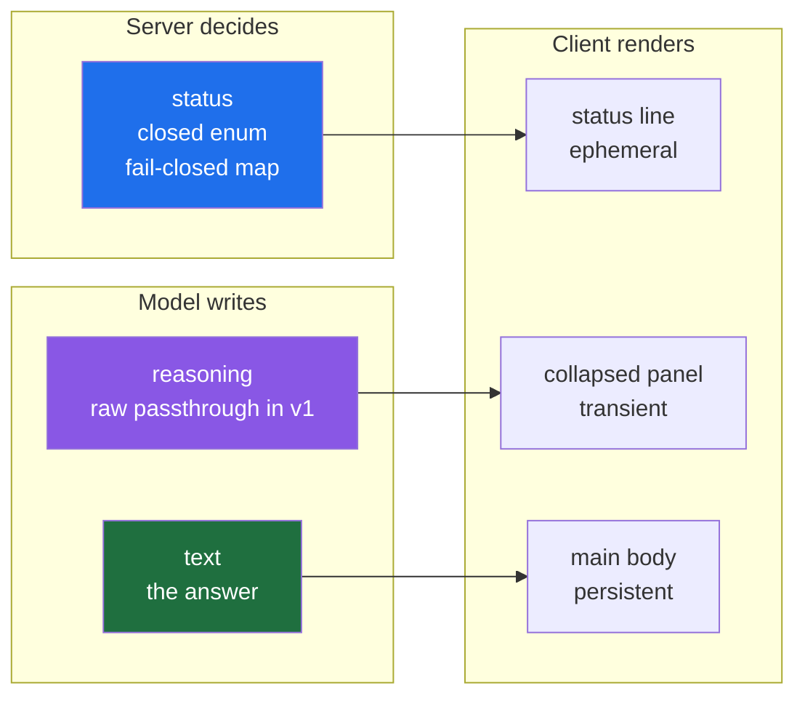

# 04 — SSE Design Decisions 1, 2, 5

Step 5 of [[01-SSE]] · decisions **1 event taxonomy**, **2 frame contract**, **5 termination** · 2026-09-08

> [!abstract] What this is
> Three of the ten decisions the SSE design document owes, taken early because the frontend is blocked on them and the other seven are not. The output is [[03-Stream-Contract]]. This file holds the reasoning; that file holds the contract.
>
> Each decision is written as what was found, what was decided, and what it costs.

---

## What four vendors already converged on

Before deciding anything, the same question was put to every streaming API that matters: how do you tell the client where a piece of text belongs.

| Concern | Anthropic | OpenAI Responses | Gemini | Vercel AI SDK |
|---|---|---|---|---|
| Open a channel | `content_block_start` with `index` and block `type` | `response.output_item.added` | `step.start` with `step.type` | `text-start`, `reasoning-start` |
| Answer text | `text_delta` | `response.output_text.delta` | delta type `text` | `text-delta` |
| Reasoning | `thinking_delta` | `response.reasoning_summary_text.delta` | delta type `thought_summary` | `reasoning-delta` |
| Tool name | complete in `content_block_start` | `output_item.added` | complete in `step.start` | `tool-input-start` |
| Tool arguments | `input_json_delta`, partial JSON | `response.function_call_arguments.delta` | `arguments_delta` | `tool-input-delta` |
| Close a channel | `content_block_stop` | `...done` | `step.stop` | `text-end` |
| End of turn | `message_delta` then `message_stop` | `response.completed` | `interaction.completed` | `finish` |
| Failure after 200 | `event: error` | `error`, `response.failed` | `event: error` | `error` part |
| Ordering | `index` | `sequence_number` | step `index` | part id |

Four teams, no coordination, one shape. The answer is always the same: **the frame declares what it is before any content arrives, and the client never inspects content to decide placement.**

Anthropic's trace for a turn that emits text and calls a tool is the exact case Xarvis hits with Gemini every day:

```
event: content_block_start
data: {"type":"content_block_start","index":0,"content_block":{"type":"text","text":""}}

event: content_block_delta
data: {"type":"content_block_delta","index":0,"delta":{"type":"text_delta","text":"Okay"}}

event: content_block_stop
data: {"type":"content_block_stop","index":0}

event: content_block_start
data: {"type":"content_block_start","index":1,"content_block":{"type":"tool_use","id":"toolu_01T1x1fJ34qAmk2tNTrN7Up6","name":"get_weather","input":{}}}

event: content_block_delta
data: {"type":"content_block_delta","index":1,"delta":{"type":"input_json_delta","partial_json":"{\"location\":"}}

event: content_block_stop
data: {"type":"content_block_stop","index":1}

event: message_delta
data: {"type":"message_delta","delta":{"stop_reason":"tool_use"},"usage":{"output_tokens":89}}

event: message_stop
data: {"type":"message_stop"}
```

Two blocks, two indices, two declared types. Nothing is ambiguous because nothing was left to inference.

Two facts fall out of this that answer probe questions without running the probe:

- **Tool names are complete at the start event everywhere.** Anthropic puts `name` in `content_block_start`, Gemini puts it in `step.start`. Only arguments stream, as partial JSON accumulated under a stable index. LangChain's `tool_call_chunks` behaves identically — `name` and `id` on the first chunk, argument fragments afterwards under the same `index`. There is an open LangGraph issue filed as a bug about this; it is not a bug, it is the universal pattern.
- **Errors after `200 OK` are frames, not status codes**, in all four. Anthropic ships `event: error` carrying `overloaded_error`, which would have been an HTTP 529 had the response not already started.

---

## Decision 1 — Event taxonomy

### The three channels that were collapsed into one

The existing system emits `progress` and `terminal_response`. The discriminator is a single line, and it does two jobs at once:

```python
event_type = "progress" if tool_names else "terminal_response"
```

`progress` is currently carrying three different things that have nothing in common except that none of them is the final answer:

| | Who writes it | Lifetime | Where it belongs |
|---|---|---|---|
| **Reasoning** | the model | persistent, part of the conversation | collapsed panel |
| **Status** | the server | ephemeral, replaced, gone when the answer starts | a status line, outside the transcript |
| **Tool activity** | structured, not prose | — | not sent at all, see below |

The synthesised progress sentence — built from the tool name because Gemini emits tool calls with no text — is server-generated status wearing the costume of model output. That is the whole reason the question of where do I render this had no answer: two different things were sharing one field.

### Decided



Seven frame types: `message_start`, `status`, `reasoning`, `text`, `question`, `done`, `error`.

### Tool internals are never sent

Product decision: the client learns what the agent is doing, never which tool did it or with what arguments.

This is where every model provider already landed. Anthropic ships `display: "summarized"` and `display: "omitted"` for thinking. OpenAI does not expose raw reasoning tokens to customers at all, only summaries. Gemini's own documentation describes `thought_summary` as a synthesized version of the model's raw thoughts. Hiding internals is the consensus, not a compromise.

There is a second reason that belongs in the security notes rather than the product ones: shipping the tool registry to a browser publishes the exact shape of the attack surface, by name, to anyone reading a network tab. Twenty admin tools and nineteen employee tools is a useful thing for an attacker to be handed.

### The status map must fail closed

```python
# One place. Product vocabulary, not tool vocabulary.
_STATUS = {
    "fetch_employee_record":  "looking_up_employee",
    "fetch_monthly_pay":      "looking_up_payroll",
    "get_leave_balance":      "looking_up_leave",
    "search_policy_document": "checking_policy",
}

def status_for(tool_name: str) -> str:
    return _STATUS.get(tool_name, "working")
```

The whole design is in the default argument. A tool added next month with no entry in the map resolves to `working` and leaks nothing. The alternative shape — a function that derives a readable phrase from the tool name — fails open, and the first new tool publishes its own name on the day it ships.

Two supporting properties:

- **Keep the vocabulary small.** Eight codes, not thirty-nine. Several tools mapping to `looking_up_employee` is correct rather than lossy — the user does not need to know which lookup ran.
- **Send the code, never the string.** Copy, tone and localisation then change without a backend deploy, and the contract does not move when the wording does.

### Reasoning ships raw in v1, and this is a known debt

> [!important] Raw reasoning can leak what the status vocabulary is protecting
> Reasoning is generated text. Nothing prevents Gemini writing: I will call `fetch_employee_record` to look up Priya's salary. That puts a tool name in front of the user through the one channel designated as clean, and it happens precisely because narrating tool selection is what a model reasons about at that moment.
>
> **Accepted for v1 deliberately.** Filtering generated text is an arms race that fails open, and the alternative — dropping the channel entirely — costs the feature that motivated the work. v2 revisits it.

Two choices taken now make v2 cheap rather than expensive:

- **Reasoning is its own frame type from day one.** v2 changes what goes inside the frame, not the contract, so no client rewrite is triggered by a decision that has not been made yet.
- **Reasoning is transient, never persisted.** Nothing is written into thread history, so v2 has no stored data to clean and nothing leaked is replayed back to the model on the following turn. Persisting it would turn a config change into a migration.

And one property that makes the whole question a runtime switch: **Gemini thought summaries are off by default.** They need `thinking_summaries: "auto"` on the newer surface, or `include_thoughts` in the thinking config on the older one. So the channel ships wired and empty, the frontend builds the panel now, and the content turns on with a flag rather than a deploy — which also means it turns off the same way if v1 goes badly.

### Where each channel comes from in LangGraph

| Frame | Mechanism |
|---|---|
| `text` | `stream_mode="messages"`, filtered on `metadata["langgraph_node"]` |
| `reasoning` | same stream, the `reasoning` entries of `AIMessage.content_blocks` |
| `status` | `stream_mode="custom"` with `get_stream_writer()`, emitted by the node itself |
| `question` | the interrupt, surfaced through `updates` in v1 and `values` in v2 |
| `done`, `error` | the streaming service, from the existing `finally` block |

`get_stream_writer()` is the piece that was missing. It moves the progress decision into the node that actually knows what is happening and out of the streaming service that currently reverse-engineers it from tool names:

```python
from langgraph.config import get_stream_writer

def fetch_employee_node(state):
    writer = get_stream_writer()
    writer({"status": "looking_up_employee"})
    return {"employee": lookup(state)}
```

One constraint to check before relying on it: **`get_stream_writer()` does not work in async code on Python below 3.11**, and the workaround is to accept `writer: StreamWriter` as a node parameter instead. LangGraph itself only requires `>=3.10`, so this is a live constraint rather than a theoretical one — check which version Xarvis runs on.

---

## Decision 2 — Frame contract

### `id:` and `retry:` are not used, and that is now a recorded decision rather than an omission

[[01-SSE]] listed both as gaps. They are not gaps, because the client POSTs.

`EventSource` only issues GET requests, so a client that POSTs a message and streams the response cannot be using it. It is parsing SSE by hand over `fetch` and a `ReadableStream`. Everything `EventSource` provides for free is therefore absent:

| Feature | Status here |
|---|---|
| automatic reconnection | not available, reconnection is client code or nothing |
| `retry:` | ignored, it is an `EventSource` directive |
| `Last-Event-ID` on reconnect | not sent, the client would have to send it deliberately |
| comment-frame handling | manual, the client parses and discards `:` lines itself |

So `id:` and `retry:` would be bytes on the wire that nothing reads. **Decision: do not send them.** Ordering is carried by a `seq` integer inside `data` instead, which every vendor also does — Anthropic as `index`, OpenAI as `sequence_number`, LangGraph v3 as `seq`.

This also settles decision 3 by removing it: **there is no resumption in v1**, and there is no replay buffer to design. That is the item [[01-SSE]] warned would expand from days into a week, and the POST client is the reason it does not have to.

### `type` stays duplicated inside `data`

The existing code duplicates the frame type inside the JSON payload as well as putting it in the SSE `event:` name, with a note that it is there for older clients.

Keep it. Anthropic does exactly the same — every event carries an SSE event name and the matching `type` inside its data. It lets a client switch on whichever it finds convenient, and it survives a parser that does not track event names at all.

The v1 removal criterion in [[03-Stream-Contract]] applies to `done.text`, not to this. `type` duplication is permanent and deliberate.

### `seq` on every frame

Strictly increasing from 0, never repeated, never skipped. It costs one integer and it cannot be retrofitted once clients exist.

---

## Decision 5 — Termination

### The final response frame is deleted, not renamed

`terminal_response` was introduced as an error carrier, because an exception cannot be raised once a 200 has gone out. That was correct, and it is what all four vendors do. It later acquired a second job, carrying the final answer, and that is the part that has to be undone.

| Today | Becomes |
|---|---|
| `terminal_response` carrying the answer | `text_start`, `text_delta` × N, `text_end` |
| `terminal_response` carrying an error | `error`, first-class |
| — | `done`, metadata only |

**In a streaming design there is no final-response frame.** The answer is complete when its block closes. What arrives at the end carries stop reason, token usage and iteration count, and no content at all. A client waiting for the terminator before rendering has discarded the entire point of streaming.

### `stop_reason` includes the paused case

A LangGraph interrupt ends the stream — the graph pauses and there is nothing more to send on that connection. That is not a completed turn and it is not a failure, so it needs its own value.

| `stop_reason` | Meaning |
|---|---|
| `completed` | the answer finished |
| `awaiting_input` | paused on a `question`, the turn resumes on a new stream |
| `cancelled` | stopped |

### Errors carry a closed code, a safe message, and a verdict on what is already on screen

Two things distinguish this from simply forwarding the exception.

**Raw exception text leaks.** A tool failure carries the tool name, frequently a hostname, sometimes a URL with parameters. The Xarvis audit in [[../05-Repo-Audit-xarvis]] found `app.hralign.repute.net` and a live bearer token committed in test files. An error frame that forwards `str(exc)` puts that class of string into a browser on the first 500. Closed code plus a user-safe message, with the real detail going to logs correlated by `run_id`.

**An error can arrive after half an answer has rendered.** The client is holding partial text and has no way to judge whether it is misleading. So the frame says:

```
event: error
data: {"type":"error","seq":22,"code":"upstream_unavailable","message":"The HR system did not respond. Please try again.","partial_output":"discard","retryable":true}
```

`keep` means what is on screen is accurate as far as it goes. `discard` means remove it.

### A stream ending with no terminator is a failure

This is why `done_event()` exists in the current code and why its docstring must survive: a finished stream and a cut stream are otherwise byte-identical from the client's side. Exactly one terminator arrives, `done` or `error`, and its absence is itself the error signal.

Silent truncation is the streaming failure nobody writes a test for.

---

## The upgrade this assumes

Latest stable is **langgraph 1.2.11**, Python `>=3.10`. Three changes do work the streaming services currently do by hand:

- **Standard content blocks.** `AIMessage.content_blocks` returns typed entries — `text`, `reasoning`, `tool_call` — normalised across providers, with the provider adapter owning the parsing. The Gemini guard that reads tool calls before checking for empty text stops being a special case, because a tool call is a differently-typed block rather than an absence of text. Keep the comment as history; the branch it protects becomes uninteresting.
- **`version="v2"` StreamPart.** Every chunk becomes `{"type", "ns", "data"}` and the service switches on `chunk["type"]` instead of unpacking a different tuple shape per mode. `stream_version` still defaults to v1, so nothing is forced.
- **`stream_mode="custom"`.** The status vocabulary above, emitted from the node rather than inferred in the service.

That is the shrink: the two near-duplicate services are largely hand-rolled parsing and phase tracking, and all three changes delete parsing.

Two things to check, neither of them a blocker:

- **`langgraph-dynamodb-checkpoint` is at 0.3.1, released 26 July 2026, and declares `langgraph` with no version bound at all.** Unpinned is worse than pinned wrong — pip installs it beside any version and gives no signal. The July date suggests it is current; nothing in the metadata promises it.
- **The checkpoint smoke test:** interrupt a thread, upgrade, resume it. At 4.9 conversations a day the odds of a real user's pause straddling a deploy are negligible and no drain or migration is needed. The test is worth five minutes anyway, because the disambiguation path is the thing least worth discovering broken from an alert.

---

## Still owed by the design document

Decisions 4, 6, 8 and 10 are untouched, and decision 7 is only half decided.

| # | Decision | State |
|---|---|---|
| 3 | Resumption | **closed by decision 2** — no resumption in v1, no replay buffer |
| 4 | Heartbeat | accept the 15s default, still need the actual `proxy_read_timeout` and load-balancer idle timeout written down |
| 6 | Concurrency limiting | untouched |
| 7 | Cancellation | passive disconnect untouched; the explicit stop endpoint is an open question back to the frontend |
| 8 | Backpressure | untouched |
| 9 | Client contract | **written as [[03-Stream-Contract]]** |
| 10 | Deployment | untouched — `X-Accel-Buffering`, idle timeouts, keepalive |

Decision 7 still carries the trap already recorded in [[01-SSE]]: a cancelled request must not write usage on a request-scoped session, because the session dies with the request and leaves an idle transaction holding row locks. The token count is still owed when a client cancels, so that write goes on a fresh session wrapped in `asyncio.shield`.
