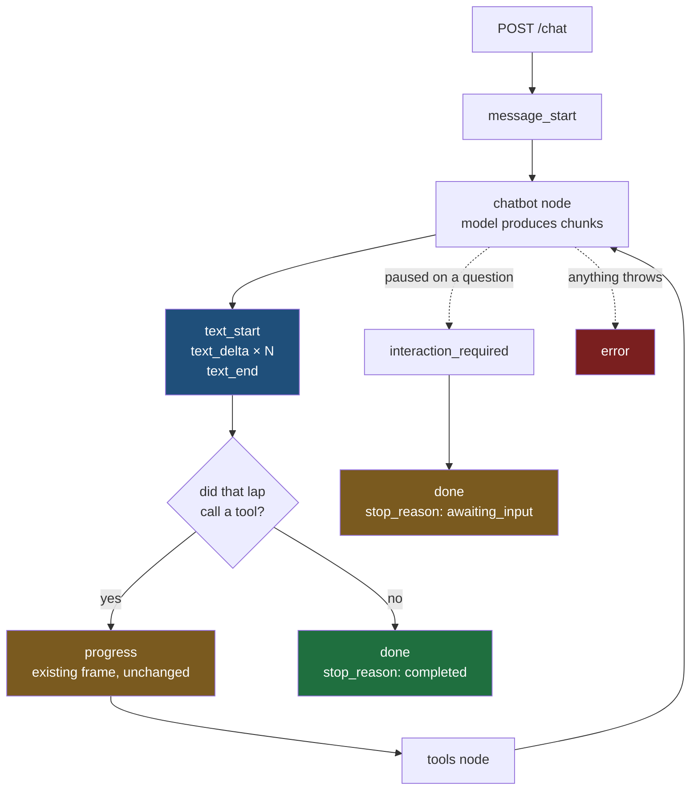

# 06 — Token Streaming Walkthrough

Reading syllabus for the uncommitted change on branch `refactor` · built against [[03-Stream-Contract]] and [[05-Streaming-Build]] · 2026-09-10

> [!abstract] What this is
> A route through the token streaming change in the order one turn actually happens, so the code can be read front to back rather than file by file. Every rung names the claim it teaches and the exact line that proves it. It assumes [[AI-Engineering/09-LangGraph-Streaming/00-Syllabus|folder 09]] and leans on it constantly — several decisions in this change are notes 6, 9 and 11 implemented against a real graph.
>
> Nothing here is a task list. [[05-Streaming-Build]] owns the tasks; this owns the understanding.

---

## What changed

Four files, uncommitted, branch `refactor`.

| File | What it owns |
|---|---|
| `orchestration/admin/nodes/chatbot.py` | whether the model produces tokens at all |
| `streaming/services/admin_streaming_service.py` | the consumer loop that turns graph items into frames |
| `streaming/sse_events.py` | the frame vocabulary and the per-turn sequence counter |
| `server/routes/chat.py` | the guarantee that exactly one terminator reaches the client |

Two environment flags gate everything, both defaulting to `false`.

| Flag | Line | Decides |
|---|---|---|
| `ADMIN_BUDGET_FIRST_CHUNK_ONLY` | `chatbot.py:35` | whether the node's timeout covers the first chunk or the whole generation |
| `ADMIN_TOKEN_FRAMES` | `admin_streaming_service.py:33` | whether the frames stream |

> [!note] Status frames were removed on 2026-09-10
> `StatusCode`, `_STATUS_BY_TOOL`, `status_for` and `StreamFrames.status` were cut from `sse_events.py`, and the branch that emitted them was cut from the service. They were never part of v1 and the 35-entry tool table was the single hardest thing in the change to read. The removed block is kept verbatim so the later step pastes it back rather than rebuilding it. `progress` frames are unchanged and still on the wire.

---

## One turn, with `ADMIN_TOKEN_FRAMES` on

The one ordering that surprises people: a lap's text streams before that lap's `progress` frame, because `progress` is derived from the updates item and the updates item arrives after every one of that node's message items.

---

## 1 · What was promised before any code moved

| Rung | Claim | Taught |
|---|---|---|
| 1.1 | A contract is a list of promises, and every promise is kept by one specific line of code, so the way to read one is to go promise by promise and find the line. `sse_events.py` has two frame builders: `assistant_event` at `:29`, which mints no `seq`, and `StreamFrames._frame` at `:150`, which passes `seq=self._next_seq()` into it. Both are still called from the service, so the contract's promise that `seq` is never skipped has no line keeping it for `interaction_required`. | yes |
| 1.2 | A stream that just stops is indistinguishable from a dropped connection, which is why the terminator has to be guaranteed somewhere that always runs. Already owned — [[04-Streams-Die-In-The-Middle]] and [[10-Reconnection-And-Termination]], section `A stream that ends and a stream that dies are the same bytes`. Recall, not a new rung. | yes |

## 2 · The one line that made token streaming possible

| Rung | Claim | Taught |
|---|---|---|
| 2.1 | `admin_streaming_service.py:100` — `stream_mode="updates"` became `stream_mode=["updates", "messages"]`. A list of modes changes the item shape from a bare dict to a `(mode, data)` pair, which is the whole reason the loop header is now `async for mode, chunk`. Folder 09 note 6 rung 1. | yes |
| 2.2 | The admin graph is flat — three nodes, `graph.py:26-28`, no subgraphs. That is why `subgraphs=True` appears nowhere here, and why onboarding is a different and harder problem. | yes |
| 2.3 | Items on the `messages` mode are `(AIMessageChunk, metadata)`, so `chunk` unpacks a second time at `:106`. Two unpacks, two different tuples. | yes |

## 3 · Why the node was rewritten, and whether it needed to be

| Rung | Claim | Taught |
|---|---|---|
| 3.1 | `stream_primary_llm` at `chatbot.py:57` replaces `ainvoke` with `astream` plus a hand-written fold. | yes |
| 3.2 | It is not what makes tokens stream. `ainvoke` never picks an endpoint itself: `BaseChatModel._agenerate_with_cache` consults `_should_stream` first and iterates `self._astream` when the answer is true, never reaching the provider's `_agenerate`. Measured 2026-09-10 with no API call — `_should_stream(async_api=True)` returns **True** with LangGraph's handler attached and **False** without it, `disable_streaming` is `False`, `_astream` is overridden. Requesting the mode is what makes the model stream. | yes |
| 3.3 | What the rewrite buys is the timeout, and only the timeout. `asyncio.timeout` at `:92` wraps the wait for the first chunk alone. The off position is not a new defect — an answer running past 10 seconds was always killed and re-answered by the fallback — but it becomes a visible one, because tokens now reach the browser first and the user watches the discarded answer being typed. The two flags are therefore coupled, and token frames on with the budget flag off is the one combination that must never ship. | yes |
| 3.4 | Adding chunks with `+` at `:90` yields an `AIMessageChunk`, whose `.type` is `AIMessageChunk` and not `ai`. The consumer at `:186` filters on exactly that field, so returning the chunk unconverted drops the whole message silently. Folder 09 note 11 rung 4 is the same fold. | yes |
| 3.5 | The rebuild at `:116` carries `usage_metadata` across explicitly but drops `id`. LangChain's own chunk-to-message conversion keeps the id, and folder 09 note 9 is where id-based dedupe was measured. | no |
| 3.6 | One link in 3.2 is inferred rather than measured: that LangGraph's handler actually lands in `run_manager.handlers` at runtime, which the probe supplied by hand. Confirm end to end by running with `ADMIN_TOKEN_FRAMES=true` and `ADMIN_BUDGET_FIRST_CHUNK_ONLY=false` and counting the `text_delta` frames. | no |

## 4 · The frame vocabulary

| Rung | Claim | Taught |
|---|---|---|
| 4.1 | `StreamFrames` holds one counter and one turn's identifiers, because `seq` is per-turn. A module-level counter would interleave across concurrent users and make the number meaningless. | no |
| 4.2 | Every frame still funnels through `assistant_event`, so the envelope is built in exactly one place no matter how many frame types exist. | no |

## 5 · The consumer loop

| Rung | Claim | Taught |
|---|---|---|
| 5.1 | Text blocks are bracketed, not sprayed. `open_block` opens on the first fragment with text, closes on the updates item, and the block id is what the client accumulates against. | no |
| 5.2 | The filter at `:114` and `:116` has to be a conjunction. The node test alone admits every `ToolMessage` from the tools node, which is raw internal output in front of a user. The type test alone admits fragments from other nodes. Folder 09 note 9 rung 11, implemented. | no |
| 5.3 | `lap_streamed_text` at `:173` rests on a measured ordering: every message item for a node arrives before that node's updates item, which makes the updates item a usable end-of-block marker. Folder 09 note 11 rung 10. | no |
| 5.4 | `answer_already_streamed` at `:249` is the whole switch. The token path replaces exactly one frame, the answer, and only when it actually streamed. The hard-fail message is constructed rather than generated, so it never appears on the `messages` mode and must keep the legacy frame. | no |
| 5.5 | Token usage accumulates at `:218` rather than taking the last message's figure, because every lap of the agent loop bills separately. | no |

## 6 · Terminators

| Rung | Claim | Taught |
|---|---|---|
| 6.1 | `chat.py:179` adds `done` only when the service did not already end the stream with `done` or `error`. | no |
| 6.2 | Why the service and not the route owns the terminator when it can: only the service knows the stop reason, the token usage and the iteration count. | no |
| 6.3 | The suppressed-recursion path proves the rule. Suppressing the error must not suppress the terminator, or an answer the client already has on screen gets reported as a dropped connection. | no |
| 6.4 | Error frames carry a message written for a user. The exception text stays in the log, because it routinely carries a tool name, a hostname or a URL with parameters. | no |

## 7 · What the flags actually isolate

| Rung | Claim | Taught |
|---|---|---|
| 7.1 | `stream_mode` is a list unconditionally, so `messages` mode is requested on every admin turn whatever the flags say — and by rung 3.2 that is exactly what makes the model stream. Turning both flags off therefore does not return the system to its previous behaviour: the model streams, and the second flag only decides whether the timeout is measured against the first chunk or the whole generation. | no |
| 7.2 | What that means for a rollback, and why the honest rollback is reverting the four files rather than clearing two variables. | no |

## 8 · Two gaps left in the change

| Rung | Claim | Taught |
|---|---|---|
| 8.1 | `interaction_required` is emitted through bare `assistant_event` at `:155`, so it is the only frame in a token-streamed turn carrying no `seq`, against the contract's own rule. `StreamFrames.question` is defined and never called. | no |
| 8.2 | `run_id` is very likely equal to `thread_id` on every turn. `current_run_id` at `:53` reads a ContextVar from inside the generator body, which `chat.py:38-41` documents as the place where that lookup does not work, and the failure is swallowed into a fallback. A run id that equals the thread id cannot key a single turn in the logs, which is the only job the contract gives it. | no |

**26 rungs across 8 sections. 9 taught.**

---

## What this syllabus corrects elsewhere

### The `ainvoke` claim in [[05-Streaming-Build]] was wrong · corrected 2026-09-10

That document concluded that `ainvoke` on `langchain-google-genai` reaches the non-streaming endpoint and fires no token callbacks, and the comments in `chatbot.py` repeated it as settled. It was verified by checking that `ChatGoogleGenerativeAI` defines `_generate`, `_agenerate`, `_stream` and `_astream` separately and that `_agenerate` does not delegate to `_astream`.

Both facts are true and neither decides the question, because `ainvoke` never calls `_agenerate` directly. The dispatch is in `BaseChatModel._agenerate_with_cache`, one layer above the provider, and it calls `_astream` whenever `_should_stream` says so. `_should_stream` says so as soon as a streaming callback handler is on the run, and LangGraph's `StreamMessagesHandler` is one. Measured, no API call: `True` with the handler attached, `False` without it.

The recorded observation of one message-mode item carrying the whole response never distinguished the two explanations, because `StreamMessagesHandler` collects from node outputs as well as from model stream events, and a node returning a message produces exactly one item on its own.

Corrected in [[05-Streaming-Build]] and in the `chatbot.py` comments on the same day. The lesson that survives it: when a question is about which code path runs, the dispatch is usually in the base class, and the provider is the part that only looks like it decides.

### [[03-Stream-Contract]] still publishes status as a v1 frame

The contract gives the frontend a `status` frame with a closed code table. The server no longer sends one and will not until a later step. The document has to say so before a client is built against it.
