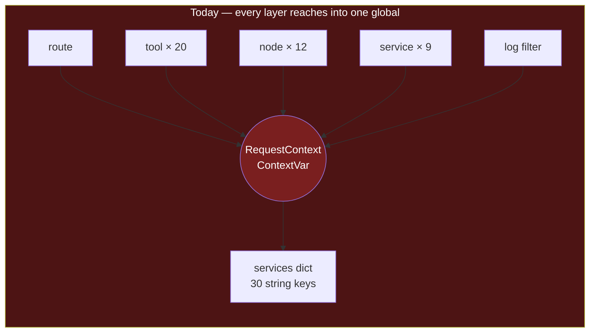
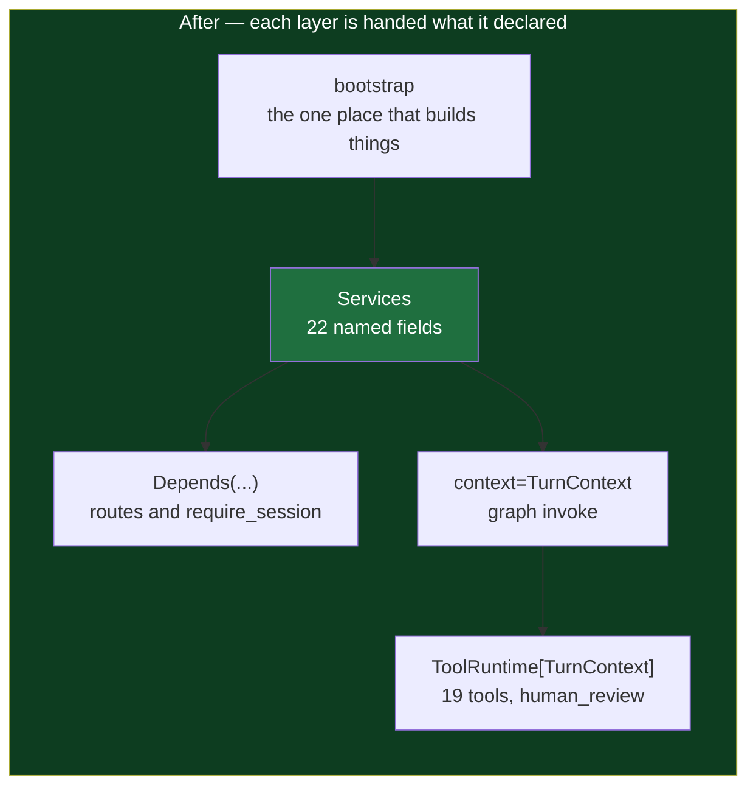

# 08 — Composition and Lifecycle

Read against `refactor` on 2026-09-12 · **implemented 2026-09-13**, all five phases · **committed 2026-09-15** on `refactor-composition-wiring`, through 1.5b · the work that came before tests

> [!abstract] What this is
> How dependencies reach the code that needs them, and how a request acquires an identity. Both were done through one global object that every layer reached into by name, which is why the system had no tests and why the auth rules were spread across three files that each knew part of the answer.
>
> Findings first, then what each became, then what is deliberately still out of scope. Every number on this page was counted with `verify/metrics.sh`, before and after.

---

## Why this came before tests

Five audits have said write tests. [[../05-Repo-Audit-xarvis]] found zero assertions in ten months on 26,000 lines, while [[../06-Repo-Audit-lab-side-project]] found 133 in six days. The difference was never discipline. It is price, and here was the invoice — every input to one tool:

```python
async def get_employee_salary_details(params: EmployeeSalaryDetailRequest) -> ToolResult:
    ctx = RequestContext.get_current()
    logged_in_user: UserData = ctx.user_data          # hidden input 1
    if not has_tool_access(logged_in_user, params.employee_id):
        return access_denied_tool_response()
    service = ctx.services["salary_detail"]            # hidden input 2, by string
    details, missing_docs = await service.get_salary_details(
        auth_token=ctx.auth_token,                     # 3
        hrms_id=ctx.hrms_id,                           # 4
        company_id=ctx.company_id,                     # 5
        base_url=ctx.hrms_base_url,                    # 6
    )
```

The signature declared one parameter. The function had seven. To call it in a test you had to set a context variable, build a `RequestContext`, and fill a thirty-entry dictionary with the right string keys — before you could assert anything at all, including that an employee cannot read someone else's salary.

The same tool now:

```python
async def get_employee_salary_details(
        params: EmployeeSalaryDetailRequest,
        runtime: ToolRuntime[TurnContext],
) -> ToolResult:
    context = runtime.context
    if not has_tool_access(context.user, params.employee_id):
        return access_denied_tool_response()
    service = context.services.salary_detail
    details, missing_docs = await service.get_salary_details(
        auth_token=context.auth_token,
        hrms_id=context.hrms_id,
        company_id=context.company_id,
        base_url=context.hrms_base_url,
    )
```

Two parameters, and both are on the `def` line. `runtime` is filled by `ToolNode` from the context handed in at invoke time and never appears in the schema the model reads, so the model cannot fill it, guess it, or borrow another request's.

**The tests were not late. They were priced out.** Every phase below lowered that price, and the test suite is what the money buys.

> [!success] The price is paid, and the receipt is a run
> `verify/probe_phase2.py` calls the salary tool with a hand-built `TurnContext` — no graph, no model, no network, no key — and checks both directions of the rule that matters: an employee asking for `9999` gets `ACCESS DENIED`, the same employee asking for their own record reaches the service, and an allowlisted admin asking for someone else's reaches it too.

---

## The finding underneath all the others

This is the configuration bug, one layer up. The same shape, the same failure mode, and the same fix:

| | How a dependency is named | What a typo does |
|---|---|---|
| config, before | `os.getenv("HRMS_BASE_URL")` | returns `None`, silently, at the moment of use |
| config, after | `settings.hrms.base_url_default` | the process refuses to start |
| services, before | `ctx.services["salary_detail"]` | `KeyError`, at the moment of use, inside a tool call |
| services, after | `context.services.salary_detail` | the checker says so before it runs |

`ty` reported all checks passed on this codebase and could not help with either of the middle rows, because **a string key is not a name.** Nothing can see through it: not the type checker, not the IDE, not a grep for callers.

The scale of it was: `RequestContext.get_current()` called at **55 sites across 48 files**, and services pulled out by string **39 times**. Outside the onboarding agent, which is deliberately out of scope, both are now zero.





Onboarding is the one layer still reaching into the global, and it is scoped out on purpose — `bootstrap_app()` keeps a `services_by_key` dictionary built from the very same `Services` instances, so the two views can never disagree while it is converted.

---

## What was found, and what each one became

Every finding below was read from the source on 2026-09-12. Each now carries what it is today.

### 1 · Authentication is decided by path, and the default is open

`middleware/request_context.py` names three public paths, checks one protected prefix, and then ends:

```python
if request.url.path in {"/", "/health", "/session"}:
    return await call_next(request)

if request.url.path.startswith("/api/v1/chat"):
    ... validate_session ...
    return await call_next(request)

return await call_next(request)          # everything else, unauthenticated
```

**A route added tomorrow is unauthenticated unless somebody remembers to edit this file.** The protected surface is a prefix literal, not a property of the route.

> [!warning] The public list is already wrong, and it has been harmless by luck
> `/session` in that set never matches anything. The router mounts at `/api/v1/session`, because `api_server.py` adds the `/api/v1` prefix, so the real path falls past both branches into the catch-all below — which is also `call_next`, so it works.
>
> Two different lines produced the same behaviour, and only one of them was intended. The day a rule was added to the fallthrough, `/session` would change behaviour and nothing in the file would say why.

> [!success] Fixed · protection is now a property of the router
> `require_session` is a dependency on the router every non-public route is mounted on, so a route added tomorrow is refused without a session because of where it was written, not because somebody remembered a list. The two public routes, `/` and `/api/v1/session`, are mounted directly on the app. The path allowlist and the protected-prefix check are gone.
>
> A route mounted on the app instead of the protected router is still served without a session. Nothing enforces where a router is mounted; see the note below Phase 2.

> [!note] Removed 2026-09-15 · the startup check, `refuse_unprotected_routes()`
> The refactor briefly added a check that walked every mounted route at startup and refused to start if one outside `PUBLIC_PATHS` could be reached without a session. It worked, and was proven against a deliberately unprotected `/api/v1/bonuses` route, but it was not needed for the refactor and enforcing a route rule by crashing production startup is not the common practice. The usual form is a test that calls every route without a cookie and expects a 401, which belongs in the guard test suite, item 3 of [[../10-Xarvis-Build-Plan]]. `PUBLIC_PATHS` went with it, since the check was its only reader.

### 2 · `SKIP_SESSION_AUTH` is named for something it does not do

```python
thread_id, auth_token, ... = await validate_session(request)   # line 47, always runs
if settings.stub_auth.skip_session_auth:                        # line 50
    return await dev_context(...)
```

Validation runs first and the flag is read after, so the cookie is still required, still decoded, and still checked against the cache. What the flag actually does is replace the validated context with a canned one — `DEV_USER`, the stub token, and a hardcoded `xarvis-local` thread.

> [!note] This is a rename, not a repair, and the behaviour was already understood
> Unlike everything else on this page, nothing here is a discovery. Both the behaviour and its cause are already written down twice:
>
> - `config.py`, the `StubAuthSettings` docstring — the flag decides whether the request middleware builds a stub context, and is allowed only in local and dev.
> - [[05-Streaming-Build]] — names both lines, and states that without a cookie the 401 fires and the skip is never reached.
>
> **That is the whole argument for the rename and the only one needed.** A flag whose real behaviour has to be explained in a class docstring and again in a build note is a flag with the wrong name. Nothing is broken, and phase 2.4 is cheap.

> [!success] Fixed · renamed to `STUB_SESSION_USER`, and the old name still works
> The field reads `AliasChoices("STUB_SESSION_USER", "SKIP_SESSION_AUTH")`, so an environment that still sets the old name keeps working and the new name wins where both appear. Measured across seven combinations of the two names in the environment and in a `.env` file. All four env files, the startup rule and `CLAUDE.md` carry the new name; the startup rule still refuses it outside local and dev.

### 3 · A display rename leaks into an authorization check

`create_session` rewrites the role before storing it:

```python
user_role = "HR_ADMIN" if user_data.role == "ROLE_HR_ADMIN" else "Employee"
```

So `has_tool_access` opens with a comparison against both spellings, and so does `chat.py`:

```python
if logged_in_user.role == "ROLE_HR_ADMIN" or logged_in_user.role == "HR_ADMIN":
```

**One concept, two spellings, and the place that reconciles them is the security check.** Any third spelling that ever reaches this — from a new identity provider, a cached session written by an older build — is silently not an admin.

> [!success] Fixed · `is_hr_admin(role)` in `services/constants/admin_access.py`
> Both spellings are named once, in the module that already owned the other admin question, `is_allowed_admin(email)`. The rewrite in `create_session` stays, because a stored session carries the display form; what changed is that no security check compares spellings itself. Both call sites now ask the predicate.

### 4 · The identity token is decoded without verifying its signature

```python
decoded_payload = jwt.decode(oauth_response.id_token, options={"verify_signature": False})
user_data = extract_user_data(decoded_payload)
```

The claims that become the user's identity are read from an unverified token. It arrives over TLS from an endpoint the service called itself, which is the argument for why this has been fine. It is not the same as verifying it, and the line does not say which of those two things was decided.

> [!success] Decided, written down, and one half of it is now a separate task
> The skipped signature is **allowed by the specification here**. OpenID Connect Core 3.1.3.7 step 6: if the ID token is received via direct communication between the client and the token endpoint, TLS server validation MAY be used to validate the issuer in place of checking the token signature. Xarvis reads it from its own call to `{base_url}/oauth2/token` over HTTPS, so it is inside that clause, and the code now says so with the citation.
>
> **What that clause does not excuse is the rest of the section.** Steps 2, 3 and 6 — `iss` exactly matching, `aud` containing this client, the current time before `exp` — are MUSTs, and none of them run. Measured: the harness's own ID token carries `exp` in **November 2023** and a session is minted from it today without complaint. That is [[09-Id-Token-Claims]], not a line in this refactor, because closing it changes who gets a session and this change was not allowed to change anything.

### 5 · A missing attribute turns a clean 404 into a 500

`AppComponents.__init__` declares `admin_graph` and never declares `employee_graph` or `onboarding_graph`; both are only ever set later, and only when their feature is enabled. So with `ONBOARDING_ENABLED=false`:

```python
if components.onboarding_graph is None:      # AttributeError, not None
    raise HTTPException(status_code=404, ...)  # never reached
```

The next three lines exist to return a clean 404 saying the onboarding agent is not enabled in this environment. They cannot run. **The guard is unreachable because the attribute it guards does not exist to be compared.**

> [!success] Fixed · every attribute `AppComponents` can hand out is assigned in `__init__`
> A feature that is off leaves `None` behind rather than a missing attribute, so the class cannot produce this failure again. Confirmed by the harness's `no_onboarding` configuration: with `ONBOARDING_ENABLED=false` the route answers **404 with the message that was written for it**, where it used to answer 500 with `Internal Server Error`.

### 6 · The warmup task can be collected mid-flight

```python
asyncio.create_task(warmup_service.warmup_employee_context(...))
```

No reference is kept. The event loop holds only a weak reference to a bare task, so this can be garbage collected before it finishes, at random, under load. It is best-effort work and failure is invisible by design, which is exactly why nobody would notice it never ran.

> [!success] Resolved by removal · 2026-09-15 · warmup and prefetch are gone
> The refactor first fixed this with `services/background.py`, a `fire_and_forget` helper that held each task in a set until it finished, the fix CPython's documentation asks for. On review the warmup itself was removed instead: it is an optimisation for the speed of a user's first answer, nobody had measured that speed with or without it, and every login paid four HRMS calls for it. With no background task left there is no task to lose.
>
> Removed: `services/background.py`, `services/prefetch_service.py` (`SessionWarmupService`), the `session_warmup` field on `Services` and its `services_by_key` entry, the `SESSION_WARMUP` key, the warmup after login in `create_session` (staging and prod), and `prefetch_employee_details` in `employee_id_using_name_tool.py`, which ran in every environment after a single match and after a disambiguation was resolved in `human_review`.
>
> What it costs: the first question about an employee in staging and prod is fetched live instead of from a warmed cache. Answers do not change; the services still cache what they fetch, so the second question is a cache hit either way. Verified with the offline harness against the pre-removal snapshot: 27 differences across the three configurations, every one a warmup call, a prefetch log line, the `session_warmup` key or the deleted G7 scenario. Bringing it back, if a measured first-answer latency ever asks for it, means restoring those two files and the `fire_and_forget` pattern with them.

### 7 · `create_session` is 174 lines doing eight jobs

Branch on stub identity, exchange an OAuth code, decode a token, rename a role, fetch a connector code, fetch connector tokens, mint and cache a session, set a cookie, launch warmup, return a greeting. It reports failure by returning a dictionary shaped like an error, so **every caller must remember to inspect a successful return value** — and the one caller, `routes/session.py`, does not.

> [!success] Fixed · three named steps that raise, and one place that answers
> `acquire_identity`, `exchange_connector_tokens` and `mint_session`. Each raises `SessionCreationError(code, title, description)` rather than returning something that looks like a result, so a step that failed cannot be mistaken for one that succeeded. The stub branch now substitutes only the first step, which is what serving a canned user always meant.
>
> **The error-shaped dictionary stays on the wire, deliberately.** The plan said to raise `HTTPException` instead, and that would have broken the deployed UI: `xarvis-ui/src/screens/chat/ChatPage.tsx` reads `data.type === "terminal_response"` and branches on `content.status`, so a `{"detail": ...}` body sets neither the greeting nor the error and the user gets a blank screen. The failure this finding describes is a Python caller forgetting to look, and that is fixed by raising internally; the response body is a contract with a shipped client, and the harness proves it is byte-identical across all seven session scenarios.

### 8 · Leftovers, cheap and unrelated to each other

| What | Where | Size | Now |
|---|---|---|---|
| Dead code, 100% commented out | `tools/factory/admin/hrms_aggregate_tool_registry.py` | 467 lines, the largest file in the repo | deleted |
| Dead code, 100% commented out | `tools/factory/admin/batch_tool_registry.py` | 65 lines | deleted |
| Dead code, 95% commented out | `tools/factory/date/date_and_time_tools.py` | 74 lines | deleted with the rest of `factory/date/` |
| `tool_progress_message` and `TOOL_PROGRESS_OVERRIDES` | `streaming/sse_events.py` | defined, called from nowhere — this is task 7.2 of [[05-Streaming-Build]] | deleted |
| `raise` inside `except` with no `from` | across `src/` | **45 occurrences**, ruff B904 | **0** |

All three commented-out files imported from a `src.models...` package layout that no longer exists, so they could not have been revived by uncommenting them even if somebody wanted to.

> [!note] The B904 fix was driven by ruff's own findings, not by a pattern match
> `verify/fix_b904.py` reads the reported sites, walks the file with `ast` to find the enclosing handler, binds a name where the handler had none — `except httpx.TimeoutException` became `except httpx.TimeoutException as exc` — appends `from exc`, and refuses to write a file that no longer parses. 78 edits across 35 files. `from exc` rather than `from None` everywhere, because in an agent chaining twenty tool calls the cause is what tells you which call actually broke.

---

## The bug the refactor found, which no audit had

This was not on the list. It surfaced the moment the auth check moved off the middleware, and it had been live the whole time.

**Every authentication refusal reached the client as a 500, not a 401.**

`request_context_middleware` called `validate_session`, which raised `HTTPException(401)`. Starlette does not apply exception handlers to an exception raised inside middleware, because the middleware runs outside the `ExceptionMiddleware` that installs them — so the 401 became an unhandled error and the client received `500 Internal Server Error` with a plain-text body. Starlette's own guidance is the same sentence: raise `HTTPException` only inside routing or endpoints, and have middleware return a response directly.

The harness recorded it on six different bad sessions, all identical:

| The request | Before | After |
|---|---|---|
| no cookie | 500 `Internal Server Error` | 401 `Session expired or missing. Please start a new chat.` |
| a garbage cookie | 500 | 401 `Invalid session token. Please start a new chat.` |
| an expired token | 500 | 401 `Session expired. Please start a new chat.` |
| a token of the wrong type | 500 | 401 `Invalid session token type.` |
| a token signed with the wrong key | 500 | 401 `Invalid session token. Please start a new chat.` |
| a valid token whose session is gone | 500 | 401 `Session not found` |
| an unknown path under `/api/v1/chat` | 500 | 404 `Not Found` |

**The client was written for the 401 and never saw one.** `lib/sse.ts` reads `body.detail` before the stream opens and its comment names 401 as an expired session; `singletons/axiosInstance.ts` redirects to login on 401. With a 500 arriving instead, an expired session showed a generic failure message and the user was left to work out that they needed to start again.

Moving the check to a dependency fixed it as a side effect: a dependency runs inside routing, so its `HTTPException` is handled the ordinary way.

---

## What the industry does

Four patterns, and the last one is the one that matters here. Each was checked against the source that owns it rather than recalled.

**Dependency injection over a global lookup.** Reaching into a global registry for collaborators is the service locator pattern, and it is named an anti-pattern for exactly the reasons this codebase demonstrates: dependencies are invisible to static checking, and testing anything requires faking the locator itself rather than the collaborator. FastAPI has first-class injection and `app.dependency_overrides` exists precisely so a test can swap one dependency without booting anything.

**Router-level dependencies over auth middleware.** `APIRouter(dependencies=[Depends(require_session)])` protects every route in that router, so a new route is protected by construction — FastAPI's own documentation offers requiring authentication for a whole group of path operations as the reason the parameter exists. The documented failure mode of middleware that skips paths with if-statements is the fail-open default found above, and it is OWASP A01's first prevention line: except for public resources, deny by default.

**A canned identity is still an authenticated one.** Every serious agent framework makes the same split — the server boundary establishes who is calling, and only the resolved identity travels inward. LangGraph's own platform does exactly this with an `@auth.authenticate` handler whose result lands in `config["configurable"]["langgraph_auth_user"]`. Xarvis is self-hosted so it owns that boundary itself, which is why `require_session` validates the cookie **before** the stub flag is read, rather than instead of it.

**A composition root in plain Python.** Take the typed settings object, branch on environment, return wired services. `bootstrap_app()` already is this — what it returns is a string-keyed dictionary rather than something with names.

> [!important] LangGraph 1.x solves the half that FastAPI cannot reach, and the upgrade already landed
> Tools are invoked by the graph, not by FastAPI, so `Depends` never reaches them. That is the real reason the context variable exists, and on the version this code used to run it was the correct workaround.
>
> It is not the correct answer any more. `langgraph==1.2.11` — installed now, per [[05-Streaming-Build]] — ships `context_schema` with `Runtime` for nodes and `ToolRuntime` for tools: a typed object passed once at invoke time and injected into each tool as a parameter that is invisible to the model and never appears in its schema.
>
> **The upgrade taken for the CVEs is what unlocks this.** The workaround became obsolete three weeks ago and nothing had noticed yet.
>
> Confirmed against the library's own guidance: a parameter named `runtime` annotated `ToolRuntime` is injected automatically, with no `Annotated` wrapper, and the `config["configurable"]` route still works so the migration can be taken one tool at a time.

> [!note] Every framework in this space converged on the same shape, which is the strongest argument for it
> This is not a LangGraph idea. The three serious Python agent frameworks all land on one typed object, passed at run time, delivered to tools as a parameter the model never sees.
>
> | Framework | What the tool declares | What the model is shown |
> |---|---|---|
> | LangGraph | `runtime: ToolRuntime[TurnContext]`, graph built with `context_schema` | only the argument schema |
> | OpenAI Agents SDK | `wrapper: RunContextWrapper[T]`, passed as `Runner.run(..., context=...)` | nothing — the docs state plainly that contexts are not passed to the LLM |
> | Pydantic AI | `ctx: RunContext[Deps]`, agent declared with `deps_type` | every other argument becomes the tool schema |
>
> All three also say the same thing about testing, which is the point of this whole page: dependencies are per call, not per agent, so a test passes a fake and the tool cannot tell.

> [!important] What phase 1 is actually repairing, stated precisely
> The `ContextVar` is not the defect. Measured in `wiring-lab` on 2026-09-13: a plain `dict` global loses a request's identity to a concurrent one — an async handler that sets the global and then awaits, run twice at once, reported `the tool saw 2000` for the request made by `1000`. A `ContextVar` closes that completely, because its key is the running task.
>
> So `RequestContext` is already the right repair for the leak, and Xarvis is not carrying a concurrency bug here. **What the `ContextVar` does not change is the testing cost**, because the tool still reaches for something its `def` line never mentions: the failure simply moves from `KeyError` to `LookupError`. Phase 1 is fixing what the leak's repair left behind, not the leak — and saying so keeps the phase honest about its own value.

---

## How this was verified

The refactor had no test suite behind it, so the verification is the industry technique for exactly that position: **characterization tests, also called golden master or approval testing** — capture what the system does now, change the code, prove the captures are unchanged. The point is not that current behaviour is correct; it is that the refactor is not supposed to alter it.

> [!warning] By the user's instruction, no test file went into the codebase
> The harness and every captured baseline live in the session scratchpad, under `verify/`. `src/` has no test file and there is no `tests/` directory. The real suite is a later piece of work, written against the shape this refactor produced.

### What the harness covers

One offline harness, three configurations — `dev`, `real`, `no_onboarding` — run as three separate processes because settings are read at import time. No network, no key: the model is scripted, every domain service is a recording fake, sessions are minted locally, and the identity provider's token is signed with a throwaway key. Secrets, UUIDv7 values and generated thread ids are scrubbed out so two runs of the same code produce the same bytes.

It records, per scenario: the HTTP status, every SSE frame in order, **the exact message window handed to the model on every lap**, every service call with its keyword arguments, the log records with their context fields, the cookie and its attributes, and the cached session payload.

| What it exercises | Scenarios |
|---|---|
| a plain answer, every domain tool, invalid tool arguments | D1, D2, D2b |
| the disambiguation interrupt and its resume | D4, D4b |
| the `ask_human` interrupt and its resume | D5, D5b |
| an answer to a question that is no longer pending | D6 |
| both models failing, and the recursion limit | D7, D8 |
| employee reading their own record, and someone else's | R1, R2 |
| admin allowlisted under both role spellings, and one not allowlisted | R3, R4, R5 |
| six ways for a session to be invalid, plus route reachability | R6 |
| session creation: stub path and seven real OAuth outcomes | R7, R8 |
| the access predicate as a table, and the warmup fan-out (G7 now reports the module removed) | G6, G7 |
| the onboarding agent's view of the request context | D9, R9 |
| `ONBOARDING_ENABLED=false` | N1 |

The whole pre-refactor `src/` plus its build and env files was frozen to a restore point with a 661-entry SHA-256 manifest, so the baseline could be re-run against untouched code at any point. It was: the manifest verifies clean, and re-running the baseline after the harness itself was edited produced **0 differences**, which is what makes the harness edit provably neutral rather than merely claimed to be.

### The numbers

Counted with `verify/metrics.sh`, before and after, every one reproducible with a single command.

| Measure | Before | After | |
|---|---|---|---|
| `RequestContext.get_current()` call sites | **55** across 48 files | **27** across 24 files | all remaining are onboarding, the disabled canonicalizers, and the logging filter |
| the same, outside onboarding and canonicalization | **32** | **1** | the logging filter, which legitimately wants ambient data |
| services fetched by string key | **39** | **2** | both inside onboarding; one of those is a docstring |
| tool files reaching for the global | **21** | **0** | |
| admin and employee agent files reaching for the global | **3** | **0** | |
| `@register_tool` uses | **21** | **0** | the decorator and its registry are deleted |
| ruff B904 violations | **45** | **0** | |
| dead lines in fully commented-out files | **611** | **0** | |
| bare `asyncio.create_task` on best-effort work | **2** | **0** | both call sites removed with the warmup on 2026-09-15, rather than wrapped |
| places comparing two spellings of the admin role | **2** | **0** | |
| `ruff check src/` total | **74** | **29** | 0 new findings of any rule |
| `ty check src/` diagnostics | **0** | **0** | and 0 across every refactored package, which was 3 before |
| a tool callable with a hand-built context, no graph | **0 of 19** | **all** | proven by running one |

### What the captures say

**Offline, all three configurations: 18 differences, and every one is a fix that was asked for.** Seven bad-session requests that answered 500 now answer 401 or 404 with the message written for them; `ONBOARDING_ENABLED=false` answers 404 instead of 500; and the OpenAPI document now declares the session cookie as a security scheme on `/api/v1/chat`, which is new information rather than changed behaviour.

**Everything else is byte-identical**, and the parts that matter most are the ones nobody would think to check: the tool payload sent to the model, the order of the 19 admin and 17 employee tools, every message window on every lap, every service call with its arguments, both interrupts and both resumes, all seven session-creation outcomes with their cookies and cached payloads.

**Live, against real Gemini and staging HRMS: two sets of six turns each, covering both HITL paths.** Eleven of the twelve turns have an identical status and an identical event sequence. The twelfth — the answer after resuming `ask_human` — differs in how many lookups the model chose to do, and the before-capture disagrees with itself more than before disagrees with after:

| Capture | `6_ask_resume` status frames |
|---|---|
| before, set 1 | 6 |
| before, set 2 | **2** |
| after, set 1 | 7 |
| after, set 2 | 6 |

The frame shape is the same in all four — `message_start`, N status frames, one content block opened, filled and closed, then `done` — and `after set2` matches `before set1` exactly. What varies is N, which is Gemini deciding how much to look up before answering a request for a summary.

A refactor that moves every row of the table, changes behaviour only where it was asked to, and leaves the recordings otherwise untouched is an upgrade by definition: the same observable behaviour, reached through declarations a checker can see.

---

## The order it was done in

```mermaid
flowchart LR
    P1["1 · typed context<br/>into tools and nodes"] --> P2["2 · require_session<br/>as a dependency"]
    P2 --> P3["3 · typed container<br/>out of bootstrap"]
    P3 --> P4["4 · split create_session"]
    P4 --> P5["5 · the cheap ones"]
    P5 --> T["next: tests"]
    T --> E["then: metering,<br/>tracing, evals, RAG"]
    style P1 fill:#238636,color:#fff
    style P2 fill:#238636,color:#fff
    style P3 fill:#238636,color:#fff
    style P4 fill:#238636,color:#fff
    style P5 fill:#238636,color:#fff
    style T fill:#1f6feb,color:#fff
    style E fill:#6e7681,color:#fff
```



Phase 1 first because it was the largest and everything else got easier once a tool stated what it needed. Phase 3 turned out to be a precondition of phase 1 rather than a successor — a tool cannot declare `context.services.salary_detail` until something named `Services` exists — so the container was built first and the phases ran 3, 1, 2, 4, 5.

**74 files changed, 6 added, 5 deleted.** The harness ran after each phase, not only at the end.

---

## Phase 1 — Typed context into tools and nodes · done

Replaced `RequestContext.get_current()` inside tools and nodes with a declared, typed context object.

**1.1** — `context/turn_context.py`: a frozen dataclass carrying `user`, `thread_id`, `auth_token`, `hrms_id`, `company_id`, `hrms_base_url` and `services`. The event queue only onboarding uses stayed out of it.

**1.2** — Both readers take `context: TurnContext` and pass it as `context=` on `astream`, on a first turn and on a resume alike. LangGraph does not checkpoint context, so a resumed turn that did not pass it again would hand every tool and node a `None`.

**1.3 / 1.4** — `salary_detail_tool.py` was the pilot and `verify/probe_phase2.py` is the proof: it is called with a hand-built `TurnContext`, no graph and no model, and both directions of the access rule come out right.

**1.5** — All 19 tools, plus `human_review`, which takes `runtime: Runtime[TurnContext]`. Both graphs are built with `context_schema=TurnContext`.

**1.5a** — **`register_tool` is gone**, along with `tools/tool_registry.py`, `tools/factory/tool_manager.py` and `tools/factory/date/`. In their place: `tools/tool_builder.py`, one generic function that turns a typed implementation into a `StructuredTool`, and `tools/catalog.py`, two explicit lists.

**1.5b** — **`build_tool` replaced by LangChain's `@tool`** · done 2026-09-15 · same branch. `build_tool` was a custom wrapper that handed each tool one request object and called `model_dump()` in one place. Checked against how tools are written elsewhere: the LangChain tools docs, LangChain's own open_deep_research and open-swe, the OpenAI Agents SDK and Pydantic AI all put a decorator on a plain function, and none wraps tools to hand over a single request object. So the wrapper went: all 21 tools are `@tool(description=..., args_schema=...)` on a function named after the tool, listing its fields and `runtime: ToolRuntime[TurnContext]`, and returning `.model_dump()` themselves. `tools/tool_builder.py` is deleted, `catalog.py` imports the functions, and the tool sections of the Xarvis `CLAUDE.md` describe the new shape.

Verified with `at_tool/snapshot.py`, which runs all 21 tools through a real `ToolNode` with a hand-built `TurnContext` and fake services: 124 cases covering success, partial, service error, unexpected error and access denied, plus four `ask_human` interrupt-and-resume turns. The payload each agent's model is bound with is byte-identical, every service call receives the same arguments, ruff stays at its 28 existing errors, ty passes, and the golden-master harness shows **0 differences** in all three configurations.

> [!bug] Found on the way · the company tool failed whenever the model left out `requested_fields`
> `EmployeeCompanyDetailRequest` declares `requested_fields: list[CompanyDetailFilters]` with a default of `None`. LangChain validates the arguments once and passes that default along. `build_tool`, and `register_tool` before it, then validated them a second time with `args_schema(**arguments)`, where an explicit `None` is not a list, so the model got `Input should be a valid list` instead of company details. `@tool` validates once, so those four cases now return real results, and they are the only differences between the two snapshots. The harness never caught it because its scripted model always sends the field.
>
> **Schema fixed too, 2026-09-15:** `requested_fields` is now `list[CompanyDetailFilters] | None`, the same shape as every other optional filter, so a model that sends `null` explicitly is accepted as well. The only change to what the model reads is that one field gaining a null option in both agents' payloads. An explicit `null`, an omitted field and a real list all return company details, and the harness shows those 9 payload leaves and nothing else.

> [!important] The tool order is part of the prompt, so the catalog is a list and not a registry
> `bind_tools` serialises tools in list order, so reordering the catalog changes what the model reads. A decorator-populated registry made that order a function of import order — invisible, and one import away from changing. The harness captures the full tool payload for all three model bindings, and it is byte-identical across the refactor, which is how the reordering risk was retired rather than hoped away.

> [!note] Verified 2026-09-13 on Xarvis's installed versions, langgraph 1.2.11 and langchain-core 1.6.2
> A real `ToolNode` was run with a context and no model, against three tool shapes. A plain function declaring `runtime` received the context. A tool in the current `register_tool` shape with no `runtime` received only its arguments. The current shape with `runtime` added to the underlying function **also received the context** — `ToolNode` found the parameter through `@wraps` and put it in the wrapper's `**kwargs` — and in all three the model's view of the tool listed only `employee_id`.
>
> So the migration can move one tool at a time without first deleting the decorator, and the decorator still goes: keeping it would mean every tool's wrapper has to take `runtime` back out of `**kwargs` by hand, which is the kind of hidden step this plan exists to remove.
>
> One thing seen and not yet explained: passing a dataclass as the context printed a `PydanticSerializationUnexpectedValue` warning about the `context` field. Results were correct. Find the cause before the pilot tool ships.

> [!note] The Pydantic warning is upstream, not ours · settled 2026-09-13
> It fires whenever a non-empty `context_schema` is used, and it is tracked in LangChain's own repositories — [langchain#36589](https://github.com/langchain-ai/langchain/issues/36589), [deepagents#491](https://github.com/langchain-ai/deepagents/issues/491) — with the same signature against `FilesystemMiddleware` and against a plain context dataclass. Results are correct in every case.
>
> **It is also avoidable here.** Measured on the installed versions: the warning comes from `ToolRuntime` declaring its `state` field as a dict, so a dataclass or pydantic state triggers it and a `TypedDict` state does not. Xarvis already uses a `TypedDict` state — `orchestration/state.py` — so the warning will not appear in this codebase at all. Nothing to fix; the definition-of-done item is closed by measurement rather than by a change.

**1.6** — `RequestContext.get_current()` is gone from tools, nodes, the readers, the route and session creation. Session creation still enriches the log context with the identity it establishes, but reaches it through `request.state.request_context` — what the framework handed it — rather than through the process-wide variable. **Only the logging filter looks the global one up**, which is exactly what it is for.

## Phase 2 — One session dependency, on a protected router · done

**2.1** — `server/dependencies.py`: `require_session` returns a frozen `Session` — `thread_id`, `auth_token`, the two connector tokens, `hrms_base_url`, `user` — instead of a tuple of six strings where position was the only thing saying which was which. The cookie is declared as an `APIKeyCookie` security scheme, so the OpenAPI document now says which routes need it.

**2.2** — Every non-public route is mounted on `APIRouter(prefix="/api/v1", dependencies=[Depends(require_session)])`.

**2.3** — The path allowlist and the protected-prefix check are deleted. The middleware keeps the request id and the base context, and branches on nothing.

**2.4** — Renamed to `STUB_SESSION_USER`, with the old name kept as an alias.

**2.5** — Done once, by hand: a throwaway route mounted outside the protected router. A startup check, `refuse_unprotected_routes()`, was added and then removed on 2026-09-15; the property moves to a test in item 3 of [[../10-Xarvis-Build-Plan]].

> [!warning] For the test that replaces it · walking `app.routes` finds nothing on this FastAPI version
> The first version of the startup check walked `app.routes` looking for `APIRoute` objects. On FastAPI 0.141.1 an included router appears there as a single opaque `_IncludedRouter`, not as its routes, so the loop found nothing to check and approved an app with a deliberately unprotected route in it. The fix was `iter_route_contexts`, the same traversal FastAPI uses to build its own OpenAPI document. A route-sweeping test has the same trap.
>
> **A check that silently passes is worse than no check**, and the only reason this one was caught is that it was tested against a route it was supposed to reject. The replacement test deserves the same treatment.

## Phase 3 — A typed container out of bootstrap · done

**3.1** — `bootstrap/services.py`: a frozen `Services` dataclass with 22 named fields. Field names match the old string keys one for one, so a service is easy to find across the two.

**3.2** — Every attribute `AppComponents` can hand out is assigned in `__init__`, including `employee_graph` and `onboarding_graph`.

**3.3** — Confirmed by the harness: 404 with the intended message.

> [!note] `services_by_key` still exists, and that is the point
> `bootstrap_app()` derives it from the very same `Services` instances. The onboarding agent keeps reading services by key from `RequestContext` until it is converted, and because both views are built from one set of objects they cannot drift apart in the meantime.

## Phase 4 — Split `create_session` · done

**4.1** — `acquire_identity`, `exchange_connector_tokens`, `mint_session`.

**4.2** — Done as raising **internally**, with the wire format unchanged. The reasoning is under finding 7: raising `HTTPException` would have broken the deployed UI, and the finding is about a Python caller forgetting to look, not about the response body.

**4.3** — First done as `services/background.py`, covering both bare tasks; superseded on 2026-09-15 by removing session warmup and the employee prefetch altogether, see finding 6.

**4.4** — Decided, cited, and the half of it that is not covered by the citation is split out as [[09-Id-Token-Claims]].

## Phase 5 — The cheap ones · done

**5.1** — The three commented-out files are deleted, 611 lines including the largest file in the repository.

**5.2** — `tool_progress_message` and `TOOL_PROGRESS_OVERRIDES` are deleted, which closes task 7.2 of [[05-Streaming-Build]].

**5.3** — 45 B904 violations, now 0.

**5.4** — `is_hr_admin(role)`, one place.

---

## Definition of done

- [x] A tool can be called from a test with a hand-built context: no graph, no model, no network, no key
- [x] `RequestContext.get_current()` appears only in the logging filter — outside onboarding and the disabled canonicalizers, both scoped out
- [x] No service is fetched by string outside onboarding
- [x] `register_tool` is gone, and every tool is a standard LangGraph tool declaring its own inputs, `runtime` included
- [x] A new route is unauthenticated only if somebody mounts it outside the protected router — enforcing that moves to a test in item 3, after the startup check was removed on 2026-09-15
- [x] `ONBOARDING_ENABLED=false` returns 404 rather than 500
- [x] Every attribute `AppComponents` can hand out is declared in its `__init__`
- [x] `ruff check src/` reports zero B904
- [x] The three dead files are gone
- [x] ~~The `PydanticSerializationUnexpectedValue` warning on a dataclass context is explained, or gone~~ — upstream, and it cannot appear here because this codebase's state is a `TypedDict`
- [x] The live captures still diff clean, including both interrupts and both resumes

**None of this was supposed to change behaviour**, and the captures are the evidence that it did not — except in the seven places where changing it was the task.

---

## The risk this plan accepted, and what happened to it

> [!warning] This was a large refactor of the request path with no test covering it
> The decision was that tests come after, because writing them against the old shape means writing them twice. The cost: the human-in-the-loop interrupt is the most distinctive thing in the codebase and the easiest thing here to break quietly, since it fails as a turn that simply ends rather than as an error.
>
> **That risk was covered, and by more than the plan proposed.** The offline harness exercises both interrupts and both resumes on scripted turns, and records the message window the model sees on every lap — so an interrupt that resumed into the wrong history would show up as a changed window even if the frames matched. The live captures then ran both paths twice against real Gemini. All four interrupt turns and all four resumes came back identical.
>
> **The insurance the plan offered was not taken, and is no longer the cheapest next thing.** Unit-testing `write_turn` was proposed because it was the one pure function available; now that a tool can be called with a hand-built context, the access rule — the thing worth most — is testable directly. That is where the suite should start.

---

## What is left, and what was left behind on purpose

| Item | Where it stands |
|---|---|
| **The ID token's claim checks** | `iss`, `aud` and `exp` are MUSTs in the spec and none of them run. Measured, with a token from 2023 accepted today. [[09-Id-Token-Claims]] |
| **Storage chosen by the environment's name** | Three decisions compare `env` where a setting belongs — the shape `CHECKPOINTER_MODE` already avoids. Carried across this refactor unchanged, on purpose, because it had a no-behaviour-change rule. [[10-Capability-Settings]] |
| **The onboarding agent** | Still the one layer on `RequestContext` and string keys — 21 files, 13 service lookups. It also drives its own graph and supplies no terminator, so converting it is one job that belongs to [[05-Streaming-Build]] and not two |
| **FastAPI's own docs routes** | `/docs`, `/redoc` and `/openapi.json` are served in every environment, including production. Not changed here, because that is a deployment decision and not a wiring one. `docs_url` and `openapi_url` on `FastAPI(...)` are the settings that govern them |
| **Every route refuses without a session, as a test** | The startup check that enforced it was removed on 2026-09-15. It returns as a test in the guard suite, item 3 of [[../10-Xarvis-Build-Plan]] |
| The 18 employee services | 2,011 lines of the same cache-fetch-filter shape, with the enum-or-string dance repeated twelve times. The biggest real duplication left, and now a far safer thing to attempt |
| Token streaming | Deferred, and untouched by this. See [[02-Token-Streaming]] |
| The staging auth gap | Recorded in [[07-Staging-Auth-Gap]] and owned outside this plan |
| Tests, metering, tracing, evaluations, RAG | They follow this, in that order. [[../10-Xarvis-Build-Plan]] carries them |

---

## Where the verification kit lives

Under `verify/` in the session scratchpad, not in the repository. Worth moving somewhere durable before the next refactor, because rebuilding it is most of a day:

| File | What it does |
|---|---|
| `harness.py` | the golden master: three configurations, scripted model, recording fakes, scrubbing |
| `run_harness.sh` | runs all three against either the repo or a frozen copy |
| `diff.py` | structural diff of two snapshots, leaf by leaf with its path |
| `summarize.py` | a readable one-line-per-scenario view of a snapshot |
| `live_capture.py` | two sets of six real turns against Gemini and staging HRMS, both HITL paths |
| `metrics.sh` | every number in the table above, one command |
| `probe_phase2.py` | the fail-closed check and the tool-callable-alone check |
| `fix_b904.py` | the ruff-driven cause-chaining rewriter |
| `../at_tool/snapshot.py` | every tool through a real `ToolNode` with fake services, 124 cases, plus the bound payloads; `before.json` and `after.json` are the `@tool` change |
| `xarvis-restore-point/` | the frozen pre-refactor tree, with a 661-entry SHA-256 manifest |
