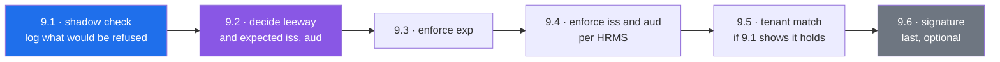

# 09 — The ID token's claims are never checked

Split out of [[08-Composition-And-Lifecycle]] finding 4 on 2026-09-13 · refreshed 2026-09-15 against the code after [[11-Startup-Lifecycle]] and [[10-Capability-Settings]] · **not started** · small: `services/session_service.py`, `config.py`, one env file per HRMS configuration

> [!abstract] What this is
> Xarvis reads a user's identity out of an OpenID Connect ID token without checking any of the claims the specification says it must check. The skipped **signature** is allowed here and is documented as such; the skipped **claims** are a separate thing, and this is that thing. It only matters in production: local, dev and staging all serve the canned user and never reach this code.

---

## What the code does today

Read 2026-09-15. `services/session_service.py`, `acquire_identity`, lines 95 to 150:

```python
hrms_name = request.query_params.get("orgId")
base_url = get_hrms_base_url(hrms_name)
code_bearer = get_hrms_auth_code(hrms_name)
...
oauth_response = await services.oauth_adapter.get_madp_oauth_tokens(base_url=..., code=madp_auth_code, ...)
...
decoded_payload = jwt.decode(
    oauth_response.id_token,
    options={"verify_signature": False},
)
user_data = extract_user_data(decoded_payload)
```

Four facts about it that shape the fix:

| Fact | Where | What it means |
|---|---|---|
| the HRMS instance is picked from the `orgId` query parameter, through `HRMS_BASE_URL` and `HRMS_CODE_AUTH`, both maps keyed by that value with a default | `session_service.py:68-73`, `config.py` `HrmsSettings` | expected `iss` and `aud` values have a natural home: two more maps keyed the same way |
| `extract_user_data` indexes `iss`, `aud`, `azp`, `iat`, `exp` and `jti` with `payload[...]` | `services/schema/user_session_data.py:57-63` | a token missing any of them already fails, by accident, as a `KeyError` turned into `AUTH_FAILED`. **Presence is enforced; values never are** |
| `UserData.audience` is declared `str` | `user_session_data.py` | a token whose `aud` is a list, which the specification allows, already fails to become a user. Worth knowing before adding an `aud` check that assumes a string |
| nothing compares the tenant in the token (`hrmsId`, `hrmsName`, `companyId`) with the `orgId` the request asked for | `acquire_identity` | a token for another tenant becomes a session scoped to that other tenant. Whether `orgId` and `hrmsName` are even the same vocabulary is unknown and has to be measured |

Also sitting in this function, and folded into this task:

- a nine-line comment block at lines 125 to 133, added during the composition refactor to explain the skipped signature and the missing claims. Under the no-comments rule it goes when this code changes, and this document is where that reasoning lives.
- line 146 logs the whole decoded token, `extra={"payload": decoded_payload}`, when the identity is unreadable: name, email, phone number and employee id in the logs. It should log which fields were missing, not their values.

---

## What the specification requires

OpenID Connect Core 1.0, section 3.1.3.7, ID Token Validation:

| Step | Requirement level | Checked today | Present-required today |
|---|---|---|---|
| 2 · the issuer identifier MUST exactly match the `iss` claim | MUST | no | yes, by `extract_user_data` |
| 3 · the client MUST validate that `aud` contains its own client id | MUST | no | yes |
| 4 · if `azp` is present, the client SHOULD verify its client id is the value | SHOULD | no | yes |
| 6 · validate the signature | MUST, **with an exemption** | no, and the exemption applies | — |
| 6 · the current time MUST be before `exp` | MUST | **no** | yes |
| 7 · `iat` may be used to reject tokens issued too long ago | MAY | no | yes |
| 8 · if a `nonce` was sent, it MUST be present and checked | MUST when applicable | no nonce is sent | — |

> [!note] The skipped signature is the one thing already settled
> Step 6 says that when the ID token is received by direct communication between the client and the token endpoint, TLS server validation MAY be used to validate the issuer in place of checking the token signature. Xarvis reads the token from the response to its own HTTPS call to `{base_url}/oauth2/token`, so it is inside that clause.
>
> **What the clause covers is the signature and nothing else.** It is not an exemption from steps 2, 3 or the `exp` check.

---

## The measurement

The offline harness mints its identity-provider token with `iat = 1_700_000_000` — 14 November 2023 — and `exp = iat + 3600`, with `iss` `https://idp.test`, `aud` and `azp` `xarvis` (`verify/harness.py:634-639`).

**A session is created from that token today, without complaint.** The `R8_oauth_ok_admin` scenario returns `SUCCESS`, sets a cookie, and caches a user built from claims that expired nearly three years ago. That is the finding, reproduced on demand.

---

## What PyJWT can do with the signature check off

The plan depends on being able to check claims **without** first building signature verification. Measured on the installed PyJWT 2.10.1, 2026-09-15:

| Call | Result |
|---|---|
| today's call, `options={"verify_signature": False}`, expired token | accepted |
| `verify_signature: False, verify_exp: True`, expired token | refused, `ExpiredSignatureError` |
| the same with `leeway=300`, token expired 120 seconds ago | accepted |
| `verify_signature: False, verify_iss: True`, wrong issuer | refused, `InvalidIssuerError` |
| `verify_signature: False, verify_aud: True`, wrong audience | refused, `InvalidAudienceError` |
| the same, right audience | accepted |
| `verify_exp: True, require: ["exp"]`, token with no `exp` | refused, `MissingRequiredClaimError` |

So each claim check can be switched on independently of the signature, and `leeway` applies to the time checks. Signature verification stays last in the plan, where it belongs.

---

## Why it is its own change

Adding any of these checks changes who gets a session, in the one environment that runs this path. A clock-skew or token-lifetime problem would appear first in production, on a code path nothing else exercises, as users who cannot log in. So the order is **observe, decide, then enforce**, and the observation has to run in production for long enough to see real tokens.



---

## What changes

**9.1** — **Shadow check, log only.** After the existing decode, decode the same token a second time with `verify_exp`, `verify_iss` and `verify_aud` switched on, catch the result, and log one line per session creation. Nothing is refused. The line carries only what is needed to decide 9.2 and nothing personal:

| Field | Why |
|---|---|
| `org` | the `orgId` requested, so expected values can be decided per HRMS |
| `seconds_until_exp` | negative means already expired on arrival; the spread is the clock skew and token lifetime |
| `seconds_since_iat` | how old tokens are when they arrive |
| `iss`, `aud`, `azp` | the provider's actual values, which are configuration, not personal data |
| `aud_is_list` | whether the `str` typing of `UserData.audience` already rejects real tokens |
| `hrms_name_matches_org` | whether the token's tenant and the requested `orgId` even use the same vocabulary, for 9.5 |

Removes the comment block at 125 to 133 and replaces the full-payload log at line 146 with the names of the missing fields. Deploy, then leave it for **a week of production logins**.

**9.2** — **Decide from the log, and write the decisions here.** The leeway, from the observed skew rather than a guess. The expected `iss` and `aud` per HRMS, from the observed values. Whether `azp` is worth checking. Whether 9.5 is possible at all.

**9.3** — **Enforce `exp`.** `options={"verify_signature": False, "verify_exp": True, "require": ["exp", "iat"]}` with the leeway from 9.2. A refusal becomes the existing `AUTH_FAILED`, and the log line names the reason. Highest value, no new configuration.

**9.4** — **Enforce `iss` and `aud` per HRMS.** Two maps in `HrmsSettings`, keyed by `orgId` like `HRMS_BASE_URL`, each with a default, and a startup rule that refuses a production configuration missing them — the pattern [[10-Capability-Settings]] used. Passed to `jwt.decode` as `issuer=` and `audience=`.

**9.5** — **Tenant match, only if 9.1 shows the vocabularies line up.** Refuse a token whose tenant does not belong to the `orgId` that was requested. If they do not line up, record that here and drop the step rather than invent a mapping.

**9.6** — **Signature verification, last and optional.** Needs the provider's JWKS endpoint, a fetch at startup on the lifecycle stack from [[11-Startup-Lifecycle]], a cache and a key-rotation story. The TLS exemption means this is an improvement rather than a repair.

---

## How it gets verified

Testing is deferred, so verification is the harness, scratchpad runs and production observation:

- **9.1:** the harness diffs clean apart from the new log line; `R8_oauth_ok_admin` still succeeds, and its shadow line reports the token as expired by roughly three years, which proves the shadow check sees what the enforcement would refuse.
- **9.3:** `R8_oauth_ok_admin` now fails with `AUTH_FAILED`, the one intended difference; a harness variant with a current token still succeeds; a scratchpad token expired inside the leeway is accepted and one outside it is refused.
- **9.4:** scratchpad tokens with a wrong `iss` or `aud` for their `orgId` are refused, the right ones accepted; production settings missing the maps refuse to start.
- **Production, after each enforcing step:** the rate of `AUTH_FAILED` against the week measured in 9.1, watched for the first days after deploy.

---

## Definition of done

- [ ] 9.1 shadow check deployed, logging no personal data, and a week of production logins collected
- [ ] The full-payload log at line 146 gone, and the comment block at 125 to 133 removed
- [ ] 9.2 decisions written into this document: leeway, expected `iss` and `aud` per HRMS, `azp`, tenant match
- [ ] `exp` enforced with the decided leeway, and `R8_oauth_ok_admin` refused as intended
- [ ] `iss` and `aud` enforced per HRMS from settings, with production refusing to start without them
- [ ] 9.5 applied or explicitly dropped, with the reason
- [ ] 9.6 decided: done, or deferred with the reason

---

## What it is worth

An attacker who can reach `/api/v1/session` cannot currently forge an identity, because they would have to make the HRMS token endpoint return a token of their choosing — the TLS connection stops that, and it is exactly the protection the specification's exemption relies on.

What the missing checks cost is **everything that is not an attacker**: a replayed old token, a token from a different client of the same provider, a token for another tenant, a stale token from a cached authorization code. None of those are caught today, and all of them are ordinary failures rather than exotic ones.
