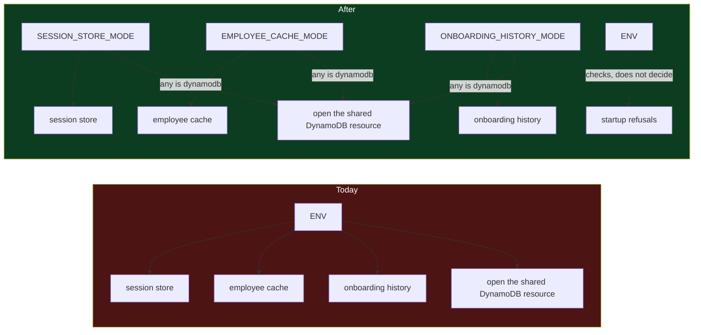

# 10 — Capability Settings

Written 2026-09-15, refreshed the same day after [[11-Startup-Lifecycle]] landed · **done 2026-09-15**, 10.1 to 10.5, the folded-in ty fixes and staging's own table names · small: `config.py`, `bootstrap/app_bootstrap.py` and four env files, plus two ty fixes folded in · its own branch · unblocked

> [!abstract] What this is
> Four behaviours are decided by comparing the environment's name: which storage the session store, the employee cache and the onboarding history use, and whether startup opens the DynamoDB resource those stores share. Each should be a setting the deployment states, the way `CHECKPOINTER_MODE` already is. The environment name stays, but only where the place genuinely is the answer — the log format, and startup checks that refuse a dangerous combination.

> [!note] Session warmup was a fourth, and is gone · 2026-09-15
> `create_session` used to pre-fetch four lookups when `settings.env in {"staging", "prod"}`, and this task planned a `SESSION_WARMUP_ENABLED` flag for it. The warmup was removed instead, together with the employee prefetch, because nobody had measured the first-answer speed it was bought for. Reasoning and verification are in [[08-Composition-And-Lifecycle]] finding 6. If it comes back, it comes back behind a flag, not an environment name.

---

## What the code does today

Recounted on the code after [[11-Startup-Lifecycle]], 2026-09-15:

| Where | Condition | What it really decides |
|---|---|---|
| `bootstrap/app_bootstrap.py:167`, `build_user_session_cache` | `env not in {"prod"}` | sessions in memory or DynamoDB |
| `bootstrap/app_bootstrap.py:175`, `build_onboarding_history` | `env not in {"prod"} or table_name is None` | onboarding history in memory or DynamoDB |
| `bootstrap/app_bootstrap.py:183`, `build_employee_cache` | `env not in {"prod"}` | employee data in memory or DynamoDB |
| `bootstrap/app_bootstrap.py:215`, `bootstrap_app` | `settings.env in {"prod"}` | whether the shared DynamoDB resource is opened at all — added by TODO 11 |
| `config.py:137`, `uses_stub_user` | `env in {"local", "dev", "staging"}` | canned user or real login — **not this task**, see below |
| `logging_utils/config.py:13` | `env == "local"` | readable or JSON logs — **stays** |
| `config.py:141` | `stub_session_user and env not in {"local", "dev"}` | refuse to start — **stays** |

Since TODO 11 the three builders take the resource instead of opening their own, and bootstrap opens it once, on the startup stack:

```python
async def build_user_session_cache(env: str, dynamodb: Any, table_name: str | None):
    if env not in {"prod"}:
        return InMemoryUserSessionCache()

    table = await dynamodb.Table(table_name)
    return DynamoUserSessionCache(table)
```

```python
dynamodb = None
if settings.env in {"prod"}:
    dynamodb = await stack.enter_async_context(aioboto3.Session().resource("dynamodb"))
```

---

## The test that decides which conditions move

From [[05-Flag-Per-Capability]]: ask what actually decides the behaviour. If the honest answer is the place, compare `env`. If it is anything else, the environment is standing in for the real reason, and it will be wrong on the day the two stop agreeing.

| The condition | What decides it, honestly | Moves to a setting |
|---|---|---|
| storage for the three stores, and so whether the shared resource opens | how the deployment runs: how many processes, whether data must survive a restart | **yes** |
| log format | whether a person reads it in a terminal | no — that is what local means |
| the startup refusal | the place itself | no — this is the right use of `env` |

> [!important] This reverses an earlier call
> `REFACTOR-TODO.md:72-78` in the Xarvis repository sorts the uses of `ENV` into three kinds, marks choosing the storage for a store as a legitimate one, and moves only whether onboarding is on to its own flag. The evidence below is why the storage choice no longer belongs on that side.

---

## Why it is already costing something

**Staging's configuration is ignored.** `.env.python.stg` sets `USER_SESSION_TABLE_NAME=chatbot-sessions` and `ONBOARDING_HISTORY_TABLE_NAME=workflow-history`, and neither is ever read, because the name is not `prod`. All four env files set `EMPLOYEE_DOMAIN_TABLE_NAME=chatbot-cache`, and only production reads it. The configuration says one thing, the code does another, and neither file mentions the other.

**One store cannot be reached at all.** `DynamoOnboardingHistory` needs `env == "prod"` and a table name. Production has no table name and does not run onboarding, so the DynamoDB path is live code that no environment executes — recorded in `REFACTOR-TODO.md:115`, and still true.

**The same question has two answers in one codebase.** The checkpointer picks its storage with `CHECKPOINTER_MODE=memory|dynamodb`. The three stores beside it pick theirs from the environment's name. Anyone who learns one rule learns the wrong rule for the other.

**In-memory sessions depend on something the name does not say.** An in-memory session store only works while every request lands on the process that created the session. Run a second copy and a session minted on one answers `Session not found` on the other, which the client sees as a 401. Whether a deployment runs one process or several is a fact about how it runs, not what it is called.

**Moving staging costs a code change.** Staging is expected to move to DynamoDB — `00-Syllabus.md:211` records it for the checkpointer. Today that means editing four conditions in `app_bootstrap.py`, then a review, a build and a deploy, and missing one leaves staging with checkpoints in DynamoDB and sessions in memory. With a setting it is one line in `.env.python.stg`.

> [!note] With the variable passed by the platform, not even a rebuild
> The Dockerfile bakes `.env.python.<ENV>` into the image. A variable the deployment passes at start beats that baked file — checked on 2026-09-15 against pydantic-settings 2.15.0, the precedence [[06-Baked-Or-Passed-In]] describes. So a setting can differ per deployment without a new image, which a condition in code never can.

---

## What changes



**10.1** — Add a mode per store, copying `CheckpointerSettings` field for field, including its rule that `dynamodb` needs a table name:

```python
class DynamoSettings(_Block):
    session_store_mode: Literal["memory", "dynamodb"] = Field("memory", validation_alias="SESSION_STORE_MODE")
    user_session_table: str | None = Field(None, validation_alias="USER_SESSION_TABLE_NAME")
    employee_cache_mode: Literal["memory", "dynamodb"] = Field("memory", validation_alias="EMPLOYEE_CACHE_MODE")
    employee_domain_table: str | None = Field(None, validation_alias="EMPLOYEE_DOMAIN_TABLE_NAME")

    @model_validator(mode="after")
    def _dynamodb_needs_a_table(self) -> "DynamoSettings":
        if self.session_store_mode == "dynamodb" and not self.user_session_table:
            raise ValueError("SESSION_STORE_MODE=dynamodb requires USER_SESSION_TABLE_NAME to be set")
        if self.employee_cache_mode == "dynamodb" and not self.employee_domain_table:
            raise ValueError("EMPLOYEE_CACHE_MODE=dynamodb requires EMPLOYEE_DOMAIN_TABLE_NAME to be set")
        return self
```

`ONBOARDING_HISTORY_MODE` goes on `OnboardingSettings` next to `history_table`, with the same rule. The names are a proposal; what matters is one field per store, named for the store.

> [!success] 10.1 applied · 2026-09-15
> `DynamoSettings` gained `employee_cache_mode` and `session_store_mode`, `OnboardingSettings` gained `history_mode`, each with a `_dynamodb_needs_a_table` rule copied from `CheckpointerSettings`. Nothing reads them yet, so behaviour is unchanged. Checked: ruff and ty clean on `config.py`; local settings load with all three at `memory`; with no env file and overrides only, each rule refuses `dynamodb` without its table, accepts it with one, and a mistyped mode is refused; harness 0 differences in all three configurations.

**10.2** — Bootstrap reads the modes instead of taking `env`. Each `build_*` function takes its store's mode in place of `env`, keeping the shared resource TODO 11 gave it, and `build_onboarding_history` loses its second condition: a `dynamodb` mode with no table is now refused at startup rather than quietly falling back to memory.

```python
async def build_user_session_cache(mode: Literal["memory", "dynamodb"], dynamodb: Any, table_name: str | None):
    if mode == "memory":
        return InMemoryUserSessionCache()

    table = await dynamodb.Table(table_name)
    return DynamoUserSessionCache(table)
```

The resource opens when any store that will be built asks for DynamoDB, so the fourth condition goes too, and a deployment with every store in memory still opens no AWS connection:

```python
modes = {settings.dynamo.session_store_mode, settings.dynamo.employee_cache_mode}
if settings.onboarding.enabled:
    modes.add(settings.onboarding.history_mode)

dynamodb = None
if "dynamodb" in modes:
    dynamodb = await stack.enter_async_context(aioboto3.Session().resource("dynamodb"))
```

**10.3** — Set the four env files to the values that reproduce today's behaviour exactly:

| | `.env`, local | `.env.python.dev` | `.env.python.stg` | `.env.python.prod` |
|---|---|---|---|---|
| `SESSION_STORE_MODE` | memory | memory | memory | dynamodb |
| `EMPLOYEE_CACHE_MODE` | memory | memory | memory | dynamodb |
| `ONBOARDING_HISTORY_MODE` | memory | memory | memory | not read, onboarding is off |

`.env` is gitignored, so other developers' copies will not have the new keys. The defaults are the local values, so nothing changes for them.

> [!success] Table names present where `dynamodb` goes · checked 2026-09-15
> Read as set or missing only, never the values: `.env.python.prod` sets `EMPLOYEE_DOMAIN_TABLE_NAME`, `USER_SESSION_TABLE_NAME` and `DYNAMODB_TABLE`, and `ONBOARDING_ENABLED=false`, so production's two store modes can be `dynamodb` without tripping 10.1's table rule, and 10.4 does not check onboarding history there. Staging sets both store tables and `ONBOARDING_HISTORY_TABLE_NAME` but runs `memory`; dev and local set only `EMPLOYEE_DOMAIN_TABLE_NAME`.

> [!warning] Commit order
> 10.1 on its own is safe: new fields defaulting to `memory`, and rules that only fire on `dynamodb`. **10.2, 10.3 and 10.4 must land in one commit.** 10.2 without 10.3 makes production read `memory` defaults and quietly run in memory; 10.4 without 10.3 makes production refuse to start.

**10.4** — Production refuses in-memory storage · **decided 2026-09-15: refuse to start**. Every mode defaults to `memory`, so a production env file that forgets a key would otherwise run local behaviour in production without a word: sessions that vanish on restart, a cache per process, checkpoints lost mid-conversation. The app must not start at all in that state.

The rule covers every store and the checkpointer, whose `CHECKPOINTER_MODE` defaults to `memory` today and has the same hole. It lives on `Settings` beside `_no_auth_bypass_outside_local`, because it reads several blocks at once, and it is the right use of comparing `env`: the rule is about the place. It names the environments where memory is allowed rather than the one where it is not, as [[03-Refuse-To-Start]] argues, so a new environment name is refused by default.

```python
MEMORY_STORAGE_ALLOWED = {"local", "dev", "staging"}


@model_validator(mode="after")
def _durable_storage_outside_local(self) -> "Settings":
    if self.env in MEMORY_STORAGE_ALLOWED:
        return self

    in_memory = []
    if self.dynamo.session_store_mode == "memory":
        in_memory.append("SESSION_STORE_MODE")
    if self.dynamo.employee_cache_mode == "memory":
        in_memory.append("EMPLOYEE_CACHE_MODE")
    if self.checkpointer.mode == "memory":
        in_memory.append("CHECKPOINTER_MODE")
    if self.onboarding.enabled and self.onboarding.history_mode == "memory":
        in_memory.append("ONBOARDING_HISTORY_MODE")

    if in_memory:
        raise ValueError(f"ENV={self.env} needs durable storage; set to dynamodb: {', '.join(in_memory)}")
    return self
```

Onboarding history is checked only when onboarding is on, which it is not in production today.

> [!success] Confirmed safe for the checkpointer · 2026-09-15
> Read one key per env file, nothing else: `.env.python.prod` sets `CHECKPOINTER_MODE=dynamodb`, while `.env.python.stg`, `.env.python.dev` and the local `.env` set `memory`. Staging, dev and local are all in `MEMORY_STORAGE_ALLOWED`, so the rule lets every environment start exactly as it does today. The store modes do not exist yet, so 10.3 has to set production's to `dynamodb` in the same commit as the rule, or production refuses to start on deploy.

> [!success] 10.2, 10.3 and 10.4 applied together · 2026-09-15
> Bootstrap now reads the modes: the three builders take `mode` instead of `env`, `build_onboarding_history` lost its `table_name is None` fallback, and the shared resource opens when any store that is built asks for `dynamodb`. `config.py` gained `MEMORY_STORAGE_ALLOWED` and `_durable_storage_outside_local`. The env files were appended to without being opened or displayed: production got `dynamodb` for both stores, staging and dev got explicit `memory` for all three, staging's missing final newline handled by starting its append with one.
>
> | Check | Result |
> |---|---|
> | the equivalence table, old `env` decisions against new modes, per env file | **16 of 16 match**: prod keeps both stores on DynamoDB with onboarding history not built, staging, dev and local keep everything in memory, and the resource opens only in prod |
> | 10.4 with overrides only | prod with every key forgotten refuses and names all four keys; prod fully durable with onboarding off starts; prod missing only the session key names only it; prod with onboarding on names `ONBOARDING_HISTORY_MODE`; staging and dev with every key forgotten start |
> | prod path with a fake aioboto3 session | every store `memory`: nothing opened; session store `dynamodb`: one open, one table, one close; both stores `dynamodb`: one open, two tables, one close |
> | ruff, ty, smoke, harness | 28 existing ruff errors unchanged and both touched files clean; ty clean including `app_bootstrap.py`; the app starts in memory locally; harness 0 differences in all three configurations |
> | conditions deciding behaviour from `env` | **2**: `uses_stub_user` at `config.py:157` and the log format at `logging_utils/config.py:13`; the other two uses are startup refusals |

**10.5** — Update the Configuration section of the Xarvis `CLAUDE.md`: the new keys, and a row in its table of refused configurations for each new startup rule · done. A new `### Storage modes` table maps each mode key to its store and required table key; the refused-configurations table gained the table-name rule and the production in-memory refusal; the Data Layer and Startup and Shutdown sections now say the shared resource opens when a store's mode is `dynamodb` rather than in prod; the env var table lists the three modes and `ONBOARDING_HISTORY_TABLE_NAME`, and marks `ENV` as required rather than defaulting to `local`. A sweep of the guides found no line left tying storage to `ENV=prod`.

---

## Before staging ever switches to DynamoDB

> [!warning] Staging names the same tables as production
> Both `.env.python.stg` and `.env.python.prod` set `USER_SESSION_TABLE_NAME=chatbot-sessions`, and all four env files set `EMPLOYEE_DOMAIN_TABLE_NAME=chatbot-cache`. Today that is harmless because only production reads them. The day staging's modes flip to `dynamodb`, staging writes to those names — fine if staging and production run in separate AWS accounts, and a collision with production data if they do not. The repository cannot say which.
>
> The config pass met exactly this with the checkpointer table and resolved it by deleting staging's copy, so the mode flip is refused until somebody chooses a staging-specific name (`00-Syllabus.md:211`). The same move works here, and it has to happen before the flip, not after.
>
> **The checkpointer does not even fail on a wrong name.** `DynamoDBSaver` creates any table it cannot find, during startup ([[11-Startup-Lifecycle]], 11.5), so a mistyped or not-yet-chosen name creates a table in whatever AWS account the credentials reach. For the checkpointer the name has to be right before the flip, because nothing will refuse it.

> [!success] Resolved · 2026-09-15 · staging has its own names now
> `.env.python.stg` was edited in place, touching only these lines and never displaying the rest: `EMPLOYEE_DOMAIN_TABLE_NAME` went from `chatbot-cache` to `chatbot-cache-staging`, `USER_SESSION_TABLE_NAME` from `chatbot-sessions` to `chatbot-sessions-staging`, `ONBOARDING_HISTORY_TABLE_NAME` from `workflow-history` to `workflow-history-staging` for consistency, and `DYNAMODB_TABLE=langgraph-checkpoints-staging` was added, where staging previously had no checkpoint table at all. Production keeps `chatbot-cache`, `chatbot-sessions` and `langgraph-checkpoints`. So a staging mode flipped later, even by mistake, can no longer write into a production table.
>
> **What the flip still needs:** the stores do not create their tables, so `chatbot-cache-staging` and `chatbot-sessions-staging` must exist, with staging's AWS role allowed to use them, before those modes become `dynamodb`. The checkpointer creates `langgraph-checkpoints-staging` itself on first start, which needs the role to be allowed to create tables. Nothing outside the env files referred to the old names, apart from two historical lines in `REFACTOR-TODO.md`.

---

## Folded in

Four ty errors that TODO 11 made visible by giving functions real types. They predate it, the running code is safe because settings validation already guarantees the values, and they sit in or beside the settings this task edits, so they go in the same commit rather than a task of their own.

| Where | What ty sees | Why it is safe today, and the fix |
|---|---|---|
| `checkpointing/factory.py:27-28` | `DynamoDBSaver` given `table_name: str \| None` and `ttl_seconds: int \| None`, where it declares `str` and `int` | `CheckpointerSettings` refuses `dynamodb` mode without a table; make that guarantee visible to ty in the settings block this task already touches. `ttl_seconds` is the library's own annotation being wrong, since it defaults to `None` |
| `services/knowledge_graph/neo4j_driver.py:96` | `cfg.uri` and `cfg.password` may be `None` | the driver is only built when `configured` is true, and `_uri_needs_a_password` refuses a URI without a password; same treatment |

> [!success] Fixed · 2026-09-15 · ty now reports nothing for either file
> `_create_dynamodb_checkpointer` narrows the table with an explicit refusal and passes `ttl_seconds` only when it is set. Checked with a fake saver: no TTL passes `table_name` alone, the library default, exactly as before, since the library only ever tests `ttl_seconds` for truthiness; a TTL passes both; a missing table raises. `build_neo4j_driver` refuses a missing URI or password before creating any driver; checked with a fake driver that a configured one still opens, verifies, ensures constraints and closes, and that either missing value raises with nothing opened. Both new refusals are unreachable from bootstrap, because settings validation already guarantees the values; they exist so the types say what the validators already enforce.

---

## Not in this task

| Item | Why not |
|---|---|
| `uses_stub_user` | It decides who a session belongs to, and staging being inside its set is the gap [[07-Staging-Auth-Gap]] exists for. Moving it is an authentication decision, not a configuration tidy-up |
| the log format check | the place really is the reason: `local` means a person reading a terminal |
| the startup refusal for `STUB_SESSION_USER` | a check, not a decision — the use of `env` this task keeps |
| staging actually moving to DynamoDB | this task makes the move one line; making it is separate, and waits on the table-name check above |

---

## How it gets verified

The change is only a refactor if every environment keeps the storage it has today, so that is what gets checked — for each env file, not only the one the harness loads.

**1 · An equivalence table over the four env files.** For each file, resolve the settings and compute every decision twice: once with the old condition on `env`, once from the new field. Four files, four decisions — the three stores and whether the shared resource opens — sixteen cells, and all must agree. Settings only — nothing opens a DynamoDB connection.

**2 · The startup rules fire.** A `dynamodb` mode with no table is refused, for each of the three stores. And 10.4: with `ENV=prod`, each of the three store modes and `CHECKPOINTER_MODE` left at `memory`, or its key deleted, refuses to start and names the key; the same values with `ENV` local, dev or staging start.

**3 · The golden-master harness diffs clean.** It loads the local env file, so it covers the memory paths, which is what local does today.

**4 · The count.** Conditions that decide behaviour from the environment's name: **6** today — the four in bootstrap (`app_bootstrap.py:167,175,183,215`), `uses_stub_user` (`config.py:137`) and the log format (`logging_utils/config.py:13`) — and **2** after: the log format, which stays, and `uses_stub_user`, which waits on 07. Recounted 2026-09-15; TODO 11 added the one at line 215, after the warmup gate's removal had brought it to 5.

**5 · The prod path in the scratchpad.** The harness only runs memory modes, so, as TODO 11 did, patch in a fake aioboto3 session: with a store in `dynamodb` mode exactly one resource opens and closes once, and with every store in `memory` none opens.

**Revert:** one commit, with the code and the env files together. Reverting only the code is safe, because `_Block` sets `extra="ignore"` and the new keys are skipped. Reverting only the env files fails loudly: production would fall back to the memory defaults, and 10.4 refuses to start on them.

---

## Definition of done

- [x] No store picks its storage by comparing the environment's name, and neither does opening the shared DynamoDB resource
- [x] Each of the four env files resolves to the same storage as before, checked cell by cell
- [x] A `dynamodb` mode with no table refuses to start, for every store
- [x] 10.4 decided, and the decision written down either way — production refuses in-memory storage, 2026-09-15
- [x] Production refuses to start with any store or the checkpointer in `memory` mode, naming the key
- [x] The staging table-name question answered before any mode in staging flips — staging's own `-staging` names, 2026-09-15
- [x] The Xarvis `CLAUDE.md` lists the new keys and refusals
- [x] The harness diffs clean, and the prod path passes in the scratchpad
- [x] ty reports nothing for `checkpointing/factory.py` and `neo4j_driver.py`
