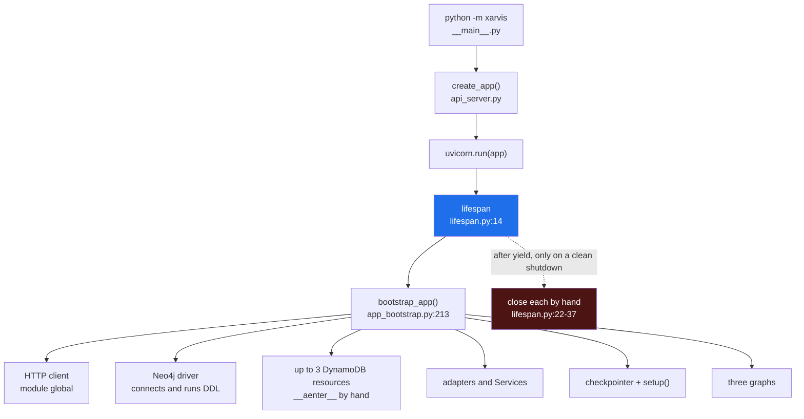
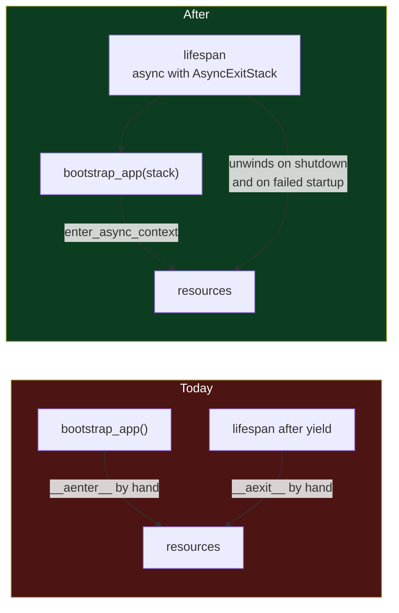

# 11 — Startup Lifecycle

Written 2026-09-15 · **done 2026-09-15**, all eight steps · small: `server/lifespan.py`, `bootstrap/app_bootstrap.py`, `api_clients/http_client.py`, `checkpointing/factory.py` · its own branch · before [[10-Capability-Settings]], which rewrites the same three `build_*` functions

> [!abstract] What this is
> Everything Xarvis opens at startup, and whether it is guaranteed to be closed. Today it is not: resources are opened by hand in one file and closed by hand in another, a startup that fails halfway closes nothing, and one close that raises skips every close after it. The fix is the one the aioboto3 documentation prescribes for long-running servers, a single `AsyncExitStack` that every resource joins the moment it is opened. Testing is deferred; verification below uses the harness and scratchpad runs only.

---

## What happens on startup today

Read on `refactor-composition-wiring`, 2026-09-15:



Opening happens in `bootstrap_app()`. Closing happens in `lifespan` after `yield`. Nothing ties the two together.

---

## What is wrong

| # | Finding | Where | What it costs |
|---|---|---|---|
| 1 | **A startup that fails halfway closes nothing.** Cleanup is the code after `yield`, and that code never runs when `bootstrap_app()` raises | `lifespan.py:14`, `app_bootstrap.py:213-344` | a graph build or table lookup that fails leaves the Neo4j driver, the DynamoDB resources and the HTTP client open |
| 2 | **One close that raises skips the rest.** Only the Neo4j close is wrapped | `lifespan.py:22-37` | if `http_client.aclose()` raises, none of the three DynamoDB resources is exited |
| 3 | **Opening and closing are in different files.** `__aenter__` is called by hand three times, and each matching `__aexit__` lives elsewhere | `app_bootstrap.py:169,182,195`, `lifespan.py:33-37` | a new resource added to one file and not the other leaks without any error |
| 4 | **Three aioboto3 sessions for one service.** Each store builds its own `Session` and its own resource | `app_bootstrap.py:167,180,192` | three connection pools to DynamoDB where one does |
| 5 | **The HTTP client is a module global.** Created on first call from anywhere, closed by `lifespan` | `api_clients/http_client.py:7-30` | its lifetime belongs to no one; a call before startup or after shutdown quietly gets a client |
| 6 | **Neo4j is mandatory at startup although the knowledge graph is optional.** `verify_connectivity()` and constraint creation run inside startup | `services/knowledge_graph/neo4j_driver.py:97-100` | a Neo4j outage stops the whole app, including the admin and employee agents, when onboarding is enabled; prod has onboarding off |
| 7 | **A blocking call on the event loop, and a dead branch.** `checkpointer.setup()` is synchronous and runs inside async startup. `create_checkpointer()` always returns `None` as the context, so its close never runs | `app_bootstrap.py:326-327`, `checkpointing/factory.py:11-34`, `lifespan.py:30-31` | low: no traffic is served during startup, but the dead branch reads as a resource that is closed |

> [!note] Finding 1, measured rather than assumed · 2026-09-15
> Run in the scratchpad against Xarvis's installed FastAPI, with one resource opened by hand and the lifespan raising before `yield`, as `bootstrap_app()` would: after the failed startup the resource was **still open**. The same shape on an `AsyncExitStack` closed both resources it had opened, in reverse order, before the error reached the server.

---

## What the industry does

**aioboto3's usage documentation** addresses exactly this. Since v8, `.client` and `.resource` are async context managers, which it notes breaks normal patterns in long-running processes like web servers. Its answer is an `AsyncExitStack`: enter each resource with `await stack.enter_async_context(session.resource(...))` at startup, reuse one `Session`, and call `await stack.aclose()` on shutdown. That covers findings 1 to 4.

**FastAPI's lifespan documentation**: acquire before `yield`, release after it. The stack keeps that shape and makes the release unconditional.

**Python's `AsyncExitStack`** unwinds like nested `async with` blocks. Measured in the scratchpad: with three resources and the middle one raising on close, all three were closed, in reverse order, and the error still surfaced.

**Starlette 1.6.0**, the version installed, lets the lifespan yield a dict that becomes `request.state` (`starlette/routing.py:648-652`). That is the typed alternative to `app.state.components`. Noted, not part of this task.

---

## What changes



**11.1** — `lifespan` owns one stack and hands it to bootstrap:

```python
@asynccontextmanager
async def lifespan(app: FastAPI):
    async with AsyncExitStack() as stack:
        app.state.components = await bootstrap_app(stack)
        logger.info("startup complete")
        yield
        logger.info("shutdown: closing resources")
```

If `bootstrap_app()` raises, the `async with` closes everything already on the stack and the error propagates, so uvicorn still refuses to start.

**11.2** — The HTTP client is created in bootstrap and joins the stack. `get_async_client()` and its module global go:

```python
components.http_client = await stack.enter_async_context(
    httpx.AsyncClient(limits=HTTP_LIMITS, timeout=HTTP_TIMEOUT)
)
```

`HTTP_LIMITS` and `HTTP_TIMEOUT` stay where they are.

**11.3** — One aioboto3 `Session` and one DynamoDB resource, entered on the stack once, shared by the stores that need it. Each `build_*` function takes the resource instead of opening its own, and stops returning a context to close:

```python
session = aioboto3.Session()
dynamodb = await stack.enter_async_context(session.resource("dynamodb"))
cache = await build_employee_cache(env=settings.env, dynamodb=dynamodb, table_name=...)
```

The resource is entered only when at least one store will use DynamoDB, so local and dev open no AWS connection at all, as today. The `env not in {"prod"}` conditions themselves stay untouched; moving them is [[10-Capability-Settings]].

**11.4** — The Neo4j driver joins the stack as a callback: `stack.push_async_callback(close_neo4j_driver, driver)`, right after it is built.

**11.5** — The checkpointer · done. Reading the installed libraries changed this step: neither `InMemorySaver` nor `DynamoDBSaver` has a `setup` method, so the `hasattr(checkpointer, "setup")` branch never ran, and `DynamoDBSaver` has no close method either. The blocking work is its constructor, which calls the synchronous `table.load()` and, when the table is missing, creates it and waits in `wait_until_exists()`. So the checkpointer is now built with `await asyncio.to_thread(create_checkpointer)`, `create_checkpointer()` returns a `BaseCheckpointSaver` alone, and the dead `setup` branch and `checkpointer_ctx` are gone.

> [!warning] `DynamoDBSaver` creates its table at startup when the name does not exist
> A checkpointer switched to `dynamodb` with a mistyped or not-yet-created table name does not fail; it creates that table in whatever AWS account the credentials reach. That is the same hazard [[10-Capability-Settings]] raises for staging's table names, and it applies before any mode flips.

**11.6** — Delete what the stack replaces · done, folded into 11.2 to 11.5. Each step removed its own hand-written close as its resource joined the stack, so nothing was ever closed twice. `lifespan` now has no closes at all, and the `dynamodb`, `user_session_dynamodb`, `onboarding_history_dynamodb` and `checkpointer_ctx` attributes are gone from `AppComponents`.

**11.7** — What a Neo4j failure at startup does · **decided 2026-09-15: degrade** · applied the same day: `bootstrap_app` catches `ServiceUnavailable` around `build_neo4j_driver` and logs `Neo4j unreachable at startup, continuing without the knowledge graph`.

| Checked after applying | Result |
|---|---|
| local Neo4j reachable | driver built, `KNOWLEDGE_GRAPH` registered, harness 0 differences in all three configurations |
| `NEO4J_URI` pointed at nothing listening | warning logged, app started, `neo4j_driver` is `None`, `KNOWLEDGE_GRAPH` absent, onboarding graph still built, clean shutdown |
| driver raising `AuthError` | startup refused, driver closed, HTTP client closed |

**Why the question is not hypothetical.** The Neo4j instance is AuraDB Free, and Aura Free pauses itself:

| Aura Free behaviour | Source |
|---|---|
| paused automatically after **72 hours** of inactivity; it cannot be paused or kept awake by hand | [Neo4j docs, instance actions](https://neo4j.com/docs/aura/managing-instances/instance-actions/) |
| a paused instance does **not** resume when a client connects; someone presses Play in the console, and resuming takes a few minutes to a few hours | same page |
| paused for more than **30 days**, the instance is deleted and all data is lost | same page; an older [support article](https://support.neo4j.com/s/article/17480821630355--Aura-Instance-Access-Issues-Understanding-Pausing-Resuming-and-Auto-Delete-Policy) says 90, the docs win |

| | Refuse to start, as before | Degrade, chosen |
|---|---|---|
| a quiet weekend, then a deploy or restart in dev or staging | the whole app refuses to start, the admin and employee agents included, which never touch Neo4j, until someone presses Play | the app starts; onboarding runs without past-pattern recommendations and without recording to the graph |
| the instance pauses while the app is running | nothing protects this; startup already passed | the same |
| prod | unaffected: onboarding is off, so Neo4j is never opened | unaffected |
| the cost | loud, and it takes everything down for an optional feature | quiet: the graph can be missing for days unnoticed |

**Why degrade matches the code already there.** Both consumers treat the knowledge graph as best effort. `fetch_context_node.py` checks `if kg_service` and wraps the call, logging `KG fetch failed — proceeding without recommendation context`. `workflow_confirmation_node.py` returns early without the service and logs `KG write failed — flow unaffected`. Refusing to start protects only the instant of startup, not the pause that can arrive at any hour after it.

**The rule:**

- Neo4j **unreachable** at startup: log a `WARNING`, leave `neo4j_driver` as `None`, and start without `KNOWLEDGE_GRAPH`.
- Neo4j **reachable but refusing the credentials**: still refuse to start. That is a configuration mistake, not a pause, and it should stay loud.
- Once started without the graph, the app stays without it until the next restart, even if the instance is resumed. Accepted for dev and staging.

> [!important] Which exception to catch · half confirmed 2026-09-15
> Against a `NEO4J_URI` with nothing listening, on the installed neo4j 6.1.0, `verify_connectivity()` raised `neo4j.exceptions.ServiceUnavailable` (`Unable to retrieve routing information`). It is a `DriverError`, on a different branch from `AuthError`, which sits under `Neo4jError`, so catching `ServiceUnavailable` alone lets a credentials failure through. A paused Aura instance itself has not been observed yet; check the log line the first time it pauses.

> [!note] The lasting fix is not code
> If the onboarding knowledge graph ever carries weight, it needs an Aura tier that does not auto-pause, or a self-hosted Neo4j. A keep-alive job to dodge the pause would only hide the problem this decision makes visible in the logs.

**11.8** — Update the Xarvis `CLAUDE.md` · done. A new `## Startup and Shutdown` section lists what joins the stack and the rule for adding a resource. The checkpointer entry now says it is built through `asyncio.to_thread` and that `redis` is refused by settings, the DynamoDB tables entry says prod shares one resource, and `ONBOARDING_ENABLED` says an unreachable Neo4j degrades while bad credentials still refuse to start.

---

## Not in this task

| Item | Why not |
|---|---|
| storage chosen by comparing `env` | [[10-Capability-Settings]], which follows this task and rewrites the same functions |
| import-time side effects in `config.py:146,165` and `llm_factory.py:16` | a separate concern: they make any import need a full environment, which matters most once tests exist |
| typing `AppComponents` and yielding lifespan state instead of `app.state` | a typing change on top of this, not part of making cleanup guaranteed |
| `services_by_key` and the onboarding services | leaves with the onboarding conversion |
| tests | deferred; the scratchpad checks below are verification, not a suite |

---

## How it gets verified

**1 · The harness diffs clean.** The golden-master harness in `verify/` covers all three configurations and every chat path, so identical snapshots mean the refactor changed no request behaviour.

**2 · Startup and shutdown, observed.** Start the app locally, send one chat request, stop it, and check the logs show every resource closed. Then the same with `CHECKPOINTER_MODE=dynamodb` pointed at a table that does not exist, confirming the failed startup closes the HTTP client and the DynamoDB resource before exiting.

**3 · Failure injection in the scratchpad.** Patch one bootstrap step to raise, and one close to raise, and confirm everything opened is closed in both cases. Scratchpad only, nothing added to the repository.

**4 · The count.** Hand-written `__aenter__` / `__aexit__` calls on the startup path: **6** before, **0** after. aioboto3 sessions: **3** before, **1** after. Measured after 11.5, with 3 `enter_async_context` calls in their place: the HTTP client, the DynamoDB resource and the Neo4j driver.

> [!success] Verified after every step, 2026-09-15
> 11.1 to 11.5 each ran ruff, ty, a smoke start and stop, and the golden-master harness against the previous step's snapshot: **0 differences** at every step, in all three configurations. The paths the harness cannot reach ran in the scratchpad against fakes: the prod DynamoDB resource opened once, shared by two stores and closed once, on shutdown and on a failed startup; the Neo4j driver closed when `verify_connectivity()` fails and when a later step fails; the `dynamodb` checkpointer built in a worker thread, not on the event loop thread.

**Revert:** one commit; nothing outside the four files and `CLAUDE.md` changes.

---

## Definition of done

- [x] Every resource opened at startup is entered on one `AsyncExitStack` owned by `lifespan`
- [x] A startup that fails at any step closes everything opened before that step
- [x] A close that raises does not stop the others
- [x] One aioboto3 `Session`, and no module-global HTTP client
- [x] No hand-written `__aenter__` or `__aexit__` on the startup path, and no `checkpointer_ctx`
- [x] Building the checkpointer no longer blocks the event loop
- [x] 11.7 decided, and the decision written down either way — degrade, 2026-09-15
- [x] 11.7 applied: an unreachable Neo4j starts the app without the knowledge graph, and a credentials failure still refuses to start
- [x] The harness diffs clean
- [x] The Xarvis `CLAUDE.md` says how to add a resource
