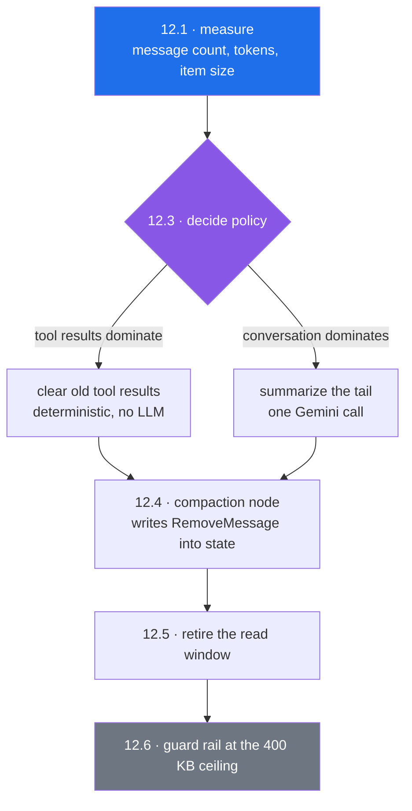

# 12 — Conversation history is truncated, never compacted

Created 2026-09-16 after reading the LangChain middleware documentation · **not started** · medium: `orchestration/employee/node_helper/`, the three chatbot nodes, one new node per graph

> [!abstract] What this is
> Xarvis shapes what the model sees by dropping old messages, and never shapes what is stored. Those are two different problems wearing one name. The first loses conversation the user still remembers; the second grows a single DynamoDB item until it hits a hard 400 KB service limit. Nothing in the codebase summarizes anything, despite the name this task was filed under.

---

## What the code does today

`orchestration/employee/node_helper/llm_window_clean.py`, read 2026-09-16, in full:

```python
from langchain_core.messages import BaseMessage, HumanMessage, SystemMessage


def build_llm_window_clean(
        full: list[BaseMessage],
        system_prompt: str,
        max_history_messages: int = 15,
) -> list[BaseMessage]:
    if not full:
        return [SystemMessage(content=system_prompt)]

    # 1. Take the initial slice
    start_index = max(0, len(full) - max_history_messages)
    window = full[start_index:]

    # 2. Refine the window: Ensure we don't start with an orphaned ToolMessage
    # or an AIMessage that was part of a tool-call chain.
    # We loop until the first message in our window is a HumanMessage.
    while window and not isinstance(window[0], HumanMessage):
        window.pop(0)

    # 3. Final safety check: If popping everything left us empty,
    # find the very last HumanMessage in 'full' and start from there.
    if not window:
        for i in range(len(full) - 1, -1, -1):
            if isinstance(full[i], HumanMessage):
                window = full[i:]
                break

    return [SystemMessage(content=system_prompt), *window]
```

That is the whole of Xarvis context management. It takes the last 15 messages, walks forward until the first one is a `HumanMessage`, and prepends the system prompt.

| Caller | Line |
|---|---|
| `orchestration/employee/nodes/chatbot.py` | 25 |
| `orchestration/admin/nodes/chatbot.py` | 65 and 101, the second for the fallback model |
| `orchestration/onboarding/nodes/conversation/conversation_node.py` | 64 |

Two pieces of dead weight sit beside it: `node_helper/llm_window.py` holds an older token-counting version built on `trim_messages` with **zero callers**, and `MAX_TOKENS = 2000` at `employee/nodes/chatbot.py:15` is never read.

> [!warning] The name on this task was wrong, and the correction matters
> This was filed believing there was hand-written summarization to replace. There is none. Nothing anywhere in `src/` summarizes, compacts, prunes or truncates conversation state — verified by grep across the whole tree. What exists is a read-time window, which is a strictly weaker thing: a summary keeps the information and drops the tokens, a window drops both.

---

## The three problems, which are not one problem

| # | Problem | Where it bites |
|---|---|---|
| 1 | **Turn 16 cannot see turn 1.** At a fixed 15 messages, and with each tool-using turn costing three or more messages, roughly five exchanges is the whole memory. Nothing tells the user, the model or the logs that anything was dropped | the user repeats themself and the agent has no idea why |
| 2 | **State never shrinks.** No `RemoveMessage` exists anywhere in `src/`. `state["messages"]` only grows, and the window hides that growth from the model while the checkpointer keeps writing all of it | a hard failure at the 400 KB item limit, below |
| 3 | **The read window and the stored history have drifted apart.** The model answers from 15 messages, the checkpoint holds hundreds, and the harness replays the latter. Any reasoning about what the agent knew has to account for both | debugging, and any future evaluation work in [[10-Xarvis-Build-Plan]] item 7 |

---

## Why problem 2 is the urgent one

`langgraph_dynamodb_checkpoint/dynamodbSaver.py`, the installed 0.2.6.4, `put()` at lines 204 to 240:

```python
type_, serialized_checkpoint = self.dynamodb_serde.dumps_typed(checkpoint)
...
data = {
    "PK": thread_id,
    "SK": checkpoint_id,
    "checkpoint_key": key,
    "checkpoint": serialized_checkpoint,
    ...
}
if self.ttl_seconds:
    data["ttl"] = int(time.time()) + self.ttl_seconds
self.table.put_item(Item=data)
```

The entire checkpoint, message list included, is serialized into one attribute of one item and written with a single `put_item`. AWS is unambiguous about the ceiling:

> Amazon DynamoDB limits the size of each item that you store in a table to 400 KB. … Exceeding the maximum item size will result in failed write attempts. DynamoDB will return a ValidationException error.

So a long enough thread does not degrade. It **fails the write**, and the turn dies after the model has already been paid for.

> [!note] TTL bounds the count, not the size
> `DYNAMODB_TTL_SECONDS` is set in all four env files and the saver honours it, so old checkpoints do expire and the table does not grow without end. That bounds how many items exist. It does nothing about how large a single item is, because every checkpoint inside the live TTL window still carries the full history of its thread. A busy thread hits 400 KB well inside its own TTL.

The honest position is that nobody knows how close production is to this, because nothing measures it. That is step 12.1.

---

## What LangChain provides, and the catch

Two built-in middleware address exactly this, and neither can be used as things stand.

| Middleware | What it does | Calls an LLM |
|---|---|---|
| `SummarizationMiddleware` | on a token, message-count or fraction-of-context trigger, replaces state with `RemoveMessage(REMOVE_ALL_MESSAGES)` plus a summary `HumanMessage` plus the last `keep` messages, choosing a cut that never separates an `AIMessage`'s `tool_calls` from their `ToolMessage`s | yes |
| `ContextEditingMiddleware` with `ClearToolUsesEdit` | on a token trigger, rewrites old tool results to a placeholder, default `[cleared]`, keeping the most recent `keep` intact and preserving pairing | **no** |

`SummarizationMiddleware(model, *, trigger=None, keep=("messages", 20), token_counter=count_tokens_approximately, summary_prompt=DEFAULT_SUMMARY_PROMPT, trim_tokens_to_summarize=4000)`. Note `trigger=None` means it never fires until configured. `ClearToolUsesEdit(trigger=100_000, keep=3, clear_at_least=0, clear_tool_inputs=False, exclude_tools=(), placeholder="[cleared]")`.

**The catch:** middleware lives in the `langchain` package, which Xarvis does not depend on, and `create_agent` is the only thing that can mount it — hooks become graph nodes named `{middleware.name}.{hook}`, wired by the factory, with no public API for a hand-built `StateGraph`. All three Xarvis graphs are hand-built. That migration is [[13-Agent-Middleware]] and it is a much larger change than this one.

---

## What was measured rather than assumed

| Question | Answer | How |
|---|---|---|
| does `RemoveMessage(REMOVE_ALL_MESSAGES)` work against the Xarvis state? | yes — the `add_messages` reducer collapsed a two-message list plus a remove-all update to the single replacement message | ran the installed reducer from the Xarvis venv against a hand-built update |
| is the sentinel stable? | `REMOVE_ALL_MESSAGES == "__remove_all__"`, importable from `langgraph.graph.message` | same run |
| can a compaction policy be written without adding the `langchain` dependency? | yes — `count_tokens_approximately` and `trim_messages` both come from `langchain-core`, which is already a dependency | imported both from the venv |
| are fraction-of-context triggers usable with Gemini? | yes — `ChatGoogleGenerativeAI` resolves a profile with `max_input_tokens = 1048576` | constructed the model with a dummy key and read the profile |
| does the summarization middleware block the event loop? | no — `abefore_model` awaits `ainvoke` | read the source |

The first row is the load-bearing one: the fix for problem 2 is available today, inside the graphs Xarvis already has, without `create_agent` and without a new dependency.

---

## The fork



**Option A, taken here:** write the compaction as an ordinary node in the graphs that exist. Costs roughly forty lines that `SummarizationMiddleware` would otherwise donate, and owes nothing to [[13-Agent-Middleware]].

**Option B, rejected for now:** wait for the `create_agent` migration and get this free. Rejected because the failure is a hard write error against a service limit, and B additionally costs the SSE readers, the streaming contract and the human-review node before it delivers a single byte of relief.

---

## What changes

**12.1** — **Measure, log only.** One line per turn, written after the graph returns: message count in state, approximate token count via `count_tokens_approximately`, the serialized checkpoint size in bytes, and the share of those bytes that is `ToolMessage` content. No message content in the log. Nothing is refused and nothing is dropped. This is the step that decides 12.3, and it needs a week of production threads. The share of bytes owed to tool results is the number that picks the policy.

**12.2** — **Delete the dead code.** `node_helper/llm_window.py` and the unread `MAX_TOKENS` at `employee/nodes/chatbot.py:15`. Independent of everything else here and safe to do first.

**12.3** — **Decide the policy from the measurement, and write the decision into this document.** If tool results dominate the bytes, which the HRMS payload shapes suggest, clearing them deterministically beats paying a Gemini call to summarize a salary blob nobody will ask about again. If conversation dominates, summarize. The trigger threshold comes from the observed distribution, not from the library default.

**12.4** — **Compaction as a node.** A node ahead of `chatbot` in each graph that returns `{"messages": [RemoveMessage(id=REMOVE_ALL_MESSAGES), *kept]}` when the trigger fires, where `kept` is chosen so no `AIMessage` with `tool_calls` is ever separated from its `ToolMessage`s. This is the step that fixes problem 2, because it shrinks what the checkpointer writes rather than what the model reads.

**12.5** — **Retire the read window.** Once state is compacted, `build_llm_window_clean` is doing the same job twice and worse. The system-prompt injection it also performs moves to the chatbot nodes, or to a `@dynamic_prompt` middleware if [[13-Agent-Middleware]] lands first. The three call sites go with it.

**12.6** — **Guard rail.** Log an error when a serialized checkpoint passes a fraction of 400 KB, so the ceiling is met as an alert rather than as a `ValidationException` in a user's turn.

---

## How it gets verified

Testing is deferred per the standing decision, so verification is the golden-master harness in `scratchpad/verify`, scratchpad runs and production observation.

- **12.1:** harness diffs clean apart from the new log line.
- **12.2:** harness diffs clean, byte for byte. Deleting unreferenced code must change nothing.
- **12.4:** a scratchpad thread driven past the trigger shows state shrinking rather than growing, the checkpoint item size falling after compaction, and every `AIMessage` with `tool_calls` still adjacent to its `ToolMessage`s. The harness scenario with parallel tool calls is the one that catches a bad cut.
- **12.5:** the harness is the whole test — the model must receive the same messages it received before, now sourced from compacted state instead of a read-time window. Any difference here is a regression, not an intended change.
- **Production after 12.4:** the item-size distribution from 12.1, re-read, with the maximum bounded.

---

## Definition of done

- [ ] 12.1 measurement deployed, logging no message content, a week of production threads collected
- [ ] `llm_window.py` and the unread `MAX_TOKENS` deleted
- [ ] 12.3 decision written into this document: clear tool results or summarize, with the trigger and the observed distribution that justified it
- [ ] compaction node live in the employee and admin graphs, with state shrinking under load
- [ ] `build_llm_window_clean` and its three call sites gone
- [ ] a checkpoint approaching 400 KB raises an alert before it raises a `ValidationException`
- [ ] onboarding decided: same treatment, or explicitly excluded with the reason

---

## What it is worth

Problem 1 is what the user notices — an assistant that forgets the beginning of its own conversation. Problem 2 is what pages someone: a write that fails against a service limit, on the longest and therefore most valuable threads, after the model has already been billed. The window addresses neither, and by making the first invisible it has been hiding the second.
