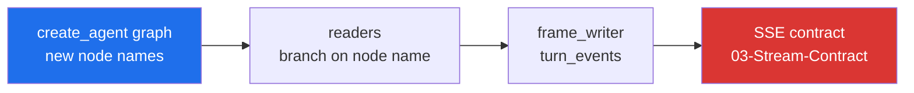

# 13 — Hand-built graphs cannot mount LangChain middleware

Created 2026-09-16 after reading the LangChain middleware documentation · **not started · decision first, not a refactor yet** · large: all three graphs, both SSE readers, the human-review node

> [!abstract] What this is
> LangChain 1.x ships roughly twenty built-in middleware covering retries, fallbacks, call limits, PII, tool selection, context editing and summarization. Xarvis has hand-written versions of two of them and none of the other eighteen. It cannot mount any of them, because middleware is wired exclusively by `create_agent` and every Xarvis graph is built by hand. This document is the cost of changing that, written before anyone starts, because the cost falls mostly on the streaming layer that [[03-Stream-Contract]] just finished.

---

## Why it is not a drop-in

From `langchain/agents/factory.py`: `create_agent` collects the middleware list, turns each `before_agent`, `before_model`, `after_model` and `after_agent` hook into a graph node named `{middleware.name}.{hook_name}`, chains those nodes into the loop, and composes the `wrap_model_call` handlers around the model call. Middleware state schemas are merged into the agent state schema at build time.

**There is no public API to attach an `AgentMiddleware` to a `StateGraph` you built yourself.** The wiring is the factory, and the factory also owns the topology.

So adopting any middleware means adopting `create_agent`, and adopting `create_agent` means giving up the node names, the edges and the two custom nodes the current graphs are built from.

| Graph | Built in | Nodes |
|---|---|---|
| admin | `orchestration/admin/graph.py` | `chatbot`, `tools`, `human_review`, plus `route_after_tools` on two conditional edges |
| employee | `orchestration/employee/graph.py` | `chatbot`, `tools`, `access_denied` |
| onboarding | `orchestration/onboarding/graph.py` | ten nodes including four nested subgraphs — a workflow, not an agent loop |

Onboarding is out of scope on sight: `create_agent` builds a model-and-tools loop, and onboarding is a staged pipeline that happens to call a model in two of its stages.

---

## The dependency situation

`langchain` is not a Xarvis dependency. `pyproject.toml` declares `langchain-core>=1.6.2` and `langchain-google-genai>=4.4.0`; `import langchain` fails in the venv.

Adding it is, unusually, free:

| Package | `langchain` 1.4.0 requires | Xarvis has |
|---|---|---|
| `langchain-core` | `>=1.6.0,<2.0.0` | 1.6.2 |
| `langgraph` | `>=1.2.11,<1.3.0` | 1.2.11 |
| `pydantic` | `>=2.7.4,<3.0.0` | 2.12.5 |

So `uv add langchain` resolves without moving a single pinned version. The dependency is not the obstacle. The topology is.

---

## What the catalogue is actually worth here

| Middleware | Verdict for Xarvis |
|---|---|
| `ToolRetryMiddleware`, `ModelRetryMiddleware` | **new capability.** No retry exists anywhere today; a failed Gemini call is a dead turn |
| `ModelCallLimitMiddleware`, `ToolCallLimitMiddleware` | **new capability.** Today the only bound is `recursion_limit=20` in both readers, which limits laps rather than spend |
| `PIIMiddleware` | **new capability**, and directly relevant to the payload logging in [[09-Id-Token-Claims]] |
| `ContextEditingMiddleware`, `SummarizationMiddleware` | **new capability**, and the subject of [[12-Context-Management]], which does not wait for this document |
| `LLMToolSelectorMiddleware` | **worth measuring.** `ADMIN_TOOLS` is 19 tools and `EMPLOYEE_TOOLS` is 17, all bound on every call |
| dynamic system prompt | **solved, not a blocker.** `create_agent` takes a static `system_prompt`, but `@dynamic_prompt` or a `wrap_model_call` doing `request.override(system_message=...)` reproduces the per-actor persona, policy and time context the chatbot nodes assemble today |
| `ModelFallbackMiddleware` | **does not replace what Xarvis has.** See below |
| `HumanInTheLoopMiddleware` | **does not replace what Xarvis has.** See below |

---

## The two behaviours middleware cannot express

> [!warning] These are the reasons this is a design decision and not a mechanical port

**The admin fallback is not an exception handler.** `admin/nodes/chatbot.py` falls back when Gemini returns a response that is structurally fine and semantically empty — `is_invalid_gemini_response` at lines 21 to 45 checks for no tool calls and no non-blank text, across both the string and content-block shapes. It then injects a correction `HumanMessage` built from `state["user_message"]` and retries on a deliberately different model. `ModelFallbackMiddleware` falls back on a raised exception only; its source catches `Exception` around the handler and has no hook for the caller to judge a successful response. It also has no timeout, where Xarvis wraps both calls in `asyncio.wait_for` at 10 and 15 seconds.

**The human review is not a pre-execution approval.** `HumanInTheLoopMiddleware` runs in `after_model` and interrupts on the tool calls in an `AIMessage`, before the tools run, offering approve, edit, reject and respond. Xarvis interrupts **after** the tool has run, because the thing needing a human is an ambiguous result — `route_after_tools` inspects the trailing `ToolMessage`s for `disambiguation_required`, and `human_review` then rewrites that `ToolMessage` in place, reusing `source.id` so `add_messages` replaces the row rather than appending a contradiction. That is a different interrupt, at a different point, with a different payload contract that the frontend already renders.

Both would have to be kept as custom middleware or custom nodes. Neither is a saving.

---

## What breaks

The streaming layer reads the graph by node name. `streaming/readers/admin_reader.py` and `employee_reader.py` both iterate `graph.astream(..., stream_mode=["updates"])`, take `node_name, node_output = next(iter(item.items()))`, and branch on constants: `CHATBOT_NODE` and `TOOLS_NODE` in both, plus `ACCESS_DENIED_NODE` in the employee reader, with `__interrupt__` handled ahead of them in the admin reader.

`create_agent` emits its own node names, and middleware adds more of them, named `{middleware.name}.{hook}`. Every `updates` item the readers key off changes.

The SSE contract itself is a client-facing promise. It must survive this unchanged, which makes the readers the real work: they become a translation layer from a topology Xarvis no longer controls to frames whose shape is fixed.

---

## Open questions, to be answered before any code

| Question | Why it decides the shape |
|---|---|
| can `create_agent`'s graph still be driven by the existing `TurnContext` and checkpointer? | the signature accepts `context_schema` and `checkpointer` and returns a `CompiledStateGraph`, so this looks like yes — needs a scratchpad proof with a real `ToolRuntime[TurnContext]` tool before it is believed |
| what node names does the compiled agent actually emit under `stream_mode=["updates"]`? | this is the entire reader rewrite; it has to be observed, not guessed |
| does `access_denied` survive as a node, or become a `wrap_tool_call`? | it is a routing destination today and its message is shown to the user as an answer |
| can `route_after_tools` plus `human_review` be expressed as custom middleware? | if not, the admin graph stays hand-built and only the employee graph migrates |
| is `state["user_message"]`, which the admin fallback depends on, expressible in the merged agent state? | `create_agent` accepts a custom `state_schema`, so probably yes |

---

## What changes

**13.1** — **Spike, throwaway, in the scratchpad.** Build a `create_agent` with two real Xarvis tools, the real `TurnContext` as `context_schema`, and an `InMemorySaver`. Stream a tool-using turn and record the exact `updates` node names. Nothing in `src/` is touched. This answers the first two open questions and is the gate for everything after it.

**13.2** — **Decide the scope, and write it here.** Employee graph only, or employee and admin. Onboarding is excluded unless 13.1 says something surprising.

**13.3** — **Reader translation layer.** Rewrite the readers against the observed node names, with the `turn_events` vocabulary and the SSE frames unchanged. This is the largest single piece and it is where the risk lives.

**13.4** — **Port the two custom behaviours.** The semantic-emptiness fallback and the post-tool disambiguation interrupt, as custom middleware or as retained nodes, whichever 13.1 shows to be possible.

**13.5** — **Migrate the chosen graph**, with the dynamic system prompt as middleware and the tools unchanged — they are already plain `@tool` functions with `ToolRuntime[TurnContext]`, which is what [[08-Composition-And-Lifecycle]] delivered and the reason this is even discussable.

**13.6** — **Adopt the middleware that motivated all of this**, one at a time, each with its own harness run: retries, call limits, tool selection, and whatever [[12-Context-Management]] decided about context.

---

## How it gets verified

- **13.1:** no verification needed, it is a throwaway. Its output is the node-name list written into 13.2.
- **13.3 and 13.5:** the golden-master harness in `scratchpad/verify` is the whole argument. The SSE frames for every scenario must be byte-identical apart from a listed set of intended differences. A migration that cannot produce a clean diff has not been done.
- **13.4:** the disambiguation scenarios specifically, including two ambiguous names in one turn, which is the case the current `human_review` was built around.
- **13.6:** one harness run per middleware added, so a behaviour change is attributed to the middleware that caused it.

---

## Definition of done

- [ ] 13.1 spike run, with the emitted node names recorded in this document
- [ ] scope decided and written here, with onboarding explicitly excluded and why
- [ ] readers rewritten, SSE contract unchanged, harness clean apart from listed differences
- [ ] semantic-emptiness fallback and post-tool disambiguation both working, or the migration abandoned with the reason recorded
- [ ] chosen graph running on `create_agent`
- [ ] each adopted middleware listed here with the harness result that accepted it

---

## What it is worth

Eighteen capabilities Xarvis does not have, against a rewrite of the layer that was finished two weeks ago. That trade is worth taking deliberately and not under pressure — which is the whole reason [[12-Context-Management]] was split out of this document rather than left waiting on it. The context problem is a hard failure against a service limit and is fixable inside the graphs that exist today. Everything in this document is an improvement, and improvements wait for spikes.
