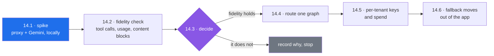

# 14 — A LiteLLM gateway in front of the model calls

Created 2026-09-16 · **not started · deliberately LAST** · large: a new service, a database, and every model call in the app

> [!abstract] What this is
> Today every model call in Xarvis constructs `ChatGoogleGenerativeAI` directly, six times, in one file. A gateway puts one addressable thing between the app and the providers, and that thing is where fallback, retries, per-tenant budgets, spend tracking and rate limits live — instead of being six more features to hand-write. LiteLLM is the self-hosted version of that idea. This document exists so the decision is recorded now and acted on later, because the ordering matters more than the technology.

---

## Why it is last, and not negotiable about it

A gateway in front of a system that is still being refactored moves the mess rather than fixing it, and it does so behind a network hop that makes every remaining bug harder to read.

| Must land first | Why |
|---|---|
| [[12-Context-Management]] | a gateway does nothing about a checkpoint growing toward a hard 400 KB write failure. That is the live defect |
| [[13-Agent-Middleware]] | decides whether fallback stays in the app at all. Building app-side fallback and then moving it to a proxy is the same work twice |
| [[10-Xarvis-Build-Plan]] item 3, the guard and authorization tests | there is nothing to catch a regression when model calls start crossing a proxy |

Plus the honest one: the learning curve here is real. Proxy config, a Postgres schema you did not design, virtual keys, budget semantics, spend attribution, and a second deployable in whatever runs Xarvis. That is worth paying for the leverage, and worth paying when nothing else is on fire.

---

## What it actually is

A proxy speaking an OpenAI-compatible API in front of many providers. To run it with the features that make it worth running:

- a `config.yaml` naming the models
- `DATABASE_URL` pointing at Postgres — **required** for virtual keys and budgets, not optional
- `LITELLM_MASTER_KEY`, which must start with `sk-`

| In the open-source tier | Behind the enterprise licence |
|---|---|
| virtual keys, per-key and per-team budgets, spend tracking, rate limits, model aliases, fallback chains, budget fallbacks, caching, OTel and Langfuse and LangSmith export | SSO and SAML beyond five users, org and team RBAC, SCIM, audit logs, enterprise guardrails, scheduled key rotation |

Everything this document wants is in the free tier. Enterprise starts around $250 a month and is the CISO feature set, not the engineering one.

---

## What it would replace in Xarvis

| Hand-written today | Where | Gateway version |
|---|---|---|
| admin fallback to a second model | `admin/nodes/chatbot.py`, the whole lower half | a fallback chain in `config.yaml` |
| the deliberately-different fallback model rule | `llm/llm_factory.py:16-20`, a `RuntimeError` at import | routing config |
| no retries at all | nowhere | proxy-side retries |
| no spend measurement | nowhere | spend logs per key, per tenant, per model |
| no quota or budget | nowhere | per-key budgets with budget fallbacks |
| no rate limiting | nowhere | RPM and TPM per key |

That last block is most of [[10-Xarvis-Build-Plan]] item 5, estimated at 50 to 70 hours, which the gateway largely donates as configuration. **That overlap is the actual argument for doing this at all** — not the multi-provider story, which Xarvis does not need while it is Gemini-only.

---

## The open questions, none of which are answered yet

> [!warning] These are the reasons this is a spike before it is a plan

| Question | What is known |
|---|---|
| how does LangChain talk to the proxy? | LiteLLM's own documentation says `ChatOpenAI` with `openai_api_base` pointed at the proxy. LangChain 1.x now discourages exactly that pattern, pointing at provider packages like `langchain-openrouter` and the first-party `langchain-litellm` instead. These two pieces of advice disagree and the disagreement has to be resolved by testing, not by reading |
| does Gemini survive the round trip intact? | LiteLLM preserves token accounting including cached and image tokens, and extracts Gemini thought signatures — but stores them in `provider_specific_fields` rather than standard message fields, explicitly flagged as needing handling in custom integrations. Xarvis reads `message.text`, `message.tool_calls` and `message.usage_metadata` in both readers, and `is_invalid_gemini_response` inspects the content-block list shape directly. Every one of those is a place the shape can change |
| does tool calling survive streaming? | there was a real bug where `bind_tools().astream()` misrouted — but it was Bedrock-specific and is **closed**, fixed by PR #64. Not a blocker, and worth re-checking against whatever version is current at the time |
| what does the extra hop cost? | unknown. The admin path already runs a 10 second primary timeout and a 15 second fallback |
| where does it run, and who starts it? | a second deployable plus Postgres, against a lifespan that [[11-Startup-Lifecycle]] just finished making clean |
| how does per-tenant attribution work? | a virtual key per tenant, or tags. Requires tenant identity to reach the proxy, which means threading it through the model call |

---

## What changes

**14.1** — **Spike locally, in the scratchpad.** Docker LiteLLM plus Postgres, one Gemini model in `config.yaml`, one virtual key. No Xarvis code involved. The output is a working proxy and a feel for the configuration surface.

**14.2** — **Fidelity check, and this is the gate.** Call the proxy from LangChain with a real Xarvis tool bound, streaming, and compare against a direct `ChatGoogleGenerativeAI` call on: `message.tool_calls`, `message.usage_metadata` (both counts populated), `message.text` on a Gemini content-block response, and what `is_invalid_gemini_response` would decide about each. Also settle the client question from the table above by trying both. Anything that differs is written down here before anything proceeds.

**14.3** — **Decide, and record the decision here.** If fidelity holds, continue. If the readers would need rewriting to accommodate the proxy, that cost joins [[13-Agent-Middleware]]'s and the two get sequenced together or the whole thing is dropped with the reason recorded.

**14.4** — **Route one graph through it**, employee first, because it has no fallback logic and no human review to complicate the comparison. The golden-master harness is the test.

**14.5** — **Per-tenant virtual keys and spend tracking.** This is the step that produces the numbers, and the numbers are the point.

**14.6** — **Move fallback out of the app**, if and only if [[13-Agent-Middleware]] has not already resolved where it lives. The semantic-emptiness check stays in the app regardless — a proxy cannot judge that a structurally valid Gemini response is empty.

---

## What it is worth, stated honestly

**As learning:** gateway patterns, budget and quota semantics, spend attribution, and the operational reality of a second service with its own database. All of it transfers, and none of it is Xarvis-specific.

**As a resume claim:** the defensible line is a self-hosted LLM gateway with per-tenant virtual keys, budgets and spend attribution, with the numbers to back it. That survives probing because the spend logs exist. What it does **not** earn is any claim about multi-provider resilience — Xarvis would still be Gemini-only, with a Gemini fallback, and saying otherwise writes the interviewer's next three questions.

**As engineering:** most of item 5 for configuration instead of code, at the cost of one more thing to run. That trade is good, and it is still good in three months, which is exactly why it can wait.

---

## Definition of done

- [ ] 14.1 spike run locally, configuration surface understood
- [ ] 14.2 fidelity results written into this document, per field, with the LangChain client question settled
- [ ] 14.3 decision recorded: proceed, sequence with [[13-Agent-Middleware]], or drop with the reason
- [ ] employee graph running through the proxy with a clean harness diff
- [ ] per-tenant virtual keys issued and spend visible per tenant
- [ ] fallback's final home decided and documented
- [ ] [[10-Xarvis-Build-Plan]] item 5 updated to say which parts this absorbed and which remain
