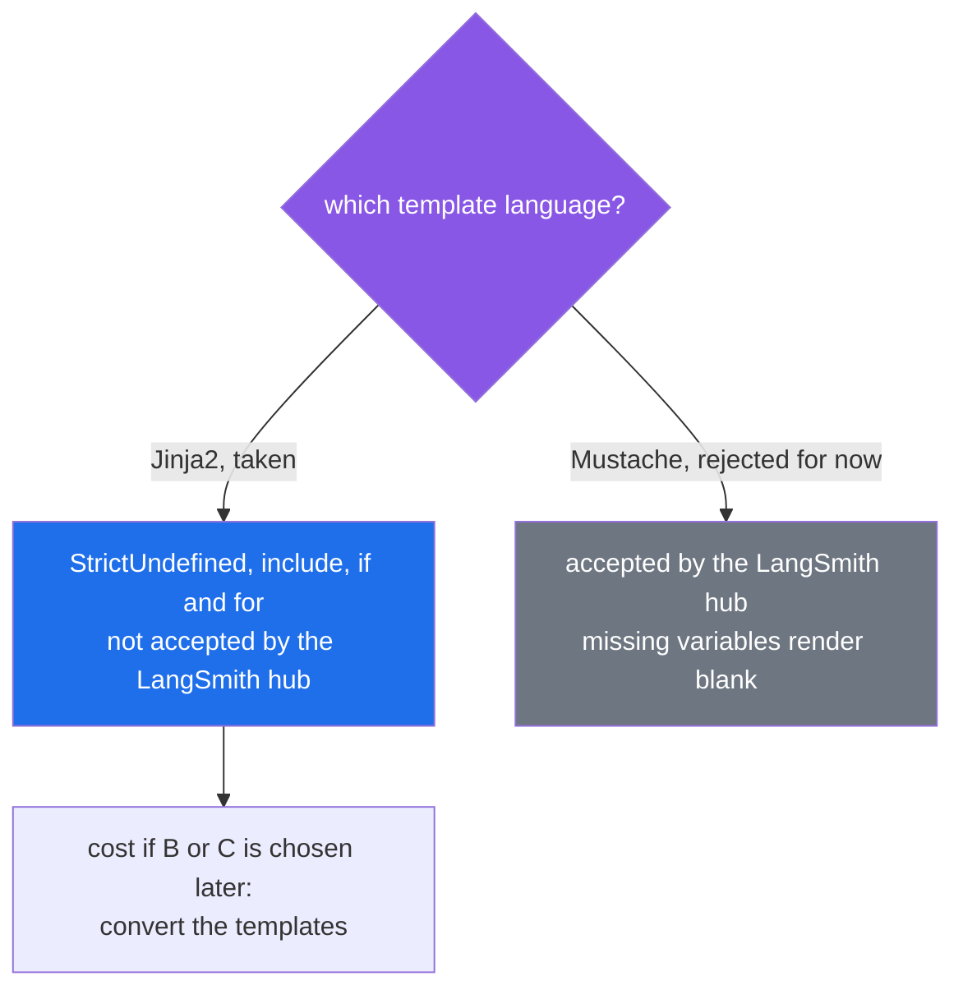
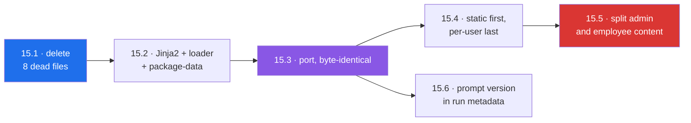

# 15 — Prompts are Python strings, concatenated by hand

Created 2026-09-16 · **15.1 to 15.3 done 2026-09-16, 15.4 to 15.6 open · runtime prompt management deliberately deferred** · medium: `src/xarvis/prompts/`, the canonicalization prompts, the five nodes that assemble prompts, `pyproject.toml`

> [!abstract] What this is
> Every prompt in Xarvis is a Python string, filled in one of four different ways, and the two chat agents are told the same thing despite living in separate files. This document moves the live prompts into Jinja2 template files inside the package, deletes the dead ones, and gives each run a prompt version. It does **not** make prompts editable without a redeploy. That is a separate decision, recorded at the bottom and deferred until evals exist.

---

## What the code does today

Twenty prompt files, read 2026-09-16. Twelve have callers.

| Live file | Used by | How it is filled |
|---|---|---|
| `prompts/admin/persona.py` | `admin/nodes/chatbot.py` | f-string function over `actor` |
| `prompts/admin/system_prompt.py` | `admin/nodes/chatbot.py` | constant |
| `prompts/admin/ask_human_policy.py` | `admin/nodes/chatbot.py` | constant |
| `prompts/employee/persona.py` | `employee/nodes/chatbot.py` | f-string function over `actor` |
| `prompts/employee/system_prompt.py` | `employee/nodes/chatbot.py` | constant |
| `prompts/common/current_time_context.py` | both chatbot nodes | f-string function over `datetime.now` |
| `prompts/onboarding/conversation/conversation_system_prompt.py` | `conversation_node.py` | function returning a constant |
| `prompts/onboarding/intent_parser/intent_parser_system_prompt.py` | `intent_parser_node.py` | f-string with `json.dumps` inside |
| `prompts/onboarding/workflow_template/workflow_generation_system_prompt.py` | `workflow_generation_node.py` | f-string plus a helper that picks a paragraph |
| `prompts/onboarding/workflow_template/workflow_edit_system_prompt.py` | `workflow_modification_node.py` | f-string with `{{ }}` escaping |
| `services/canonicalization/prompts/department_prompt.py` | `department_canonicalizer.py` | `str.format` |
| `services/canonicalization/prompts/designation_prompt.py` | `designation_canonicalizer.py` | `str.format` with `{{ }}` escaping |

The chat nodes then glue the pieces together by hand. `admin/nodes/chatbot.py:55-63`:

```python
base_system_prompt = (
        admin_persona
        + "\n"
        + ADMIN_SYSTEM_PROMPT_CONTENT
        + "\n"
        + ASK_HUMAN_POLICY
        + "\n"
        + build_time_context()
)
```

And two prompts are not in `prompts/` at all: the correction message written inline at `admin/nodes/chatbot.py:91-97`, and the user turn built inline at `workflow_generation_node.py:74`.

---

## The six problems

| # | Problem | Evidence |
|---|---|---|
| 1 | **The admin and employee system prompts are the same prompt.** The split happened to the files, not to the content | `diff` of the two files differs only in the header comment and the variable name. The employee agent is told it offers Team Insights and is given rules for presenting other employees |
| 2 | **Contradictions are resolved by stacking, not editing.** The shared prompt tells the model to ask clarifying questions in prose in five places, and `ask_human_policy.py` is appended after it under a heading saying it overrides everything above | the file's own comment says the block only wins by coming last. Its comment also still cites `audience="admin"`, which the `@tool` conversion deleted |
| 3 | **Eight of the twenty files are dead.** Old versions are kept as sibling copies because nothing else versions a prompt | zero importers anywhere in `src/`, `scripts/` or `tests/`: `system_prompt.py`, `system_prompt_older.py`, `system_prompt_oldest.py`, `employee_system_prmmpt.py`, `reference_prompt.py`, `tool_usage_prompt.py`, `disambiguation_prompt.py`, `onboarding/workflow_template/workflow_template_system_prompt.py` |
| 4 | **Four filling mechanisms, and logic living inside prompts.** Constants plus `+`, f-string functions, `str.format`, inline f-strings in nodes | `intent_parser_system_prompt.py:30` hardcodes the default workflow `["google", "jira"]`. `_format_recommended_apps` decides which paragraph the model sees. The two privacy rules are copied into both persona files |
| 5 | **No run records which prompt produced it.** A behaviour change cannot be attributed to a prompt change | no prompt version, name or hash in any run metadata or tag. With only about fourteen days of traces on the LangSmith free tier, the window to correlate by deploy date is short too. This blocks [[10-Xarvis-Build-Plan]] item 7 |
| 6 | **Per-user text sits at the front.** The persona, carrying the user's name and employee ID, is the first thing in the system prompt, so no two users share a prefix | Google's caching guidance says to put large and common content at the beginning. Harmless today: the assembled admin system prompt is about 1,800 tokens, and Gemini 3.6 Flash implicit caching starts at 4,096 |

---

## The premise that did not survive: a folder outside `src/`

This task was first framed as moving prompts to a top-level `prompts/` folder so that editing a prompt would not need a code change or a redeploy. The folder's location cannot deliver that.

`Dockerfile`, read 2026-09-16:

```dockerfile
COPY src/ src/
RUN uv sync --locked --no-dev --no-editable

COPY . .
```

`COPY . .` puts a top-level `prompts/` into the image exactly as it puts `src/` there. Changing a template still means a new image and a deploy. Only moving where the running process **reads** prompts from, at runtime, breaks that coupling, and that is the deferred decision at the end of this document.

> [!warning] And a top-level folder is harder to find, not easier
> `uv sync --no-editable` installs Xarvis into `.venv` as a regular package, and `python -m xarvis` runs from `/app` where there is no `xarvis/` directory, so the code executes from `site-packages`. A path relative to `__file__` therefore points into `site-packages` and never reaches `/app/prompts`. A top-level folder would need its location passed in as a setting, and that setting would differ between a laptop and the image.

So the templates go inside the package, at `src/xarvis/prompts/`, where the loader finds them the same way everywhere. That brings its own trap, measured below.

---

## What was measured rather than assumed

| Question | Answer | How |
|---|---|---|
| does the current setuptools config ship `.j2` files? | **no, silently.** The wheel contained the Python files and dropped the templates, and the build reported success | built a wheel in the scratchpad with Xarvis's exact `[build-system]`, `package-dir` and `packages.find` settings, then listed its contents |
| what makes them ship, including nested folders? | `[tool.setuptools.package-data]` with `"xarvis" = ["prompts/**/*.j2"]`. Both `admin/system.j2` and `common/privacy.j2` appeared in the wheel | same toy package, rebuilt |
| does Jinja2 load them from an installed, non-editable package? | yes, with `PackageLoader("xarvis", "prompts")`, including `` across folders | installed the toy wheel into an isolated environment with `jinja2` 3.1.6 and rendered |
| does a missing variable fail loudly? | yes, with `undefined=StrictUndefined` it raises `UndefinedError: 'name' is undefined` instead of rendering blank | same run |
| is Jinja2 already a dependency? | no, `uv.lock` has no `jinja2` entry | grep |
| is there a `MANIFEST.in` or `setuptools-scm` that would include data files anyway? | neither exists | `ls` and grep of `pyproject.toml` |

The first row is the load-bearing one. Without `package-data`, the image builds, the app boots, and the first chat turn raises `TemplateNotFound`.

---

## The template language fork



| | Jinja2 | Mustache |
|---|---|---|
| a variable that was not passed | raises, with `StrictUndefined` | renders as nothing |
| shared blocks, like the privacy rules | `` | partials |
| conditionals and loops | full | minimal, so the logic moves back into Python |
| LangSmith prompt hub | **not supported**, the hub takes f-string and Mustache only | supported |

**Jinja2 is taken** because a prompt that silently loses a variable is precisely the failure nothing in Xarvis would catch today, and the hub is a deferred decision. The conversion cost is small: only two templates carry real logic.

**Use `jinja2.Environment` directly, not `PromptTemplate(template_format="jinja2")`.** Xarvis does not use LangChain prompt templates anywhere, and LangChain renders Jinja2 in a restricted sandbox that forbids all attribute access, which has broken ordinary templates such as ones using `loop.index0` (langchain issue #34052).

> [!note] Security, stated precisely
> LangChain's warning is never to render Jinja2 templates from untrusted sources, because template syntax can reach Python objects. Here every template is a file in the repository, reviewed like code. The untrusted part is the data, such as raw HRMS department names in the canonicalizers, and Jinja2 inserts a variable's value as text without evaluating it. `autoescape=False` is correct because the output is a prompt, not HTML.

---

## What changes



**15.1** — **Delete the eight dead files.** Independent of everything else and safe to do first. The prompt history they represent is already in git.

**15.2** — **Add the machinery, render nothing yet.** `uv add jinja2`, the `package-data` entry, and one small module holding a single `Environment(loader=PackageLoader("xarvis", "prompts"), undefined=StrictUndefined, autoescape=False, trim_blocks=True, lstrip_blocks=True)`. As built, `trim_blocks` and `lstrip_blocks` let block tags sit on their own lines without emitting newlines, and the default trailing-newline stripping lets every template file end with a normal newline. Load every template once at startup, inside the lifespan that [[11-Startup-Lifecycle]] made clean, so a template missing from the image fails the boot rather than a user's turn.

**15.3** — **Port every live prompt, with the rendered text byte-identical to today.** This step changes where prompts live and nothing the model reads.

- each of the twelve live prompts becomes a `.j2` file, and the two inline prompts in `admin/nodes/chatbot.py` and `workflow_generation_node.py` join them
- the privacy rules become one shared include used by both personas
- computation stays in Python and arrives as variables: the date arithmetic in `build_time_context`, the default workflow list, and the allowed actions. `_format_recommended_apps` becomes an `` and a `` inside its template
- the `{{ }}` escaping in `workflow_edit_system_prompt.py` and `designation_prompt.py` goes back to plain braces, because a single `{` is literal in Jinja2. Any JSON example that contains `{{` or `{%` goes inside ``
- the whitespace between glued pieces, the `"\n"` in the concatenation above, has to be reproduced exactly, which is why this step is verified by comparing strings and not by eye

**15.4** — **Reorder: static content first, per-user content last.** The persona moves after the policy text. This is the first step that changes what the model reads, so it is its own step with its own harness run. The caching gain is latent until the prefix passes 4,096 tokens, but the order is wrong regardless and costs nothing to fix while the files are open.

**15.5** — **Make the two agents' prompts actually different.** A content decision, made together, not a mechanical edit: which rules are admin-only (other employees, name resolution, `ask_human`), which are employee-only, and which are shared includes. The five prose clarifying-question instructions come out of the admin prompt, and the override block stops needing to override anything. Each change is a separate harness run, so a behaviour change is attributed to the edit that caused it.

**15.6** — **Record the prompt version on every run.** Hash each template's source at load time and put template name plus a short hash into the `metadata` of the `RunnableConfig` both readers already build. Every LangSmith trace then says which prompt produced it. Can land any time after 15.3, and it is the step that makes this work useful to [[10-Xarvis-Build-Plan]] item 7.

---

## Sequencing with the other TODOs

| TODO | Overlap |
|---|---|
| [[12-Context-Management]] | 12.5 moves system-prompt injection out of `build_llm_window_clean`, at the same three call sites 15.3 rewrites. Whichever lands second rebases onto the first |
| [[13-Agent-Middleware]] | a `@dynamic_prompt` middleware would render these same templates. Nothing here depends on it, and templates make that port smaller |
| [[14-LiteLLM-Gateway]] | none. A gateway changes where the model call goes, not what it says |

---

## How it gets verified

Testing is deferred per the standing decision, so verification is scratchpad runs, the golden-master harness in `scratchpad/verify`, and production observation.

- **15.1:** harness diffs clean, byte for byte.
- **15.2:** build the actual wheel, or the image, and list the templates inside it. A successful build proves nothing, as measured above.
- **15.3:** a scratchpad script renders every template for fixed inputs, with a fixed date for the time context, and compares against the old Python functions for the same inputs. Every pair must be equal as strings. Then the harness diffs clean.
- **15.4 and each 15.5 change:** one harness run each, with the differences read and accepted, not just counted.
- **15.6:** a trace in LangSmith showing the template names and hashes in its metadata.

---

## Deferred: prompts editable without a redeploy

> [!info] Recorded now, decided later
> Explicitly deferred on 2026-09-16. Revisit once [[10-Xarvis-Build-Plan]] item 7 has an eval suite that can gate a prompt change.

| Option | How it works | What is known |
|---|---|---|
| **B · runtime registry** | the app fetches a prompt by name and label on each use, and a UI promotes versions | LangSmith: `client.pull_prompt("name:production")`, tags are movable pointers to commits, Staging and Production environments, a webhook fires on every commit. Its SDK cannot set a commit tag programmatically when pushing (langsmith-sdk issue #2126). Langfuse: labels, a client-side cache that serves the stale copy while refreshing in the background, and a `fallback=` for a cold start during an outage |
| **C · hybrid** | git stays the source of truth, CI pushes to the registry on merge, the runtime pulls by label with the bundled file as fallback | keeps review and the deploy trail while removing the redeploy. Needs the CI step and, for LangSmith, the Mustache conversion |

Why not now: a registry puts a vendor on the path of every model call, and a prompt edit made in a UI skips code review. Without evals to gate that edit and without 15.6 to trace it, B would let an untested prompt reach production with no record of what changed. A, this document, is also the prerequisite for both: prompts have to exist as standalone template files before a registry can hold them.

---

## Definition of done

- [x] eight dead prompt files deleted
- [x] `jinja2` added, `package-data` in place, templates confirmed present inside a built wheel and loaded from it
- [x] all templates loaded at startup by `load_prompts()` in `bootstrap_app`
- [x] every live prompt, including the two inline ones, rendered from a `.j2` file, byte-identical to the old output for fixed inputs: 39 of 39 cases, driven through the real nodes with capturing fake models, and the comparison shown to catch a single removed trailing space
- [ ] harness run against the change
- [ ] no prompt text or prompt concatenation left in node code
- [ ] static content ordered before per-user content, harness differences accepted
- [ ] admin and employee prompts differing in content, with the override block gone and each change's harness run recorded here
- [ ] template names and hashes visible in LangSmith run metadata
- [ ] B or C decided and written here, or left deferred with the reason

---

## What it is worth

The mechanical part, 15.1 to 15.3, is a few hours and changes nothing the model reads. Its value is that every later prompt change becomes a reviewable diff of a text file instead of an edit inside a Python string. The real payoff is 15.5 and 15.6. The employee agent has been running on admin instructions, and so far nobody could say which prompt produced which answer. The first is a behaviour bug hiding in plain sight. The second is the thing evals will need on day one.
