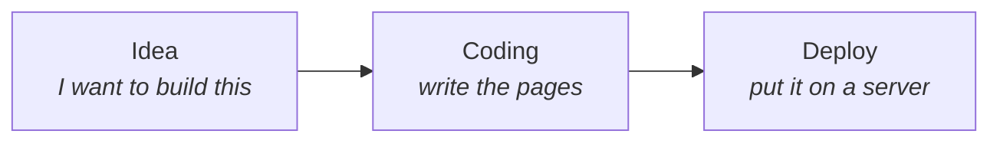
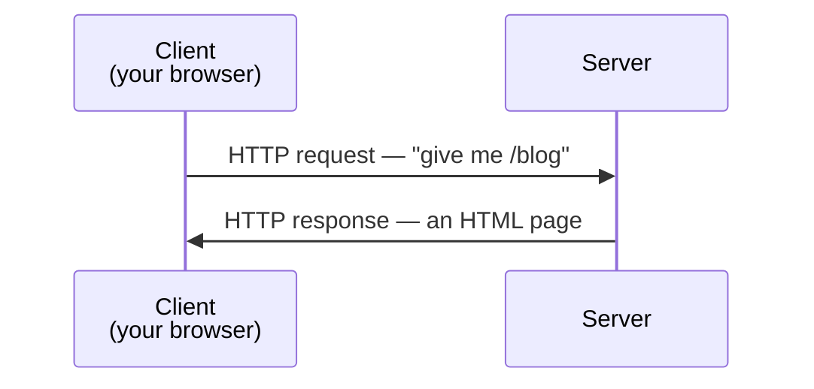
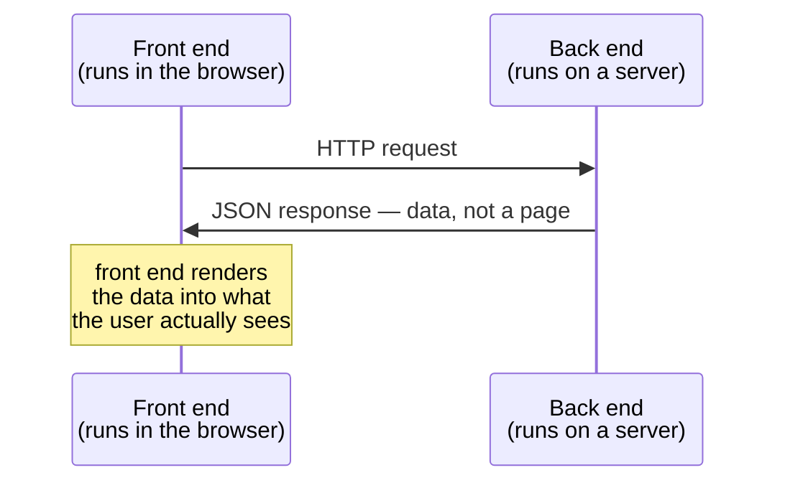
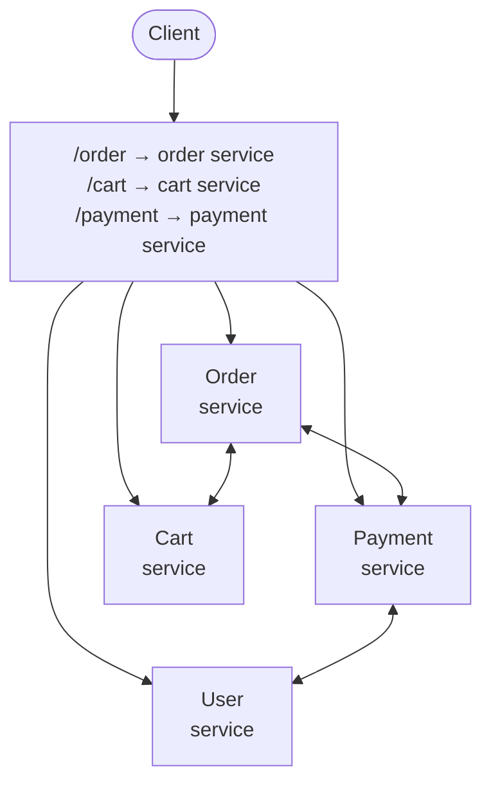

There was a time when nobody had heard of a DevOps engineer. Not because the title was unfashionable — because the job did not exist. There was no work for such a person to do.

Understanding why that changed is the whole foundation of this subject. So start where the industry started.

---

## One person, three stages

Early websites were simple enough that a single person built and shipped them. That person was usually called a **coder** — "developer" was itself a newish word — and the entire life of a website fit into three stages:

That was the pipeline. Idea, code, deploy, done.

**Deploy** here means something very literal: take the files you wrote and place them on a server — a machine that stays switched on and answers requests from the internet — so that anyone in the world can reach them.

And crucially, this happened *rarely*. There was no expectation of shipping every day. You might change something once a month, or once in two months, code it, push it out, and go back to leaving it alone. The system barely moved.

## What a website was made of

The reason one person could handle all three stages is that there was very little to handle.

A site of that era served **static content** — pages that are the same for everyone who visits. Plain HTML, some CSS for styling, maybe a little JavaScript. Nothing more.

> **Static** is the load-bearing word. It means the page does not change per visitor and is not assembled fresh on each request. The file that sits on the server is exactly the file you receive.

There was no sign-up, so no **authentication** — no checking of who you are. There was no database behind the page, so no content being fetched and assembled per visitor. And there was no security work to speak of, for the blunt reason that there was nothing worth securing.

The interaction was as simple as the content:

Think of an old personal blog. Someone writes their text inside an HTML file, puts that file on a server, and from then on every visitor who asks for that page receives the same file back and reads it. That is the entire machine.

---

## Then the back end arrived

Websites stopped being documents and started being *programs*. The code split into two halves that live in completely different places, and this split confuses people for years if nobody points it out.

The **front end** is HTML, CSS and JavaScript. It is delivered to the visitor and runs **inside their browser**, on their own machine.

The **back end** is written in something like Java (often with the Spring Boot framework), Node.js, or Python. It does *not* run in the browser. It runs on a server elsewhere, and the visitor never sees its code.

Once that split exists, the conversation changes shape. The server usually stops sending finished pages and starts sending raw data instead:

Older systems sent **XML** for this; today it is almost always **JSON** — both are just text formats for structured data, JSON being the lighter and more readable of the two.

> [!important] **"Client" does not mean "the human".** In this diagram the client is the **front end** — it is the thing making the request. The person sitting at the screen is the *user*. Mixing these up makes every architecture discussion harder than it needs to be, and it is the single most common confusion when this split is first taught.

---

## What a modern application looks like

Now take any site you actually use — Netflix, Amazon, X, Instagram. None of them is a website in the earlier sense. Each is a full application, an architecture, a network of moving parts.

Four things in particular arrived and never left:

| What changed | What it means |
|---|---|
| **Authentication and authorization** | Confirming a user is who they claim to be, and then deciding what that user is allowed to do. Now a core part of the system rather than an afterthought |
| **Data intensity** | Data becomes the centre of gravity. The application exists largely to store, fetch, combine and serve it |
| **Many servers, not one** | The application no longer lives on a single machine |
| **Microservices** | The application itself gets broken into many small independent programs |

---

## Monolith, and why it stopped scaling

Originally, all of an application's code lived in one place. One repository, one enormous service, everything in a single codebase.

That shape has a name: **monolithic architecture**.

If you were building Amazon this way, ordering, payments, the shopping cart and user accounts would all be code in one project, deployed as one unit.

It works — and for small systems it is genuinely the right answer. But look at what it costs once the system is large. Changing one line in the payment logic means rebuilding and redeploying *the entire application*, including the ninety-nine percent of it you did not touch. Every deployment carries the risk of the whole system, no matter how small the change.

## Microservices

So the application gets cut into small independent services, each owning one job:

An **order service** that only handles orders. A **payment service** whose only job is taking money from the user. A **cart service**, a **user service**, and as many more as the system needs.

They are still just code — the difference is that each piece is separate, deployed separately, and often running on its own server.

They talk to each other the same way a browser talks to a server: over a **protocol**, usually HTTP or HTTPS. Some systems use an **event-driven** style instead, where services announce that something happened rather than calling each other directly. Either way, the services stay independent of one another.

Two things people expect to be rules, and are not:

- **Services need not share a programming language.** One can be Java, another Python, another Node.js. Each service is free to use whatever suits it.
- **Each service can have its own repository**, its own deployment, its own server. Fully separate, if you want them that way.

**What you get:** work naturally divides across teams, and deployment gets cheap. Change the payment service and you deploy the payment service — nothing else moves.

> [!info] This is a deliberately shallow tour. Microservices is a large subject in its own right — how services stay consistent with each other, how they handle one another's failures, when the split is a mistake — and this course is not going to teach it. What matters here is the shape: **one big application, broken into small pieces that talk over a protocol.**

---

## The complication is the point

Everything above is the story of a system getting more capable and, in exact proportion, more complicated.

One person with three stages became many people, many services, many servers, many databases, many configurations, and something that has to be shipped continuously rather than every couple of months.

That is far more than one role can hold. So the industry split the work — and the way it split is where all the trouble starts.
