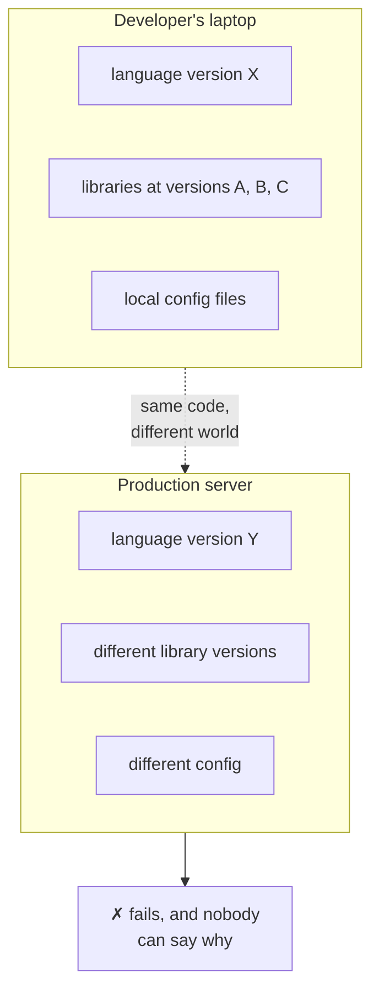
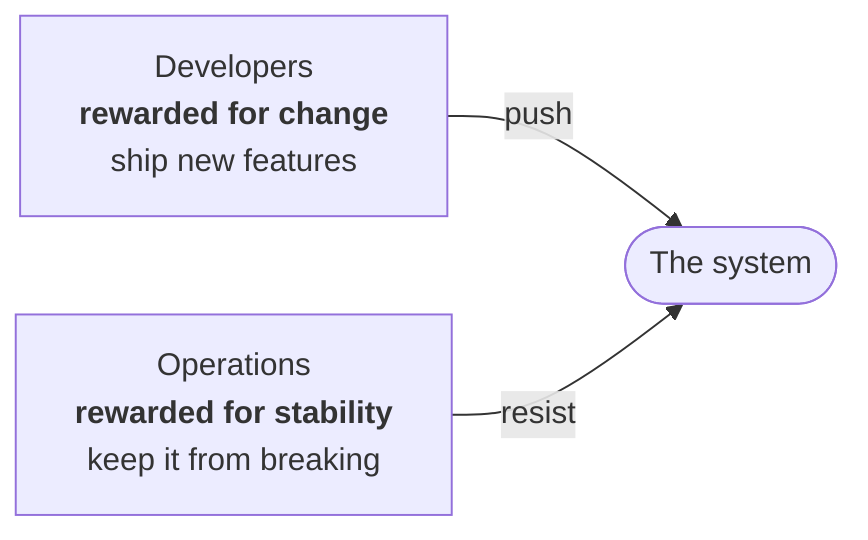
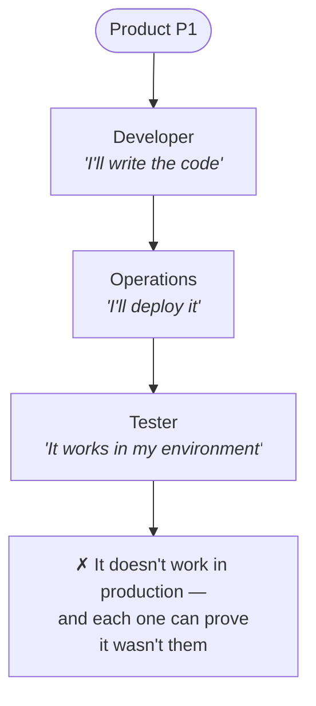

Once applications outgrew what one person could ship, the programming world divided into two camps. Understanding that division — and precisely why it turned hostile — is the reason the DevOps role was invented.

---

## Two worlds

**Developers** were the people who wrote code. Their work was defined by two things:

- **integrating new features** — building what the product did not do yesterday
- **fixing bugs** — patching what is broken in what already exists

If you have written code professionally, this is familiar ground. Given a bug in an application, you know roughly how to go and find it.

**Operations** were a separate department, and their job was everything that happens *after* the code is written:

| What operations owned | What that involves |
|---|---|
| **Deployment** | Getting the code onto servers and running |
| **Running many servers** | One server is a single point of failure — if it dies, the product dies. So the application is **replicated** across many machines, often around the world |
| **Databases** | Deploying and managing them, whether SQL, MongoDB or anything else, and finding the storage they need |
| **Configuration** | The settings a program needs in order to run correctly in a given environment |
| **Operating system work** | Creating files on a server, adjusting the machine itself, making the OS do what the application needs |

That replication point deserves its own name. When one application runs across many machines rather than one, you have a **distributed system**. The network of servers that serves content from wherever is closest to the user is often a **CDN** — a content delivery network.

So the split was clean:

> **The developer's job was to write the code. The operations engineer's job was to get that code to the user.**

> [!info] **Do operations people write code?** Largely, no — not in this older picture. They write some automation scripts, but the bulk of the job is deployment, not building features. This changes later, and that change is much of what DevOps is about.

---

## "It works on my machine"

Now the famous line. Almost anyone who has worked in a team has heard some version of it:

> *"The code I wrote runs fine on my machine. It doesn't run in production. That's not my fault."*

It is easy to hear this as an excuse. It is not — it is a straightforward description of a real technical situation, and it is worth understanding the mechanism rather than laughing at the sentence.

You built the application on your own laptop. You had a particular version of the language installed. You pulled in some external libraries at whatever versions you happened to get. You had configuration files set up a particular way, some of which you set up so long ago you have forgotten they exist.

Then you handed the code to operations, who ran it on a production server that has **a different set of all of those things**. Different library versions, different configuration, a different environment entirely.

Neither person is lying. The code genuinely ran in one place and genuinely failed in the other. What is missing is any guarantee that the two environments *match* — and nobody owns that guarantee, because it falls between the two roles.

---

## The contradiction nobody designed on purpose

Here is the part worth slowing down for, because it explains why this became a conflict between people rather than a technical annoyance.

Look at what each side is **rewarded** for.

A developer is rewarded for shipping new features. Features are changes. So a developer is, in effect, paid **to change the system** — and the more they change it, the better they are doing their job.

An operations engineer is rewarded for keeping production stable. No outages, no bugs reaching users, databases healthy, configuration correct. The most reliable way to keep a system stable is to **let as little change it as possible**. So an operations engineer is paid, in effect, **not to change the system**.

> [!important] **These two incentives point in opposite directions.** You are paying one group to move the system and the other group to hold it still. Nobody sat down and designed this conflict — it emerged from splitting the work by *task* rather than by *outcome*. But once it exists, every disagreement between the two teams has a structural cause underneath it, and no amount of goodwill between individuals resolves it.

---

## The silo working model

Push this a step further and you arrive at the failure mode this has a name for.

Imagine a company where every person is sealed inside their own bubble. Ask the developer what they do, and they say: *"I write code. That's my job. Nothing else."* Ask the operations engineer, and they say: *"I deploy code and keep servers up. I don't know anything else and I won't do anything else."* Ask the tester, and they say: *"It passes in my test environment. My work is finished."*

Nobody in that company is responsible for the product actually reaching users and working. Everyone is responsible for their own slice.

That is the **silo working model** — S-I-L-O, from the tall sealed towers that store grain, each one holding its contents completely separated from the next.

Hand such a company a product to build and watch what happens when it fails. The developer says the code runs locally, and they tested it. Operations says they deployed exactly what they were given. The tester says it passed in the testing environment. Every one of them is telling the truth about their own bubble, and the product is still broken.

> [!danger] **The silo model is a failure model, and it cannot be fixed by hiring.** This is the sharpest claim in the module: it does not matter how skilled the individuals are. Bring in the best developer available, the best operations engineer, the best tester — if each of them owns only their own slice, work still will not reach production on time. **The problem is the shape of the responsibility, not the quality of the people.**

A company in this state may well employ someone with "DevOps" in their job title. It will not have DevOps. The title will just be another silo, with someone sitting in it.

Which raises the obvious question — what is the alternative supposed to look like?
