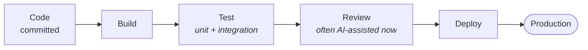
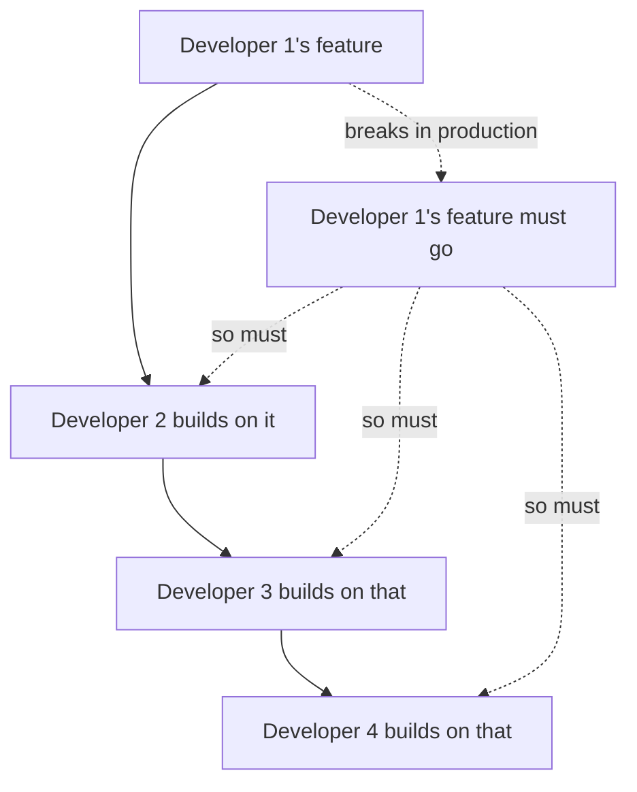

The word itself is the definition, and it is worth saying out loud because it gets forgotten:

**DevOps = developer + operations.**

That is the whole of it. The role exists so that the two groups from the previous note can work together instead of against each other — and so that the gap between "the code is written" and "the users have it" stops being a place where things fall.

---

## What the role actually does

A DevOps engineer builds the **pipeline** that carries code from a developer's machine to production, and the tools that make that journey automatic and reliable.

But the more interesting part is what that does to the two original roles. A working DevOps setup changes the job description on both sides:

| | Before | After |
|---|---|---|
| **Developer** | responsible for writing code, and that is where it ends | responsible for the code **and** for it getting deployed |
| **Operations** | knows how to take a developer's code and deploy it | writes automation tools, understands the CI/CD pipeline, understands how the whole integration works |

**CI/CD** is short for continuous integration and continuous deployment — the automated path that takes committed code, builds it, tests it and releases it. It gets covered properly later; for now it is enough to know that it is the machinery a DevOps engineer builds and maintains.

And the circle is wider than two roles. Security people, product managers, IT, QA engineers — a DevOps engineer's responsibility is helping *that whole group* keep working properly, and building the tools that let them.

> [!info] **The definition drifts between companies.** Plenty of organisations use "DevOps engineer" to mean someone who only does operations work and writes no code at all. Others expect full end-to-end ownership. Neither is wrong; the term is used loosely in the market, and it is worth asking what a specific company means by it rather than assuming.
>
> A related reality check: **nobody has permissions on everything.** There is no corporate role that can touch every system. A DevOps engineer will still depend on other teams for access, and that is normal rather than a failure of the model.

---

## Philosophy and role

Two different things travel under the same name, and separating them makes the subject much easier to hold.

**DevOps as a role** is a job — build automation tools, run CI/CD, keep integration and deployment continuous.

**DevOps as a philosophy** is a set of beliefs about how software should be built and shipped, which a company either lives by or does not. A company can hire a DevOps engineer and still not practise DevOps. That is exactly the silo failure from the previous note.

The philosophy rests on four ideas.

---

## 1 · Shared ownership

Developers, operations, security, product managers, IT, QA, testers — **all of them are responsible for carrying a piece of software from an idea to a working thing in front of users.** Not each responsible for their own slice. Responsible for the outcome.

The phrase for this is **end-to-end responsibility**.

> [!important] This is not a moral preference — it is the direct fix for the silo model. In a silo, every person can be doing their job correctly while the product fails. Shared ownership removes the gaps by refusing to let anyone's responsibility end before the user has the thing.

There is a live trend worth noticing here. As AI takes over more of the raw code-writing, the separation between "developer" and "DevOps" keeps shrinking, because responsibility increasingly lands end-to-end on one person: they write the code — much of it with AI assistance — prepare the pieces, write the documentation, and see it through to deployment.

The practical consequence for anyone reading this as a developer: **"that's a separate role, not my job" is no longer an available answer.** Knowing this material is becoming part of the base expectation.

---

## 2 · Automation

Go back to how deployment worked before. A person manually packaged up a set of files, manually put that package on a server, manually started the server, and the application ran. Somewhere in there they might have run tests by hand — unit tests, integration tests.

Every one of those steps is repeatable, mechanical, and done identically every time. Which makes every one of them a candidate for automation.

A DevOps engineer's job is to build the pipeline that does it instead:

Each stage runs automatically, in order, and the code only moves forward if the stage before it passed.

---

## 3 · Small and regular deployments

Deployments should be **small** and they should be **frequent**. Both words matter, and the reason is easiest to see by watching the opposite fail.

Some companies deploy nothing for thirty or forty days, and then push a month of accumulated work to the server all at once — the whole batch tipped in like emptying a bin.

Now count the ways that hurts.

Every bug in a month of work surfaces at the same moment, and you have no idea which change caused which failure. Worse, features get built on top of each other:

If developer 1's feature turns out to be broken, developers 2, 3 and 4 have to roll their work back too — because their features are built on the broken one. One failure takes four features with it.

Deploy small pieces instead and the picture inverts. Something breaks, you know what it was, and you pull back that one thing.

---

## 4 · Fast feedback

If a developer writes code that has a problem, they should find out **immediately** — ideally before it deploys, otherwise right after.

The failure mode is feedback that arrives two months later. By then the developer has forgotten what they changed and why, and has to reconstruct their own reasoning before they can fix anything. The work of fixing a bug grows the longer you wait to report it, and it grows fast.

---

## The two goals everything reduces to

You can compress the entire subject into two words, and this is the compression worth memorising:

> **Fast delivery. Reliable delivery.**

**Fast delivery** is what every company wants: I ask for a payment feature, and it is live in two or three days rather than two months.

**Reliable delivery** matters exactly as much, and is the half people forget. Shipping fast means nothing if twenty-five other things break on the way — including things that used to work fine.

DevOps is the claim that you can have both at once. Everything in the rest of this course — Jenkins, Grafana, Kubernetes, Docker, every tool and every practice — exists to make one or both of those two things true.

> [!tip] **Interview framing.** *"What is DevOps?"* has a good short answer built from this note: it is developers and operations both taking end-to-end responsibility, supported by automation and a culture that makes that possible, in order to achieve fast and reliable delivery. Naming the two goals is what separates an answer that sounds memorised from one that sounds understood.
