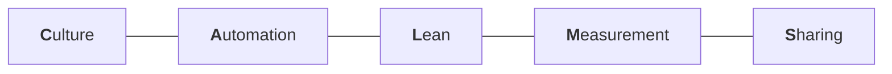

The previous note left a gap. If DevOps is a *philosophy* that a company either lives by or does not, how do you tell which? You cannot look at the job titles — a company can employ three DevOps engineers and still be a set of silos.

**CALMS** is the answer to that. It is a five-part checklist for judging whether an organisation genuinely practises DevOps.

---

## C · Culture

How do the people in this company actually work together?

Developers, testers, operations engineers — do they take responsibility for their work, or do they hand it over the wall and stop caring? When something goes wrong, can they talk to each other about it usefully?

A concrete test: a piece of Java code will not run in an environment. Can the people involved discuss which configurations might be causing it, across role boundaries? If a developer and an operations engineer can have that conversation productively, the culture is healthy. If the conversation is an argument about whose fault it is, it is not.

**Positive culture** here means something specific: the developers, operations and everyone else can share work out between them and communicate their way through problems.

## A · Automation

Does this company use automation tools at all?

Is the build pipeline automated, or does someone assemble it by hand each time? Is there a **CI/CD** pipeline — continuous integration and continuous deployment — so that committed code moves toward production without a human carrying it between stages?

## L · Lean

This is the one that surprises people, because **it is not a computer science idea at all.** It comes from manufacturing.

In that world, lean means:

> **Maximum value to the customer, minimum waste.**

Translating it into software: build a product where you can get new features to users as quickly as possible, and where those features carry as few defects as possible. Maximum value delivered; minimum waste created.

The clearest way to see waste is to watch the calendar on a single feature:

| Stage | Time taken |
|---|---|
| Developer writes the feature | **5 days** |
| QA tests it | 20 days |
| Operations deploys it | 20 days |
| **Total to reach the user** | **45 days** |

> [!important] **The five efficient days made no difference whatsoever.** The developer could have taken ten days, or two, and the user would have received the feature at almost exactly the same time. Forty of the forty-five days were spent not-building — and that is the waste lean is pointing at.
>
> This is why optimising the coding stage alone is such a common mistake. When the bottleneck is downstream, making the upstream faster changes nothing the user can see.

## M · Measurement

Suppose someone tells you a company has a good culture, uses automation tools, and is large and successful. Fine — but how would you *check*?

You need **quantifiable numbers**. Something you can point at to say: deployments here go well, bugs are rare, and when bugs do appear the fix reaches production quickly.

Without numbers, every claim about DevOps maturity is just an opinion. This requirement is what the next note is entirely about.

## S · Sharing

Work, knowledge and responsibility are shared rather than hoarded.

A developer knows what QA is responsible for. QA knows what operations is responsible for. Operations knows what the developers are dealing with. And when a configuration needs changing, that responsibility does not belong to exactly one person — the developer, QA and DevOps engineer can each carry it.

Sharing is what shared ownership looks like in daily practice: not just agreeing that everyone owns the outcome, but everyone actually knowing enough about the neighbouring roles to act on it.

---

> [!tip] **How to use this.** CALMS is most useful as a diagnostic rather than a definition. Walk a company through the five letters and the gaps are usually obvious — plenty of organisations score well on automation, because tools are easy to buy, and badly on culture and sharing, because those cannot be purchased. A company that is strong on A and M but weak on C and S is a company with good tooling and silos, which is the failure mode from note `02` wearing better equipment.
