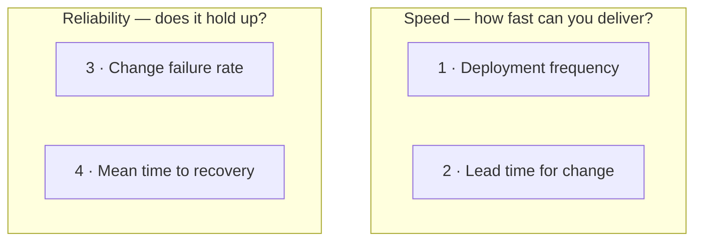
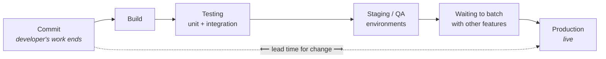
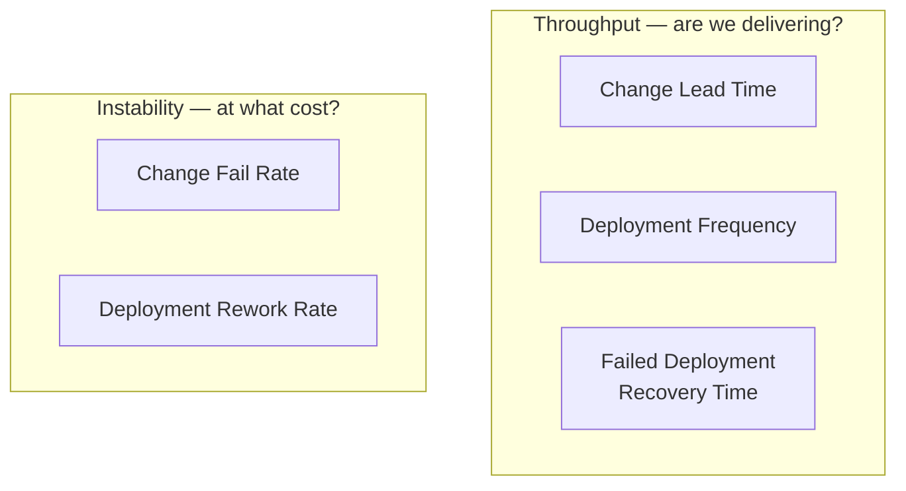

CALMS ends with **Measurement**, and leaves the question open: measure *what*, exactly?

**DORA metrics** are the answer. Four numbers that let you look at a company and say something factual about whether it practises DevOps, rather than something impressionistic.

> [!danger] DORA stands for  **DevOps Research and Assessment** — the name of the research group whose long-running study of engineering organisations produced these metrics. Worth having right, because this is the kind of thing an interviewer asks directly.

---

## What DORA is actually judging

Something important, and easy to miss:

> [!important] **DORA does not measure how skilled the engineers are.** A company can hire outstanding developers, an outstanding operations team and an outstanding DevOps engineer, and still score badly. If the numbers are bad, that company is drifting toward the silo model no matter who it employs.
>
> **The shape of the organisation dominates the talent inside it.** DORA measures the shape.

---

## Four questions

The whole framework is four questions you could ask any engineering organisation:

| # | Question | Metric |
|---|---|---|
| 1 | How frequently do you deploy? | **Deployment frequency** |
| 2 | How quickly does a change reach production? | **Lead time for change** |
| 3 | How frequently do failures occur in deployment? | **Change failure rate** |
| 4 | How quickly do you recover from those failures? | **Mean time to recovery** |

If a company can answer all four with real numbers, you can form a genuine view of how much DevOps philosophy it applies.

> [!info] **DORA's current model has five metrics, not four.** The four below are the classic set — what the class teaches, what most writing on the subject describes, and what an interviewer will usually mean. Learn them first. What changed, and why the changes are improvements, is at the end of this note.

And notice how they split:

Which is exactly **fast delivery and reliable delivery** from note `03`, made countable. The four metrics are not saying anything new — they are the two goals with numbers attached.

---

## 1 · Deployment frequency

How often does this company put code into production?

The answer might be several times a day, once a week, once a month, or every fourteen days on a fixed sprint cycle — different teams follow different models.

**More frequent is better.** Shipping one or two small things every day is a healthy sign: it means small changes, arriving continuously.

**What counts as a deployment?** The company defines it. A small patch counts. A bug fix counts. A major feature counts. The rough test is whether something meaningful shipped — a new feature, or a fix to an existing one.

**Calculating it** is simple averaging. A company shipped 40 deployments over the last 20 days:

$$\frac{40 \text{ deployments}}{20 \text{ days}} = 2 \text{ deployments per day}$$

> [!warning] **High frequency alone does not mean a good company.** A team could deploy fifty things a day and have every one of them be a changed paragraph or a fixed spelling mistake. That is a large number describing nothing.
>
> This is why there are four metrics and not one. Deployment frequency gives you a rough shape, and the other three stop you from being fooled by it.

## 2 · Lead time for change

How long does it take a change to travel from *finished code* to *live in production*?

The clock starts where the developer's job ends — the code is written and **committed** — and stops when it is serving users.

Everything in that middle stretch is time the developer is not in control of: the build, the test suites, running in one environment after another, and often simply waiting so that several features can go out together.

**Shorter is better.** If a feature took two days to write, you would like it live within a day or two of that — not four days later, and certainly not thirty.

> [!info] **Why so many environments?** Code usually runs in several places before production, and the count varies by company. Common ones are a **QA environment** for testing and a **staging environment** for a final check.
>
> Staging is often called **pre-prod**, and the name explains the idea: it looks exactly like production — same setup, same shape — but it is internal. Real users have not reached it. It is the last place a problem can be caught cheaply.

## 3 · Change failure rate

Of everything you deployed, how much of it broke?

$$\text{change failure rate} = \frac{\text{failed deployments}}{\text{total deployments}} \times 100$$

Deploy 50 things in a month and have 5 of them fail, and your change failure rate is 10%.

**Failed** means what you would expect: a feature that does not work, or a bug fix that did not fix the bug.

A small number of failures is normal and not worth panicking about — 5 out of 50 is survivable. What you are watching for is failure becoming the common case rather than the exception.

## 4 · Mean time to recovery

You now know how often things break. The remaining question is how long you stay broken.

Take a month with three failures, and time how long each took to resolve:

| Incident | Time to recover |
|---|---|
| Feature 1 | 20 minutes |
| Feature 2 | 40 minutes |
| Feature 3 | 90 minutes |
| **Total** | **150 minutes** |

$$\frac{150 \text{ minutes}}{3 \text{ incidents}} = 50 \text{ minutes}$$

So the mean time to recovery is **50 minutes**: on average, when something breaks in production, this company has it working again within roughly an hour.

> [!info] The lecture calls this *"mean recovery time"* or *"failure recovery time"*. The long-standing term is **Mean Time to Recovery (MTTR)**, sometimes written as "time to restore service". DORA has since replaced this metric with a more precise one — see below.

What "recovering" actually consists of turns out to be a genuine question with three different answers — which is the next note.

---

## The model has five metrics now

Everything above is the **four-metric model**, and it is what the class teaches, what most articles describe, and what an interviewer is most likely to be thinking of. Learn it first — it is not wrong, and it is still the common currency.

But DORA's own current guidance publishes **five** metrics, and the changes are worth knowing, because two of them fix real problems with the four.

| Category | Metric | Measures |
|---|---|---|
| **Throughput** | Change Lead Time | how quickly a committed change reaches production |
| **Throughput** | Deployment Frequency | how often changes are deployed to production |
| **Throughput** | Failed Deployment Recovery Time | how quickly the team recovers from a *failed deployment* |
| **Instability** | Change Fail Rate | how often deployments require immediate intervention |
| **Instability** | Deployment Rework Rate | how often unplanned deployments are needed because of production incidents |

Note that the split has been renamed as well. "Speed and reliability" from the lecture becomes **Throughput and Instability** — same idea, and the second name is the more honest one, because it says what a bad score means.

### What changed, and why each change is an improvement

**MTTR became Failed Deployment Recovery Time.**

The problem with MTTR is that nobody agrees what the letters stand for. Mean Time To **Repair**? **Recover**? **Restore**? **Resolve**? All four are in active use, they mean subtly different things, and two teams comparing their MTTR may be measuring two different quantities.

The replacement is deliberately narrow: **how long it takes to restore service after a deployment fails and needs immediate intervention.** No ambiguity about what event starts the clock.

**Deployment Rework Rate is entirely new**, and it measures something the original four could not see.

Change Fail Rate tells you what proportion of deployments *broke*. Rework Rate tells you what proportion of deployments *existed only to fix an earlier break* — emergency patches, corrective deploys, incident-driven configuration changes.

> [!important] **This is a measure of wasted capacity**, and it connects straight back to **Lean** in note `04`.
>
> A team deploying twenty times a week looks excellent on Deployment Frequency. If twelve of those deploys are repairs of the other eight, that team is not shipping fast — it is running to stay still. Deployment Frequency alone cannot tell you the difference; Rework Rate is what exposes it.

---

## How to use them, and how people misuse them

The metrics are designed to be read **together**. Each one alone is trivially gameable:

- Deploy fifty typo fixes a day and Deployment Frequency looks superb.
- Deploy nothing at all and Change Fail Rate is a perfect zero.

Neither team is doing well. The set exists so that gaming one shows up in another.

> [!danger] **Do not use these to evaluate individual engineers.** This is the most common and most damaging misuse.
>
> DORA metrics describe a **delivery system** — its bottlenecks, its handoffs, its automation. The moment they become someone's performance target, they stop measuring the system and start measuring people's ability to make a number look good. Deployment Frequency in particular can be inflated to any figure you like by anyone willing to split their work into meaningless commits.
>
> The same applies to comparing unrelated teams. A team shipping a payments service and a team shipping an internal dashboard face different risks and will produce different numbers, and neither figure says anything about the other.

Used well, they are: measured **per service**, watched as **trends over time** rather than as absolute scores, interpreted in the context of what that service does, and shared across development, operations and release teams as a shared diagnostic rather than a scoreboard.

---

> [!tip] **Interview framing.** This is theory, and DevOps interviews ask theory directly. You are not expected to have the names memorised as vocabulary — you are expected to know **what each one measures and why anyone cares**.
>
> The strongest version connects them back: **two measure speed, two measure reliability, and those are the only two things DevOps claims to deliver.** Then, if you want to be clearly ahead of a memorised answer: note that DORA now publishes five, that MTTR was replaced because the acronym was ambiguous, and that Deployment Rework Rate was added to catch teams whose high deployment frequency is mostly repair work.
>
> Knowing both models is also the safe play. An interviewer working from the classic four will find your answer complete; one who has read the current guidance will notice you have too.

> [!info] **On sourcing.** The four-metric model above is what the lecture taught. The five-metric model in this section is **not from the class** — it comes from DORA's current published guidance, which the course's own written notes also reference. It is included because a note that teaches only the superseded version would leave you exposed on exactly the question this material exists to answer.
