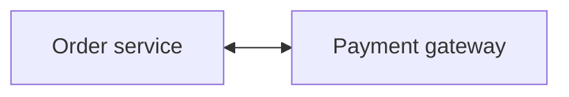
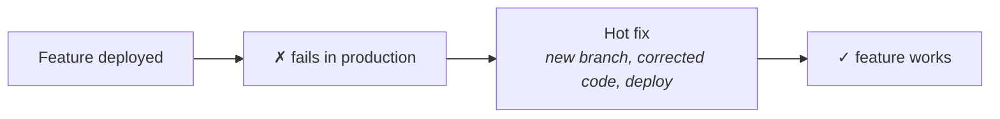
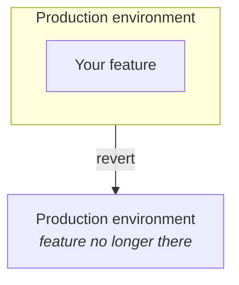
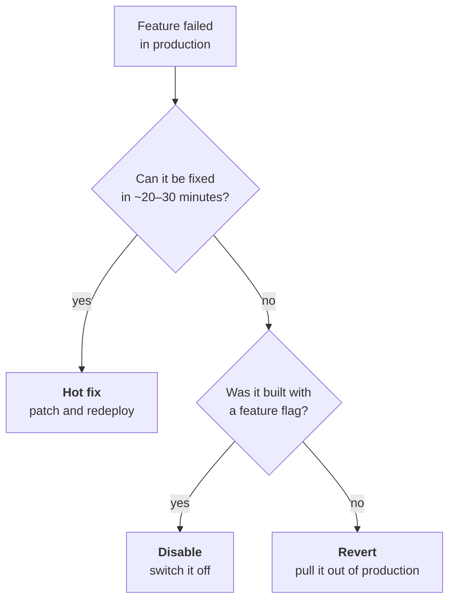

Mean time to recovery measures how long it takes to recover from a failure. That leaves an obvious question unanswered: what does *recovering* actually mean?

It turns out to mean three different things, and different companies use the word differently. The underlying goal is the same in all three cases:

> **Recovery means the platform is stable again.** Not necessarily that the feature works — that the system is healthy.

That distinction is what makes the three options make sense.

---

## A worked failure

Use one concrete situation throughout. You are a developer, and you have been asked to add a payment gateway to the application — the third-party service that actually moves the money.

You wire the order service to the payment gateway, deploy it, and it does not work in production. Users cannot complete payments. Your manager tells you the feature you shipped is broken.

You have three ways out.

---

## 1 · Hot fix — repair it in place

You investigate and find the cause. Perhaps a function in the payment gateway integration was written incorrectly. Perhaps it was not tested properly. Perhaps it is a configuration issue.

So you fix it: create a new branch, write the corrected code, and deploy that. The feature now works in production.

That is a **hot fix**: a small, urgent patch shipped specifically to repair something that is broken in production right now.

> [!info] **Feature branch.** The branch you created for the original payment work is called a **feature branch** — a branch in version control holding one feature while it is being built. This is ordinary Git practice rather than anything DevOps-specific, but the vocabulary matters here: the hot fix is a *different* branch, made after the fact, to repair what the feature branch shipped.

**The time this takes is the time that counts** toward mean time to recovery. If the hot fix takes forty minutes from failure to working feature, that incident contributes forty minutes.

## 2 · Revert — take it back out

Now suppose you investigate and realise this is not a forty-minute problem. It is going to take a day or two to fix properly.

Leaving a broken payment flow in production for two days is not an option. So instead of repairing the feature, you remove it:

You pull the code back out of production. As far as the running system is concerned, that feature no longer exists — you have taken it away.

**The platform is stable again, which means you have recovered, even though the feature is not working**. That is the point of defining recovery as stability rather than as functionality.

> [!info] **How this works in Git.** If the feature reached production through a merge, you do not delete history — you **revert the merge**. That creates a *new* commit which undoes the changes the merge introduced. The feature's code is retracted from the branch, and the record of both the merge and the revert stays intact.

## 3 · Disable — switch it off where it stands

The third option keeps the code in production but stops it from running. The feature sits there, switched off.

This is a **feature flag** — a stored value that the code checks before doing anything, so behaviour can be turned on or off without deploying new code.

Take a different example. You have shipped a promotional discount: users under 50 get a special promo code. The promo lives in your database roughly like this:

| promo_id | code | is_disabled |
|---|---|---|
| 1 | `SUPER200` | `false` |

`is_disabled` is `false` by default, meaning the feature is live and the code works — apply `SUPER200` at checkout and you get the discount.

Something goes wrong with the promotion. You go into the database and set that one value:

| promo_id | code | is_disabled |
|---|---|---|
| 1 | `SUPER200` | **`true`** |

Now nobody can apply the promo code. Nothing was redeployed, nothing was reverted, and the feature is off.

> [!important] **Disabling only works if you built for it.** You can switch a feature off only if you deployed it with an on/off switch in the first place. Plenty of features have no such switch — and for those, disabling is simply not available and you revert instead.
>
> This is the real lesson hiding in the example: whether you *can* disable something is decided when you build it, not when it breaks.

---

## Choosing between them

The deciding factor is **how long the repair will take**. A quick fix is worth doing directly. Anything longer, and you get the platform stable first and fix the feature afterwards, on your own schedule rather than under an outage.

| | What happens to the code | What happens to the feature | Needs |
|---|---|---|---|
| **Hot fix** | new code deployed | works | a quick, well-understood cause |
| **Revert** | removed from production | gone | nothing special |
| **Disable** | stays in production | switched off | a feature flag built in advance |

> [!tip] **This is where the theory stops being abstract.** These three words come back constantly once the course reaches real tooling — deployment pipelines exist partly to make hot fixes fast, and version control workflows exist partly to make reverts safe. The vocabulary here is what the rest of the subject is built on.
