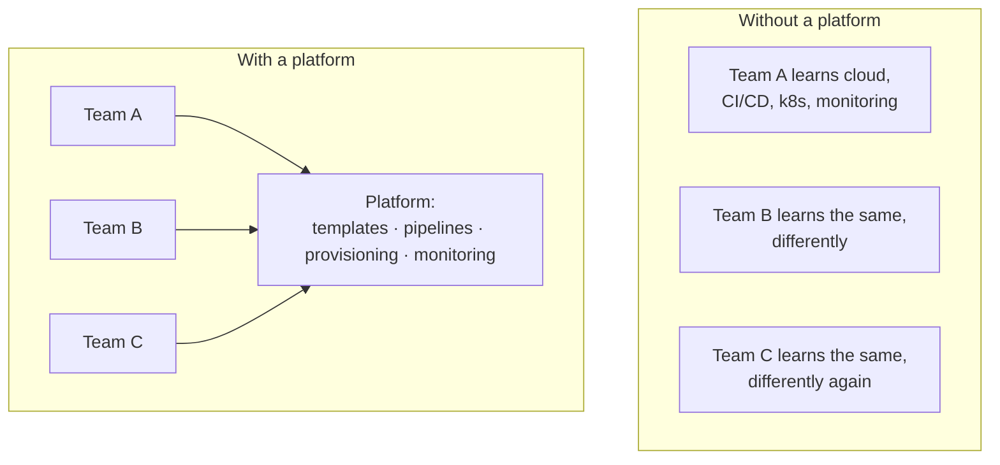
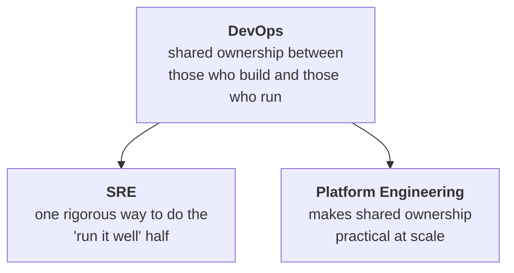

Look at job listings for the work this module describes and three titles come back: **DevOps Engineer**, **Site Reliability Engineer**, **Platform Engineer**. The descriptions underneath them overlap heavily — Linux, cloud, Kubernetes, CI/CD, monitoring — which makes it easy to conclude they are three names for one job.

They are not, and the difference is not seniority or tooling.

> **Each one starts from a different problem.** Once you know which problem, everything else about the role follows.

| | Starting problem | Main focus |
|---|---|---|
| **DevOps** | The people who build software and the people who run it work in silos | Collaboration, shared ownership, automation, continuous delivery |
| **SRE** | Production reliability needs to be an engineering discipline, not heroics | Reliability targets, incident response, operational risk |
| **Platform Engineering** | Every product team is drowning in infrastructure complexity | Self-service platforms, paved paths, developer experience |

---

## DevOps — the handover is the problem

This is the whole of the previous notes. Development and operations were split by task, their incentives pointed in opposite directions, and work fell into the gap between them. DevOps is the response: shared ownership, automation, fast feedback, small frequent changes.

Note what it is and is not. **DevOps is primarily a philosophy and an operating model** — a claim about how teams should be organised and what they should be accountable for. It is not a fixed org chart, which is exactly why note `02`'s "DevOps team" can be either the solution or a new silo depending on how it is run.

## SRE — reliability is the problem

**Site Reliability Engineering** started at Google and takes a specific angle: treat operations as a software engineering problem.

Rather than asking "is the system up?", SRE asks questions that have numbers for answers:

- **How reliable does this service actually need to be?** Not "as reliable as possible" — that is unaffordable and, past a point, unnoticeable to users.
- **How is that reliability measured**, and are we currently meeting it?
- **When reliability work should take priority over shipping features** — and, crucially, when it should *not*.
- **How are incidents handled**, and what changes afterwards as a result?
- **Which operational tasks should be automated away** rather than done repeatedly by a person?

> [!important] **The idea worth taking from SRE even if you never hold the title:** *"as reliable as possible"* is not an engineering target. It is an excuse to never ship. SRE's contribution is making reliability an explicit, measured budget that gets traded off against delivery on purpose rather than by accident.

SRE is best understood as **one concrete way to implement DevOps principles**, particularly at organisations where scale and availability requirements are demanding enough that good intentions do not survive contact with production.

## Platform Engineering — cognitive load is the problem

This one emerges from growth.

A company with three engineers can expect all of them to understand the cloud account, the pipeline, the container orchestration and the monitoring. A company with three hundred cannot. Multiply that expectation across every product team and you get the same infrastructure knowledge being learned, badly and inconsistently, dozens of times over.

**Platform engineering builds an internal platform those teams consume through self-service.** Typically:

- application templates and standard project scaffolding
- ready-made CI/CD pipelines
- approved infrastructure patterns
- environment provisioning on request
- secrets and configuration management
- monitoring and security controls that are on by default

The goal is to **reduce unnecessary cognitive load while keeping delivery standardised and safe**. A product team should be able to ship without becoming infrastructure specialists — and without inventing a private, unreviewed way of doing it.

> [!warning] **Platform engineering fails in exactly the way note `02` describes.** A platform that teams *use themselves* removes load. A platform that teams must *file tickets against* is the DevOps-team anti-pattern wearing a newer name. The word doing the work in "self-service platform" is **self**.

---

## How they fit together

They are not competing answers to one question, and an organisation can sensibly have all three.

DevOps sets the expectation that teams own their software in production. SRE supplies the discipline for doing that when reliability genuinely matters. Platform engineering supplies the tooling that makes it feasible when there are more teams than experts.

> [!tip] **Interview framing.** *"What's the difference between DevOps and SRE?"* is a common question and a good filter, because the memorised answer is "SRE is Google's version of DevOps" and it is not quite right.
>
> The stronger answer names the starting problems: **DevOps starts from organisational silos, SRE starts from reliability as an engineering discipline, platform engineering starts from developer cognitive load.** Then add that SRE is one way to implement DevOps rather than an alternative to it — which shows you have thought about the relationship, not just memorised three definitions.

> [!info] **Not from the lecture.** This note is drawn from the course's written notes rather than the session. It is included because the three titles are the ones you will actually be applying under, and because being able to say which problem each one starts from is a cheap, durable way to sound like someone who has worked near all three.
