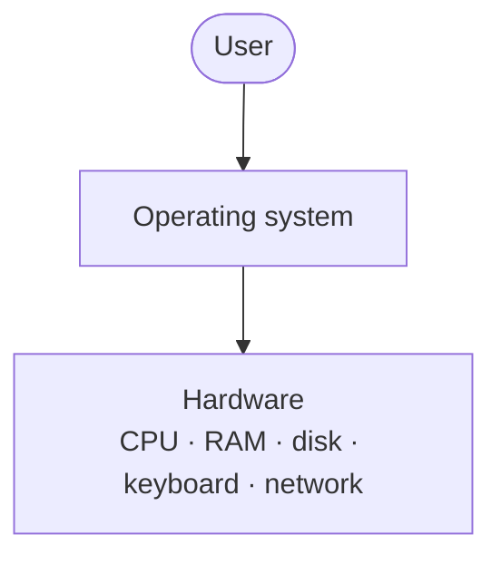
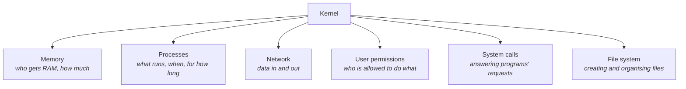

Before Linux makes any sense, one idea has to be in place: **you never talk to your hardware.**

You are a user. In front of you is a machine — a laptop, a phone — and inside it is physical hardware: a processor, memory chips, a disk, a keyboard, a network card. You cannot address any of it directly. There is no way for you to reach in and tell a memory chip to store something.

So something has to sit in between. A piece of software that takes what you want and makes the hardware do it.

That software is the **operating system**.

---

## Watch it happen

Take something you did a minute ago: you typed a message and pressed enter.

Between your finger and the result, the operating system did all of this:

1. Took the keystrokes from the keyboard
2. Handed them to a **driver** — the small piece of software that knows how to talk to one specific piece of hardware
3. Got the characters printed onto your screen as you typed
4. When you pressed enter, made a **network call** so the message actually left your machine

Every one of those steps is the operating system acting on your behalf. You did not think about any of them.

## What it manages

The list is longer than most people assume:

| Resource | What the OS handles |
|---|---|
| **CPU** | Which program gets to run, and for how long |
| **RAM** | Handing out memory to programs and taking it back |
| **Disk** | Long-term storage — the memory that survives being switched off |
| **Keyboard and input** | Getting your input to the right program |
| **Network** | Sending and receiving data over the network |

> [!info] **RAM and disk are both "memory", and the distinction matters later.** RAM is fast, small, and empties when the machine powers off. Disk is slower, much larger, and keeps its contents. When a program "runs", it is in RAM. When a file is "saved", it is on disk.

The point of all of it is the same: **so that you never have to deal with any of these things directly.**

---

## The kernel

An operating system that does all of the above is clearly a large piece of software. And within it, one part is the most important:

> **The kernel is the core of the operating system.** It is the part responsible for handling system calls, and it is the only part with direct access to hardware.

A **system call** is a request from a program to the operating system asking it to do something the program is not permitted to do itself — read a file, allocate memory, send data over the network. The name is literal: it is a call into the system.

The kernel is what answers those calls.

### What the kernel is responsible for

A useful piece of vocabulary while we are here. A **process** is a program that is currently running — which means it has been loaded into RAM. A program sitting on your disk is not a process. The moment it starts running, the kernel loads it into memory and it becomes one.

> [!tip] **The car analogy that came up in class is a good one.** The kernel is the engine. Everything else in the operating system is bodywork, seats and dashboard — genuinely useful, but the engine is the part doing the work, and it is the part you do not open up casually.

### The file system

One responsibility deserves calling out because it is easy to take for granted.

The kernel does not just *tell* you how to create files and directories — it creates them, organises them, and enforces who may open what. Every file operation you perform, in any program, eventually becomes a request to the kernel.

---

Which sets up the question the next note answers. If the kernel is the most important part of an operating system, and Linux is famously an operating system — what exactly is Linux?

The answer is not what most people assume.
