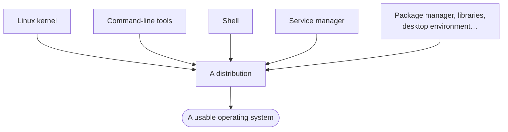

Here is the sentence to fix in your head, because almost everyone gets it wrong the first time:

> **Linux is not an operating system. Linux is a kernel.**

K-E-R-N-E-L. That is the whole of what Linux is — the core piece from the previous note, the part that handles system calls, manages memory and processes, and talks to hardware.

Nothing else. No terminal, no windows, no file manager, no way to install software.

---

## So what do you actually install?

If Linux is only a kernel, it cannot be the thing you download and run. A kernel on its own is not usable — you would have an engine sitting on the floor with no car around it.

To become something a person can use, the kernel needs company:

| Added on top | What it gives you |
|---|---|
| **Command-line tools** | The actual commands — listing files, copying, moving, searching |
| **A shell** | The program that reads what you type and interprets it (there are several, covered in note `05`) |
| **A service manager** | Starts and supervises background programs — the things that must be running for the system to work |
| **…and a good deal more** | Package managers, libraries, and often a graphical desktop |

Bundle the Linux kernel together with all of that, and you get something usable. That bundle is a **distribution**.

> [!important] **This is the whole idea of the module in one line:** the kernel is the part that is *Linux*, and the distribution is the part that makes it an *operating system*.

> [!info] **A wording slip in the lecture.** Early in the session Linux is described as "a distribution", and later corrected to "a kernel". The corrected version is the right one and the only one used here — Linux is the kernel, and Ubuntu, Fedora and the rest are the distributions built around it.

---

## The distributions you will meet

| Distribution | Where you tend to see it |
|---|---|
| **Ubuntu** | The most common general-purpose choice; the one recommended for this course |
| **Debian** | Long-established and stable — Ubuntu is itself built on it |
| **Fedora** | Fast-moving, close to the newest versions of everything |
| **Red Hat** (RHEL) | The commercial enterprise standard, sold with support |
| **CentOS** | Historically a free rebuild of Red Hat; see the note below |
| **Amazon Linux** | Amazon's own, tuned for running on AWS |
| **Kali Linux** | Packaged for security testing work |
| **SteamOS** | Valve's, built for gaming hardware |

They look different, ship different tools, and are aimed at different jobs. But underneath:

> [!tip] **The kernel is the same across all of them.** This is why the skill transfers. Learn to work in Ubuntu and you can work on a Red Hat server, because the thing you are really learning to talk to — the kernel — is common to both. What changes at the edges is which tools are installed and how software gets managed.

**Ubuntu is the pick for this course** simply because it is the friendliest to start on. Real servers run whatever their teams chose, and that is fine; nothing you learn is wasted.

> [!warning] **CentOS is the one to check before you rely on it.** It used to be a free, binary-compatible rebuild of Red Hat Enterprise Linux, which made it a popular way to get RHEL behaviour without the licence. That model was discontinued in favour of **CentOS Stream**, which sits *upstream* of RHEL rather than downstream — meaning it now receives changes before RHEL does, rather than after. If you meet CentOS on a real server, find out which of the two it is.
