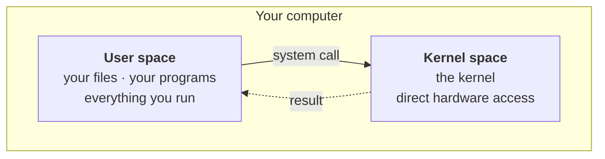
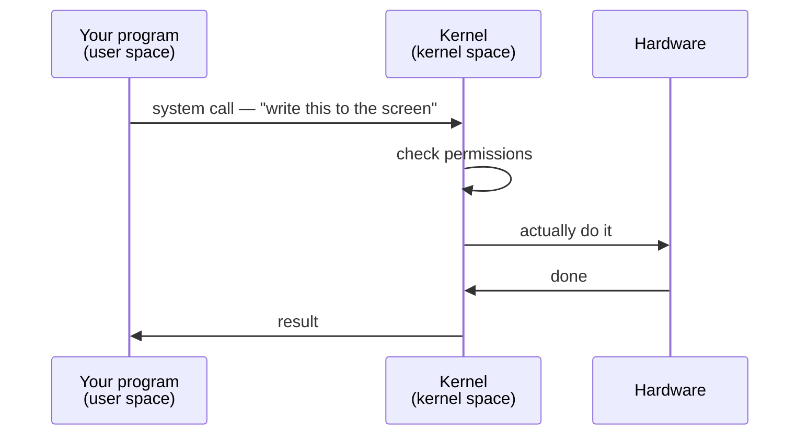

Everything a computer can do is divided into two territories, and the border between them is one of the most consequential design decisions in computing. This is true of every operating system, not just Linux.

---

## Kernel space

This is where the kernel lives, and it is **extremely high privilege**. Code running here can deal directly with memory, with hardware, with the CPU, with the file system.

Which is exactly why it is restricted. Not everything is allowed in.

To see why that restriction is not paranoia, ask what kernel space actually contains. It is code — a program, like any other program. And programs have bugs.

> [!danger] **A bug in kernel space can take down the entire machine.** Not the program — the operating system. Everything stops.
>
> That is the whole argument for the border. You want as little code as possible running with that kind of power, and you want it to be code that has been examined very carefully.

## User space

This is where everything else happens. Your files, your programs, the applications you install and run.

Your Java program runs here. Your Python script runs here. Your browser runs here. All of it, in user space.

And the reason is the mirror image of the danger above:

> [!important] **If your application crashes, the operating system does not.** A program in user space failing is contained — it takes itself down and nothing else. That containment is only possible because the application was never given kernel-level access in the first place.

---

## So how does a program get anything done?

A program in user space cannot touch hardware. But programs obviously do touch hardware constantly — they read files, print to the screen, take keyboard input, send network requests.

The resolution is that they **ask**.

When your program needs something it is not allowed to do itself, it makes a **system call** — a request to the kernel. The kernel checks whether it should be allowed, does the work, and hands back the result. The program never gets direct access; the kernel does the job on its behalf.

### You have been doing this all along

This is not exotic machinery. It is underneath the first line of code you ever wrote.

In Java, printing to the screen is `System.out.println`. In C++, it is `cout`. Every language has its own way of doing it.

But think about what those actually have to do. They cannot write to your screen themselves — no user-space program can. So underneath, each of them is making a system call, asking the kernel to do it.

The friendly method in your language is a wrapper. The real work happens across the border.

---

## The kernel as landlord

There is a second half to the kernel's role here, beyond answering requests. When you open an application, the kernel decides:

- **how much memory** the process gets
- **which resources** it is allowed
- **how long** it runs before being interrupted
- **when to pause it** and let a different process have the CPU

Your program does not negotiate any of this. It is handed an allocation and works inside it — a sandbox, with the kernel deciding the walls.

> [!info] **A common confusion, worth answering directly.** *"My Java program runs in RAM — so is it in user space or kernel space?"*
>
> Both spaces are in RAM. The split is not about *where* the code physically sits; it is about **what the code is permitted to do**. Your program is in RAM, in user space, with no direct hardware access. The kernel is also in RAM, in kernel space, with full access. Same memory, different privilege.

---

## One correction: `sudo`

A question came up in class about `sudo` — the command that runs something with administrator privileges — and the answer given was that the kernel receives the request and asks you for your password.

> [!warning] **The kernel never asks you for a password.** `sudo` is an ordinary user-space program. *It* prompts you, *it* checks the password, and *it* consults a configuration file listing who is permitted to do what.
>
> The kernel's role is separate and comes afterwards: it enforces the privileges that `sudo` has legitimately acquired. Authentication is a user-space job; enforcement is the kernel's.

This distinction matters more than it looks. Anything that talks to you — prompting, printing, waiting for input — is in user space, because talking to you *is itself* a system call. The kernel has no way to run a password prompt.

---

## Users and permissions

The permission checks throughout this note are why your computer has multiple users at all. There is an **admin** or **root** user with full access, and there may be others with much less.

Some users cannot open certain folders. Some cannot install software. Some cannot see other users' files.

**The kernel is what enforces every one of those boundaries.** When something is denied, the kernel denied it — which is what makes it worth understanding before you start running commands that expect you to be allowed.
