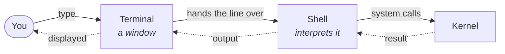
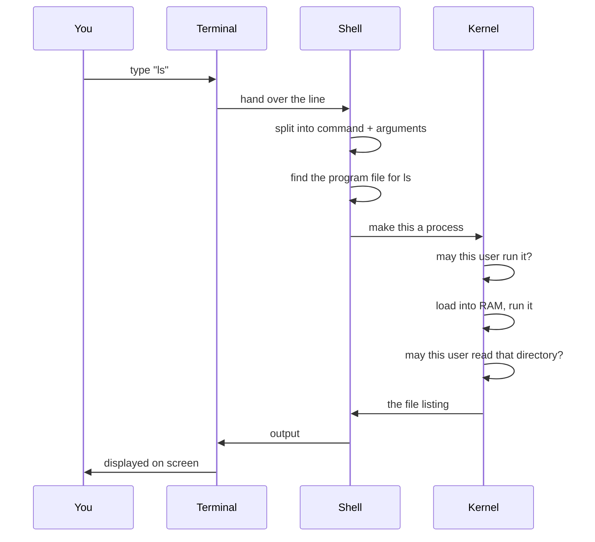
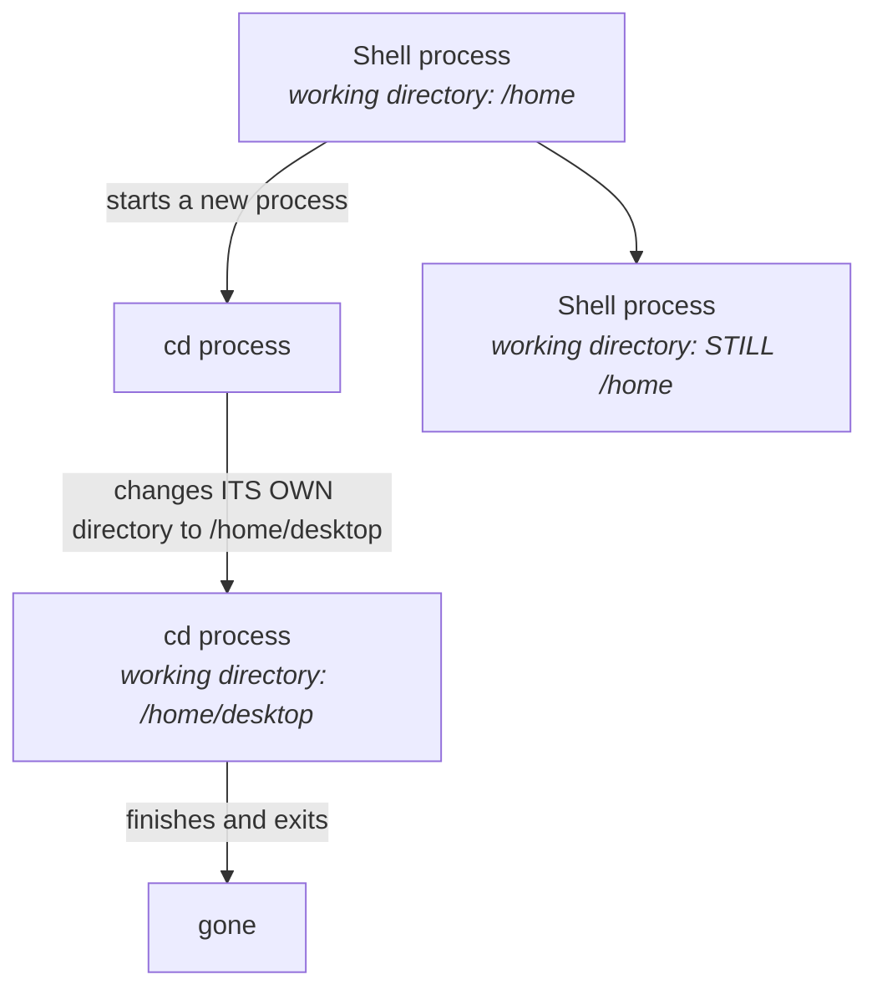

You open a terminal, type `ls`, and a list of files appears. It looks like the terminal did that.

It did not. The terminal did almost nothing.

Getting this right is worth a few minutes, because it is the difference between commands feeling like magic words and commands feeling like something you understand.

---

## The terminal is a window

Ask the direct question: **does the terminal execute your commands?**

> **No. Not at all.**

The terminal is a **graphical user interface** — a window. Its job is to show you the characters you type and to display whatever comes back. That is the extent of it.

Type `cd desktop` and the terminal reads the line. Then it hands it to something else.

## The shell is the engine

Behind the terminal sits the program that does the actual work: the **shell**.

Two facts about it, and the first is the one that unlocks everything:

**The shell is a program.** Nothing mystical — a program like any other. Which means, from the previous note, that it runs in **user space** with no special privileges of its own.

**Its job is to interpret.** It takes a command as input, works out what you meant, gets it done, and returns the output to you.

### Which shell

There are several, and they differ in convenience features rather than in fundamentals:

| Shell | Notes |
|---|---|
| **bash** | The long-standing default on most Linux systems |
| **zsh** | The default on macOS. The other one you will actually meet |
| **sh** | The original, minimal |
| **fish** | Newer, friendlier defaults |

**bash and zsh are the two that matter.** If you are on a Mac, open your terminal and look at the top of the window — you will see `zsh`, because that has been the macOS default for several years.

> [!tip] **You can switch, and it is worth trying once.** Type `bash` and you are in a bash shell; the prompt changes to show it. Type `exit` and you are back in zsh. Nothing about your machine changed — you simply started a different interpreter program and then left it. That is a good demonstration that the shell really is just a program you are running.

---

## What happens when you run `ls`

Now the full journey. Follow `ls` — the command that lists what is in a directory — from keypress to output.

Step by step:

1. **The terminal takes your input** and passes the line to the shell.
2. **The shell splits it up.** `ls` is the command; anything after it is an argument. Given `cd home/desktop`, the two pieces are `cd` and `home/desktop`.
3. **The shell finds the program.** `ls` is a real executable file sitting on disk. The shell knows where to look for it.
4. **The shell asks the kernel to run it** — to turn that program into a **process**, which means loading it into RAM so it can execute.
5. **The kernel checks permission first.** Before creating anything, it asks whether this user is allowed to run this program.
6. **The program runs**, receiving the argument as a parameter — which is exactly what it would be if you had written the program yourself, as a function taking a string.
7. **The kernel checks permission again**, this time on the target. Are you allowed to read *that* directory?
8. **The result travels back**: kernel → shell → terminal → your screen.

> [!info] **Why permission gets checked twice.** They are different questions. *May you run this program?* is about the program file. *May you read that directory?* is about the thing the program is trying to touch. Being allowed to run `ls` does not entitle you to list somebody else's private folder.
>
> A concrete version: I am the root user on my machine and I have a private folder. I let you use my computer as a guest. You run `ls` on my private folder — the command is fine, you are allowed to run it — and the kernel refuses the second check, because a guest user has no business reading that directory.

---

## `cd` is the exception, and the exception is interesting

> [!warning] **Where this note departs from the lecture.** The class walks through `cd` using the sequence above — the shell finds an executable file for `cd`, asks the kernel to make it a process, and so on. **That is accurate for `ls` and almost every other command. It is not how `cd` works, and it cannot be.**

Here is why, and it is a genuinely satisfying piece of reasoning.

Every process has its own **current working directory** — the folder it considers itself to be "in". Changing directory means changing that value.

Now suppose `cd` were a separate program, run as its own process. Follow the consequences:

The new process would change **its own** working directory, then immediately exit — taking that change with it. Your shell would be exactly where it started. `cd` would appear to do nothing at all.

The only way `cd` can work is for the **shell itself** to change its own working directory. No new process, no separate program, no `exec`.

Commands that work this way are called **shell builtins** — they are part of the shell program rather than separate files on disk. `cd` is the classic example, and it is a builtin in every shell precisely because it has no alternative.

> [!tip] **This is a common interview question**, usually phrased as *"why can't `cd` be an external command?"* The answer is the diagram above: a child process cannot change its parent's working directory, so a `cd` that ran as its own process would change nothing.
>
> The general lesson generalises usefully: **most commands are programs, but a few must be part of the shell** — the ones whose whole purpose is to change the shell's own state.

---

## Seeing it for yourself

Everything above is visible in about thirty seconds at a terminal:

- Look at the top of the window and note which shell you are in.
- Type `bash`, watch the prompt change, type `exit`, watch it change back.
- Run `ls` to see what is in the current directory.
- Run `cd desktop` to move, then `ls` again to see somewhere different.

Each of those took the full journey — terminal, shell, kernel, permission checks, and back. It just happened faster than you could notice.

The commands themselves are the next module. What matters now is that when you type one, you know which piece is doing what.
