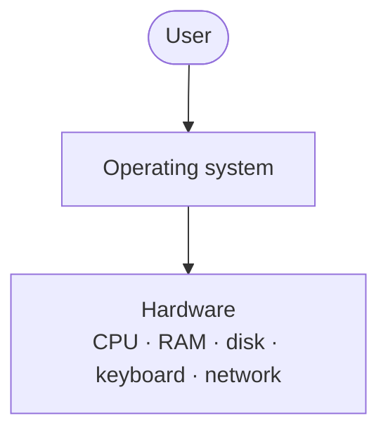
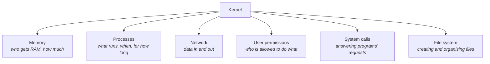
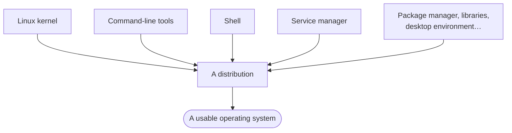

The theory is finished. From here the work is the actual job: developers and operations working together, tools built to make that possible, products shipped quickly and reliably. And the first thing that job requires is knowing how code gets onto a server.

Start with what a server even is, because the word sounds grander than the thing.

> **A server is just a computer.** There is nothing special about it. We call it a server because it *serves* requests — it stays switched on, connected, and answers when something asks it for data. That is the entire difference between a server and the laptop you are reading this on.

You deploy your code onto that computer. And that computer, overwhelmingly, is running a **Linux-based system**.

Not every server — but most of them. Which is why a DevOps engineer has to be able to work in one.

---

## How much Linux do you need?

Less than people expect. You do not need to become a systems programmer.

What you need is to be able to open a terminal on a Linux machine and get things done in it — move around the file system, look at files, run programs, adjust configuration. Basic, everyday interaction through the shell.

That is the target for these notes: enough Linux to work, not enough to write an operating system.

---

## You never talk to your hardware

Before Linux makes any sense, one idea has to be in place.

You are a user. In front of you is a machine — a laptop, a phone — and inside it is physical hardware: a processor, memory chips, a disk, a keyboard, a network card. You cannot address any of it directly. There is no way for you to reach in and tell a memory chip to store something.

So something has to sit in between. A piece of software that takes what you want and makes the hardware do it.

That software is the **operating system**.

### Watch it happen

Take something you did a minute ago: you typed a message and pressed enter.

Between your finger and the result, the operating system did all of this:

1. Took the keystrokes from the keyboard
2. Handed them to a **driver** — the small piece of software that knows how to talk to one specific piece of hardware
3. Got the characters printed onto your screen as you typed
4. When you pressed enter, made a **network call** so the message actually left your machine

Every one of those steps is the operating system acting on your behalf. You did not think about any of them.

### What it manages

The list is longer than most people assume:

| Resource | What the OS handles |
|---|---|
| **CPU** | Which program gets to run, and for how long |
| **RAM** | Handing out memory to programs and taking it back |
| **Disk** | Long-term storage — the memory that survives being switched off |
| **Keyboard and input** | Getting your input to the right program |
| **Network** | Sending and receiving data over the network |

> [!info] **RAM and disk are both "memory", and the distinction matters later.** RAM is fast, small, and empties when the machine powers off. Disk is slower, much larger, and keeps its contents. When a program "runs", it is in RAM. When a file is "saved", it is on disk.

The point of all of it is the same: **so that you never have to deal with any of these things directly.**

---

## The kernel

An operating system that does all of the above is clearly a large piece of software. And within it, one part is the most important:

> **The kernel is the core of the operating system.** It is the part responsible for handling system calls, and it is the only part with direct access to hardware.

A **system call** is a request from a program to the operating system asking it to do something the program is not permitted to do itself — read a file, allocate memory, send data over the network. The name is literal: it is a call into the system.

The kernel is what answers those calls.

### What the kernel is responsible for

A useful piece of vocabulary while we are here. A **process** is a program that is currently running — which means it has been loaded into RAM. A program sitting on your disk is not a process. The moment it starts running, the kernel loads it into memory and it becomes one. Note `07` takes this apart properly.

> [!tip] **The car analogy that came up in class is a good one.** The kernel is the engine. Everything else in the operating system is bodywork, seats and dashboard — genuinely useful, but the engine is the part doing the work, and it is the part you do not open up casually.

### The file system

One responsibility deserves calling out because it is easy to take for granted.

The kernel does not just *tell* you how to create files and directories — it creates them, organises them, and enforces who may open what. Every file operation you perform, in any program, eventually becomes a request to the kernel.

---

## Linux is a kernel, not an operating system

Here is the sentence to fix in your head, because almost everyone gets it wrong the first time:

> **Linux is not an operating system. Linux is a kernel.**

K-E-R-N-E-L. That is the whole of what Linux is — the core piece from above, the part that handles system calls, manages memory and processes, and talks to hardware.

Nothing else. No terminal, no windows, no file manager, no way to install software.

### So what do you actually install?

If Linux is only a kernel, it cannot be the thing you download and run. A kernel on its own is not usable — you would have an engine sitting on the floor with no car around it.

To become something a person can use, the kernel needs company:

| Added on top | What it gives you |
|---|---|
| **Command-line tools** | The actual commands — listing files, copying, moving, searching |
| **A shell** | The program that reads what you type and interprets it (note `02`) |
| **A service manager** | Starts and supervises background programs — the things that must be running for the system to work |
| **…and a good deal more** | Package managers, libraries, and often a graphical desktop |

Bundle the Linux kernel together with all of that, and you get something usable. That bundle is a **distribution**.

> [!important] **This is the whole idea in one line:** the kernel is the part that is *Linux*, and the distribution is the part that makes it an *operating system*.

> [!info] **A wording slip in the lecture.** Early in the session Linux is described as "a distribution", and later corrected to "a kernel". The corrected version is the right one and the only one used here — Linux is the kernel, and Ubuntu, Fedora and the rest are the distributions built around it.

---

## The distributions you will meet

| Distribution | Where you tend to see it |
|---|---|
| **Ubuntu** | The most common general-purpose choice; the one recommended for this course |
| **Debian** | Long-established and stable — Ubuntu is itself built on it |
| **Fedora** | Fast-moving, close to the newest versions of everything |
| **Red Hat** (RHEL) | The commercial enterprise standard, sold with support |
| **CentOS** | Historically a free rebuild of Red Hat; see the note below |
| **Amazon Linux** | Amazon's own, tuned for running on AWS |
| **Kali Linux** | Packaged for security testing work |
| **SteamOS** | Valve's, built for gaming hardware |

They look different, ship different tools, and are aimed at different jobs. But underneath:

> [!tip] **The kernel is the same across all of them.** This is why the skill transfers. Learn to work in Ubuntu and you can work on a Red Hat server, because the thing you are really learning to talk to — the kernel — is common to both. What changes at the edges is which tools are installed and how software gets managed.

**Ubuntu is the pick for this course** simply because it is the friendliest to start on. Real servers run whatever their teams chose, and that is fine; nothing you learn is wasted.

> [!warning] **CentOS is the one to check before you rely on it.** It used to be a free, binary-compatible rebuild of Red Hat Enterprise Linux, which made it a popular way to get RHEL behaviour without the licence. That model was discontinued in favour of **CentOS Stream**, which sits *upstream* of RHEL rather than downstream — meaning it now receives changes before RHEL does, rather than after. If you meet CentOS on a real server, find out which of the two it is.

> [!important] **Not all servers run Ubuntu.** Real servers run all sorts of distributions, chosen for all sorts of reasons. But the thing that matters underneath — the kernel — is common across them, so what you learn on Ubuntu transfers.

---

## Getting a Linux machine

You need somewhere to practise. There are four routes, and which one you take depends on what you already own.

### If you are on Windows

You have two good options.

**WSL — Windows Subsystem for Linux.** This is the lighter of the two. It gives you a Linux environment running inside Windows without the overhead of a full virtual machine, and your Linux commands run in it directly.

**A virtual machine (VM).** Software that runs a complete second computer inside your existing one — its own operating system, its own file system, fully separate from Windows.

> [!tip] **Choose by how much machine you have.** A VM consumes noticeably more memory than WSL, because it is running an entire operating system alongside the one you already have. If your Windows machine is not particularly powerful, **use WSL**. If it is, a VM gives you a more complete environment — effectively a whole separate computer to work in.

**Dual boot** is the third option: install Ubuntu alongside Windows and choose between them when the machine starts. It gives you the real thing with no overhead at all, but it is the most disruptive to set up — and for one or two lectures' worth of use, it is likely more than you need.

### If you are on a Mac

You are mostly fine already. macOS is **Unix-based**, and Linux comes from the same lineage, so the majority of commands work unchanged in the macOS terminal.

"Mostly" is doing some work in that sentence, though. Some commands differ between the two, and occasionally a flag behaves differently. So it is still worth installing a virtual machine for the parts where the difference matters.

### If you are already on Linux

Nothing to do. You are in the best position of anyone.

> [!warning] **On using a work machine.** If you are thinking of installing this on a company laptop, check your organisation's policy first. Installing virtualisation software or a Linux subsystem on managed hardware is the kind of thing that is often restricted, and a personal machine avoids the question entirely.

---

Setting this up is homework, not classwork. Have a working Linux environment ready before you go further — commands start in note `03`, and they are much easier to learn while typing them yourself than while watching someone else type them.

---

*Source: class 1 — 2026-08-05, recording parts 4–5.*
