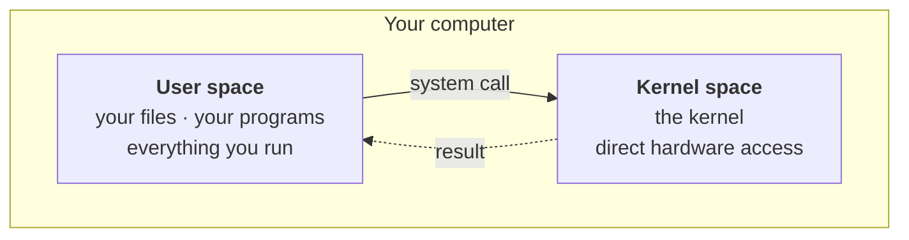
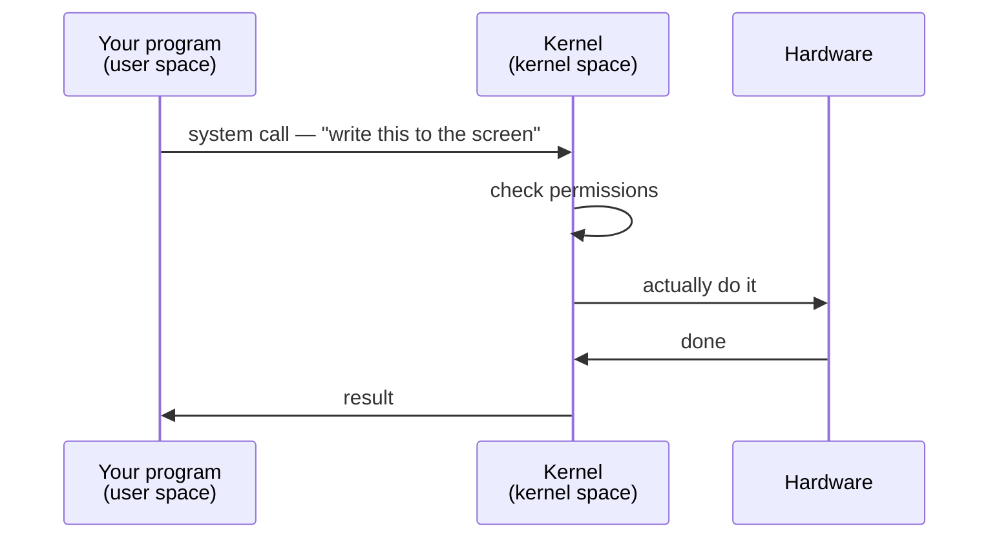
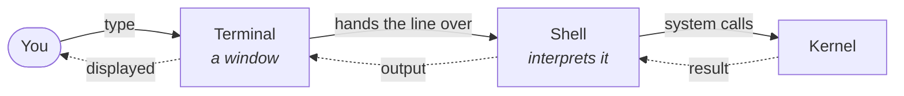
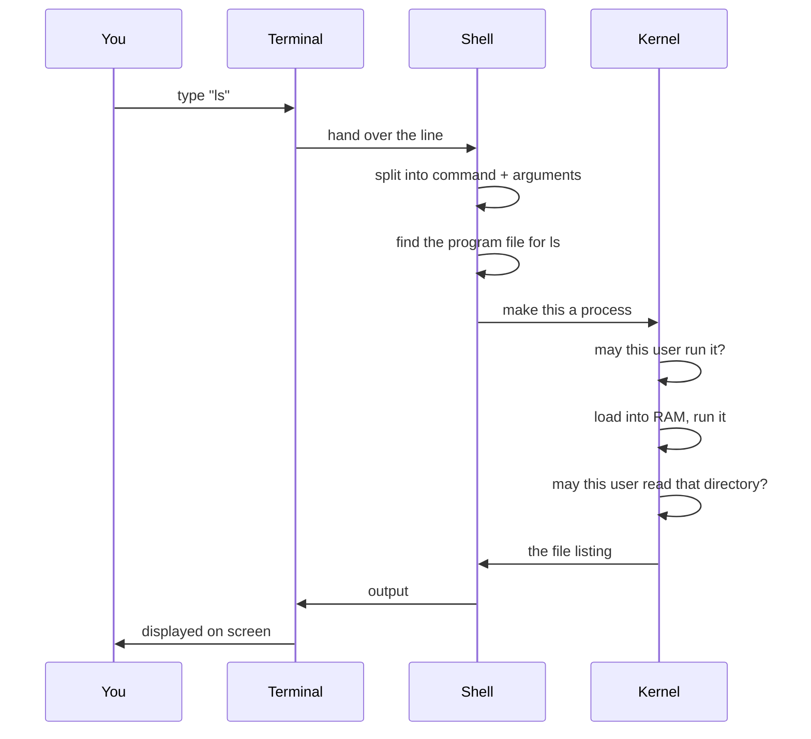
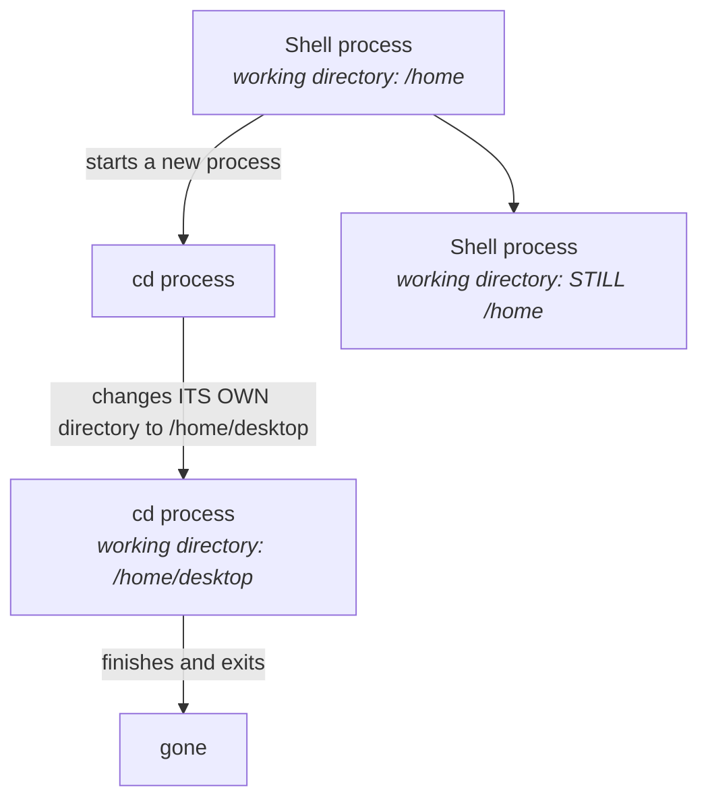

Everything a computer can do is divided into two territories, and the border between them is one of the most consequential design decisions in computing. This is true of every operating system, not just Linux.

---

## Kernel space

This is where the kernel lives, and it is **extremely high privilege**. Code running here can deal directly with memory, with hardware, with the CPU, with the file system.

Which is exactly why it is restricted. Not everything is allowed in.

To see why that restriction is not paranoia, ask what kernel space actually contains. It is code — a program, like any other program. And programs have bugs.

> [!danger] **A bug in kernel space can take down the entire machine.** Not the program — the operating system. Everything stops.
>
> That is the whole argument for the border. You want as little code as possible running with that kind of power, and you want it to be code that has been examined very carefully.

## User space

This is where everything else happens. Your files, your programs, the applications you install and run.

Your Java program runs here. Your Python script runs here. Your browser runs here. All of it, in user space.

And the reason is the mirror image of the danger above:

> [!important] **If your application crashes, the operating system does not.** A program in user space failing is contained — it takes itself down and nothing else. That containment is only possible because the application was never given kernel-level access in the first place.

---

## So how does a program get anything done?

A program in user space cannot touch hardware. But programs obviously do touch hardware constantly — they read files, print to the screen, take keyboard input, send network requests.

The resolution is that they **ask**. When your program needs something it is not allowed to do itself, it makes a **system call** — the request to the kernel from note `01`. The kernel checks whether it should be allowed, does the work, and hands back the result. The program never gets direct access; the kernel does the job on its behalf.

### You have been doing this all along

This is not exotic machinery. It is underneath the first line of code you ever wrote.

In Java, printing to the screen is `System.out.println`. In C++, it is `cout`. Every language has its own way of doing it.

But think about what those actually have to do. They cannot write to your screen themselves — no user-space program can. So underneath, each of them is making a system call, asking the kernel to do it.

The friendly method in your language is a wrapper. The real work happens across the border.

---

## The kernel as landlord

There is a second half to the kernel's role here, beyond answering requests. When you open an application, the kernel decides:

- **how much memory** the process gets
- **which resources** it is allowed
- **how long** it runs before being interrupted
- **when to pause it** and let a different process have the CPU

Your program does not negotiate any of this. It is handed an allocation and works inside it — a sandbox, with the kernel deciding the walls.

> [!info] **A common confusion, worth answering directly.** *"My Java program runs in RAM — so is it in user space or kernel space?"*
>
> Both spaces are in RAM. The split is not about *where* the code physically sits; it is about **what the code is permitted to do**. Your program is in RAM, in user space, with no direct hardware access. The kernel is also in RAM, in kernel space, with full access. Same memory, different privilege.

## One correction: `sudo`

A question came up in class about `sudo` — the command that runs something with administrator privileges — and the answer given was that the kernel receives the request and asks you for your password.

> [!warning] **The kernel never asks you for a password.** `sudo` is an ordinary user-space program. *It* prompts you, *it* checks the password, and *it* consults a configuration file listing who is permitted to do what.
>
> The kernel's role is separate and comes afterwards: it enforces the privileges that `sudo` has legitimately acquired. Authentication is a user-space job; enforcement is the kernel's.

This distinction matters more than it looks. Anything that talks to you — prompting, printing, waiting for input — is in user space, because talking to you *is itself* a system call. The kernel has no way to run a password prompt.

> [!info] **Every permission check in these notes is ultimately the kernel's.** Whichever user you are, whatever you are denied, it is the kernel that denied it — which is what makes it worth understanding before you start running commands that expect you to be allowed. Note `06` is about the rules it enforces.

---

## The terminal is a window

Now to the program you will spend all your time in.

You open a terminal, type `ls`, and a list of files appears. It looks like the terminal did that.

It did not. The terminal did almost nothing.

Ask the direct question: **does the terminal execute your commands?**

> **No. Not at all.**

The terminal is a **graphical user interface** — a window. Its job is to show you the characters you type and to display whatever comes back. That is the extent of it.

Type `cd desktop` and the terminal reads the line. Then it hands it to something else.

## The shell is the engine

Behind the terminal sits the program that does the actual work: the **shell**.

Two facts about it, and the first is the one that unlocks everything:

**The shell is a program.** Nothing mystical — a program like any other. Which means, from everything above, that it runs in **user space** with no special privileges of its own.

**Its job is to interpret.** It takes a command as input, works out what you meant, gets it done, and returns the output to you.

### Which shell

There are several, and they differ in convenience features rather than in fundamentals:

| Shell | Notes |
|---|---|
| **bash** | The long-standing default on most Linux systems |
| **zsh** | The default on macOS. The other one you will actually meet |
| **sh** | The original, minimal |
| **fish** | Newer, friendlier defaults |

**bash and zsh are the two that matter.** If you are on a Mac, open your terminal and look at the top of the window — you will see `zsh`, because that has been the macOS default for several years.

> [!tip] **You can switch, and it is worth trying once.** Type `bash` and you are in a bash shell; the prompt changes to show it. Type `exit` and you are back in zsh. Nothing about your machine changed — you simply started a different interpreter program and then left it. That is a good demonstration that the shell really is just a program you are running.

---

## What happens when you run `ls`

Now the full journey. Follow `ls` — the command that lists what is in a directory — from keypress to output.

Step by step:

1. **The terminal takes your input** and passes the line to the shell.
2. **The shell splits it up.** `ls` is the command; anything after it is an argument. Given `cd home/desktop`, the two pieces are `cd` and `home/desktop`.
3. **The shell finds the program.** `ls` is a real executable file sitting on disk — and the shell finds it by consulting **`PATH`**, a list of directories it searches in order. The first match wins, and that is the program that runs.
4. **The shell asks the kernel to run it** — to turn that program into a **process**, which means loading it into RAM so it can execute.
5. **The kernel checks permission first.** Before creating anything, it asks whether this user is allowed to run this program.
6. **The program runs**, receiving the argument as a parameter — which is exactly what it would be if you had written the program yourself, as a function taking a string.
7. **The kernel checks permission again**, this time on the target. Are you allowed to read *that* directory?
8. **The result travels back**: kernel → shell → terminal → your screen.

> [!info] **`PATH` is why you type `ls` and not `/usr/bin/ls`.** It is an ordinary list of directories, and the shell walks it top to bottom looking for a file with the name you typed. Most commands you know live in `/usr/bin`, which is on that list by default.
>
> Two consequences worth carrying:
>
> - **A program not on `PATH` cannot be run by name.** This is the whole explanation for `command not found` on something you know is installed — the file exists, it is simply not in any directory the shell searches.
> - **Order decides which one wins.** Two versions of the same program in two directories, and the one earlier in `PATH` is the one you get. This is how version managers work, and how you end up running a different Python than you thought.

> [!info] **Why permission gets checked twice.** They are different questions. *May you run this program?* is about the program file. *May you read that directory?* is about the thing the program is trying to touch. Being allowed to run `ls` does not entitle you to list somebody else's private folder.
>
> A concrete version: I am the root user on my machine and I have a private folder. I let you use my computer as a guest. You run `ls` on my private folder — the command is fine, you are allowed to run it — and the kernel refuses the second check, because a guest user has no business reading that directory.

---

## `cd` is the exception, and the exception is interesting

> [!warning] **Where this note departs from the lecture.** The class walks through `cd` using the sequence above — the shell finds an executable file for `cd`, asks the kernel to make it a process, and so on. **That is accurate for `ls` and almost every other command. It is not how `cd` works, and it cannot be.**

Here is why, and it is a genuinely satisfying piece of reasoning.

Every process has its own **current working directory** — the folder it considers itself to be "in". Changing directory means changing that value.

Now suppose `cd` were a separate program, run as its own process. Follow the consequences:

The new process would change **its own** working directory, then immediately exit — taking that change with it. Your shell would be exactly where it started. `cd` would appear to do nothing at all.

The only way `cd` can work is for the **shell itself** to change its own working directory. No new process, no separate program, no `exec`.

Commands that work this way are called **shell builtins** — they are part of the shell program rather than separate files on disk. `cd` is the classic example, and it is a builtin in every shell precisely because it has no alternative.

> [!tip] **This is a common interview question**, usually phrased as *"why can't `cd` be an external command?"* The answer is the diagram above: a child process cannot change its parent's working directory, so a `cd` that ran as its own process would change nothing.
>
> The general lesson generalises usefully: **most commands are programs, but a few must be part of the shell** — the ones whose whole purpose is to change the shell's own state.

---

## Seeing it for yourself

Everything above is visible in about thirty seconds at a terminal:

- Look at the top of the window and note which shell you are in.
- Type `bash`, watch the prompt change, type `exit`, watch it change back.
- Run `ls` to see what is in the current directory.
- Run `cd desktop` to move, then `ls` again to see somewhere different.

Each of those took the full journey — terminal, shell, kernel, permission checks, and back. It just happened faster than you could notice.

The commands themselves are next. What matters now is that when you type one, you know which piece is doing what.

---

*Source: class 1 — 2026-08-05, recording part 5.*
