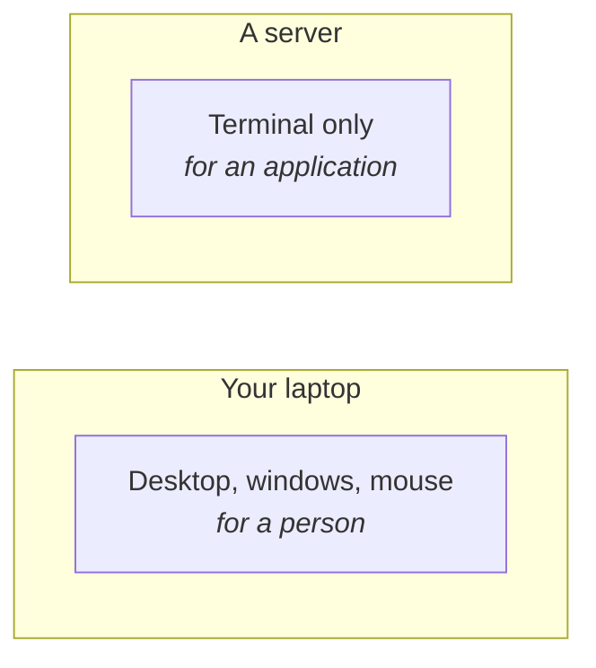
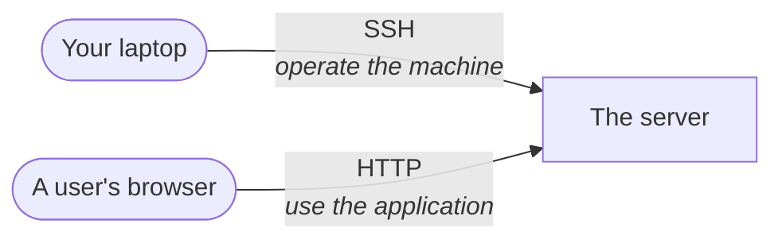
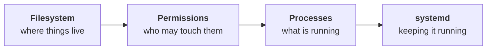
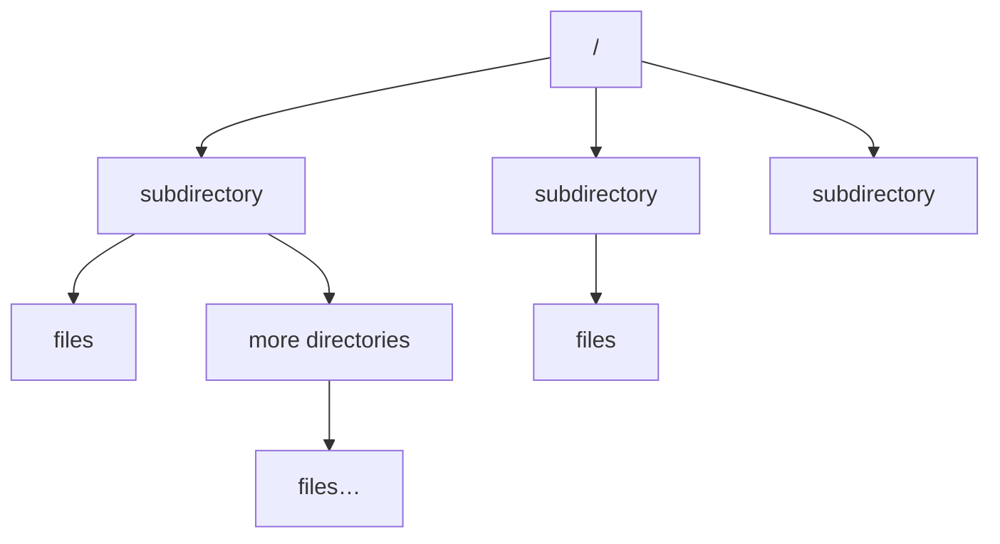
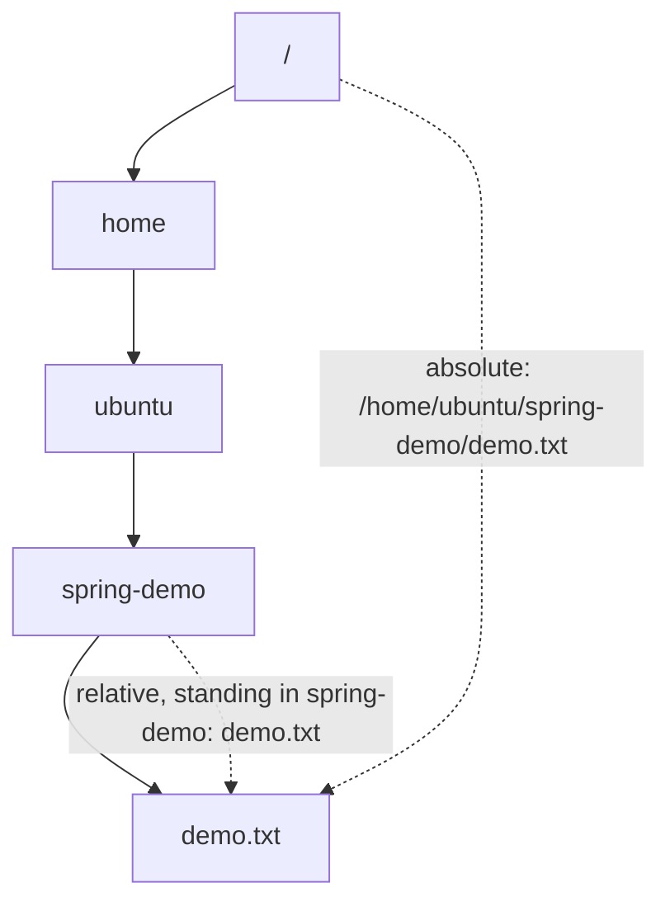
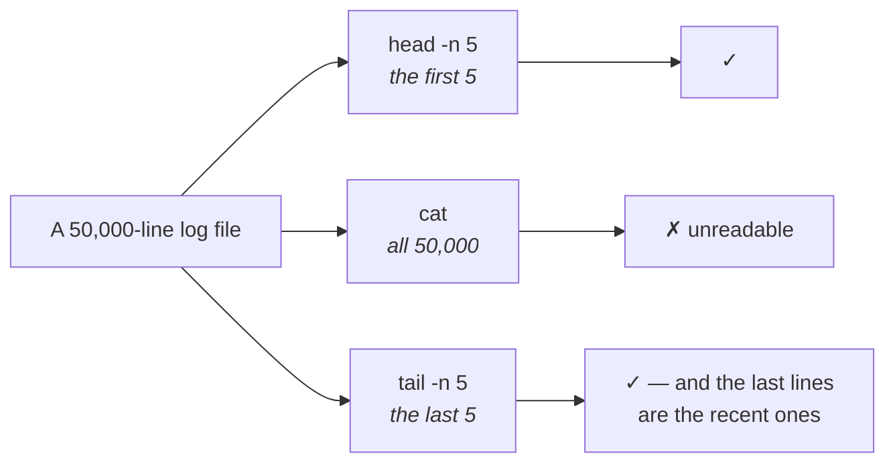

You have written an application on your laptop. It needs to run on a server. So you sit down at the server and copy it over.

Except you cannot sit down at it, and there is nothing to sit down in front of.

---

## A server is a computer with better specifications

Nothing exotic — the definition from note `01` still holds. A server has far more RAM, far more storage and many more CPU cores than a laptop, because it is serving many people at once. But it is a computer, running an operating system, and overwhelmingly that operating system is a Linux distribution.

What it does **not** have is a screen, a mouse, or a desktop.

## Why there is no graphical interface

This was put to the class as a question before it was answered, and it is worth answering yourself before reading on.

A graphical interface exists so that a **person** can work with a computer. You need one on your laptop because you do many different things: write code, join a class, watch something, read mail. Icons, windows and a mouse make that pleasant.

A server does exactly one thing: **serve the application deployed on it.** No person sits in front of it. So the interface has no user.

And it is not merely unnecessary — it is expensive:

> [!important] **A graphical interface consumes real resources.** Rendering a desktop costs CPU, memory and disk that you are paying for and that your application would rather have. On a machine whose entire purpose is to run one application as well as possible, spending a slice of it drawing windows nobody looks at is pure waste.

The class summarised this well: **a server is designed to run services, not for a person to interact with it directly.**

So a server runs a Linux distribution **without a GUI** — a terminal-based system, and nothing else.



> [!info] **This is the honest answer to "why learn commands?"** Not tradition, and not because commands are more powerful. Because **on a server there is no alternative.** Every interaction you will ever have with a production machine goes through a terminal, and the commands are the only vocabulary that exists there.

---

## So how do you reach it?

Your laptop is here. The server is elsewhere — in a data centre, or on a cloud provider like AWS. Between them is the internet.

You cannot plug anything in. You need to talk to it over the network, which means you need a **protocol** — an agreed way for two machines to exchange messages.

The obvious candidate is the one you already know. When a browser talks to a server it uses **HTTP**. So why not that?

> [!important] **Because HTTP does the wrong job.** HTTP carries a request and returns a response — you ask for a page, you get a page. That is what a *client* does with a *running application*.
>
> That is not what you are trying to do. You want to **operate the machine**: copy files onto it, create directories, run commands, read logs, restart things. You want to reach into its terminal from outside, as though you were sitting at it.

The protocol for that is **SSH — Secure Shell.**

The name is the definition. It gives you a **shell** on a remote machine — the interpreter program from note `02` — **securely**, meaning everything you type and everything that comes back is encrypted in transit.



Two different conversations with the same machine, for two different purposes. As a DevOps engineer you are almost always on the top line.

> [!tip] **This distinction answers a question people ask for months:** *"why can't I just deploy over HTTP?"* You can move a file over HTTP. What you cannot do is **become a shell on the far machine** — and deployment is almost entirely shell work: put this here, set that permission, edit this config, start that service.

---

## The practice machine

You need a Linux machine to work on, and the class does not use a rented server for it. It uses a **virtual machine** — a complete second computer running inside your own, with its own operating system and filesystem.

The demonstration machine was set up with **Multipass**, Canonical's tool for running Ubuntu VMs, on macOS:

```bash
brew install multipass
```

Then a VM is created and can be inspected:

```bash
multipass info devops
```

`devops` is the name given to the VM. The output reports what it has been allocated. In class:

| | |
|---|---|
| Image | Ubuntu 24.04 LTS |
| CPU cores | 4 |
| Memory | 6 GB (of the host's 24 GB) |
| Disk | 40 GB, ~2.6 GB used |

And to open a shell inside it:

```bash
multipass shell devops
```

The prompt changes to something of the form `ubuntu@devops`. Read that as two facts: **`ubuntu` is your username** on that machine, and **`devops` is the machine's name**.

> [!info] **Use whatever gets you an Ubuntu terminal.** Multipass is one route and it is a Mac-friendly one. On Windows, **WSL** is the easy path; VirtualBox and other VM managers work equally well. On Linux you already have what you need.
>
> The commands to *create* the VM differ per tool and are worth looking up once for your own setup. Everything after that point is identical, because everything after that point is just Linux.

> [!warning] **The VM is on your own laptop, and that has one consequence worth naming.** Your "server" and your "client" are the same physical machine. Nothing travels over the internet. That is fine for learning — the shape of every operation is identical — but it does mean the network is doing less work than it would in production, so network problems that a real deployment would hit will not appear here.

---

## What the rest of these notes are

With a terminal on a Linux machine, four things are worth learning, in this order:



And it ends somewhere concrete: **a Spring Boot application, built on the laptop, running on the Ubuntu machine, answering requests from outside.** Every command between here and there exists to make that happen.

---

## The filesystem is one tree

Every operating system has to answer the same question: where do files go? And the answers differ enough that moving from Windows to Linux feels disorienting for a week.

Windows splits storage into **drives**. `C:\` is one, `D:\` is another, `E:\` another still. Each is its own separate top level, and a path begins by naming which one you mean.

Linux — and macOS, which shares Linux's Unix ancestry — does not do that.

> **There is exactly one top, and it is called `/`.**

One tree. Everything on the machine hangs off it: every file, every directory, every disk. There is no second root to choose between.



Below the root are subdirectories; inside those, more directories or files; and so on down as far as you like. That is the entire structure.

### Seeing it

```bash
cd /
ls
```

`cd` is **change directory**. `/` is the root. So this says "go to the top", and `ls` lists what is there:

```
bin  boot  dev  etc  home  lib  lost+found  media  mnt
opt  proc  root  run  sbin  srv  sys  tmp  usr  var
```

Twenty-odd directories, none of which you created. What they are for is note `04`; for now the point is only that they exist and that they all hang off the same `/`.

### Why it is arranged, not scattered

Here is the framing from class that makes the whole thing click, and it works because you already do this.

Think about a project you have written. You did not put every file in one folder. You made a structure:

```
project/
├── backend/
│   ├── src/
│   └── static/
└── frontend/
    ├── html/
    ├── css/
    └── js/
```

You invented that layout so that anyone opening the project can guess where things are. Images in `static`. Styles in `css`. Nobody had to be told.

> [!important] **Linux does exactly the same thing, for the whole machine.** Its directory structure is a convention about what goes where, and it is followed seriously enough that the layout is **predictable** — configuration is always in one place, logs are always in another, on any Linux machine you have ever met.
>
> That predictability is the thing that makes a DevOps engineer's job possible. You are handed a server you have never seen, built by someone you will never meet, and you already know where to look.

---

## Absolute and relative paths

Two ways to name the same file, and the difference matters more than it looks.

### Absolute — from the root, every time

An **absolute path starts at `/`** and spells out every step down to the thing you want:

```
/home/ubuntu/spring-demo/demo.txt
```

Read it left to right: start at the root, go into `home`, into `ubuntu`, into `spring-demo`, and there is `demo.txt`.

An absolute path is **unambiguous from anywhere on the machine.** It does not matter where you are standing when you use it — it names exactly one file, always.

### Relative — from where you already are

A **relative path starts from your current directory**.

If you are already inside `/home/ubuntu/spring-demo`, then naming the file is just:

```
demo.txt
```

Same file. Much less typing. But it only works *because of where you are standing* — run it from somewhere else and it means nothing, or worse, means a different file.



> [!tip] **Which to use.** Relative paths when you are working interactively and you know where you are. **Absolute paths in anything you save** — a script, a config file, a service definition — because those run later, from a directory you did not choose and cannot predict. Every path in the deployment in note `05` is absolute, and that is not an accident.

---

## Knowing where you are

Relative paths only make sense if you know your current position, so there is a command for it:

```bash
pwd
```

**Print working directory.** It answers "where am I?" — and it answers with an absolute path:

```
/home/ubuntu
```

This is the command to reach for the instant you are confused. It is impossible to be lost in a filesystem while `pwd` exists.

## Moving around

```bash
cd /
```

Go to the root.

```bash
cd home
```

Go into `home`, relative to where you are.

```bash
cd ubuntu
```

And into your own directory. Now `pwd` prints `/home/ubuntu`.

### Going back up

```bash
cd ..
```

`..` means **the parent directory** — one step up. From `/home/ubuntu` this puts you in `/home`.

```bash
cd .
```

`.` means **the directory I am already in**. Which does nothing at all, and that is genuinely the point:

> [!info] **`.` looks useless and is not.** As a `cd` target it is pointless. But `.` is how you *refer* to the current directory in a command that needs a path spelled out, and you will see it constantly in exactly that role. Learn it here as the counterpart of `..` and it will not surprise you later.

### Going home from anywhere

Get yourself deliberately lost:

```bash
cd /usr/bin
pwd
```

```
/usr/bin
```

You are deep in a system directory. To get back to your own space:

```bash
cd ~
```

`~` — the tilde — means **your home directory**. Not the root, not the parent: *yours*.

```bash
pwd
```

```
/home/ubuntu
```

> [!important] **`cd ~` works from anywhere, always, regardless of how far you have wandered.** It is the single most useful piece of navigation on this page, and the class flagged it as the one to commit to memory. When you have no idea where you are and want to start again, that is the command.

| Command | Goes to |
|---|---|
| `cd /` | the root of the filesystem |
| `cd ~` | your home directory |
| `cd ..` | the parent of where you are |
| `cd .` | nowhere — the directory you are in |
| `pwd` | *(prints where you are)* |

## Your home directory

`cd ~` took you to `/home/ubuntu`. That `ubuntu` is **your username** — on a machine where the user is `ana`, it would be `/home/ana`.

This is your space on the machine. Your files, your projects, anything you download. On a desktop it is where your documents and media would sit.

```bash
ls
```

On a fresh machine this prints nothing at all. The directory is completely empty — which is worth seeing once, because it tells you that everything you find in there later, you put there.

Which is the natural place to start actually doing something.

---

## Creating a directory

A server is somewhere you *put* things. So: create a directory, create a file, put content in it, and read it back. Four commands do all of that, and a fifth pair exists for a problem the first four cannot handle.

```bash
mkdir project
```

`mkdir` is **make directory**. The argument is the name you want.

```bash
ls
```

`project` is now listed. That is the whole operation.

> [!info] **Notice what you did not have to type.** No `sudo`. You were in your own home directory, and inside your own home directory you are allowed to create things freely. That stops being true the moment you step outside it — which is the subject of note `06`.

## Creating a file

```bash
touch demo.txt
```

`touch` creates an empty file if the name does not exist yet.

```bash
ls
```

Now both `project` and `demo.txt` are listed — one directory, one file.

> [!tip] **`touch` is not really a "create file" command**, which is why the name looks odd. Its actual job is to update a file's timestamps, and creating the file when it is absent is a side effect. In practice everyone uses it to make empty files, and that is fine — but the name will stop looking arbitrary once you know.

---

## Putting something in the file

Here is the situation the next command exists for. You have a text file. It is empty. You want to write in it — and you have **no editor and no graphical interface**, because you are working through a terminal on a machine that has no desktop at all.

The terminal supplies its own editor:

```bash
nano demo.txt
```

The file opens for editing, with a header showing the version — `GNU nano 7.2` on the machine used in class.

Type whatever you like:

```
Hello, my name is Ana
and I am an engineer at Example Corp
```

The controls are printed along the bottom of the screen, so you do not have to remember them:

| Key | Does |
|---|---|
| `Ctrl+O` | Write the file out (save) |
| `Ctrl+X` | Exit |
| `Ctrl+R` | Read another file in |

Press `Ctrl+X` to leave. Nano notices you have unsaved changes and asks — `Save modified buffer?` — press `Y`, confirm the filename with `Enter`, and you are back at the shell with the content saved.

> [!tip] **Nano tells you what to press, at all times.** That is the entire reason it is the editor to start with. `vim` is more powerful and is what you will eventually meet on servers that do not have nano installed, but it gives you no such help, and having to look up how to quit an editor is a bad first experience of a machine you are trying to learn.

## Reading the file back

```bash
cat demo.txt
```

`cat` prints the file's entire contents to the screen. Both lines you typed come back.

That is it — for a small file.

---

## Where `cat` stops working

Now the case that breaks it, and it is the case you will actually be in.

You are on a server. Your application is running. It writes a **log file** — a running record of what it did, one line per event. Someone reports a problem and you go to read that log.

> **A production log file is not two lines. It can be fifty thousand.**

And it is not sitting still. The application is live, requests are arriving, and every one of them appends another line. The file is growing while you are looking at it.

Run `cat` on that and your terminal fills with fifty thousand lines, scrolls past everything you wanted, and leaves you at the bottom of a wall of text.

So you need to say "not all of it — just some of it, from one end".

```bash
head demo.txt
```

`head` prints the **first** lines of a file. By default, **ten**. In the class demo the file had eleven lines and `head` returned ten of them — the eleventh simply was not shown, which is the clearest possible demonstration of what "by default ten" means.

```bash
tail demo.txt
```

`tail` prints the **last** lines. Also ten by default.

And when ten is the wrong number, `-n` sets it:

```bash
head -n 5 demo.txt
tail -n 5 demo.txt
```

The first prints the top five lines, the second the bottom five.



> [!important] **`tail` is the one you will reach for constantly, and here is why.** A log file is written in time order, so the **newest events are at the bottom**. When something just broke, what you want is the end of the file — which is exactly what `tail` gives you.
>
> There is a further form, `tail -f`, which stays attached and prints new lines as they are written, so you can **watch a live application as it runs**. It comes into its own once there is a running application to point it at, and it is the command DevOps work leans on most heavily of all: deploy, watch the log, see what happens.

## When you want to move around inside the file

`head` and `tail` give you the ends. Sometimes you want the middle, or you want to browse.

```bash
less demo.txt
```

`less` opens the file and shows **one screenful at a time**, letting you scroll through it rather than dumping it all at once. Press `q` to quit.

On a file of eleven lines this looks identical to `cat`, because eleven lines fit on one screen — which is exactly what happened in the class demonstration. Its value only shows up on a file too big to fit, which is the case you will actually be in on a server.

---

## The command summary

| Command | Does | Default |
|---|---|---|
| `pwd` | print working directory | — |
| `cd <path>` | change directory | — |
| `ls` | list a directory | — |
| `mkdir <name>` | create a directory | — |
| `touch <name>` | create an empty file | — |
| `nano <file>` | open the terminal's editor | — |
| `cat <file>` | print the whole file | — |
| `head <file>` | print from the top | 10 lines |
| `tail <file>` | print from the bottom | 10 lines |
| `head -n N` / `tail -n N` | choose how many | — |
| `tail -f <file>` | follow the file as it grows | — |
| `less <file>` | scroll through it a screen at a time | `q` to quit |

None of these needed `sudo`, because all of it happened inside your own home directory. Step outside it and the machine starts saying no.

---

*Source: class 2 — 2026-08-09, recording parts 1–2.*
