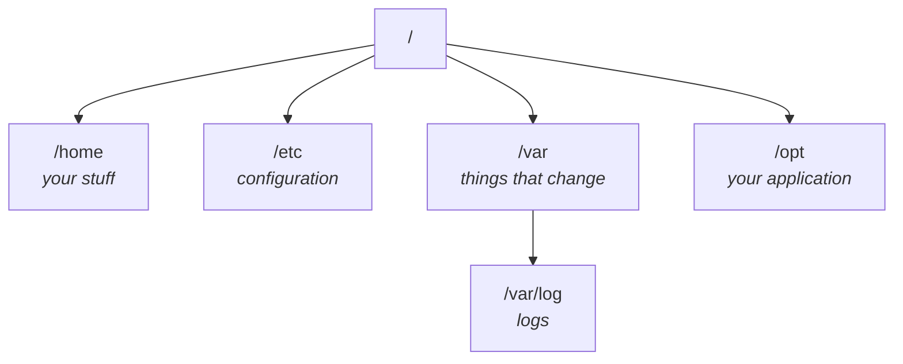
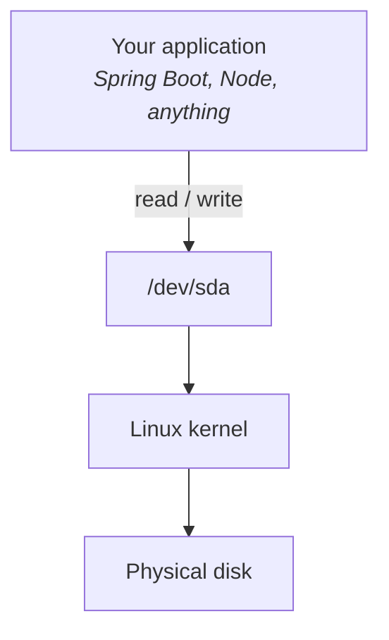

Run `ls` at the root of a Linux machine and about twenty directories come back. You did not create any of them.

The instinct is to memorise the list. Don't — most of it you will never touch. The useful question is narrower: **when I put an application on this machine, where does each piece of it go?**

Four directories answer that, and the rest can wait until something makes you care about them.



Four more get covered along the way — `/root`, `/tmp`, `/usr` and `/dev` — because each of them corrects a misconception rather than just naming a place.

---

## First: you did not make these

A question came up in class that is worth answering before anything else — *"I didn't create these folders. Where did they come from?"*

**Linux created them for itself.** The operating system needs its own files and its own places to put them, and those places exist from the moment the system is installed. You are a guest in a house that was already furnished.

That also explains why the names are terse and slightly cryptic: they were chosen decades ago, for the system's own use, and everyone else has been living with them since.

---

## `/home` — people

Each ordinary user gets a directory under `/home`, named after them:

```
/home/ana
/home/ubuntu
```

This is where a user's own things live — their files, their projects, their personal work. On a desktop machine it is the equivalent of the user folder on Windows or macOS.

It is also, as note `03` showed, **the one place you can create things without asking permission**.

## `/root` — the administrator, and a name collision

`/root` is the home directory of the **root user** — the administrator account.

> [!warning] **`/` and `/root` are two different things and the names actively mislead.**
>
> - **`/`** is the root *of the filesystem* — the top of the whole tree.
> - **`/root`** is a directory *inside* it, belonging to one particular user.
>
> They are unrelated. `/root` sits under `/` exactly like `/home` does. The word "root" is doing two unconnected jobs, which is unfortunate and permanent.

## `/etc` — configuration

Every application has configuration: the settings it reads at startup to know how to behave.

You have seen this in whatever you build with. A Spring Boot application has `application.properties`. A Node.js server has a config file, often JSON. Whatever the language, there is a file somewhere holding the values that change between one environment and another.

> **`/etc` is where that configuration goes on a Linux server.**

Real examples you will meet on machines you did not set up:

```
/etc/nginx/
/etc/ssh/
/etc/hosts
```

And when you deploy your own application, you make your own directory alongside those.

> [!info] **What "etc" stands for is not worth your time.** It is a historical name with a contested expansion, and knowing it tells you nothing. What matters is the association: **`/etc` means configuration.**

## `/var` — things that change while the system runs

`/var` is for data that **changes during normal operation**. Not the program, not its settings — the output and working state.

The one that matters immediately:

```
/var/log
```

**Every log file goes here.** Your application's log, and the logs of everything else on the machine.

Look inside `/var` on a running system and you will also find `lib`, `cache`, `local` and others. On a real server you will meet things like `/var/lib/docker` and `/var/lib/mysql` — programs keeping their working data where working data belongs.

> [!info] **A question from the class, worth keeping.** *"Why would libraries be under `/var`? Libraries don't change."*
>
> They change more than you'd think — you add one, remove one, upgrade one. Anything you install and later modify is closer to "changing data" than to "fixed program", which is the distinction `/var` is drawing.
>
> The practical answer for this course is narrower: **a Spring Boot `.jar` contains its own libraries inside it.** So there is nothing separate to place, and the whole `.jar` goes to `/opt` with the rest of the application.

## `/opt` — your application

`/opt` is short for **optional**: software that is not part of the operating system.

That is exactly what your application is. So:

```
/opt/spring-demo
/opt/node-demo
```

Your code, deployed, lives under `/opt` in a directory named for the application.

## `/tmp` — temporary, and genuinely temporary

`/tmp` holds files that only need to exist for a while — something created mid-way through an operation and thrown away afterwards, an intermediate file, an upload being processed.

```bash
cd /tmp
ls
```

You will see files you did not create. Linux made them, because it needed them.

> [!danger] **Never put anything in `/tmp` that you need to keep.** Linux clears it out from time to time. That is not a bug or a risk — it is the entire purpose of the directory. A file in `/tmp` is a file you have agreed to lose.

---

## `/usr` — installed programs, and a name that misleads

This one catches people, so deal with the misreading first.

> [!warning] **`/usr` is not where users live.**
>
> The name reads as "user", and the natural guess is that it holds home directories. It does not — that is `/home`, from the top of this note.
>
> **`/usr` holds installed software**: programs, the libraries they need, and shared system resources.

### `/usr/bin` — where the commands actually are

Look inside and you get an enormous list of files. That list is the point, because of what those files are:

```
/usr/bin/java
/usr/bin/git
/usr/bin/curl
```

**These are the commands you have been typing.** `ls` is a file on disk. So is `cat`. So is `sudo`. Note `02` made the claim that a command is just a program somebody wrote; `/usr/bin` is where you can go and look at them.

You can ask where any particular one lives:

```bash
which curl
```

```
/usr/bin/curl
```

> [!tip] **This closes the loop on `PATH`.** You type `curl`, not `/usr/bin/curl`, because `PATH` lists the directories the shell searches and `/usr/bin` is on that list. The shell is saving you from typing the full path every time.
>
> It also explains a failure you will hit: if a program expects to find `java` in `/usr/bin` and it is not there, the command does not run. The file exists somewhere, but nothing is looking there.

### `/usr/local` — what the administrator installed by hand

```
/usr/local
```

`/usr/local` is for software installed **locally, by whoever runs the machine**, rather than software that came with the operating system or arrived through its normal package manager.

The class example: you find a monitoring tool on the internet, download it yourself, and it is not part of Ubuntu and never will be. That is a `/usr/local` thing.

> [!important] **Where the line falls is a judgement call, not a rule.** The instructor was explicit about this: it is the administrator's decision what goes where. Most things end up in `bin`. Nothing enforces the split.

> [!info] **A question from the class: "isn't `etc` supposed to be at the root? Why is there one here too?"**
>
> Because the same handful of directory names — `bin`, `etc`, `lib`, `share`, `include`, `man` — get reused at several levels of the tree. There is a `/bin` and a `/usr/bin` and a `/usr/local/bin`.
>
> The names mean the same thing everywhere; what changes is **whose** binaries, **whose** config, **whose** libraries. Read `/usr/local/bin` as "executables belonging to locally installed software" and the repetition stops being confusing.

---

## `/dev`, and the idea behind it

You already know how to work with a file. Four operations, and you have used them in every language you have ever written:

**open · read · write · close**

Open `demo.txt`, read what is in it, write something new, close it. `cat demo.txt` shows you the contents. `nano demo.txt` lets you change them. Nothing surprising.

Now your program needs to write to the hard disk directly. Not to a file *on* the disk — to the disk itself. How?

### The naive answer, and why it does not scale

The obvious design is a dedicated interface for each piece of hardware. An API for disks. A different one for terminals. Another for printers, another for network cards, another for whatever gets invented next.

Follow that through and count the cost:

- Every program that touches hardware has to learn a separate vocabulary for each device.
- Every new kind of device means new operations for every program that wants to use it.
- The operating system has to expose, document and maintain all of those vocabularies forever.

Unix took a different route, and it is one of the ideas the system is genuinely famous for.

> **Everything is a file.**

If the disk *looks* like a file, then the four operations you already know work on it. Open the disk. Write to the disk. Close the disk. No new vocabulary — you are reusing the one thing every program already understands.

> [!info] **This comes from Unix, not Linux.** The phrase predates Linux by two decades. Linux inherited the idea wholesale, which is why it shows up here — and why you will meet the same phrase reading about macOS or BSD.

### Where the devices are kept

`/dev` is short for **devices**, and it is the directory where that idea becomes visible.

List it and the contents look nothing like a normal folder:

```
sda
null
tty0
tty1
loop0
loop1
```

No `.txt`, no `.jar`, no obvious documents. Two of these matter for now.

### `/dev/sda` — the disk

```
/dev/sda
```

**That is your hard disk or SSD**, presented through the filesystem. A program that needs to read from or write to the raw disk does it here.

The chain is worth drawing, because the thing most people get wrong is assuming their program talks to the kernel directly:



Your application reads and writes `/dev/sda`. The kernel is what turns that into actual movement on actual hardware. Your code never has to know how an SSD works.

> [!important] **The refinement that keeps this honest.** `/dev/sda` is not a file that *contains* your disk. It is better understood as **an interface, shaped like a file, through which programs communicate with the disk.**
>
> The course's own written notes make the same qualification about the slogan itself: *"everything is a file"* is **slightly simplified**. It is a good mental model to start from and a bad one to defend literally. The useful version is: *Linux exposes many system resources through filesystem-like interfaces.*

### `/dev/null` — the black hole

```
/dev/null
```

**Anything written to `/dev/null` is discarded.** It does not get stored anywhere, and there is nothing to read back. The instructor's name for it — **the black hole of Linux** — is the one people actually use.

Demonstrating it takes two commands. Normally output goes to your screen:

```bash
echo "Hello DevOps"
```

```
Hello DevOps
```

Send that output to `/dev/null` instead and nothing appears at all:

```bash
echo "Hello DevOps" > /dev/null
```

```
```

The output was produced, handed to `/dev/null`, and ceased to exist.

> [!tip] **`>` is redirection**, and it is worth naming since it appears here for the first time. It takes whatever a command would have printed to your screen and sends it somewhere else instead — a file, or in this case a device that throws it away.

**Why would you ever want output destroyed?** Because a great deal of software is noisy in situations where nobody is watching:

- a script that runs a command whose chatter you do not care about
- a scheduled job that would otherwise mail you its output every time it runs
- a background command you want silent
- a step in a pipeline where only the failures matter

The class flagged this forward: once the course reaches Jenkins and a MySQL server running on the same box, discarding output you did not ask for stops being a curiosity and becomes routine. It also noted that most of the time you are not calling it yourself — **the kernel and the tools you install use it internally**, and you meet it in somebody else's script long before you write one.

> [!info] **It is a device, not a directory.** The class demonstrated this by trying to `cd` into it, which fails. There is nothing to enter — `/dev/null` is a device entry that happens to live in a directory, exactly like `/dev/sda` is.

### A question from the class that needs a correction

> *"So if I want to delete a file, I just put it in null?"*

The answer given in class was yes, and **in spirit that is right** — writing something to `/dev/null` does make it vanish. But the sentence is easy to carry away in a form that will hurt you, so it is worth being precise.

> [!danger] **`/dev/null` discards *output*. It is not a delete command, and `mv` is not the way to use it.**
>
> - **What works:** redirecting a command's output — `some-command > /dev/null`. The output is generated and thrown away.
> - **What does not:** `mv secret.txt /dev/null`. As a normal user this fails outright, because `/dev/null` belongs to the root user. Run it with `sudo` and something worse happens: you **replace the device itself** with your file. `/dev/null` stops being a black hole for every program on the machine until the system rebuilds it, and your file is not deleted at all — it is sitting there, wearing the name `/dev/null`.
>
> **To delete a file, delete the file.** `/dev/null` is for output you never wanted in the first place.

### Two more from the Q&A

> [!info] **"Are `stdin` and `stdout` devices too?"**
>
> Yes — and this is the idea generalising exactly as it should. Standard input and standard output are reached the same way everything else is. That is the whole payoff of the design: one set of operations, applied to programs, hardware, and the streams connecting them.

> [!info] **"Is this a system call?"**
>
> Not quite, and the distinction is worth holding. `/dev` is a **directory structure** — a set of names arranged in the filesystem. System calls are the mechanism by which a program asks the kernel to do something. You reach `/dev/sda` *through* system calls (open, read, write), but `/dev/sda` itself is a name, not a call.

---

## `/proc` — the same trick, applied to running programs

`/dev` exposes hardware. `/proc` exposes something with no physical existence at all: **the programs currently running.**

List it and you get a wall of numbers:

```
1
10
19
194
1000
```

Those are **process IDs**. Every running program on a Linux machine has one — a `PID` — and `/proc` gives each of them a directory named after its number. Note `07` is where processes get taken apart properly; what matters here is that the kernel exposes them *as directories*, using the same trick as `/dev`.

So `/proc/1000` is a directory holding information about whatever is running as PID 1000. The kernel maintains it. Nothing there is a file on your disk in the ordinary sense — the contents are assembled by the kernel at the moment you look.

The demonstration in class is worth repeating for what it reveals: `cd` into one of those directories, run `ls`, and much of it comes back **permission denied**. You are not entitled to inspect the internals of processes that are not yours — which is a preview of note `06`.

> [!important] **Three directories, one idea.**
>
> | Directory | Exposes | As |
> |---|---|---|
> | `/dev` | hardware devices | directory entries |
> | `/proc` | running processes | directories named by PID |
>
> Neither is storing files on your disk. Both are the same design decision: **give it a path, and every tool that already knows how to read a path can reach it.** That is the payoff of "everything is a file" — not that everything *is* one, but that everything can be *reached like* one.

### What to take from it

The slogan is memorable, and memorable slogans get repeated without being understood. The version worth carrying into an interview is the one that names the problem it solves:

> **Programs already know how to open, read, write and close.** Presenting devices through filesystem-like interfaces means every program can talk to new kinds of hardware using operations it already has, instead of learning a new interface per device.

That is why `/dev` looks the way it does, and it is the reason `/dev/null` — a device whose entire job is to be nothing — is a sensible thing to build rather than a joke.

---

## The part people get wrong

> [!important] **This is convention, not enforcement.**
>
> Nothing in Linux *stops* you putting your application in `/home`, your logs in `/opt` and your configuration wherever you like. The system will not object. Every one of those directories is just a directory.
>
> The reason to follow the convention is that **other people — and other tools — expect it.** A monitoring agent looks in `/var/log`. The next engineer looks in `/etc` for the config. Deployment scripts assume `/opt`. Putting things where they are expected is what makes a machine legible to someone who did not build it.

So the layout for the deployment in note `05`:

| Piece | Goes to |
|---|---|
| The application itself (`app.jar`) | `/opt/spring-demo/` |
| Its configuration | `/etc/spring-demo/` |
| Its log output | `/var/log/spring-demo/` |

Three directories, one application, each piece where the next person will look for it.

> [!tip] **The one-line version, for when someone asks you to explain the filesystem.** The instructor's own summary, and it is a good one to have ready:
>
> *In Linux everything is a file. `/proc` holds running processes as directories named by PID. `/dev` holds devices. `/var/log` holds logs. `/etc` holds configuration. `/opt` holds your application. `/usr` holds installed programs and commands.*
>
> Six directories, one sentence each. That is the whole tree as far as this course needs it.

---

*Source: class 2 — 2026-08-09, parts 1–2 (`/home`, `/root`, `/etc`, `/var`, `/opt`, `/tmp`) · class 3 — 2026-08-13, parts 1–2 (`/usr`, `/dev`, `/proc`, "everything is a file"). **This is the one note that spans two classes.***
