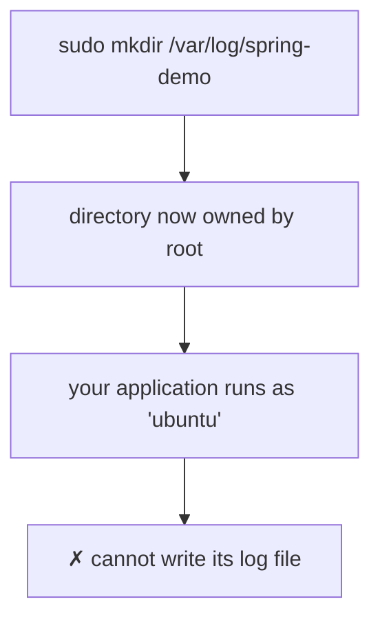
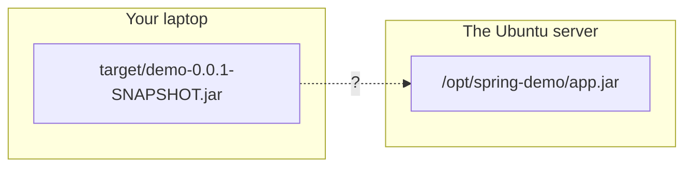
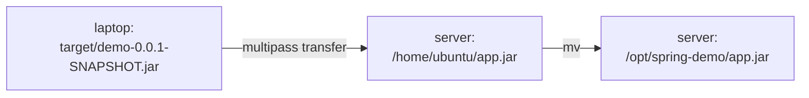
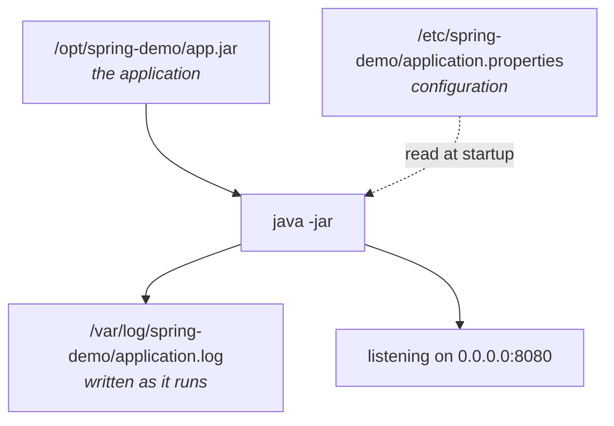
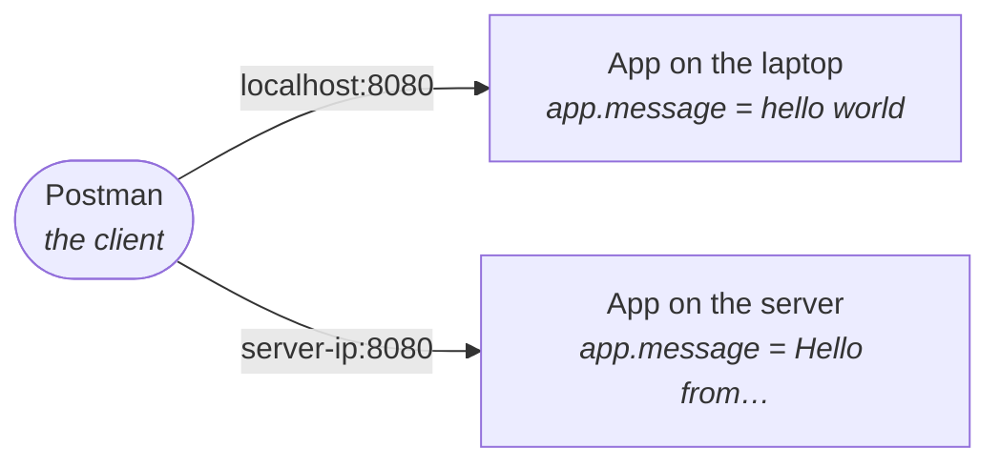
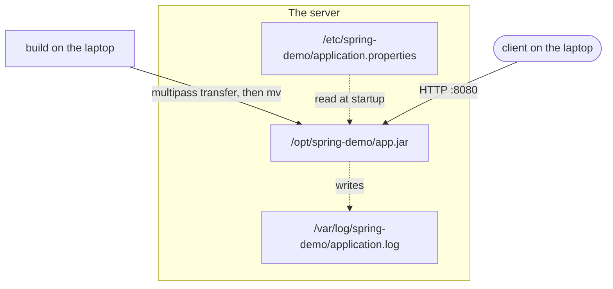

Everything up to here has been Linux for its own sake. This note spends it.

The goal is concrete: **an application written on your laptop, running on the Ubuntu machine, answering requests from outside.** Every command below exists to make that sentence true, and every one of them is done by hand — later modules automate all of it, and the automation only makes sense if you have felt the manual version once.

---

## Making somewhere to put it

You know from note `04` that your application code belongs in `/opt`, its configuration in `/etc`, and its logs under `/var/log`. So go and make those directories:

```bash
cd /opt
mkdir spring-demo
```

```
mkdir: cannot create directory ‘spring-demo’: Permission denied
```

**`/opt` belongs to the system, not to you.** An ordinary user may not create things in it — only inside their own home directory. Note `06` is the full account of why; for now, all you need is the escape hatch.

**`sudo`** runs a single command with administrator privileges. It prompts for your password the first time, and then the command proceeds as though the administrator had run it. This is a legitimate administrative task — you are setting up system directories — so it is the right answer here rather than a reflex:

```bash
sudo mkdir /opt/spring-demo
sudo mkdir /etc/spring-demo
sudo mkdir /var/log/spring-demo
```

All three exist now.

## But `sudo` alone is not enough

Here is where it gets interesting, and where the class's example earns its keep.

The directories exist. But **you created them as the administrator**, which means the administrator owns them. Your ordinary user does not.

Now think about what happens next. Your application is going to run as *you* — as the ordinary user — and it is going to want to write a log file into `/var/log/spring-demo` continuously, appending a line every time a request arrives.

It will not be allowed to. The directory belongs to somebody else.



So creating the directory was only half the job. You also have to hand it over:

```bash
sudo chown -R ubuntu:ubuntu /opt/spring-demo
sudo chown -R ubuntu:ubuntu /var/log/spring-demo
```

Reading that piece by piece:

| Piece | Means |
|---|---|
| `sudo` | you are changing something you do not currently own, so this needs elevation |
| `chown` | **change owner** |
| `-R` | **recursive** — apply to the directory *and everything inside it* |
| `ubuntu:ubuntu` | the new owner, then the new group, separated by a colon |
| `/opt/spring-demo` | what you are changing |

Substitute your own username on both sides of the colon. If your user is `ana`, it is `ana:ana` — on a normal Ubuntu machine your group has the same name as your user, which is why the word appears twice and is not a typo.

> [!danger] **`-R` is not optional here, and leaving it off is a silent failure.**
>
> Without `-R`, `chown` changes the ownership of the directory itself and **nothing inside it**. The command succeeds, prints nothing, and looks like it worked — and then your application fails later on a file it cannot write, in a directory that appears to belong to you.
>
> This happened live in the class: the first `chown` was typed without `-R` and had to be run again. Watch for it.

Ownership and permissions get their own treatment in note `06`. What matters here is only that the gap exists and has to be closed by hand.

### Which directories actually need this

Not all three.

| Directory | Needs `chown`? | Why |
|---|---|---|
| `/opt/spring-demo` | **yes** | the application runs from here |
| `/var/log/spring-demo` | **yes** | a log file is written and appended to constantly, while the app runs |
| `/etc/spring-demo` | no | you write the config **once**, by hand, with `sudo`. The application only reads it |

The distinction is worth stating plainly, because it is the actual principle rather than a rule to memorise:

> **Hand over ownership of the things your application has to write to.** Configuration is something you place once and the application reads; it can stay owned by the administrator.

---

## What is being deployed

A minimal web application with one endpoint. Ask it for `/api/hello` and it answers with a message.

> [!info] **You do not need to know the framework.** The application below is Spring Boot because that is what the class used, and a Node.js version was shown afterwards following exactly the same steps. **The framework is not the lesson.** If you read the code and understand nothing, you have lost nothing — what matters is that a build produces one file, and that file has to travel.

Three details matter later, so notice them now:

```java
@RestController
public class HelloController {

    private static final Logger log = LoggerFactory.getLogger(HelloController.class);

    @Value("${app.message}")
    private String message;

    @GetMapping("/api/hello")
    public String hello() {
        log.info("GET /api/hello endpoint called");
        return message;
    }
}
```

1. **It returns a message it does not contain.** `@Value("${app.message}")` means the text comes from *configuration*, not from the code. Change the configuration and the application says something different without being rebuilt.
2. **It writes a log line** every time the endpoint is called.
3. **It listens on a port** — 8080 by default.

Configuration, logs, and a port. Those are the three things you are about to place on a server by hand.

## Building it into one file

```bash
mvn package
```

This compiles the project and produces a single file under `target/`:

```
target/demo-0.0.1-SNAPSHOT.jar
```

**JAR** is short for **Java archive**. The important property is that it is *self-contained* — the application's own code and every library it depends on, in one file. You can hand that file to a machine with Java installed and it will run.

> [!info] **Two things went wrong here in class, both ordinary.** The first `package` run failed because the project's tests did not pass, and the build was re-run after skipping them. And the very first project had to be regenerated because the initial download unpacked to the wrong name.
>
> Neither is interesting in itself. They are worth recording because **this is what building actually looks like** — the clean single-command version in a tutorial is the exception, not the rule.

Node.js has the same shape: a build step, and one artifact that gets deployed. The name and the tooling differ; the process does not.

---

## The actual problem

You now have a `.jar` file. Where is it?

**On your laptop.** In `target/`, inside a project directory, on the machine you wrote the code on.

And where does it need to be? **On the server** — the Ubuntu machine, which is a completely separate operating system with its own filesystem.



Two machines. Two filesystems. Nothing you have learned so far crosses that gap — `cp` and `mv` move files *within* one machine.

> [!important] **This is the whole reason the next command exists**, and it is worth sitting with for a second. Every deployment problem in this course is a version of this picture: an artifact is here, and it needs to be there, and "there" is a machine you are not sitting in front of.

## Crossing the gap

In this course the Ubuntu machine is a **virtual machine** running on the laptop itself, managed by **Multipass**. So the tool that copies files across is Multipass's own:

```bash
multipass transfer <source-path> <instance>:<destination-path>
```

For a VM named `devops`:

```bash
multipass transfer ~/Desktop/demo/target/demo-0.0.1-SNAPSHOT.jar devops:/home/ubuntu/app.jar
```

Read it as three parts: the file on your laptop, the name of the virtual machine, and where it should land inside it. The file is renamed to `app.jar` on the way — a shorter name to type from here on, and the `.jar` extension is preserved because that is what makes it runnable.

> [!info] **The error worth keeping.** Running this without naming the instance produces:
>
> ```
> An instance name is needed for either source or destination
> ```
>
> Multipass is copying *between two machines*, so at least one side of the command has to say which machine. That is the `devops:` prefix. The error is a good one — it names exactly what is missing.

> [!warning] **On other setups the command is different, but the idea is not.** WSL, a cloud server, a VM under a different manager — each has its own way of moving a file in. The one you will meet most often on real servers is `scp`, which copies over SSH. Look up the one that matches your setup; what you are looking for is always "how do I copy a file from here to there".

## You can only land in the home directory

The `transfer` above put the file in `/home/ubuntu/`, not straight into `/opt/spring-demo/` where it belongs. That was not an arbitrary choice.

**Multipass writes as the ordinary user**, and by now you know what that means: it can write to that user's home directory and nowhere else. `/opt` needs `sudo`, and a file transfer coming in from outside has no way to elevate.

So the file arrives in the home directory first:

```bash
cd /home/ubuntu
ls
```

`app.jar` is there.

## Moving it into place

Now you are inside the server, as a user who owns `/opt/spring-demo` — because you handed it to yourself at the top of this note. So the second hop is an ordinary move:

```bash
mv ~/app.jar /opt/spring-demo/app.jar
```

`mv` is **move**. Same command you would use to move a file between two directories on your own laptop, because that is exactly what this is — both directories are on the server now.

Confirm it landed:

```bash
cd /opt/spring-demo
ls
```

`app.jar`.



Two hops, because the first one could not reach past the home directory.

> [!important] **That is deployment, at its most basic.** A question came up in class — *"what does deployment actually mean?"* — and this is the answer in its plainest form: **the built artifact is sitting on the server, in the place the server expects it.**
>
> Real deployments do not look like this. They use a cloud provider, they build container images, they run a pipeline that does all of it without a person typing anything. Those come later in the course. What you are doing here is the same job **by hand**, so that when a pipeline does it for you, you know what it is doing.

The application is on the server. It cannot run yet — it has no configuration and nowhere to write its logs.

---

## Writing the configuration file

```bash
cd /etc/spring-demo
sudo nano application.properties
```

`sudo`, because `/etc/spring-demo` was made by the administrator and — deliberately — never handed over. The application only ever *reads* this file, so it does not need to own it.

Four settings:

```properties
server.port=8080
server.address=0.0.0.0
app.message=Hello from the Spring Boot application running on Ubuntu
logging.file.name=/var/log/spring-demo/application.log
```

Taking them one at a time, because three of the four are more interesting than they look.

### `server.port`

Which port the application listens on. 8080 is the Spring Boot default.

### `server.address` — the one that catches people

`0.0.0.0` means **listen on every network interface this machine has**.

The alternative, and the default in many setups, is to listen only on `localhost` — which means *"accept connections that originate on this machine, and nothing else"*. That is fine while you are developing, because your browser and your application are on the same computer.

> [!important] **On a server it is exactly wrong.** The whole point of a server is that requests arrive from *somewhere else*. An application bound to `localhost` on a server is unreachable from anywhere but the server itself — it will start cleanly, log nothing unusual, and refuse every connection from outside. That failure looks like a networking problem and is not one.

### `app.message`

The text the endpoint returns. This is the value the code declared with `@Value("${app.message}")` and did not contain.

Notice what this buys you: **to change what the application says, you edit this file and restart it.** No rebuild, no re-transfer. That is the practical argument for configuration living outside the artifact.

> [!info] **"So where does my `.env` file go?"** — a question from the following class, and the answer is the same place: **`/etc`**, for exactly this reason. Environment variables are configuration, `/etc` is where configuration lives, and the payoff is that you change a value without touching code.
>
> This holds regardless of what you deployed. Spring Boot, Node, Django — the language decides the file's *format*, not where it belongs on the machine.
>
> Managed platforms are the exception worth knowing about: deploy to a cloud provider and it will usually offer its own store for environment values instead of a file on disk. Same idea, different mechanism.

> [!important] **The follow-up question is better than the first one:** *"if the same code is deployed to several servers, isn't a fixed path like `/etc/spring-demo/` a problem?"*
>
> No — and seeing why is worth more than the answer. **The code is not shared between those servers. It is copied to each of them.** Every server gets its own copy of the artifact, and its own copy of the configuration at the same path. The path being identical everywhere is the feature: each machine finds its own file exactly where it expects to.
>
> The instructor's phrasing of the general rule is the memorable one:
>
> > **A single point of contact is a myth.**
>
> Databases get replicated. Configuration gets replicated. Storage gets replicated. When you scale from one server to many, the instinct is to look for the one shared copy of a thing — and in a well-built system there usually isn't one, because a single shared copy is a single thing that can fail and take everything with it.

### `logging.file.name`

Where to write the log:

```
/var/log/spring-demo/application.log
```

This is the directory you created above and then handed to yourself with `chown -R`. If you had skipped that step, the application would start and then fail the first time it tried to write a line here.

---

## Running it

```bash
java -jar /opt/spring-demo/app.jar
```

The application starts. The terminal is now occupied by it — the process is running in the foreground, printing as it goes.



Three directories, three roles, one running process. That diagram is the whole deployment in one picture.

---

## Calling it from outside

The application is running on the server. Your API client — Postman, in the class — is on your laptop. Those are different machines, so `localhost` will not reach it.

You need the server's **IP address**:

```bash
multipass info devops
```

This prints the virtual machine's details, including its IPv4 address. On a Multipass VM it will be a private address on your own machine's network, something of the form `192.168.x.x`.

Then, from Postman on the laptop:

```
GET http://<server-ip>:8080/api/hello
```

The response comes back:

```
Hello from the Spring Boot application running on Ubuntu
```

That string came from `application.properties` on the server. Nothing in the compiled `.jar` contains it.

> [!info] **The failure that happened first, and is worth reproducing deliberately.** The initial request was sent to the IP address with **no port**, and the connection was refused.
>
> An IP address alone identifies a *machine*. A machine runs many programs, and a port is what selects between them. Without `:8080`, the request arrives at the default HTTP port — where nothing is listening — and is rejected. The error looks alarming and means only "you did not say which program".

Switch to the terminal where the application is running and the log line is there:

```
GET /api/hello endpoint called
```

Request in, response out, log written. The loop is closed.

---

## Two applications at once

The class finished with a demonstration that makes the client/server split concrete, and it is the best part of the session.

The same application was also started **locally**, in the IDE on the laptop, with a different `app.message` — `hello world`. So two copies were running: one on the laptop, one on the server.

From the same Postman window:

| Request | Reaches | Response |
|---|---|---|
| `http://localhost:8080/api/hello` | the copy on the laptop | `hello world` |
| `http://<server-ip>:8080/api/hello` | the copy on the server | `Hello from the Spring Boot application running on Ubuntu` |



> [!important] **Same client, same endpoint, same port — two different servers, distinguished only by the address.** That is what "client" and "server" actually mean, and why note `01` of module `01` insisted the client is a *program making a request*, not a person.
>
> It also shows configuration doing its job. The two copies are byte-for-byte the same `.jar`. They behave differently because they read different `application.properties` files.

> [!info] **A question from the class:** *"Is it HTTP by default?"* Yes. The requests above are plain HTTP. HTTPS requires a certificate and additional setup, which this deployment does not have.

---

## What you have actually built



Every step of that was done by hand: build, transfer, move, configure, own, run.

> [!danger] **And every step of it is fragile, in ways that are the point of what comes next.**
>
> The application is running in a terminal. Close that terminal and it stops. Reboot the server and it does not come back. If it crashes at three in the morning, nothing restarts it and nobody is told.
>
> That is not a flaw in what you just did — it is the motivation for note `07`. **Services and `systemd`** exist to make a program survive a logout and a reboot, and to restart it when it fails. Doing the deployment manually first is what makes those tools look necessary rather than arbitrary.

---

*Source: class 2 — 2026-08-09, recording parts 2–4.*
