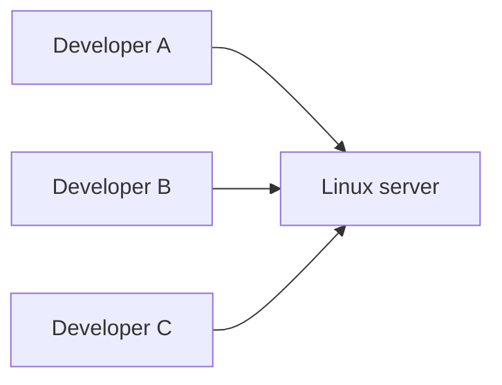
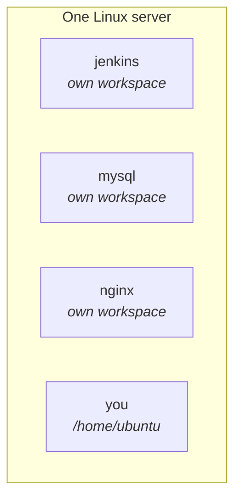
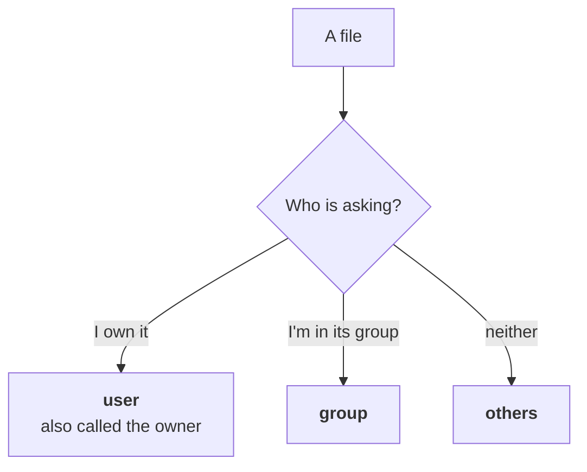
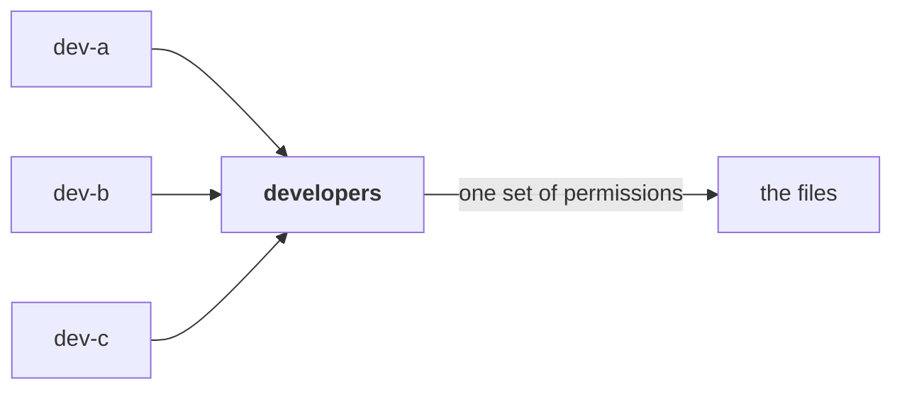
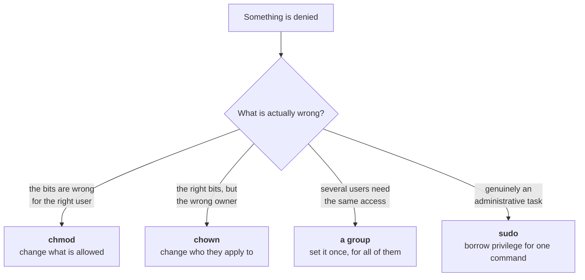

Everything so far worked because you were the only person on the machine. One VM, one login, one home directory. Nothing had to be negotiated.

Now put a real team on that server.



Three people, one machine, all of them writing files and running things. And that is before you count what else is on there: an application, a build server, a database, a web server — each installed by somebody, each writing to disk, none of them aware the others exist.

Something has to decide who is allowed to touch what. That decision is the subject of this note, and Linux's answer starts somewhere unexpected.

---

## Linux was never designed for one person

This is not a feature that was added later. It is a starting assumption:

> **Linux is a multi-user operating system.** It has never assumed that one person is using the machine.

That inheritance is from Unix, built when a computer was a shared and expensive thing and a dozen people worked on it at once. Your laptop having exactly one user is the unusual case, historically — and Linux does not treat it as the normal one.

Everything that follows is a consequence. If several parties share a machine, the system must be able to answer *who is doing this?* before it can answer *are they allowed to?*

## A user is not necessarily a person

Here is the move that makes the model click, and it is the thing most people have backwards.

> **Anything that uses the server is a user.** Human or not.

Two developers with logins are users. So is each of these:

| Also a user | What it is |
|---|---|
| Your Spring Boot application | the thing you deploy in note `05` |
| Jenkins | the build server this course reaches later |
| MySQL | the database |
| NGINX | a web server, and several other things besides |

None of those are people. All of them read files, write files and run programs — which means all of them need an answer to *who is doing this?*

> [!info] **NGINX came up in class and is worth a placeholder answer now**, since it appears repeatedly from here on. It is a **web server**, and it is also commonly used as a **reverse proxy** — something that sits in front of your application and forwards requests to it. It does several other jobs too. The course uses it properly later; for now it is one more thing on the server that needs an identity.

### Why this matters: the workspace

Give every program its own user and something useful falls out. Each one gets its own **workspace** — its own place to keep files, that nothing else has business touching.



The failure this prevents is concrete. MySQL and Jenkins both write files. Without separate identities there is nothing stopping MySQL overwriting a file Jenkins depends on internally — no malice required, just two programs that happened to pick the same path. Separate users means separate territory, and the kernel enforces the boundary rather than trusting everyone to be careful.

> [!tip] **You get this for free, and you should expect it.** Install Jenkins on a Linux server and a `jenkins` user is created automatically, with its own workspace, without you asking. That is not Jenkins being unusually well-behaved — it is the convention every serious piece of server software follows.
>
> So when you meet an unfamiliar account on a server you did not build, the first guess is not "somebody made an account". It is **"something is installed here"**.

---

## Finding out who you are

Every user has a numeric **user ID**, and Linux tracks people by that number rather than by name. The names are for you.

```bash
id
```

```
uid=1000(ubuntu) gid=1000(ubuntu) groups=1000(ubuntu)
```

Three things in that output:

- **`uid`** — the **user ID**. `1000` is conventionally the first ordinary human account created on the system.
- **`gid`** — the **group ID**, which is covered below.
- **`groups`** — every group this user belongs to.

You can see the human accounts a different way, since each gets a directory:

```bash
ls /home
```

```
ubuntu
```

One account on a fresh VM. On a shared team server this list is how you find out who else is on the machine.

> [!info] **Why `1000`?** Numbers below it are reserved for the system and for the accounts that programs run as. When you meet a user with a three-digit or two-digit ID on a server, that is a strong hint it belongs to software rather than a person — and `0` is reserved for exactly one account: `root`.
>
> This detail is not from the lecture; the class showed `uid=1000` without explaining the number. It is included because the convention is universal and it makes an unfamiliar `id` output readable.

---

## The three answers to "who are you?"

When you try to touch a file, Linux asks who you are — and there are exactly three answers it cares about. Not "which of the fifty accounts on this machine", but which of three **relationships** you have to the file in front of you:



| | Means |
|---|---|
| **user** | you are the **owner** of this file — the two words are used interchangeably |
| **group** | you are not the owner, but you belong to the group the file is assigned to |
| **others** | neither of the above — everybody else on the machine |

Three important things about that list:

**Everyone is still a user.** "Group" and "others" are not different kinds of account. A group is a collection of users; others is everyone who did not match the first two tests. Underneath, it is users all the way down.

**The categories are relative to the file, not to you.** You are the owner of the files in your home directory and one of the "others" for a file in `/etc`. Nothing about *you* changed between those two sentences — the file changed.

**Linux checks them in that order** — user, then group, then others — and that turns out to matter more than it looks, as the next section shows.

---

## Seeing it fail

The model is easiest to believe after it stops you. Two commands, in two directories.

In your own home directory, creating things is unremarkable:

```bash
cd /home/ubuntu
mkdir demo
```

It works, and no permission is involved worth mentioning — **you own this directory.** It was made for you when the account was created.

Now the same command one directory over:

```bash
cd /opt
mkdir demo
```

```
mkdir: cannot create directory 'demo': Permission denied
```

Same command. Same user. Refused.

**`/opt` is not yours.** It belongs to the administrator, and you are one of the "others" as far as it is concerned. Nothing about the command was wrong; the answer to *who are you?* was.

> [!important] **This is where `sudo` fits, and where it does not.** `sudo mkdir demo` succeeds, because `sudo` runs the command with administrative privilege rather than as you. The mechanics of it are at the end of this note.
>
> Which is worth being careful about. **`sudo` is not the fix for permission denied — it is the override.** Reaching for it every time you are refused means you have stopped reading what the refusal is telling you.
>
> The course's own written notes are blunt about this: when you see *permission denied*, the question to ask is **why am I denied?** Wrong owner? Wrong permissions? A system directory you should not be writing to at all? Should the application be using a different location entirely? Answer that first. Sometimes the answer really is "this needs administrative privilege", and then `sudo` is correct — but it should be a conclusion, not a reflex.

> [!warning] **Do not become someone who prefixes everything with `sudo`.** A command that fails without it is telling you that you are touching something that belongs to the system — which is information worth registering rather than overriding on autopilot. The habit of typing `sudo` first and reading the error never is how people delete things they did not mean to.
>
> The simpler version of the rule, which covers almost every *permission denied* you will hit while learning: **if you are creating or modifying anything outside your home directory, you will need `sudo`. Inside your home directory, you will not.**

---

## What you are allowed to do: `rwx`

Linux knows who you are. The other half of the question is what that entitles you to, and the answer is a nine-character string you have been looking at without reading.

Three things can be done to a file:

| | | |
|---|---|---|
| **`r`** | read | look at the contents |
| **`w`** | write | change the contents |
| **`x`** | execute | run it as a program |

Three permissions, three audiences, and every file carries an answer for each combination. Nine bits, and that is the entire system.

### Reading `ls -l`

Plain `ls` gives you names. The long form gives you everything else:

```bash
ls -l
```

```
-rw-r--r-- 1 ubuntu ubuntu  1240 Aug 13 21:30 notes.txt
-rw-r--r-- 1 ubuntu ubuntu 18204 Aug 13 20:11 app.jar
```

> [!info] **`-l` is short for "long".** Same listing, with the details attached — permissions, owner, group, size and modification time.

Taking the columns that matter:

| `-rw-r--r--` | the permissions |
| `ubuntu` | the **owner** |
| `ubuntu` | the **group** the file is assigned to |
| `notes.txt` | the file |

Two `ubuntu`s, and they are not the same thing. The first is a user, the second is a group that happens to share its name.

> [!info] **What is your group?** On a normal Ubuntu machine, **your group has the same name as your user.** If you set the machine up as `ubuntu`, your user is `ubuntu` and your group is `ubuntu`. If you created the user under your own name, both take that name. That is why commands later in this note read slightly oddly, with the same word twice. It is not a typo — and the reason it happens is in the groups section below.

### Splitting the string

`-rw-r--r--` is ten characters, and it is only confusing until you cut it in the right places:

```
-  rw-  r--  r--
↑   ↑    ↑    ↑
│   │    │    └── others
│   │    └─────── group
│   └──────────── owner
└──────────────── file type
```

**The first character is not a permission.** A `-` means "this is an ordinary file", and you can ignore it. (A `d` there means directory, which is how you spot them in a listing.)

After that it is three groups of three, always in the same order — **read, write, execute** — and a `-` in any position means *not permitted*.

So `-rw-r--r--` reads as:

| | Permissions | In words |
|---|---|---|
| **owner** | `rw-` | can read, can write, **cannot** execute |
| **group** | `r--` | can read only |
| **others** | `r--` | can read only |

That is the default for a file you create, and it is worth memorising because you will see it constantly.

---

## Watching it stop somebody

Take the file above — `notes.txt` in `/home/ubuntu`, owned by `ubuntu` — and let a second developer try to use it.

They can get to it and read it:

```bash
cd /home/ubuntu
cat notes.txt
```

That works. They are one of the **others**, others have `r`, and `cat` only needs to read.

Then they try to change it:

```bash
nano notes.txt
```

They cannot write. Others have `r--` — no `w`. The file opens, and nothing they type can be saved.

**Nobody was blocked from the directory.** They walked in and read a file that was not theirs, and that was allowed. Permissions are per-file, and "can read" and "can change" are genuinely different questions.

### The same thing on a file that is not yours at all

Now a real system file rather than a friendly example. In `/etc`, files belong to `root`:

```bash
ls -l /etc/some-service.conf
```

```
-rw-r--r-- 1 root root 1875 Jun 14 09:22 /etc/some-service.conf
```

Owner `root`, group `root`, and you are neither — so Linux uses the **others** column, `r--`.

Try to edit it:

```bash
nano /etc/some-service.conf
```

The editor opens the file but refuses to save it. Try to delete it:

```bash
rm /etc/some-service.conf
```

```
rm: cannot remove '/etc/some-service.conf': Permission denied
```

Both refusals come from the same `r--`. You may look. That is all.

> [!important] **Linux uses the first category that matches, and then stops.**
>
> This is the rule that catches people, so take it slowly. Given a file owned by `dev-a` and assigned to the group `developers`, and a user `dev-b` who is *in* that group, Linux asks:
>
> 1. Is `dev-b` the owner? **No** — move on.
> 2. Is `dev-b` in the group `developers`? **Yes** — use the group permissions. **Stop here.**
>
> Others is never consulted. Which produces a result that looks like a bug the first time you hit it: **if the group has fewer permissions than others, being in the group leaves you with less access than a stranger.** Permissions are not added up. The first match wins outright.

---

## Files you can run

`r` and `w` are intuitive. `x` needs a demonstration, because "execute" is doing more work than it appears to.

Some files are meant to be run:

| File | Runnable? |
|---|---|
| `notes.txt` | no — it is text, there is nothing to execute |
| `demo.sh` | yes — a **shell script**, a text file of commands Linux can run |
| `app.jar` | yes, through `java -jar` |

Make one. A `.sh` file is a plain text file whose contents happen to be commands:

```bash
nano demo.sh
```

```bash
echo "Deploying web application..."
```

That is the whole script — `echo` prints its argument, so running this file should print one line.

Now run it:

```bash
./demo.sh
```

```
bash: ./demo.sh: Permission denied
```

> [!info] **`./` is not decoration.** It means "the file named `demo.sh` **in this directory**". Without it the shell searches `PATH` — the list of directories from note `02` — and your current directory is not on that list, so it would report `command not found` instead. Two different failures with two different causes, and the `./` is what distinguishes them.

Check why it was refused:

```bash
ls -l demo.sh
```

```
-rw-r--r-- 1 ubuntu ubuntu 38 Aug 13 22:14 demo.sh
```

`rw-` for the owner. **No `x` anywhere in the string.** You created the file, you own it, you can read and change it — and you cannot run it, because Linux does not hand out execute permission just because a file looks like a script.

---

## `chmod` — changing the answer

```
chmod = change mode
```

That is all the name means, and knowing the expansion makes the command stop looking cryptic.

The form used in class reads almost as a sentence:

```bash
chmod u+x demo.sh
```

**"For the user, add execute, on `demo.sh`."**

```bash
ls -l demo.sh
```

```
-rwxr--r-- 1 ubuntu ubuntu 38 Aug 13 22:14 demo.sh
```

The `x` has appeared in the owner's block. And now:

```bash
./demo.sh
```

```
Deploying web application...
```

> [!tip] **A wrong turn from the class worth keeping.** The first attempt named the user explicitly — putting `ubuntu` in the command — and it failed. `chmod` does not take a username. `u` does not mean "this particular person", it means **"whoever owns the file"**, and since you own it, `u` already refers to you.
>
> If you want to change permissions *for a different user*, that is not what `chmod` does at all — you would change who owns the file, with `chown`, further down this note.

### The whole vocabulary

Every symbolic `chmod` is three choices, and there are only ten symbols to know:

| Who | | Operation | | Permission | |
|---|---|---|---|---|---|
| `u` | user / owner | `+` | add | `r` | read |
| `g` | group | `-` | remove | `w` | write |
| `o` | others | `=` | set exactly | `x` | execute |
| `a` | all three | | | | |

Combine one from each column:

```bash
chmod g+w shared.txt      # group can now write
chmod o-r secret.txt      # others can no longer read
chmod u+rw file.txt       # owner gets read and write
chmod g+rx deploy.sh      # group gets read and execute
chmod o-rwx secret.txt    # others get nothing
```

> [!warning] **`=` is not a third way of saying "add".** `chmod u=rw secret.txt` sets the owner's permissions to **exactly** read and write — so if the owner previously had `rwx`, execute is now gone, because `x` was not in the list.
>
> `+` and `-` adjust what is there. `=` replaces it. Reaching for `=` when you meant `+` is a quiet way to remove a permission something else depended on.

### Taking one away

Removal works the same way, and the failure it produces is a good one to see on purpose:

```bash
chmod u-w notes.txt
nano notes.txt
```

The editor opens, and along the bottom:

```
File 'notes.txt' is unwritable
```

You own the file. You just removed your own ability to change it, and the editor is telling you before you waste any typing. Put it back:

```bash
chmod u+w notes.txt
```

and the file is editable again.

---

## The same thing as numbers

You will not get far in DevOps before meeting a line like this in somebody's deployment script:

```bash
chmod 755 deploy.sh
```

No `u`, no `+`, no `x`. Three digits, and they mean exactly the same thing as the symbolic form — the same nine bits, written a shorter way.

### Three numbers, one rule

Each permission is assigned a value:

| Permission | Value |
|---|---|
| **read** | `4` |
| **write** | `2` |
| **execute** | `1` |

To describe a set of permissions, **add up the ones you want**.

| Wanted | Sum | As `rwx` |
|---|---|---|
| read + write + execute | 4 + 2 + 1 = **7** | `rwx` |
| read + write | 4 + 2 = **6** | `rw-` |
| read + execute | 4 + 1 = **5** | `r-x` |
| read only | **4** | `r--` |
| write + execute | 2 + 1 = **3** | `-wx` |
| nothing | **0** | `---` |

> [!warning] **Do the addition carefully — it is easier to fumble than it looks.** The class slipped on this live, calling `4 + 2` seven at one point and five at another, and it is worth naming because the same slip in a script produces a file with permissions you did not intend and no error message to tell you.
>
> Read is 4, write is 2, execute is 1. **`4 + 2 = 6`.** Write it down once and check yourself against the table above until it is automatic.

### Why those numbers and not 1, 2, 3

Because every combination has to produce a **unique** total, and 4/2/1 is the smallest set that does.

Each is a distinct power of two, so no two combinations can add to the same number. Try it with 1, 2, 3 instead and `1 + 2` collides with `3` — the digit becomes ambiguous and the whole scheme falls apart.

> [!info] **A question from the class: "can I use 3?"**
>
> Yes — `3` is a perfectly valid digit. It just is not a permission in its own right; it is `2 + 1`, which is **write and execute, without read**. Every digit from 0 to 7 is reachable, and 7 is the maximum because 4 + 2 + 1 is everything there is.
>
> Anything above 7 in a position is meaningless. Below is fine: **`0` is how you deny everything**, and it is used constantly.

### Three digits, three audiences

The digits are positional, and the order is the one you already know:

```
chmod 755 deploy.sh
       ↑↑↑
       ││└── others
       │└─── group
       └──── user (owner)
```

So `755` unpacks as:

| Digit | Audience | Means |
|---|---|---|
| `7` | owner | `rwx` — read, write, execute |
| `5` | group | `r-x` — read and execute |
| `5` | others | `r-x` — read and execute |

giving `-rwxr-xr-x`. That is the standard setting for a script: **the owner can edit and run it, everybody else can run it but not change it.**

A few you will actually meet:

| Command | Result | Reads as |
|---|---|---|
| `chmod 644 notes.txt` | `-rw-r--r--` | owner can edit, everyone can read — the default for a data file |
| `chmod 755 deploy.sh` | `-rwxr-xr-x` | the standard for a script or a directory |
| `chmod 744 notes.txt` | `-rwxr--r--` | owner does everything, others read only |
| `chmod 000 notes.txt` | `----------` | nobody can do anything |
| `chmod 777 notes.txt` | `-rwxrwxrwx` | everybody can do everything |

The class demonstrated `000` on purpose, and it does exactly what it says — every permission stripped from every audience, including you. The file is still yours, so you can hand them back with another `chmod`, but until you do, you cannot read your own file.

### `777` is the one to be careful with

`chmod 777` appears in an enormous amount of tutorial content and StackOverflow advice, always in the same context: something returned *permission denied*, and this made it stop.

> [!danger] **`chmod 777` does not fix a permission problem. It deletes the permission system for that file.**
>
> Owner, group and every other account on the machine can now read it, change it, and execute it. If the file is a script, anyone on that server can edit what it does and it will still run. If it holds configuration, anyone can rewrite it.
>
> It usually does clear the immediate error, which is exactly why it spreads — the error goes away and the security problem it created is silent.

The question the course's written notes tell you to ask instead is short and it is a good one:

> **Which user actually needs which permission?**

Usually the answer is one user needing one permission, which is a `chmod u+w` or — more often — not a permissions problem at all, but an ownership problem. The file belongs to the wrong user, and the fix is to change who owns it rather than to open it to everybody.

### Which form should you use

Both do the same job, and the class stated a preference worth passing on:

| | Good for |
|---|---|
| **Symbolic** (`chmod u+x`) | changing **one thing** without touching the rest — add execute for the owner and leave everything else alone |
| **Numeric** (`chmod 755`) | setting **all nine bits at once** to a known state |

The instructor's own preference was symbolic, for exactly the reason above: `u+x`, `g-w`, `o+r` let you adjust a single permission by name, while a numeric mode always rewrites everything.

> [!tip] **You need to be able to read numeric even if you never write it.** Scripts, Dockerfiles, Ansible playbooks and configuration-management tools use the numeric form almost exclusively, because they are declaring a complete desired state rather than making an adjustment. When you meet `0644` in a config file, that is this — the leading zero is a separate flag you can ignore for now.

### One more column in `ls -l`

A question came up that is worth capturing, because the answer is genuinely obscure and the instructor was straight about not knowing it off the top of his head:

```
-rw-r--r--  1  ubuntu  ubuntu  1240  Aug 13 21:30  notes.txt
            ↑
```

**That number is the hard link count** — how many directory entries point at this same data on disk.

For an ordinary file it is `1`, which is why it looks like a constant and gets ignored. For a directory it is usually 2 or more, because a directory contains entries referring back to itself and to its parent.

> [!info] **You will almost never need this**, and the class's conclusion was the right one: it stays at `1` for regular files, so nobody notices it. It is included here only so that the column is not a permanent small mystery in a listing you look at every day.

---

## What `chmod` cannot do

A fair question came up in class: *if anyone can run `chmod`, can't I just give myself permission to anything?*

No — and the demonstration is the important part.

```bash
cd /etc
chmod o+w some-service.conf
```

```
chmod: changing permissions of 'some-service.conf': Operation not permitted
```

> [!important] **You can only change permissions on files you own.**
>
> `chmod` sets what the permission bits say. It does not decide whether you are entitled to set them — **ownership** does that, and ownership is not something you can hand yourself.
>
> Every `chmod` above worked because it ran inside `/home/ubuntu`, on files owned by `ubuntu`. Move to `/etc`, where `root` owns everything, and the same command is refused before it starts.

---

## Groups — a name for several users

Every permission string so far has had a middle section nobody explained. Time to fix that, and the way in is a problem that `chmod` alone cannot solve.

You have two hundred files. Three developers need read and write access to all of them.

Do it with what you know and you are setting permissions per user, per file, by hand — and then doing it again when a fourth developer joins, and unpicking it when one leaves. It does not scale, and worse, it drifts: after a few months nobody can say with confidence who has access to what.



Create a group, put the users in it, assign the files to it, and set the group's permissions **once**. Every member gets that access. Add a fourth developer to the group and they inherit it immediately, with no file touched.

That is the middle three characters of every permission string: what members of the file's group may do.

### Why your files already have a group

Look at anything you own and the same name appears twice — `ubuntu ubuntu`, or `root root`. You never created that group.

> [!info] **Creating a user automatically creates a group of the same name**, and the user is its only member. So a fresh account is its own private group of one.
>
> This is why the doubled names appear everywhere and look redundant. They are not redundant, they are just uninteresting — the group mechanism is present and doing nothing, because there is nobody else in the group to affect.
>
> It becomes interesting the moment you make a real group and put several people in it. The class's own approach: rather than adding one person to another person's automatic group, create a new named group like `developers` and put everyone in that.

> [!important] **This is where the first-match-wins rule starts to bite.** A user who is in a file's group gets the **group** permissions — not the owner's, and not others'. Adding somebody to a group can therefore *reduce* their access, if the group's permissions are tighter than others'. Granting access is the usual intent; check that it is the actual effect.

---

## `chown` — changing who owns a file

```
chown = change owner
```

The naming follows `chmod` exactly, and so does the reasoning: `chmod` changes what the permissions *say*, `chown` changes **who they apply to**.

```bash
sudo chown root demo.sh
```

Try it without `sudo` and:

```
chown: changing ownership of 'demo.sh': Operation not permitted
```

> [!important] **Giving a file away requires privilege, and that is deliberate.** If any user could reassign ownership at will, the permission system would be trivially escapable — you would simply hand yourself anything you wanted. Changing ownership is an administrative act.

Check the result:

```bash
ls -l demo.sh
```

```
-rwxrw-r-- 1 root ubuntu 38 Aug 13 22:14 demo.sh
```

The owner is now `root`. The permission bits **did not change** — `rwx` still sits in the owner's position, it simply applies to somebody else now. And note what that means for you: you were the owner a moment ago, and now you are one of the *others*, reading the last three characters instead of the first three.

### Owner and group together

```bash
sudo chown root:root demo.sh
```

`user:group` — the new owner, then the new group, separated by a colon. Both change in one command. Substitute your own username on both sides if you are handing something to yourself: if your user is `ana`, it is `ana:ana`.

### Whole directories

For a directory and everything inside it:

```bash
sudo chown -R myapp:myapp /opt/myapp
```

| Piece | Means |
|---|---|
| `sudo` | you are changing something you do not currently own, so this needs elevation |
| `chown` | **change owner** |
| `-R` | **recursive** — apply to the directory *and everything inside it* |
| `myapp:myapp` | the new owner, then the new group |
| `/opt/myapp` | what you are changing |

> [!warning] **`-R` is capital, and lowercase `-r` is not an abbreviation for it.** The class typed `-r` first and got:
>
> ```
> chown: invalid option -- 'r'
> ```
>
> which is the good outcome, because it fails loudly.

> [!danger] **Leaving `-R` off entirely is the dangerous version, because it is a silent failure.**
>
> Without `-R`, `chown` changes the ownership of the directory itself and **nothing inside it**. The command succeeds, prints nothing, and looks like it worked — and then your application fails later on a file it cannot write, in a directory that appears to belong to you.
>
> This happened live in the class: the first `chown` was typed without `-R` and had to be run again. Watch for it.
>
> The opposite mistake is worse. A recursive ownership change on the wrong directory affects an enormous number of files, silently and successfully. Check the path before pressing enter.

### `chgrp` — the group on its own

```bash
sudo chgrp developers demo.sh
```

Changes only the group, leaving the owner alone. It exists, it works, and you will rarely reach for it — `chown owner:group` does the same job and one more. The class's own summary was that in practice you use `chmod` and `chown`, because groups usually already exist on a team's server.

> [!tip] **Three commands, and the names tell you everything.** `chmod` = change **mode**. `chown` = change **owner**. `chgrp` = change **group**. Once the expansions are in your head, none of them are cryptic, and the first two are the ones that matter.

---

## The root user

Every Linux system has one account that the permission system does not constrain:

> **`root` is the superuser.** Its authority extends over essentially the entire system, and it is identified by **UID 0** — that number, rather than the name, is what actually confers the privilege.

Everything in this note has been about restricting what a user can do. Root is the account those restrictions do not apply to, and it exists because somebody has to be able to install software, create users and repair the system.

### Why you do not simply use it

You can log in as root. The class was clear that you should not, and gave the reason that actually lands:

> [!danger] **A mistake as root is unbounded and irreversible.**
>
> Run `rm` against the wrong directory as an ordinary user and you get *permission denied* — the system stops you, and the mistake costs you nothing. Run the same command as root and it succeeds. System files, other applications, other users' data.
>
> There is no undo, no recycle bin, and no confirmation. The class's summary: you can destroy the entire server, take multiple applications down with it, and **not be able to reverse any of it**.

There is a second reason, from the course's written notes, that matters more as soon as anything faces the internet: **if an application runs as root and is compromised, the attacker inherits root.** The same breach against an application running as its own restricted user is contained to whatever that user could reach.

Both reasons are the same principle:

> **Principle of least privilege** — give every user and every process exactly the permissions it needs to do its job, and nothing beyond that.

### `sudo` is how you borrow it

```
sudo = super user do
```

`sudo` runs **one command** with administrative privilege, then you are back to being yourself. That scope is the entire point — you are not root, you briefly acted as root, and only for the command you explicitly marked.

Three practical things the class demonstrated:

**It asks for your password, once.** After the first `sudo`, subsequent ones within a short window do not re-prompt. That is convenience, and it is also worth knowing: an unattended terminal shortly after a `sudo` is more dangerous than it looks.

**The password requirement is a feature, not friction.** Knowing it means you are an administrator, and typing it makes each privileged command a deliberate act rather than a reflex.

**It does not work on everything.** `sudo cd /root` does not do what you expect — and the reason is one you already know. `cd` is a **shell builtin**, from note `02`: it is not a program that `sudo` can run on your behalf, it is the shell changing its own state. `sudo` starts a new process, that process changes *its* directory, and it exits.

> [!tip] **That is the same argument as "why can't `cd` be an external command?"**, arriving from a different direction, and being able to connect the two is a good sign you actually understand it rather than having memorised it.

---

## Where this leaves you



Four tools, four different diagnoses, and the reason to keep them separate is the one from the top of this note: *permission denied* is a question. These are the four answers, and reaching for `sudo` or `chmod 777` every time means you stopped reading the question.

And notice the shape of the problem underneath, because it recurs constantly in operations work: **the thing that creates a resource and the thing that uses it are often not the same identity.** You make a directory as the administrator. Your application runs as an ordinary user. Somebody has to bridge that gap explicitly, and nothing will do it for you — which is exactly what note `05` ran into when it created three directories as the administrator and then had to hand two of them back.

---

*Source: class 3 — 2026-08-13, recording parts 2–3.*
