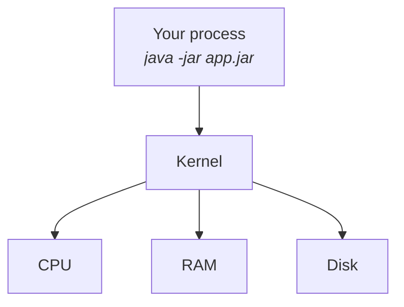
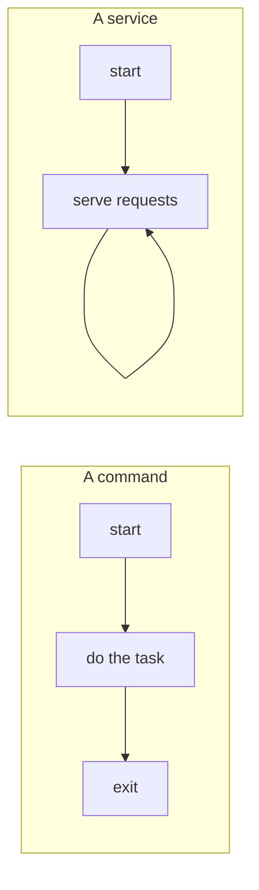
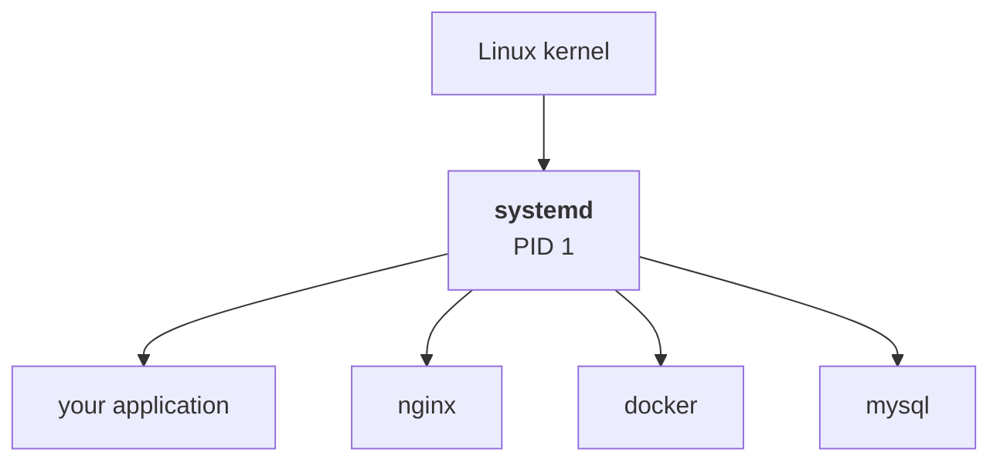

Note `05` finished with a Spring Boot application running on a server and a problem it could not solve: close the terminal and the application dies. Something has to keep it alive.

Getting to that answer needs three words that are used loosely and mean different things.

---

## Program and process

Your application, sitting on disk, is a **program**:

```
/opt/spring-demo/app.jar
```

That is instructions in a file. It occupies disk space and does nothing else. The same is true of a Node.js application, a Django project, or Chrome the moment after you install it.

Run it:

```bash
java -jar app.jar
```

and Linux creates a **process** — a running instance of those instructions.

| | |
|---|---|
| **Program** | static. Instructions stored on disk. |
| **Process** | dynamic. A running instance of a program, consuming real resources. |

The class's example is the one that sticks: **Chrome is a program until you open it.** Then it is a process, occupying memory and consuming CPU time. Note `01` introduced the word in passing — this is the whole of it.

> [!important] **One program can become many processes.** `app.jar` exists once on disk. Run it three times and Linux creates three independent processes with three separate identities — same instructions, three separate running things, each with its own memory.
>
> Which is why "is the application running?" is a question about processes, not about whether the file is present.

> [!info] **A question from the class: process versus thread.** A **process** is a running program. A **thread** is the smallest individual unit of execution inside one — and a single process can have many threads running concurrently. The distinction matters in application code more than it does in DevOps work, but it comes up in interviews often enough to be worth having in one sentence.

### What a process actually costs

Watch the Spring Boot application start and the resource use is visible in the logs. It runs an embedded Tomcat server, which means every incoming request has to be handled — that is **CPU time**. It holds objects in memory — that is **RAM**. It writes a log file — that is disk.

None of it reaches the hardware directly:



The process asks; the kernel decides and does it. That is the same arrangement as `/dev/sda` in note `04`, the same arrangement as the system calls in note `02`, and the same arrangement as the permission checks in note `06` — **the kernel is the thing in the middle, every time.**

---

## PID — the name a process is known by

Every process gets a number when it starts:

> **PID** — process ID. Unique among the processes currently running.

Linux tracks processes by that number, and so do you. It is also the number naming each directory under `/proc`, from note `04`.

To see what is running:

```bash
ps
```

```
  PID TTY          TIME CMD
 2280 pts/0    00:00:00 bash
 3891 pts/0    00:00:00 ps
```

> [!info] **`ps` means process status.** By default it shows only the processes attached to your current session — which is why a fresh terminal shows almost nothing.
>
> Note the second row. **`ps` itself appears in its own output**, because running it created a process too. That is not a quirk; it is the model being consistent.
>
> The first row is worth noticing too: **your shell is a process.** `bash` is a program like any other, and when you run `ls`, that is one process starting another and waiting for it to finish.

The demonstration in class made the point properly. Start the Spring Boot application in one terminal, open a second one into the same machine, and run `ps` there:

```
  PID TTY          TIME CMD
23878 pts/1    00:00:04 java
```

**`java`, PID 23878.** Your application, visible as a running thing with an identity, from a completely separate session.

That number is what you use when you need to act on it — inspect it, or stop it.

### `kill` is not what it sounds like

```bash
kill 23878
```

The name is misleading. A plain `kill` is **a polite request**: it asks the process to shut down cleanly — close its open files, release its resources, finish what it is doing and exit.

> [!important] **A well-behaved process obeys, and that is what you want.** A database given a graceful shutdown flushes to disk before exiting. Killed abruptly, it does not.
>
> Which means the sequence matters when something will not stop: **ask first.** Only escalate to a forceful signal if the process ignores the request — and understand that forcing it gives the process no chance to clean up.

---

## Service — a process that is supposed to stay running

Some processes are meant to start, do a job, and exit. `ls` is one. So is `ps`.

Others are meant to never stop:



> **A service is a long-running process** — something expected to keep running and keep serving, without anyone sitting at a terminal.

Your Spring Boot application is one. So are all of these, and you will meet every one of them in this course:

| | |
|---|---|
| **NGINX** | the web server from note `06` |
| **MySQL** | the database |
| **Jenkins** | the build server |
| **Docker daemon** | the thing that runs containers |
| **SSH server** | how you reached the machine in the first place |

The expectation is 24/7. Not literally — servers crash, machines get restarted, deployments happen — but the *intent* is continuous availability, and anything that stops is an incident rather than a normal ending.

> [!info] **A service is not a different kind of thing from a process.** A question in class asked exactly this, and the answer is worth being precise about: a service **runs as** one or more processes. "Service" describes the role and the expectation — long-running, managed, providing functionality — not a separate mechanism. Underneath, it is processes and the kernel, like everything else.

---

## `systemd` — the thing that manages services

Here is the gap. You can start your application with `java -jar app.jar`. What you cannot do with that command alone is answer any of the questions that come next:

- What starts it again when the machine reboots?
- What restarts it if it crashes at three in the morning?
- Which user does it run as?
- Where do its logs go?
- What has to be running before it starts?

Something has to sit above the process and manage it. On Ubuntu — and on most modern Linux distributions — that something is **`systemd`**.



`systemd` is a **system and service manager**. It is one of the first things the kernel starts, and it normally runs as **PID 1** — the first process, and the ancestor of everything else running on the machine.

> [!info] **This is an introduction, not the treatment.** The class gave `systemd` a few minutes and flagged that it gets used heavily later, particularly once the course reaches Jenkins and the tools that have to survive a reboot.
>
> What to hold onto for now is the one-line version: **`systemd` manages long-running processes.** Everything else — unit files, `systemctl`, `journalctl`, restart policies — is detail layered on that.

> [!info] **A question from the class: "isn't `init` the thing that does this?"** It was, historically, and some systems still use it or an alternative. The instructor's answer went to the level underneath: whatever the service manager is, **everything still depends on the kernel** — a service is a program too, just a long-running one, and the manager is itself a process the kernel started.

> [!tip] **This is the answer to note `05`'s closing problem.** That note ended with an application that dies when you close the terminal and asked what to do about it. This is what to do about it: stop starting it by hand, and hand it to the thing whose job is keeping services alive.

---

## Where Linux ends

That closes the Linux portion of the course. Worth being honest about the scope: this was never a complete treatment of the operating system — how the kernel schedules, how memory management works, and most of what a Linux administrator knows is all untouched.

What it does cover is the part that DevOps work actually collides with:

| | |
|---|---|
| **Filesystem** | where applications, configuration and logs belong |
| **Users and groups** | who is performing an operation |
| **Permissions** | what that user is allowed to do |
| **Program vs process** | static instructions versus a running instance |
| **PID** | the identity of a running process |
| **Service** | a process expected to stay up |
| **`systemd`** | what manages services |

Each one exists on this list because it is the thing that breaks. An application that will not start, a build that cannot write, a service that dies on reboot — those are the failures, and they are all somewhere in that table.

If a new command turns up later in the course, it gets learned where it appears. The instructor's own framing: most of Linux is here, and the rest is picked up in context when a tool needs it.

---

*Source: class 3 — 2026-08-13, recording part 3.*
