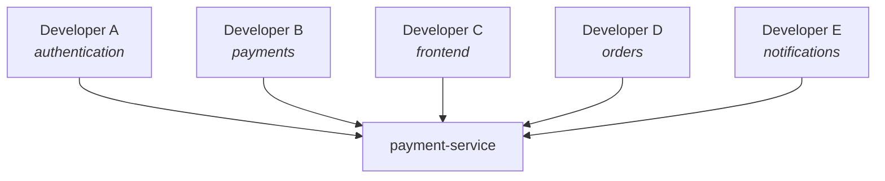
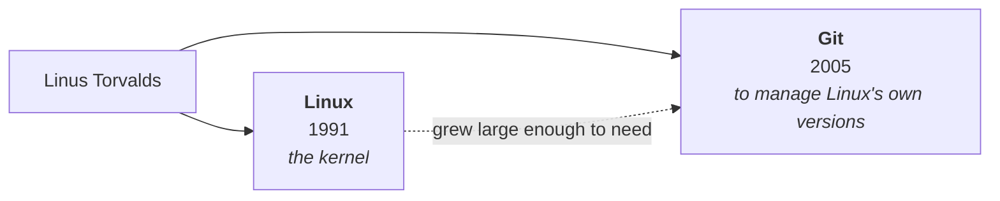
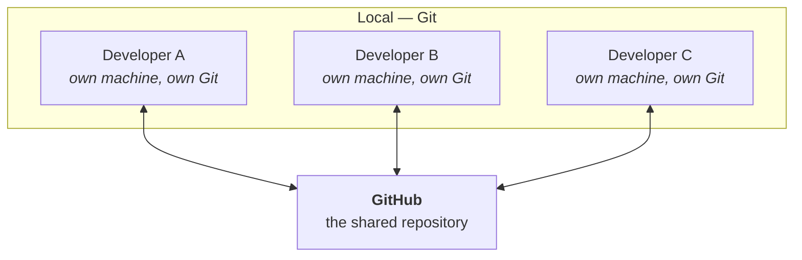

Linux is finished, and the next tool is the one you will touch more often than any other in this course. Every tool still to come leans on it — the build server pulls from it, the container image is built from it, the deployment is triggered by a change to it.

Which sets the bar higher than you might expect.

> [!important] **A developer can get by knowing five Git commands. A DevOps engineer cannot.**
>
> As a developer you `pull`, `add`, `commit`, `push`, and occasionally `merge`, and that is genuinely enough to do the job. In DevOps, Git is the thing pipelines are wired to — so you need to know **how it works underneath**, not only which command to type. The instructor was explicit that this module goes deeper than a developer's working knowledge, and that it is a mix of practical and theoretical rather than either alone.

So start at the bottom: not with what Git does, but with the problem that makes it necessary.

---

## Four days on a payment service

You are building a service that handles payments.

| | |
|---|---|
| **Day 1** | The payment API works |
| **Day 2** | You add discount logic |
| **Day 3** | You refactor the payment logic |
| **Day 4** | Everything is broken |

Somewhere in that refactor you introduced a bug. The code no longer works and you cannot see why.

What you want at that moment is simple to say: **take me back to how the project looked on Day 2.** Not to a backup of one file — to the state of the whole project, as it was, at a moment you know was working.

Without a tool for it, you cannot have that. The Day 2 version does not exist anywhere. You overwrote it.

## The naive fix, which works exactly once

Everyone reaches the same answer independently: **copy the folder before you change it.**

```
payment-service/
payment-service-final/
```

And for one person over one day, this is completely adequate. You have Day 1 preserved, you work in the copy, and if the copy breaks you delete it and start again. There is nothing wrong with the idea.

Run it for a week, though, and it turns into this:

```
payment-final
payment-final2
payment-working
payment-final-working
payment-final-final
payment-final-final-2
```

The instructor's own version of this was a college resume — save it, rename it `resume-final.pdf`, then think of one more change, and now you need a name for the thing that comes after "final".

> [!tip] **The word "final" is the tell.** We reach for it to mean *this is the finished one*, and the reason the list above keeps growing is that **you never know in advance when you will need to go back.** Every one of those folders was "final" at the moment it was named.

Break it properly, though, because the naming is the least of it. This scheme cannot answer any of the questions you will actually have:

- **Which of those folders is Day 2?** The names record your mood, not the date or the content.
- **What changed between two of them?** Nothing tells you. You would have to compare every file by hand.
- **Why was it changed?** That reasoning existed only in your head, and it is gone.
- **What if the project is 400 MB?** Now every "version" is another 400 MB of near-identical files.

And then the part that kills it outright.

## Now put five people on it

Manual copying is a single-player solution. Real projects are not single-player:



Five people editing the same project, and now the questions get sharper:

- **Who changed this particular line?**
- **When, and why?**
- **Can two people work at the same time without overwriting each other?**
- **Can someone experiment without endangering the code that works?**
- **Can changes from five people be combined into one project?**

There is no folder-naming convention that answers those. This is a different class of problem, and it needs a real tool.

---

## Version control, defined

> **A version control system tracks changes to files over time, so that you can inspect, compare, collaborate on, and restore different versions of a project.**

**Git is a version control system.** That is the whole of what it is.

Instead of a pile of manually copied folders, Git records **meaningful versions of the project** — each one a deliberate, labelled point in its history. The class's framing of what that buys you:

| You say | Git says |
|---|---|
| "Take me back to the previous version" | Yes |
| "Take me back to the very first version" | Yes |
| "Let me try something risky and throw it away if it fails" | Yes — and your working code is untouched |

That third one is worth pausing on, because it is the one people underestimate. Being able to **experiment without endangering what already works** is not a convenience feature; it is what makes it safe to change anything at all. The mechanism behind it is branching, which the course reaches later.

---

## The same person wrote Linux and Git

A genuinely good piece of trivia, and it is not only trivia.

The Linux kernel — the subject of the last three classes — was one person's project. **Git was that same person's next one.**

The reason connects the two directly: he had built a kernel that a large number of people were now contributing to, and **he needed a way to manage its versions.** Nothing available did the job the way he wanted, so he wrote an entire piece of software to do it. That software is Git.



> [!info] **Git was built to solve its author's own problem, and it shows.** Git is unusually fast at operations that a kernel-sized project with thousands of contributors performs constantly — branching, merging, and asking what changed. That is not an accident of design; those were the operations that hurt.

> [!warning] **Added beyond the lecture.** The class gave the origin as "he needed to manage Linux's versioning". The fuller version: the Linux project had been using a proprietary tool called **BitKeeper**, and in 2005 the free access it had been granted was withdrawn. Git was written in the weeks that followed. Not needed for anything in this course — it is here because the "why 2005, fourteen years after Linux?" question is otherwise left hanging.

---

## Git and GitHub are not the same thing

This is the confusion to clear before anything else, because the names invite it. People hear *Git*, then hear *GitHub*, and assume one is shorthand for the other.

They are related. They are not the same, and the difference is exactly the local/remote split.

### Git

> **Git is a version control system that runs on your own machine.**

It lives on your computer. It manages the versions of your code locally. It needs no internet connection, no account, and no server — a Git repository on a laptop that has never been online is a complete, fully functional Git repository.

### GitHub

> **GitHub is a cloud platform that hosts Git repositories.**

It takes the work you do with Git and makes it possible at cloud level — so that multiple people, typically in one organisation, can work on the same application.

The unit of storage on GitHub is a **repository**: one project, with its full history, that many people can work in at once.



**Each developer has a complete Git repository on their own machine.** They make changes locally, and then send those changes up to GitHub. That is the shape of the whole system, and it is worth noticing how unusual it is: there is no single central copy that everyone edits. There are many complete copies, and one of them is agreed to be the one that matters.

### What goes wrong without the shared server

The class made the case with a worked example — an alternative to a well-known food-delivery app, called **Tomato**. Several developers, one application, everyone working at once.

Three things go wrong immediately:

- **One developer changes something.** Another developer's change **overwrites** it.
- **A third developer needs the latest change** and has no way to know it exists.
- **The code breaks in production.** Now: *who do we blame?*

That last one was the instructor's emphasis, and it is the one people find surprising. The code is broken, three people touched it today, and **you cannot assign responsibility** — not to punish anyone, but because you cannot fix a bug whose origin you cannot find.

### What GitHub gives you on top

Once every change goes through a shared repository, the questions above stop being unanswerable:

| | |
|---|---|
| **Attribution** | Point at **the exact line** that caused the issue, and at the change that introduced it |
| **History** | Move back to a previous version of the code |
| **Deployment** | Deploy from a known, named version rather than from whatever is on someone's laptop |
| **Review** | **Reject a pull request** — "I have looked at this change, I want more work done on it, and I will not merge it into the main code" |

That last row is the one that changes how a team behaves. A **pull request** is a proposal: *here is my change, please consider merging it*. It can be discussed, amended, and refused. Nobody's work lands in the shared code merely because they wrote it.

> [!info] **Local branch and remote branch — named here, explained later.** A branch you create on your own machine is a **local branch**; its counterpart on GitHub is a **remote branch**. You work locally, then **push**, and your local changes arrive in the remote branch. Every developer does the same thing against the same remote. The class flagged branches as a topic of their own and moved on; the mechanics come later in the module.

### GitHub is not the only one

GitHub is a product built around Git, and it has competitors:

| | |
|---|---|
| **GitHub** | The most widely used, and the one this course uses |
| **GitLab** | The main alternative; strong built-in CI/CD |
| **Bitbucket** | Common in organisations already using Atlassian's other tools |

> [!important] **Git is the technology; GitHub is a vendor.** This is why the distinction is worth being precise about rather than pedantic about. Everything you learn about Git itself transfers to every one of those platforms unchanged, because they are all hosting the same thing. Only the web interface and the collaboration features differ.

---

## Why the terminal, and why Linux

A decision was made explicitly at this point in the class, and the reasoning matters more than the decision.

Git has perfectly good graphical interfaces. Your editor almost certainly has Git support built into its sidebar, with buttons for staging and committing. As a developer, using them is entirely reasonable.

**This course does not use them.**

The reason is not purism. It is that as a DevOps engineer, the machine you run Git on is very often **not the machine in front of you**. You connect from your laptop to a remote Linux server — exactly as in note `03` of the `Linux/` folder — and that server has no graphical interface at all. There is no sidebar to click. There is a terminal, and that is the entire interface.

> [!tip] **A tool you only know through its buttons is a tool you cannot use on a server.** This is the general form of the rule, and it applies well beyond Git. If your only route to an operation is a GUI, then your ability to perform it disappears the moment you SSH into something.

Two consequences for how you should follow along:

- **Work in a terminal, not in your editor's Git panel.** The class used a terminal opened directly into an Ubuntu virtual machine, created with **Multipass** — the same setup from the Linux classes.
- **Run Git on Linux, not on Windows.** The instructor was firm about this. Git will run on Windows and you can make it work, but the whole point of the exercise is to build the reflexes you will use on a Linux server. If Linux is genuinely unavailable to you, Windows is a fallback rather than an equivalent.

---

## Setting up somewhere to work

The first hands-on step, and it involves no Git at all yet.

Move into the home directory of your user. On the class's virtual machine that user is `ubuntu`:

```bash
cd /home/ubuntu
```

```bash
ls
```

Nothing. An empty home directory, which is the intended starting point.

Before creating anything, the class paused on a question that sounds trivial and is not:

> **What is an application, from the operating system's point of view?**

The answer: **an application is a directory.** Nothing more exotic than that. It holds multiple files, those files belong together, and the directory is what groups them. When you say "my project" or "my application", the thing you are pointing at is a folder.

That is the reason the next step is `mkdir` and not something Git-specific — you are creating an ordinary directory, exactly as you would for any project:

```bash
mkdir git-fundamentals
```

```bash
cd git-fundamentals
```

```bash
ls
```

Empty, as expected. **This is still just a normal directory.** Git knows nothing about it, is not watching it, and has no record that it exists.

> [!important] **Git does not track every folder on your system, and this is deliberate.** A directory becomes a Git repository only when you explicitly make it one. Until then it is an ordinary folder that happens to be where you intend to work — which is why running a Git command inside it at this point produces an error rather than useful output.

Files go in next, and then that directory gets turned into something Git manages. That is where the class picked up after the break.

---

> [!info] **A question from the class, worth keeping.** *What will I actually be able to do after this course?*
>
> The instructor's answer: apply for DevOps roles, including as a fresher. His point was that **junior-level DevOps hiring genuinely exists** — the common belief that DevOps is only ever hired at senior level is wrong, and he has personally interviewed candidates for junior positions.

---

*Source: class 4 — 2026-08-16, recording part 1.*
