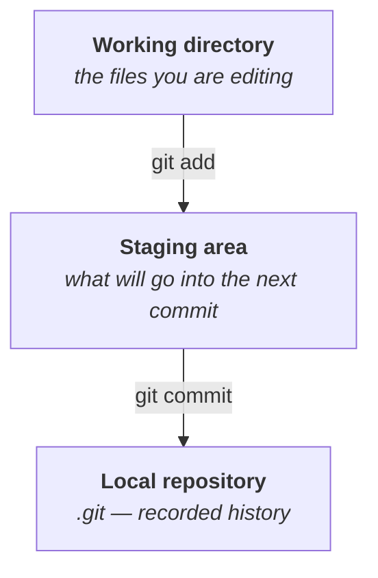
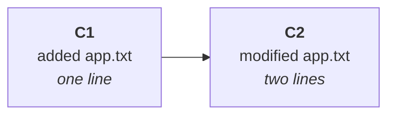
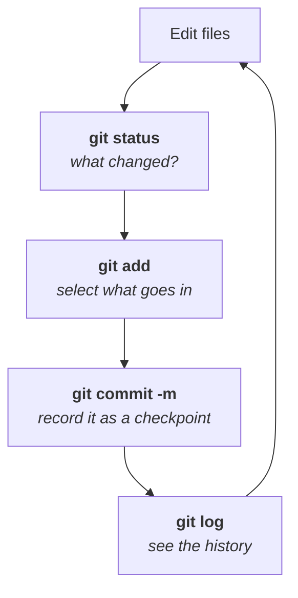

Note `01` left an empty directory that Git knows nothing about. This one turns it into a repository and walks the loop you will run several hundred times a week: change something, look at what changed, select it, record it.

Everything here happens on one machine. Nothing touches the internet, no account is needed, and there is no GitHub in this note at all — which is itself the point. Git is complete without it.

---

## Something to track

The class worked in plain text files rather than any programming language, deliberately: **Git does not care what is in the file.** It tracks bytes. A `.java` file, a `.js` file and a `.txt` file are all the same problem to it, so a text file keeps the demonstration language-independent.

Create one:

```bash
nano app.txt
```

Put a single line in it:

```
this is my first line
```

Save and check it:

```bash
cat app.txt
```

```
this is my first line
```

> [!tip] **Read `app.txt` as a stand-in for real code.** Everything in this note behaves identically if it is `Application.java` or `server.js`. Text was chosen so nothing depends on knowing a language.

---

## `git init`

Right now this is an ordinary directory. Git is installed on the machine, but it is not watching this folder — and it is not watching any folder by default.

> [!important] **Git does not track your system. It tracks what you point it at.**
>
> This is deliberate and worth being clear about early. Git only manages a directory once you explicitly hand it over. Until you do, running a Git command inside that directory is an error, not a no-op — `git status` in an untracked folder replies `fatal: not a git repository`.

Handing it over is one command:

```bash
git init
```

Read it as *initialise*: you are telling the Git installed on your machine to start managing this project's versions.

### The message it prints back

`git init` does not just succeed quietly. On any modern Git it prints a hint:

```
hint: Using 'master' as the name for the initial branch. This default branch name
hint: is subject to change. To configure the initial branch name to use in all
hint: of your new repositories, which will suppress this warning, call:
hint:
hint: 	git config --global init.defaultBranch <name>
hint:
hint: Names commonly chosen instead of 'master' are 'main', 'trunk', and
hint: 'development'. The just-created branch can be renamed via:
hint:
hint: 	git branch -m <name>

Initialized empty Git repository in /home/ubuntu/git-fundamentals/.git/
```

Two things are being said, and the second is the one people skim past.

**Git has started managing the project.** That is the last line.

**Git manages every project on a branch, and it just made one for you.** Every repository has a main line of development, and Git named this one `master`. Branches get their proper treatment later in the module — for now, all you need is that there is one, and it has a name.

### Why the hint exists — `master` and `main`

Git used `master` as the default name for the main branch for most of its life, and its author used that name from the beginning.

A number of platforms objected to it, on the grounds that *master* carries the connotation of master/slave architecture. GitHub changed its default to **`main`**, and many hosted repositories were renamed to match.

> [!info] **You will meet both, and nothing about them differs technically.** `master` and `main` are ordinary branch names — Git attaches no special meaning to either. A repository created locally with an older default will say `master`; one created on GitHub today will say `main`. If the two disagree, pushing fails in a confusing way, which is the practical reason to know about this at all.
>
> To set your own default once, so the hint stops appearing:
>
> ```bash
> git config --global init.defaultBranch main
> ```
>
> To rename the branch in a repository that already exists:
>
> ```bash
> git branch -m main
> ```

**The class stayed on `master`**, which is why every output below says `master`. If you followed along on a newer setup and see `main`, nothing else changes.

---

## `.git` — where the repository actually lives

`git init` appeared to do almost nothing. It created one thing:

```bash
ls -la
```

```
.
..
.git
app.txt
```

> [!info] **A Linux recap the class made in passing.** `.` is the current directory and `..` is the parent — which is why `cd ..` moves up one level and `cd .` goes nowhere. They appear in every directory listing and are covered in the `Linux/` notes.

The new entry is **`.git`**, and the leading dot makes it hidden, which is why a plain `ls` does not show it.

> **`.git` is the repository.** Everything Git knows about your project lives inside that one directory — every version, every commit, all of its configuration and all of its logic.

You can walk into it like any other directory:

```bash
cd .git
```

```bash
ls
```

and find a set of folders and files that Git maintains for itself. The class's framing is the useful one:

> [!important] **Treat `.git` as a database.** It is not a copy of your files and it is not a backup folder — it is a store that Git reads and writes to answer questions like *what did this project look like three commits ago*. **The internals of that database are the subject of a later note**; here it is enough that it exists, that it is the entire repository, and that deleting it turns your project back into an ordinary directory with no history.

> [!danger] **`.git` and `.gitignore` are not the same thing, and the names invite the confusion.**
>
> A question from the class asked exactly this. They are opposites:
>
> | | |
> |---|---|
> | **`.git`** | the repository itself — everything Git **does** track, plus all its machinery |
> | **`.gitignore`** | a file listing what Git should **not** track |
>
> `.gitignore` exists for two everyday reasons. **Configuration you must not publish** — anything holding a password, key or token has no business on a hosting platform. And **files you gain nothing by storing** — downloaded dependency libraries, which can be re-fetched at any time and would otherwise bloat the repository for no benefit.

---

## The shape of the workflow

Before the individual commands, the model they fit into. Git moves a change through distinct areas, and almost every confusing Git error makes sense once you know which area you are in:



Three areas, two commands between them. That is the whole of this note. A fourth area — the remote repository — comes next.

---

## `git status`

The file exists, and Git has been initialised. So is it being tracked?

No — and this is the point people miss. **Initialising a repository does not start tracking anything.** You told Git to manage the project; you have not yet told it which files matter.

```bash
git status
```

```
On branch master

No commits yet

Untracked files:
  (use "git add <file>..." to include in what will be committed)
	app.txt

nothing added to commit but untracked files present (use "git add" to track)
```

Three separate facts in that output:

| Line | Meaning |
|---|---|
| `On branch master` | which branch you are on |
| `No commits yet` | nothing has ever been recorded in this repository |
| `Untracked files: app.txt` | Git can see this file and is **not** managing it |

> [!tip] **`git status` is the command to run when you do not know what to do next.** It reports where you are, what has changed, and what Git thinks you probably want — the parenthesised hints are genuine suggestions. Run it constantly. It costs nothing and changes nothing.

---

## `git add` and the staging area

```bash
git add app.txt
```

Nothing is printed. **Silence means success** — a habit worth acquiring, because a great many Unix tools work this way.

Ask `git status` what changed:

```bash
git status
```

```
On branch master

No commits yet

Changes to be committed:
  (use "git rm --cached <file>..." to unstage)
	new file:   app.txt
```

The file has moved from *untracked* to **changes to be committed**, and in a colour terminal the filename turns from red to green.

What `git add` did was move that file into the **staging area**:

> **The staging area holds the version of each file that will go into your next commit.**

So `git add` is better read as *"include this in what I am about to record"* than as *"start tracking this"* — though on a file's first appearance the two amount to the same thing.

> [!info] **The class deliberately deferred the deeper answer.** *Why does a staging area exist at all — why not commit straight from the working directory?* The instructor said explicitly that this makes proper sense only once you have seen Git's internals, and moved on. It is answered in a later note, where the staging area turns out to be a real file with real contents rather than a concept.

---

## `git commit`

Staging says *these are the changes I mean*. Committing records them.

> **A commit is a checkpoint.** The instructor's word for it was a *पड़ाव* — a stage on a journey, a point you can stop at and return to. You are locking a set of changes into the project's history as a named, permanent version.

This is exactly the thing note `01` said manual folder-copying could not give you, done properly. Where you once had:

```
resume.pdf
resume-final.pdf
resume-final-final.pdf
```

you now have three commits, in order, each with a description of what changed and why.

Every commit needs a **message**:

```bash
git commit -m "first commit added app.txt"
```

```
[master (root-commit) a831c23] first commit added app.txt
 1 file changed, 1 insertion(+)
 create mode 100644 app.txt
```

Read the confirmation:

| Piece | Means |
|---|---|
| `master` | the branch it landed on |
| `(root-commit)` | this is the **first** commit in the repository — it has no parent |
| `a831c23` | the start of this commit's unique identifier |
| `1 file changed, 1 insertion(+)` | one file touched, one line added |

`1 insertion(+)` is exactly right: `app.txt` has one line in it.

> [!important] **`-m` is not optional in practice.** Without it Git opens an editor and waits for a message, because a commit without one is not allowed. The message is the part of a commit that survives — it is what someone reads in six months when they are trying to work out why a line changed.

---

## A second commit

One commit is not a history. Repeat the loop with a change.

```bash
nano app.txt
```

Add a second line, save, and confirm:

```bash
cat app.txt
```

```
this is my first line
this is my second line
```

Now check status **before** doing anything else — this is the habit:

```bash
git status
```

```
On branch master
Changes not staged for commit:
  (use "git add <file>..." to update what will be committed)
  (use "git restore <file>..." to discard changes in working directory)
	modified:   app.txt

no changes added to commit (use "git add" and/or "git commit -a" to commit)
```

**`modified`, not `untracked`** — the distinction matters. Git already knows this file. It is comparing what is on disk against what it recorded, and reporting a difference.

Stage it and commit it:

```bash
git add app.txt
```

```bash
git commit -m "second commit modified app.txt"
```

> [!tip] **Write messages for the person reading them, not for the exercise.** "first commit" and "second commit" are teaching labels. Real messages say what changed and why — *"fix discount rounding on multi-item orders"* — because the audience is a colleague, or you, trying to find where something broke.

Two commits now exist:



> [!info] **A question from the class: how do you undo a change before committing it?** The answer given was that `reset` and related commands exist for exactly this, and that they get their own treatment later. The `git status` output above is already pointing at part of it — `git restore <file>` discards uncommitted changes in the working directory.

---

## `git log`

Two commits exist, but nothing has shown them as a history yet.

```bash
git log
```

```
commit 3f9d1a7c8e2b45a1d0c6e93f77b2a4e5c1d8f0b6 (HEAD -> master)
Author: Your Name <you@example.com>
Date:   Sun Aug 16 11:12:04 2026 +0530

    second commit modified app.txt

commit a831c2392b8f5e1c7d04a9b3e6f2c8d5a017b4e9
Author: Your Name <you@example.com>
Date:   Sun Aug 16 11:04:47 2026 +0530

    first commit added app.txt
```

Three things worth noticing.

**The newest commit is at the top.** The class described the ordering as stack-like — most recent first — which is what you want when the usual question is *what happened recently*.

**Each commit carries an author and a timestamp**, not just a message. Where that name and email come from is the next section.

**Each commit has a long identifier.** That 40-character string is the commit's identity.

> [!important] **In Git, essentially everything is identified by an ID like that one.** Commits have them. So does every version of every file. So does every stored change. The instructor flagged this explicitly and said it is the thread that runs through Git's internals — **where those IDs come from, and why they are what they are, is the most important idea in this module.** It gets its own note.

For a compact view:

```bash
git log --oneline
```

```
3f9d1a7 second commit modified app.txt
a831c23 first commit added app.txt
```

Same history, one line per commit, with the identifier shortened to its first seven characters. This is the form you will use day to day.

---

## Telling Git who you are

`git log` printed an author name and email. Git did not guess them — it read them from configuration, and on a machine where that configuration has never been set, **Git refuses to commit at all** until you provide it.

The reason is the collaboration problem from note `01`: if a commit cannot say who made it, the whole attribution argument for using Git collapses. Every commit must be attributable, so every commit needs an identity attached.

Set it:

```bash
git config --global user.name "Your Name"
```

```bash
git config --global user.email "you@example.com"
```

Read it back:

```bash
git config user.name
```

```bash
git config user.email
```

`--global` means *for every repository on this machine*, which is what you want — you are the same person in all of your projects. Setting it without `--global` applies to the current repository only, which is occasionally useful when one project needs a different email.

> [!warning] **This is configuration, not authentication.** The class described it as "signing up", which is a reasonable way to introduce it but is not what happens. Nothing is verified, no account is contacted, and no password is involved — you are writing two strings into a config file, and Git stamps them onto your commits.
>
> The practical consequence: **`user.email` should match the email on your hosting account**, or the platform will not connect your commits to your profile. Proving you are entitled to push is a separate mechanism entirely, and it is where note `03` runs into trouble.

> [!info] **A question from the class: what if two people configure the same name and email?** Locally, nothing stops them — these are just strings. The check happens at the hosting platform, which will not let two accounts claim the same email address.

> [!info] **Another one: does Git use an in-memory database, or something like MongoDB?** Neither. **Everything is in the `.git` directory** — plain files on disk, no database server, no external process.

---

## The loop, in one picture

Everything in this note is one cycle, repeated:



| Command | What it does |
|---|---|
| `git init` | turn a directory into a repository — **once per project** |
| `git status` | what has changed, and what is staged |
| `git add <file>` | move a change into the staging area |
| `git commit -m "…"` | record everything staged as a checkpoint |
| `git log` | show the history |
| `git log --oneline` | show the history compactly |
| `git config --global user.name` | who commits are attributed to |
| `git config --global user.email` | the email attached to commits |

All of it is local. The repository is `.git`, the `.git` directory is on one machine, and if that machine dies the history dies with it — which is the problem note `03` starts from.

---

*Source: class 4 — 2026-08-16, recording part 2.*
