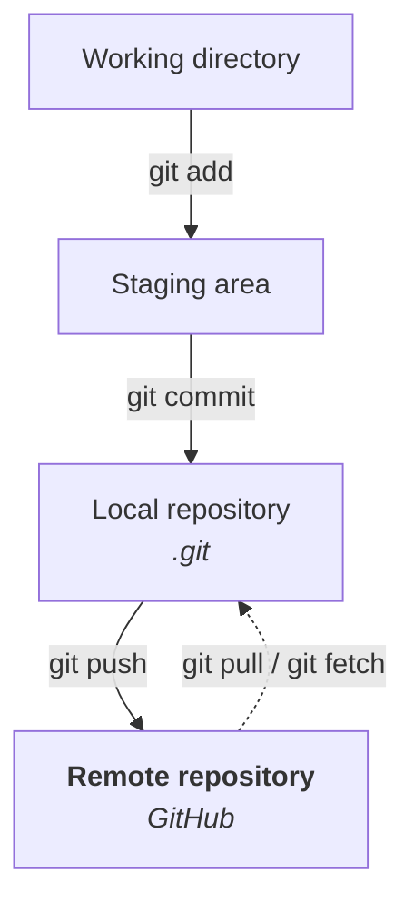
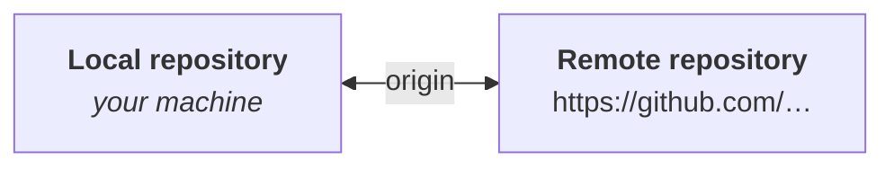
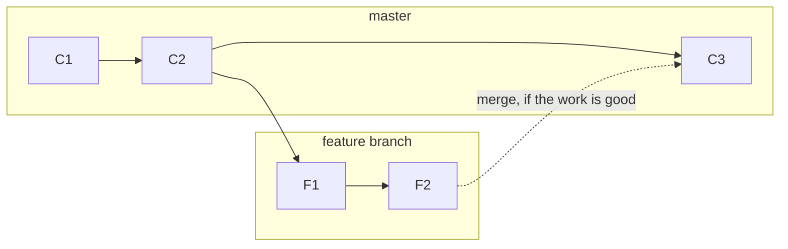
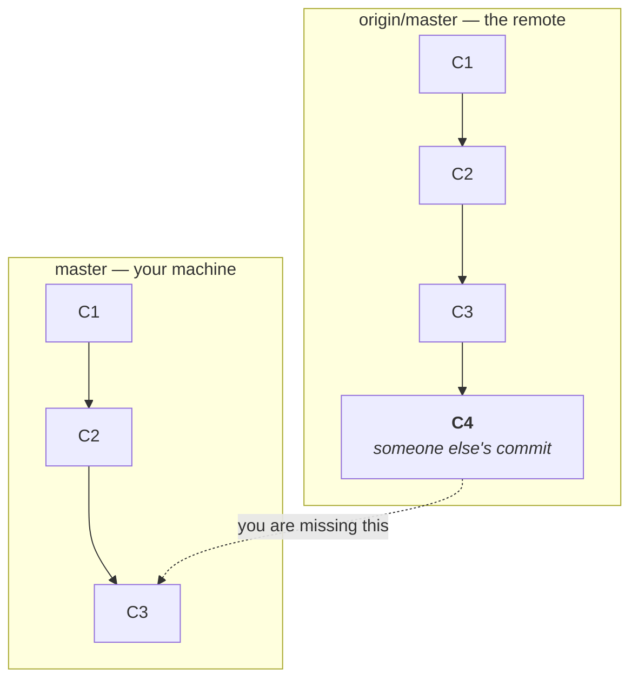
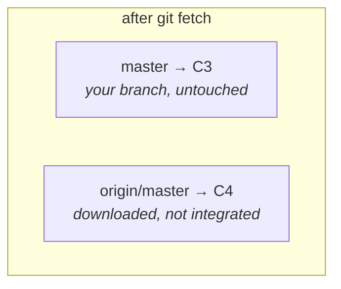
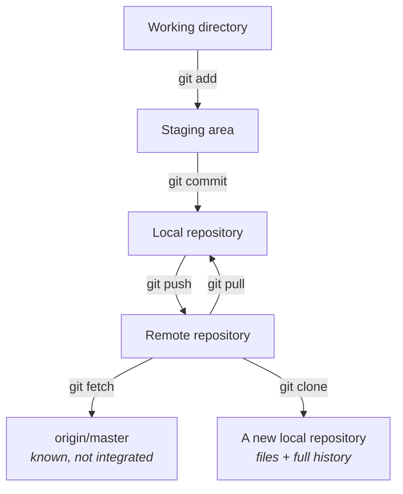

Note `02` ended with two commits, a complete history, and a problem it stated but did not solve: all of it is in one `.git` directory on one machine.

Two things follow from that, and both are fatal.

**If the machine dies, the history dies.** You built a version control system's worth of careful checkpoints and stored every one of them in the single place whose failure you were insuring against.

**Nobody else can see any of it.** Note `01` argued that Git's real value shows up when several people work on one project. None of that is possible while the repository exists only on your laptop.

The fix is a copy of the repository on a server that everyone can reach — a **remote repository**. This note connects the local one to it, and it takes three failures to get there.



That top half is note `02`. This note is the bottom arrow, in both directions.

---

## Failure 1: Git does not know where to send anything

The obvious command:

```bash
git push
```

```
fatal: No configured push destination.
Either specify the URL from the command-line or configure a remote repository using

    git remote add <name> <url>

and then push using the remote name

    git push <name>
```

Which is entirely reasonable. You have asked Git to send your commits somewhere, and you have never told it where.

> [!tip] **Read Git's errors properly — they are unusually good.** That message names the exact command that fixes it. A large fraction of Git problems are solved by reading the output rather than searching for the error text.

So first, there has to be somewhere to send it. On GitHub, create a new repository — the class used the same name as the local project, `git-fundamentals`, and **skipped the README**, which matters: a repository initialised with a README already has a commit in it, and pushing a local history into it causes a conflict you have not learned to resolve yet.

GitHub then shows the repository's URL. Copy it.

## Telling Git where the remote is

```bash
git remote add origin <repository-url>
```

Nothing is printed. Silence is success, as usual.

Check it took:

```bash
git remote -v
```

```
origin  https://github.com/<your-username>/git-fundamentals.git (fetch)
origin  https://github.com/<your-username>/git-fundamentals.git (push)
```

### What `origin` means

`origin` is **not a keyword**. It is a name you chose, and Git attaches no special meaning to it — you could call it anything.

> **`origin` is simply the conventional name for the primary remote repository.** It is a label pointing at a URL, so you can type `origin` instead of the full address every time.

The instructor's gloss was *"origin means where everything started"* — the canonical copy, the one everyone agrees is the real one. Every tutorial, every tool and every colleague will assume this name, so use it.



---

## Failure 2: Git does not know which branch

Try again:

```bash
git push
```

```
fatal: The current branch master has no upstream branch.
To push the current branch and set the remote as upstream, use

    git push --set-upstream origin master
```

A different complaint, and a fair one. You said *which repository*. You did not say *which branch inside it*.

### Branches, briefly

Branches get a full treatment later in the module; this is the minimum needed to get past the error.

When Git starts managing a project it creates one branch — `master` in the class's setup — and your commits go onto it. You can create others. The usual reason is to **try something without endangering what already works**:



You branch off, build a feature on the side, and if you are happy with it you **merge** it back into `master`. If you are not, you discard it and `master` was never touched. That is the mechanism behind the "experiment safely" claim in note `01`. How merging actually works comes later.

The relevant part here: **both your local repository and the remote have branches, and they are different objects.** Pushing means connecting one to the other.

### Upstream

```bash
git push --set-upstream origin master
```

or equivalently, the form you will actually see:

```bash
git push -u origin master
```

`-u` is the short form of `--set-upstream`. It says: *push this branch to `master` on `origin`, and remember that pairing.*

> [!info] **A question from the class: what does "upstream" mean?**
>
> It is a direction, not a Git-specific term. You push **up** to the cloud, so the remote is *upstream*.
>
> The instructor connected it to a term from application development: **downstream services**. A request arrives at the frontend, which calls a backend service, which calls another service, which finally reaches the database. The database is pictured at the bottom and each service sits above the one it calls — so calls travelling toward it are **downstream** calls. Upstream is the same picture, reversed: your machine at the bottom, the shared server above it.

> [!important] **You set upstream once per branch, and then never think about it again.** That is the entire point of `-u`. After this, a bare `git push` knows both the repository and the branch — which is why every later push in this note is one word.

---

## Failure 3: your password is not accepted

Now Git knows where and what. It asks who:

```
Username for 'https://github.com':
Password for 'https://<your-username>@github.com':
```

Type your GitHub username, then your GitHub password, and:

```
remote: Invalid username or token. Password authentication is not supported for Git operations.
fatal: Authentication failed for 'https://github.com/<your-username>/git-fundamentals.git/'
```

The password is correct. It is being rejected anyway.

> [!important] **GitHub removed password authentication for Git operations in 2021.** It used to work exactly as you would expect. It no longer does, and this catches out anyone following an older tutorial.
>
> The reason is worth understanding rather than working around: your account password unlocks **everything** — every repository, your settings, your billing, your ability to delete things. Handing that to a command-line tool, which then caches it on disk, means one compromised laptop costs you the entire account. A token can be scoped to one repository and expired on a schedule.

### Creating a token

The path is buried, so precisely:

**GitHub → Settings → Developer settings** (at the very bottom of the left sidebar) **→ Personal access tokens → Fine-grained tokens → Generate new token.**

The class filled it in like this:

| Field | Value | Why |
|---|---|---|
| **Token name** | anything descriptive | it is a label for you |
| **Expiration** | **7 days**, not the default 30 | short-lived by choice — see below |
| **Repository access** | **only `git-fundamentals`**, not all repositories | the token can touch nothing else |
| **Permissions → Contents** | **Read and write** | this is the one that matters — read-only cannot push |
| **Permissions → Actions** | read | added in the class |

Then **Generate token**. GitHub displays it once, with:

```
Make sure to copy your personal access token now as you will not be able to see this again.
```

That is literal. Close the page without copying it and the token is unrecoverable — you delete it and generate another.

> [!danger] **A token is a credential. Treat it exactly as you would a password.**
>
> **Never commit one, never paste one into a shared document, never put one in a screenshot, and never send one to anyone.** A token with `Contents: read and write` can rewrite your repository.
>
> The instructor showed his on screen during the class and said plainly that you should not do this — it was scoped to a single practice repository and deleted afterwards. **Those two mitigations are the only reason it was survivable**, and they are the habit worth copying: scope every token to the narrowest repository set that works, and give it the shortest expiry you can tolerate.
>
> If one does leak: **revoke it immediately** in the same settings page. Revocation is instant and total, which is the whole advantage of tokens over passwords.

> [!tip] **Turn on two-factor authentication before any of this.** The class's token generation triggered a 2FA code to a phone. That is not an obstacle — it is the thing standing between someone with your password and every repository you own.

### Using it

Run the push again. At the prompts, enter your **username** as normal, and paste the **token where it asks for the password**.

> [!info] **"Password" is a lie in that prompt, and it confuses everyone once.** Git is asking for a credential; GitHub wants that credential to be a token. Your account password will always be rejected.

---

## The push that works

```bash
git push -u origin master
```

```
Enumerating objects: 6, done.
Counting objects: 100% (6/6), done.
Compressing objects: 100% (2/2), done.
Writing objects: 100% (6/6), 465 bytes | 465.00 KiB/s, done.
Total 6 (delta 0), reused 0 (delta 0)
To https://github.com/<your-username>/git-fundamentals.git
 * [new branch]      master -> master
branch 'master' set up to track 'origin/master'.
```

Three things happened, and the last two are the ones to hold onto.

**`* [new branch] master -> master`** — there was no `master` on the remote, so Git created one and put your commits on it.

**`branch 'master' set up to track 'origin/master'`** — this is what `-u` bought you. Your local `master` is now **tracking** the remote one.

> [!important] **`master` and `origin/master` are two different branches, and the difference explains most confusing Git output.**
>
> | | |
> |---|---|
> | **`master`** | the branch on **your** machine, that your commits go onto |
> | **`origin/master`** | your machine's **record of where the remote's `master` was**, last time you checked |
>
> "Tracking" means the pairing is remembered: pushes from `master` go to `origin/master`, and Git can tell you when the two have drifted apart. Note that `origin/master` is still **local** — it is Git's cached knowledge of the remote, not a live view of it. That distinction is the entire basis of `fetch` versus `pull` below.

## Confirming it landed

Refresh the repository page on GitHub and `app.txt` is there, containing both lines. The sidebar shows the latest commit message and a total of **2 commits**, and clicking through gives the full history — `first commit added app.txt`, `second commit modified app.txt` — rendered in the web interface.

Nothing new happened here. **It is the same history from `git log`**, drawn with a graphical interface instead of printed to a terminal. Worth doing once, precisely so that the web page stops looking like the real thing and starts looking like a view of it.

## From here, `git push` is one word

Prove the upstream setting did what it claimed. Make a third change:

```bash
nano app.txt
```

```
this is my first line
this is my second line
this is my third line
```

The full loop from note `02`, unchanged:

```bash
git status
```

```bash
git add app.txt
```

```bash
git commit -m "third commit modified app.txt added third line"
```

And then:

```bash
git push
```

No `-u`, no `origin`, no `master`. It already knows both.

---

## `git clone` — starting from an existing repository

Everything so far assumed the repository began on your machine. Usually it does not: you join a project that already exists.

```bash
git clone <repository-url>
```

This is not a download of the visible files. A clone gives you:

| | |
|---|---|
| The project files | as they are right now |
| **The entire commit history** | every version, back to the first commit |
| The branches | all of them |
| Git metadata | the whole `.git` directory |
| Remote configuration | `origin` already pointing at where you cloned from |

> [!important] **This is why cloning is fundamentally different from downloading a ZIP.** A ZIP gives you files — one frozen state, with no history, no branches, and no way to ask what changed or why. A clone gives you a **complete, working repository**. You can inspect any past version, create branches, and commit, all offline.

**Cloning does not grant you the right to push.** Anyone can clone a public repository; pushing to it requires that the owner has given your account write access. Without it your push is rejected by the server — the repository is on your disk, but the remote will not accept your commits.

> [!warning] **A correction on a point made in class.** The instructor answered *"technically, do pull and clone do the same thing?"* by saying that after cloning **you are not connected to the remote** — that you have merely downloaded it, like saving a PDF.
>
> **The distinction he was drawing is real, but the reason given is not.** `git clone` automatically configures `origin` and sets up branch tracking; a fresh clone is fully connected and `git pull` works in it immediately. The course repo's own written notes agree, listing *remote configuration* among the things a clone gives you.
>
> What is actually missing after cloning someone else's repository is **write permission**, which is an authorisation matter on the server, not a connection that was never made. The practical upshot he was reaching for is correct: you can clone freely, and you still cannot push without being granted access.

---

## When someone else pushes: `git pull`

Now the situation the whole exercise was for.

You have three commits, locally and on the remote. A second developer on the team pushes a fourth commit to the same branch:



The remote has four commits. You have three. You need the fourth.

```bash
git pull
```

That brings the remote's changes down and joins them onto your local branch. Push sends local to remote; **pull brings remote to local.**

## `git fetch` versus `git pull`

The instructor flagged this as a small difference that matters a great deal, and it is a reliable interview question.

**`git fetch`** downloads the commits that exist on the remote and do not exist locally — and **stops there**.

```bash
git fetch
```

After it runs, your local Git knows C4 exists. `origin/master` now points at C4. But your own `master` still points at C3, and **your working files have not changed at all**.



**`git pull`** does that, and then integrates:

```
git pull  =  git fetch  +  integrate
```

where *integrate* is, in the normal case, `git merge`. So these two are equivalent:

```bash
git pull
```

```bash
git fetch
```
```bash
git merge
```

> [!important] **The distinction is: does it touch my working files?**
>
> | | Downloads remote changes | Changes your branch and files |
> |---|---|---|
> | **`git fetch`** | yes | **no** |
> | **`git pull`** | yes | **yes** |
>
> `git fetch` is the safe one. It is how you answer *"what has everyone else done?"* without disturbing work in progress — look first, integrate when ready.
>
> `git pull` is the convenient one, and it can surprise you: if the incoming commits touch lines you have also changed, the merge happens immediately and can leave you with conflicts you were not braced for.

> [!info] **Why the exact integration step is worth a caveat.** `git pull` merges by default, but that is configurable — it can be set to rebase instead, which produces a different history shape. The course repo's notes flag the same thing. Merge versus rebase is a topic the instructor has already promised, and the difference only becomes meaningful once you have seen both.

---

## Not typing your token every time

Every push asking for a username and token gets old immediately. Git can hold the credential in memory for a while:

```bash
git config --global credential.helper 'cache --timeout=14400'
```

`14400` seconds is **4 hours**, which was the value used for the class session.

> [!tip] **`cache` keeps the credential in memory only.** It is not written to disk, and it is gone when the timeout expires or the machine restarts — which is the property you want. There are helpers that store credentials permanently on disk, and on a shared or work machine that is a meaningfully worse trade.

---

## Where this leaves you



| Command | What it does |
|---|---|
| `git remote add origin <url>` | name a remote repository — **once per project** |
| `git remote -v` | show the configured remotes |
| `git push -u origin master` | push and remember the branch pairing — **once per branch** |
| `git push` | send local commits to the remote |
| `git pull` | bring remote commits down **and** integrate them |
| `git fetch` | bring remote commits down **without** integrating |
| `git merge` | integrate fetched commits into your branch |
| `git clone <url>` | copy an entire repository, history included |
| `git config --global credential.helper 'cache --timeout=14400'` | stop retyping the token for 4 hours |

Together with note `02`, that is the everyday working set: `status`, `add`, `commit`, `log`, `push`, `pull`, `fetch`. The instructor's framing was that you should be comfortable with exactly these before going further — because what comes next is not another command.

**What comes next is what Git is doing underneath all of them.**

---

*Source: class 4 — 2026-08-16, recording parts 2–3. The remote thread starts partway through part 2, at the first failed `git push`, and finishes in part 3.*
