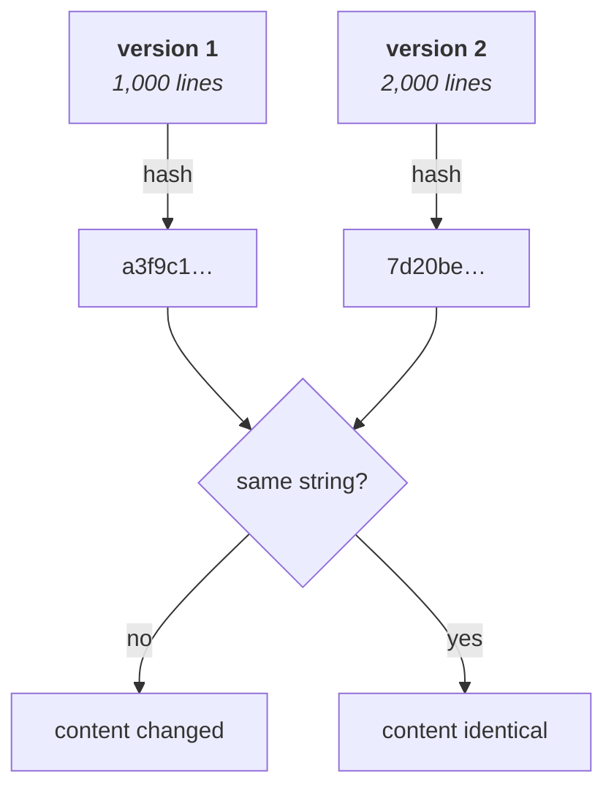
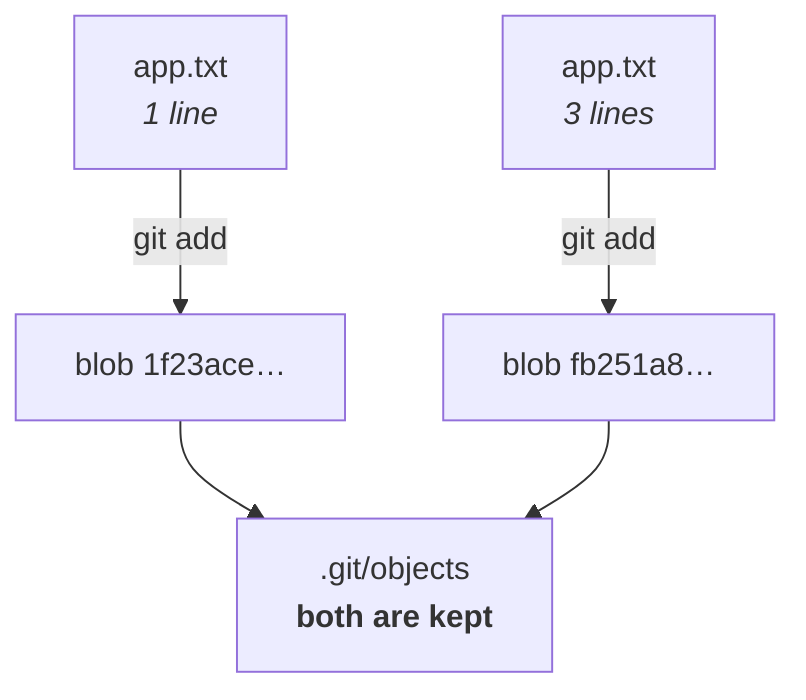
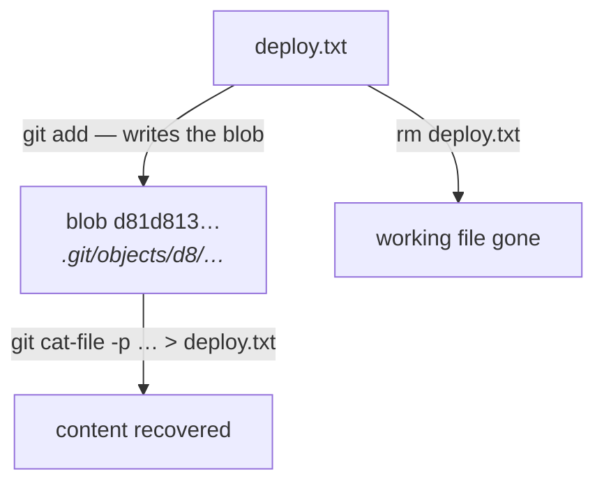
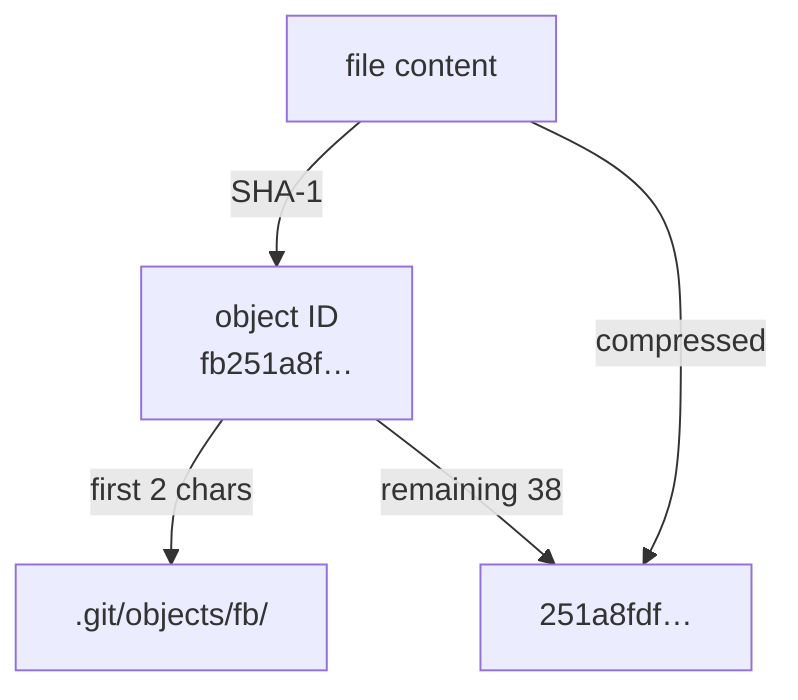

Notes `02` and `03` covered the commands: `init`, `add`, `commit`, `log`, `push`, `pull`, `fetch`. The instructor's framing before the break was that you should be comfortable with exactly those before going further — and then that what comes next is not another command.

This is the part that separates someone who uses Git from someone who understands it. It is also, bluntly, the most interview-valuable material in this folder.

The question is simple: **when you run `git add`, what actually happens on disk?**

---

## A second definition of Git

Note `01` defined Git as a version control system. That is true and it is not the useful definition here. The one that explains the machinery is:

> **Git is a content-addressed object database.**

Three words, each doing work:

| | |
|---|---|
| **Object** | everything Git stores is an *object* — a unit with a type and an identity |
| **Content-addressed** | an object's identity is **derived from its content**, not assigned to it |
| **Database** | it is a store you can query, and it lives entirely inside `.git` |

"Content-addressed" is the load-bearing idea, and it is genuinely unusual. In most systems you name a thing and then put content in it — a filename, a row ID, a key you chose. **Git works the other way round: the content decides the name.** Put the same bytes in, get the same identifier out, every time, forever.

> [!info] **There is no database server anywhere in this.** No MySQL, no MongoDB, no background process. `.git/objects` is a directory of ordinary files, and Git reads and writes them directly. The class asked this explicitly in part 2 and the answer has not changed — everything is in the `.git` folder.

---

## Why identity is a hash

Before accepting hashing, break the obvious alternative — because the obvious alternative works fine on the easy case.

You have a file. You change it. **How does Git know it changed?**

The naive answer is the one every programmer reaches for: **compare the two versions.** Every language has it — `.equals()` in Java, `==` in Python — and for a one-line file it is instant and completely correct.

Now scale it. A source file with **1,000 lines**. You add another 1,000, so there are 2,000. Git has to answer *what changed* — and doing that by comparison means walking both versions character by character.

Now scale it again, because this is the part that kills it:

- `git status` does this check for **every file in the project**, and you run it constantly.
- A project has thousands of files.
- Git needs the answer for **every commit in history**, not just the current one.

Full comparison is linear in the size of the content, every time, for every file. That is the wrong cost for an operation that has to feel instant.

### Hashing instead

> **A hash function takes content of any size and produces a short, fixed-length string. The same input always produces the same output; different input produces a different output.**

So Git never compares content. It compares **identities**:



Comparing two 40-character strings costs the same whether the file has ten lines or ten million.

> [!important] **This catches every kind of change, in both directions.** Add a line and the hash changes. Delete a line and the hash changes. Change one character in the middle and the hash changes. There is no edit that leaves the content different but the hash the same — which is exactly the property that makes it safe to use the hash *instead of* the content.

---

## The three objects

Git stores several kinds of object. Three of them account for the whole model:

| Object | Stores |
|---|---|
| **blob** | a file's **content** |
| **tree** | **filenames and directory structure** |
| **commit** | a **snapshot** plus metadata and a link to its parent |

Understand those three and you understand Git's architecture. **This note is the first one.** Trees and commits follow.

---

## Blob objects

> **A blob is the content of a file, stored under an identifier derived from that content.**

The name comes from databases: **b**inary **l**arge **ob**ject.

The critical property, and the one everything else depends on:

> [!important] **A blob stores content and nothing else. Not the filename, not the path, not the timestamp, not the permissions.** Where the content came from is somebody else's job — the tree's, as it turns out. A blob is bytes and an ID.

### Asking Git for a file's object ID

```bash
git hash-object app.txt
```

With `app.txt` containing the three lines from note `02`:

```
this is my first line
this is my second line
this is my third line
```

Git replies:

```
fb251a8fdf7bf699c0476ec75d9894c39bd5cd65
```

That 40-character string is the **object ID** — also called the **blob ID**, or just *the hash*.

> [!tip] **These values are real, and you can check them.** Every hash in this note was computed from the exact content shown. Create that file with those three lines and `git hash-object` will print the same string on your machine, on any machine, in any year. That reproducibility is the whole point of content addressing — and it is worth proving to yourself once, because it is what makes the rest of Git's design make sense.

> [!warning] **`git hash-object` on its own only calculates. It does not store.**
>
> This is easy to miss and it matters for the recovery trick at the end of this note. The command reads the file, computes the ID, prints it, and writes nothing. To actually put the object into the database you need:
>
> ```bash
> git hash-object -w app.txt
> ```
>
> `-w` means **write**. Same ID printed — the ID never depends on whether you stored it — but now the object exists in `.git/objects`.

### Where the object goes

Git does not create one file named with the whole 40-character hash. It **splits it in two**:

```
fb 251a8fdf7bf699c0476ec75d9894c39bd5cd65
^^ ^^^^^^^^^^^^^^^^^^^^^^^^^^^^^^^^^^^^^^
dir            filename
```

The first two characters become a **directory name**, the remaining 38 become the **filename** inside it:

```
.git/
└── objects/
    └── fb/
        └── 251a8fdf7bf699c0476ec75d9894c39bd5cd65
```

See it directly:

```bash
cd .git/objects
```

```bash
ls
```

```
15  3f  a8  df  fb  info  pack
```

Each of those two-character directories is the first two characters of some object's ID — `fb` is the one holding the blob above. The others belong to objects Git created for its own purposes, and `info` and `pack` are Git's own, not object directories.

> [!info] **Why split at two characters?** It is a convention, and the instructor said so plainly — it could have been three or four. The reason it exists at all is filesystem performance: a repository can accumulate hundreds of thousands of objects, and directories with that many entries in them get slow on many filesystems. Splitting on the first byte spreads them over 256 directories.

### Why you cannot read the file

The object is right there. Read it:

```bash
cat .git/objects/fb/251a8fdf7bf699c0476ec75d9894c39bd5cd65
```

```
xKÊÉOR0dHÌË,IUHÎÙ?Æ ?%??
```

Garbage. Not the three lines you wrote.

**Git stores objects compressed**, not as plain text. That is why `cat` is the wrong tool — you are looking at compressed bytes and asking a text utility to render them.

### `git cat-file`

Git provides its own reader:

```bash
git cat-file -p fb251a8fdf7bf699c0476ec75d9894c39bd5cd65
```

```
this is my first line
this is my second line
this is my third line
```

`-p` is **pretty-print**: decompress and display properly.

And to ask what kind of object it is:

```bash
git cat-file -t fb251a8fdf7bf699c0476ec75d9894c39bd5cd65
```

```
blob
```

`-t` is **type**.

| Command | Question it answers |
|---|---|
| `git cat-file -t <hash>` | what kind of object is this? |
| `git cat-file -p <hash>` | what is inside it? |

> [!info] **You will not use these day to day, and the instructor said so.** `hash-object` and `cat-file` are described in Git's own documentation as *plumbing* — the low-level machinery that the everyday commands are built on. They are here to make the model visible, not because your workflow needs them.

---

## This is what `git add` has been doing

The obvious question: *do I have to run any of this myself?*

**No.** You have been running it all along, indirectly.

> [!important] **`git add` computes the file's hash, writes a blob into `.git/objects`, and records the reference.** Everything in this note is what that one command does on your behalf.

Prove it rather than take it on faith. Create a new file:

```bash
nano deploy.txt
```

```
this is the first line of deploy.txt
```

Check Git noticed:

```bash
git status
```

It reports `deploy.txt` as untracked. Now add it:

```bash
git add deploy.txt
```

Silence, as always. But ask what its object ID would be:

```bash
git hash-object deploy.txt
```

```
d81d8132905637897497d7b85ae8d4ed516b6806
```

Starts with `d8` — and there was no `d8` directory a moment ago. So if `git add` really wrote a blob, there is one now:

```bash
ls .git/objects
```

```
15  3f  a8  d8  df  fb  info  pack
```

```bash
ls .git/objects/d8
```

```
1d8132905637897497d7b85ae8d4ed516b6806
```

There it is — **written by `git add`**, without you touching `hash-object` at all.


That last box — the staging area — is the subject of a later note. What matters here is that the blob is written **at `add` time**, not at commit time.

---

## Same content, same ID — the experiment that proves the model

This is the demonstration that makes content addressing click, and it takes thirty seconds.

Take the exact contents of `app.txt` and put them in a **completely different file**:

```bash
nano dummy.txt
```

Paste the same three lines. Change nothing. Save.

Now ask for both IDs:

```bash
git hash-object app.txt
```

```
fb251a8fdf7bf699c0476ec75d9894c39bd5cd65
```

```bash
git hash-object dummy.txt
```

```
fb251a8fdf7bf699c0476ec75d9894c39bd5cd65
```

**Identical.** Different filenames, different files on disk, one object ID.

> [!important] **The filename does not determine identity. The content does.**
>
> ```
> app.txt   ─┐
>            ├──→  "this is my first line…"  ──→  fb251a8f…
> dummy.txt ─┘
> ```
>
> Two consequences follow, and both are load-bearing:
>
> **Git stores that content once.** Not twice. Two files with identical contents share a single blob, and a hundred files would still share one. This is a large part of why a Git repository is so much smaller than the sum of its history suggests.
>
> **Renaming a file does not create new content.** The blob is already in the database; only the name attached to it changes. Which is why Git can detect renames it was never told about.

### What happens when you modify a tracked file

A student worked through this properly in class, and the exchange is worth keeping in full:

> [!info] **Q: If `git add` creates a blob from the file's content hash, and I then modify the file, its content changes and so its hash changes. Does Git create a new blob automatically?**
>
> **Yes — when you `git add` it again.** Not at the moment you save the file. The blob is written when you stage.
>
> **Q: And does the old blob stay in `.git/objects` while the new content is stored?**
>
> **Yes. It always stays.** Git does not delete objects on its own, because the entire purpose of the system is that you can go back. An old blob is an old version, and deleting it would destroy the thing you are using Git for.



> [!info] **Objects are not literally kept forever.** Git has a garbage collector that eventually discards objects nothing references — an experiment you staged and abandoned, for instance. But **nothing reachable from any commit is ever removed**, which is the promise that matters. *(This sentence goes slightly beyond the lecture, which said only that Git never deletes.)*

---

## Recovering a deleted file from its blob

The payoff, and the instructor's own framing was that very few people know this — which is why very few people can do it.

You have three files:

```bash
ls
```

```
app.txt  deploy.txt  dummy.txt
```

Note `deploy.txt`'s object ID, which `git add` already wrote to the database:

```bash
git hash-object deploy.txt
```

```
d81d8132905637897497d7b85ae8d4ed516b6806
```

Now **delete the file**:

```bash
rm deploy.txt
```

```bash
ls
```

```
app.txt  dummy.txt
```

Gone from the working directory. But check the object database:

```bash
ls .git/objects/d8
```

```
1d8132905637897497d7b85ae8d4ed516b6806
```

**Still there.** Deleting the file did nothing to the object — they are separate things, which is the point being demonstrated.

So read the object back, and redirect it into a file:

```bash
git cat-file -p d81d8132905637897497d7b85ae8d4ed516b6806 > deploy.txt
```

```bash
cat deploy.txt
```

```
this is the first line of deploy.txt
```

Recovered.

> [!tip] **The `>` is ordinary shell redirection, not a Git feature.** It sends a command's output into a file instead of to the screen — the same operator from the `Linux/` notes. `git cat-file -p` prints the content; `>` catches it. You can name the recovered file anything you like, because **the name was never part of the blob.**



> [!danger] **This only works if the blob was written, and `git add` is what writes it.**
>
> A file you created and deleted **without ever staging it** has no blob, and nothing above will bring it back. `git hash-object` without `-w` will happily tell you what the ID *would* have been, and there will be nothing stored under it.
>
> Practically: **`git add` is the point at which your work becomes recoverable.** Not `git commit` — `git add`. That is a genuinely useful thing to know at 2am.

> [!info] **You would not normally do this by hand.** The instructor was clear that Git has ordinary commands for restoring files, and that this walkthrough exists to show the architecture rather than to teach a workflow. The reason it is worth knowing anyway: when a normal restore command does something you did not expect, this is the layer where you can see what is actually there.

---

## The question that comes up every time

> [!info] **Q: Hashing is not reversible. So how can Git get the content back from a hash?**
>
> A good question, and the answer is that **it never reverses anything.**
>
> The hash is an **address**, not an encoding. Git stores the content — compressed, in a file — and uses the hash to decide *where*. Retrieving is a lookup:
>
> ```
> want fb251a8f…  →  open .git/objects/fb/251a8f…  →  decompress  →  content
> ```
>
> Nothing is being decoded. The content was there all along; the hash just told Git which file to open. That is exactly what "content-addressed" means — **the content's hash is its address.**
>
> The one-way property is not an obstacle to this design. It is what makes it work: because a hash cannot be forged from different content, an ID is a reliable name for exactly one piece of content.

> [!warning] **Added beyond the lecture, because it prevents a confusing experiment.** Git's hash is **SHA-1**, and it is computed not over the raw file bytes but over the content with a small header prepended — the object type, its length, and a null byte. This is why `sha1sum app.txt` gives a *different* answer from `git hash-object app.txt`. If you try to verify a blob ID with a standard checksum tool and the numbers do not match, this is why. *(Newer Git can use SHA-256, but SHA-1 remains the default.)*

---

## Where this leaves you

| Command | What it does |
|---|---|
| `git hash-object <file>` | print the object ID for the file's content — **stores nothing** |
| `git hash-object -w <file>` | same, and **write** the object into `.git/objects` |
| `git cat-file -t <hash>` | what type of object is this |
| `git cat-file -p <hash>` | print its content |
| `git cat-file -p <hash> > <file>` | print its content into a file — recovery |

And the model so far:



Content in, ID out, stored at a path derived from the ID.

**Which leaves an obvious hole.** A blob knows the bytes and nothing else — not the filename, not which directory it sat in. Yet `git checkout` restores a whole project with every file in the right place. Something has to hold the names and the structure.

That something is the **tree** object.

---

*Source: class 4 — 2026-08-16, recording part 4.*
