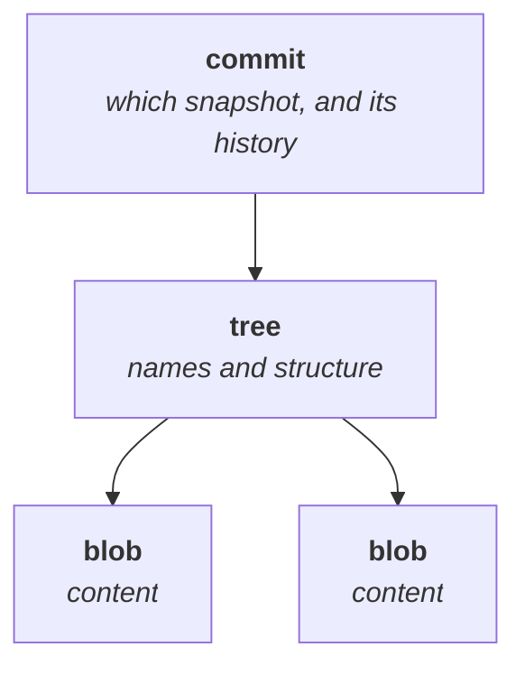
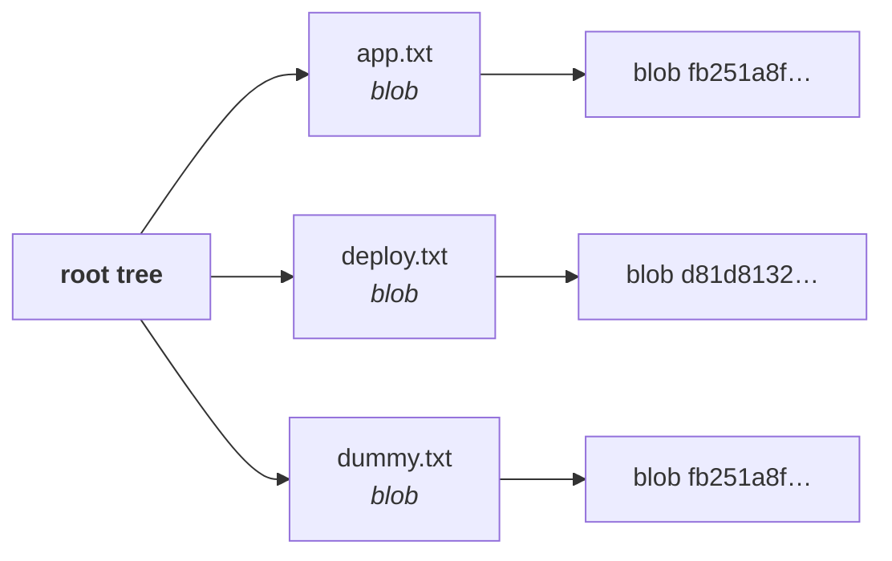
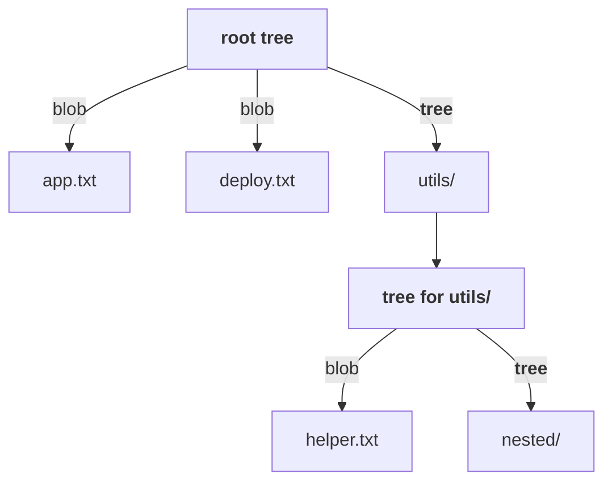
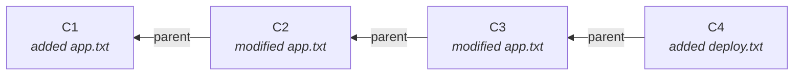
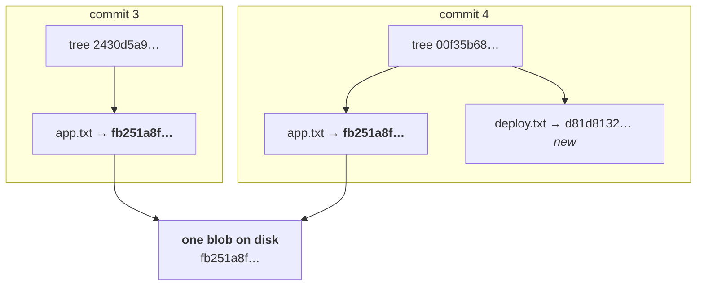
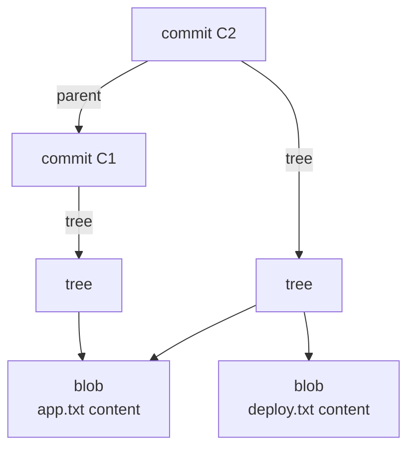

Note `04` ended on a hole it deliberately left open.

A blob stores content and nothing else — not the filename, not the directory it sat in. Yet Git can restore an entire project with every file in the right place. Something has to hold the names and the structure, and something has to say *which version of the project* those names belong to.

Those are the other two objects: the **tree** and the **commit**.



---

## Tree objects

> **A tree records the contents of one directory: the name of each entry, what kind of thing it is, and the object ID it points to.**

Where a blob is *what*, a tree is *what it is called and where it sits*.

For a project with three files, the root tree holds three entries:



Each entry carries four things:

| | Example |
|---|---|
| **mode** | `100644` — an ordinary file |
| **type** | `blob` or `tree` |
| **object ID** | the hash from note `04` |
| **name** | `app.txt` |

### Directories nest, because a directory is just another tree

If the project contained a subdirectory, the tree would not flatten it. The entry's **type would be `tree`** rather than `blob`, pointing at another tree object describing that directory's own contents:



> [!important] **Files are blobs, directories are trees, and it recurses all the way down.** That is the entire structure — there is no third mechanism for "deeply nested folder". A directory ten levels deep is ten trees pointing at each other.

### Looking at a tree

```bash
git ls-tree master
```

```
100644 blob fb251a8fdf7bf699c0476ec75d9894c39bd5cd65	app.txt
100644 blob d81d8132905637897497d7b85ae8d4ed516b6806	deploy.txt
```

Two files, both blobs, each with the object ID from note `04` — and now, finally, **with their names attached**.

You can also ask for the tree of the current position rather than a named branch:

```bash
git ls-tree HEAD
```

> [!tip] **These object IDs are the same ones from note `04`, and that is the point.** `app.txt`'s blob is `fb251a8f…` here and it was `fb251a8f…` there. The tree did not copy the content — it **references** it. Content lives in exactly one place, and everything else points at it.

---

## Commit objects

A tree describes the project at one moment. It does not say *when*, *who*, *why*, or *what came before*. That is the commit's job.

> **A commit points at one tree — the project's complete snapshot — and adds the metadata and history around it.**

A commit stores:

| | |
|---|---|
| **tree** | the ID of the root tree — the snapshot |
| **parent** | the ID of the commit before it |
| **author** and **committer** | name and email, from `git config` |
| **timestamp** | when |
| **message** | why |

### Reading one directly

Take a commit ID — from `git log --oneline`, or copied out of GitHub's commit view — and print the object:

```bash
git cat-file -p <commit-id>
```

```
tree 00f35b684a9ea0c9d81d0ee33c61ec51ca76b05c
parent d8f3c1a97b2e6045ca8710b3fd92e4a6c05178bb
author Your Name <you@example.com> 1755330000 +0530
committer Your Name <you@example.com> 1755330000 +0530

fourth commit added deploy.txt
```

That is the entire commit. It is small, it is plain text, and every relationship in it is an ID.

> [!important] **The commit does not contain the project. It contains a tree ID.**
>
> This is the sentence to remember. Git did not store your folder structure inside the commit — it stored a 40-character reference to a tree object, which itself stores references to blobs. Follow the IDs and you reach the content:
>
> ```
> commit  →  tree  →  blob  →  your bytes
> ```

Walk it by hand. Take the tree ID from the commit above:

```bash
git cat-file -p 00f35b684a9ea0c9d81d0ee33c61ec51ca76b05c
```

```
100644 blob fb251a8fdf7bf699c0476ec75d9894c39bd5cd65	app.txt
100644 blob d81d8132905637897497d7b85ae8d4ed516b6806	deploy.txt
```

Then follow one of those blobs:

```bash
git cat-file -p fb251a8fdf7bf699c0476ec75d9894c39bd5cd65
```

```
this is my first line
this is my second line
this is my third line
```

Three commands, and you have travelled from a commit to the actual bytes of a file — entirely by following IDs.

> [!info] **Tree and blob IDs are reproducible; commit IDs are not.** Every blob and tree hash in these notes was computed from the exact content shown, so `git hash-object` and `git ls-tree` will give you the same strings. **A commit's ID cannot be**, because it hashes the author name and the timestamp along with everything else — commit the identical tree one second later and you get a different ID. The commit IDs above are illustrative.

---

## History is a chain of parents

Every commit stores its **parent**, which is how history exists at all.



> [!important] **The arrows point backwards, and this is not a drawing convention — it is how the data is stored.**
>
> We read history left to right, oldest first. But **a commit has no idea what comes after it.** C3 does not know C4 exists; C4 knows about C3. Each commit records where it came from, never where it is going.
>
> The reason is content addressing. A commit's ID is a hash of its contents — including its parent ID. If a commit could point forward, creating a new commit would change the old one's contents, which would change its ID, which would change every ID after it. **History is append-only because the arrows point backwards.**

### The first commit has no parent

```bash
git cat-file -p <first-commit-id>
```

```
tree 4b825dc642cb6eb9a060e54bf8d69288fbee4904
author Your Name <you@example.com> 1755320000 +0530
committer Your Name <you@example.com> 1755320000 +0530

first commit added app.txt
```

**No `parent` line at all.** Nothing came before it, so the field is simply absent — which is what `(root-commit)` meant in `git commit`'s output back in note `02`.

### Commits build on each other

The instructor's worked example, following one file across three commits:

| Commit | What you did | `app.txt` now contains |
|---|---|---|
| **C1** | write a first line | `hello` |
| **C2** | append to it | `hello` + `world` |
| **C3** | append again | `hello` + `world` + `welcome` |

Each commit works **on top of** the last. You do not restate the whole file each time — you change it, and the commit records the state that results.

---

## The question that makes the design click

Here is the objection you should have, and the class raised it directly.

A commit points at a tree representing **the whole project**. A real project has thousands of files and might be gigabytes. There are hundreds of commits.

**Does Git store gigabytes per commit?**

> **No. Absolutely not.**

And the mechanism is already in front of you — it is content addressing doing its job.

### Watch it happen across two commits

Commit 3 changed `app.txt`. Commit 4 added `deploy.txt` and **did not touch `app.txt`**.

Commit 3's tree:

```bash
git cat-file -p 2430d5a9cb7d06ac0c04ca7cd9c0109c267881ed
```

```
100644 blob fb251a8fdf7bf699c0476ec75d9894c39bd5cd65	app.txt
```

Commit 4's tree:

```bash
git cat-file -p 00f35b684a9ea0c9d81d0ee33c61ec51ca76b05c
```

```
100644 blob fb251a8fdf7bf699c0476ec75d9894c39bd5cd65	app.txt
100644 blob d81d8132905637897497d7b85ae8d4ed516b6806	deploy.txt
```

Look at `app.txt` in both.

**`fb251a8f…` in commit 3. `fb251a8f…` in commit 4.** The identical blob.



> [!important] **Unchanged content is not stored again. It is pointed at again.**
>
> Commit 4 wrote exactly one new blob — for `deploy.txt`, the only thing that actually changed. `app.txt`'s content already existed in the object database under `fb251a8f…`, so the new tree simply references it.
>
> **A new tree object is created** (the directory listing changed — it has two entries now, not one), but a tree is a few dozen bytes. The gigabytes of unchanged file content are referenced, not copied.

This is why the "Git stores full snapshots" description is true and yet not alarming. Each commit *does* describe the complete project. It describes most of it with pointers to objects that already exist.

> [!tip] **This is the interview answer, and it is worth being able to give it cleanly.** *"Doesn't storing a full snapshot per commit waste enormous space?"* — No, because objects are addressed by the hash of their content. Two commits containing the same file produce the same blob ID, so the content is stored once and referenced by both trees. Only what changed produces a new object.

And the same reasoning runs forward: make a fifth commit that adds a new file without touching `app.txt` or `deploy.txt`, and both of their blob IDs stay exactly as they are. One new blob is added, and nothing else moves.

---

## The whole object model



| Object | Stores | Answers |
|---|---|---|
| **blob** | file content | *what are the bytes?* |
| **tree** | names, modes, types, object IDs | *what is it called and where does it live?* |
| **commit** | a tree ID, a parent ID, author, timestamp, message | *which version is this, and what came before?* |

| Command | Shows |
|---|---|
| `git ls-tree master` | the tree of a branch — names and object IDs |
| `git ls-tree HEAD` | the tree at your current position |
| `git cat-file -p <commit-id>` | the commit object: tree, parent, author, message |
| `git cat-file -p <tree-id>` | the tree's entries |
| `git cat-file -p <blob-id>` | the file's content |

Three object types, all identified by the hash of their contents, all pointing at each other by ID. **That is Git.** Branches, merges, rebases and everything still to come are operations on this structure — not new machinery.

There is one part of `.git` that is not in this picture at all, though. `git add` puts a file somewhere before `git commit` records it, and that somewhere is not an object.

---

*Source: class 4 — 2026-08-16, recording part 5.*
