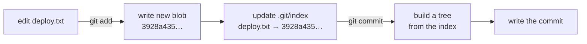
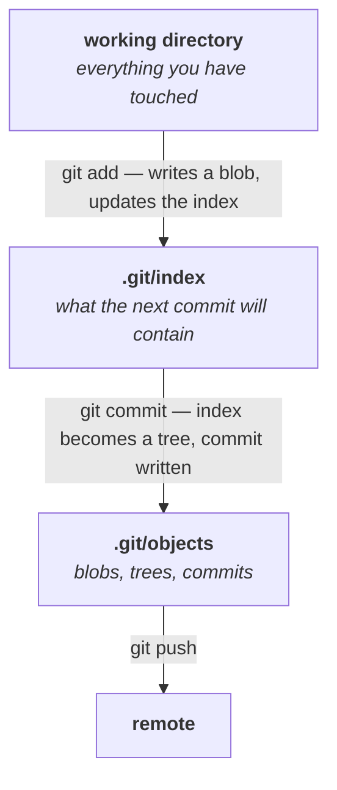

Note `05` finished the object model: blobs, trees, commits, all addressed by the hash of their contents. That accounts for everything Git has *recorded*.

It does not account for the gap in the middle. `git add` happens, and then some time later `git commit` happens, and in between Git is holding something that is not yet a commit. Note `02` called that the staging area and deferred explaining it. Note `04` deferred it again.

This note closes both deferrals — what the staging area physically is, and the question the instructor put to the class directly: **why does it exist at all?**

---

## What is actually inside `.git`

```bash
ls -la .git
```

```
COMMIT_EDITMSG
HEAD
config
description
hooks/
index
info/
logs/
objects/
refs/
```

Most of it you can ignore. Five entries matter:

| Entry | What it is |
|---|---|
| **`objects/`** | the object database — every blob, tree and commit. Notes `04` and `05`. |
| **`index`** | **the staging area** |
| **`refs/`** | branches and tags — a name pointing at a commit ID |
| **`HEAD`** | your current position: which branch you are on |
| **`config`** | this repository's configuration |

> [!info] **`refs/` and `HEAD` are how branches work, and both are simpler than they sound.** A branch is a file containing one commit ID. `HEAD` is a file saying which branch you are on. That is genuinely all — which is why creating a branch in Git is instant, and why the class could keep deferring branches without anything breaking. They get their own treatment when the course reaches merging.

## The index is a file, not a folder

Everything else in that listing with a slash is a directory. `index` is not:

```bash
cd .git/index
```

```
cd: not a directory: .git/index
```

It is a single file. And like the objects in note `04`, reading it directly is useless:

```bash
cat .git/index
```

```
DIRC     ?�K?�...
```

Binary. Git provides a reader instead.

> [!important] **The staging area is not a concept, a mode, or a flag. It is one file: `.git/index`.**
>
> This is why the deferral in note `02` was reasonable — "the staging area" sounds like an abstraction until you can point at the thing on disk. The useful definition:
>
> **The index is Git's proposed contents for the next commit.**

## Reading the index

```bash
git ls-files --stage
```

```
100644 fb251a8fdf7bf699c0476ec75d9894c39bd5cd65 0	app.txt
100644 d81d8132905637897497d7b85ae8d4ed516b6806 0	deploy.txt
```

Mode, **object ID**, stage number, filename.

Those object IDs are the blobs from note `04`. Which tells you what staging really does:

> [!important] **`git add` does not mark a file. It records a specific blob against a filename.**
>
> The index is not a list of *"files I intend to commit"*. It is a list of **exactly which version of each file** will be committed — filename mapped to object ID. That is why the shape of the index and the shape of a tree look so similar: the index is essentially the next tree, being assembled.

Watch it change. Modify a file:

```bash
nano deploy.txt
```

```
this is the first line of deploy.txt
second line of deploy.txt
```

```bash
git status
```

Git reports `deploy.txt` as modified but not staged. Stage it:

```bash
git add deploy.txt
```

```bash
git ls-files --stage
```

```
100644 fb251a8fdf7bf699c0476ec75d9894c39bd5cd65 0	app.txt
100644 3928a435a615f277f91515c3dfb95a4f5cb649b1 0	deploy.txt
```

**`app.txt` is unchanged — same blob.** `deploy.txt` now points at a different object, because its content changed and `git add` wrote a new blob.



> [!tip] **This is the whole `add`/`commit` split in one line.** `git add` writes blobs and updates the index. `git commit` turns the index into a tree, writes a commit object pointing at it, and moves the branch. Neither command does the other's job.

---

## So why does staging exist?

The instructor stopped and put this to the class rather than answering it, which is the right way round — so answer it yourself before reading on.

*You have changed some code. You know you want to commit it. Why must you run two commands? Why can't `git commit` just record whatever is different?*

Answers offered in the class included **security**, **recovery**, **testing**, and **being able to roll back to a known point**. The one he accepted as exactly right:

> **Full control over precisely which changes go into the snapshot.**

### The scenario that makes it concrete

You are working on a service. Over the afternoon you write two separate things:

- a **login API** — finished, tested, working
- a **payment API** — half-written, definitely broken

Both are sitting in your working directory. Your manager asks you to **commit the login API so the rest of the team can use it.**

Think about what committing means, following it all the way through:


If `git commit` recorded everything that changed, **your broken payment code goes with it** — into the shared branch, into everyone's next `git pull`.

Without a staging area your options are all bad:

- **Delete the payment code**, commit, then write it again from scratch.
- **Revert the payment file** to its previous state, commit, then somehow restore your work.
- **Commit the broken code** and hope nobody pulls before you fix it.

Each of those means destroying work in order to record unrelated work.

> [!important] **The staging area exists so that "what I have changed" and "what I am about to commit" can be two different things.**
>
> ```bash
> git add login.java
> ```
> ```bash
> git commit -m "add login API"
> ```
>
> The payment code stays in your working directory, untouched and unstaged. It is not in the commit, not pushed, and not lost. You keep working on it.

The rule the class ended on:

> **Only the files you want in the next commit go into staging. A file you do not want to commit does not belong there.**

> [!tip] **The interview form of this question is common and people answer it badly.** *"Why does Git have a staging area when other version control systems don't?"* — The answer is not "to mark files". It is that **a commit should be a coherent unit of work**, and the working directory is not: it contains everything you happen to have touched. Staging is where you compose the commit you actually want, out of a working directory that contains more than that.

---

## Staging several files at once

`git add` takes as many paths as you want, space-separated:

```bash
git add app.txt deploy.txt
```

> [!info] **`git add .` stages everything under the current directory**, and it is what most people use most of the time. It is also exactly what the section above argues against when your working directory holds work that is not ready. **Run `git status` before `git add .`, every time** — that one habit is the difference between a clean commit and pushing a broken payment API.

---

## One more thing about tokens

A question from the class, and it follows directly from note `03`'s warning:

> [!info] **Q: I saved my token in a file, tried to push, and GitHub refused. Why?**
>
> **Because GitHub scans pushes for secrets and blocks them.** Credentials have recognisable shapes — a GitHub token, an AWS key, an API key from a model provider — and the platform matches those patterns against what you are pushing.
>
> The instructor's broader point: this is not specific to GitHub tokens. Put a paid API key in a config file and push it, and you should expect to be warned. Providers also monitor for their own keys appearing in public repositories.
>
> **Treat the block as the system working, not as an obstacle to route around.** A key that reaches a public repository must be considered compromised and rotated — deleting the commit afterwards does not help, because the object is still in the history and note `04` showed you exactly how recoverable that is.

---

## Where class 4 ends

The full picture, from an edit to a pushed commit:



| Command | What it does |
|---|---|
| `ls -la .git` | see the repository's internals |
| `git ls-files --stage` | read the index — filename to object ID |
| `git add <file> <file>` | stage several files |
| `git add .` | stage everything below the current directory |

And the map of `.git`:

| | |
|---|---|
| `objects/` | blobs, trees, commits — everything recorded |
| `index` | the staging area, as a single binary file |
| `refs/` | branches and tags |
| `HEAD` | where you are now |
| `config` | this repository's settings |

**Still to come**, named explicitly at the end of the class: **branches**, **merge**, **rebase**, and **cherry-picking** — the three operations he wants covered properly in one go — and after that GitHub-level topics: monorepo versus polyrepo, and Git Flow.

All of them are operations on what these notes have already built. A branch is a file holding a commit ID. A merge is a commit with two parents. Nothing new gets invented.

---

*Source: class 4 — 2026-08-16, recording part 5.*
