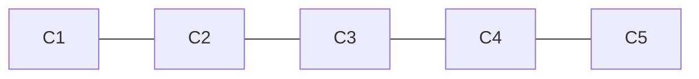
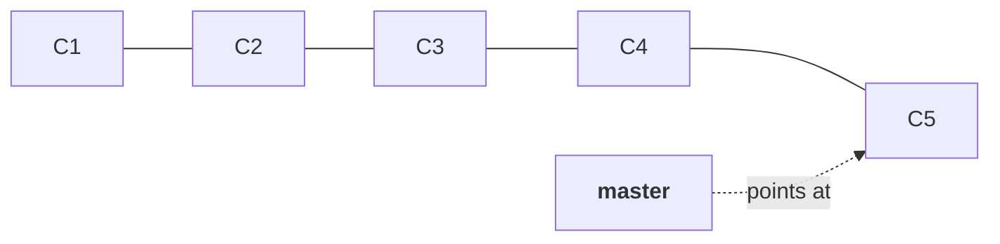
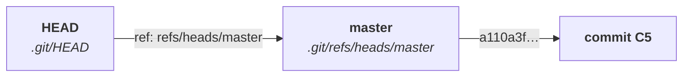
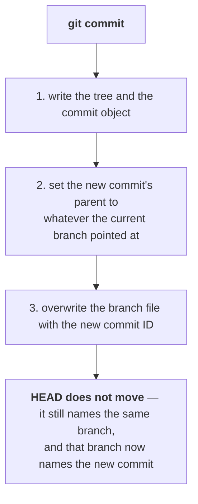
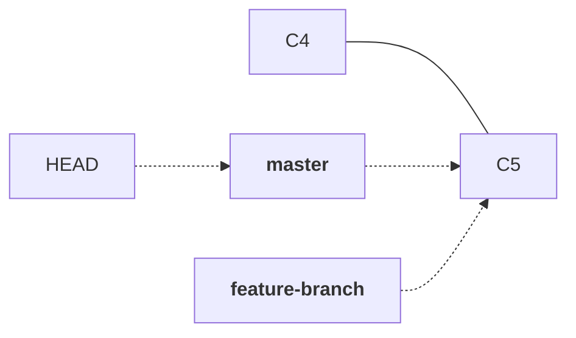
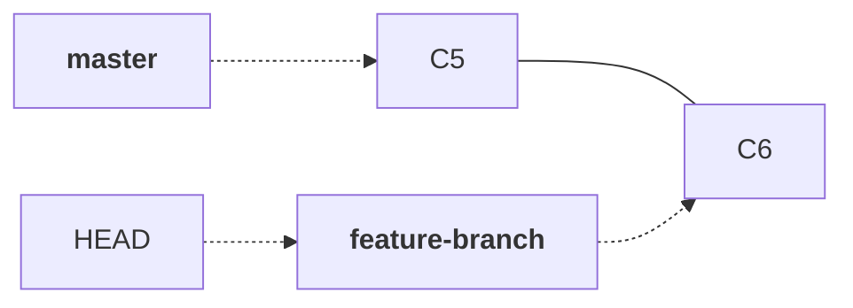
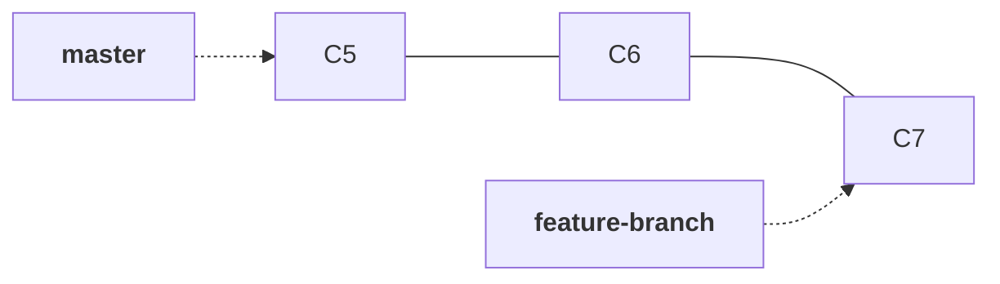

Everything in notes `01` to `06` produced a single straight line. Commits point at their parents, one after another, and `master` is where they all land.



That works perfectly for one person doing one thing at a time. Now put two people on it.

You are three days into a feature. It is not finished — half the code is written, some of it does not compile. Meanwhile a colleague needs to ship a small fix, and the fix has to go live today. Both of you are committing to `master`, and **`master` is the line that gets deployed to production**.

Note `06` solved a version of this: the staging area lets you commit the login API while the broken payment API sits unstaged in your working directory. But that only holds until you commit. The moment your half-finished work becomes a commit on `master`, it is on the line that deploys, and your colleague's fix cannot go out without carrying your broken code along with it.

What you actually want is a second line of history — one where your unfinished work can accumulate commits safely, while `master` stays deployable.

That is a branch.

---

## A branch is a pointer, and you can prove it

The word branch suggests a copy of the project. It is not.

> **A branch is a file containing one commit ID.**

That is the whole thing. Git keeps them in `.git/refs/heads/`, which note `06` listed but did not open:

```bash
ls .git/refs
```

```
heads
remotes
tags
```

`heads` holds your local branches. Look inside:

```bash
ls .git/refs/heads
```

```
master
```

One branch, one file. Read it:

```bash
cat .git/refs/heads/master
```

```
a110a3f9c2b47e5d8a1f06c9e3b285d7f4c61a08
```

A commit ID. Nothing else.

> [!important] **`master` is not special, not a container, and not a copy of anything. It is a 41-byte file holding the ID of one commit.**
>
> This explains something that otherwise looks like magic: **creating a branch in Git is instant, even on a repository with a million commits.** It writes one small file. Compare that with the folder-copying approach note `01` broke — copying a project to work on it separately is exactly what a branch replaces, and a branch does it for the cost of forty-one bytes.

So the picture from the start of this note is more precisely drawn like this:



## HEAD is a pointer to a pointer

There is a second name you have already seen, in every `git log --oneline` output since note `02`:

```
a110a3f (HEAD -> master) 5th commit modified deploy.txt
```

`HEAD` answers a different question from `master`. `master` says which commit that branch is on. **`HEAD` says which branch you are on.** It is a file too:

```bash
cat .git/HEAD
```

```
ref: refs/heads/master
```

Not a commit ID — a path to a branch file. So the chain has two links:



|  | What it holds | What it answers |
|---|---|---|
| **a branch** | one commit ID | where is this line of work up to? |
| **`HEAD`** | the name of a branch | which line of work am I on right now? |

> [!info] **Do not memorise HEAD as the latest commit.** It is one step removed from that, and the difference is the whole point. `HEAD` names a **branch**; the branch names a commit. Say it as **HEAD points to the branch you are on, and that branch points to a commit** — that phrasing survives every case in this note and the next.

### What a commit actually does to these two files

Note `05` said a commit stores a tree and a parent. Here is the other half — what happens to the pointers.



> [!important] **Committing moves the branch, not `HEAD`.** `HEAD` keeps naming the same branch the whole time. It only looks like `HEAD` moved because the branch underneath it did. This is why `git commit` is cheap in pointer terms — it rewrites one small file.

A student in the class said this feels like a linked list, and that is exactly right: each commit holds its parent's address, the branch is a pointer to the head of the list, and `HEAD` is a pointer to that pointer.

---

## Making a second branch

List what exists:

```bash
git branch
```

```
* master
```

The `*` marks the branch you are on. Create a new one:

```bash
git branch feature-branch
```

Nothing is printed. Look again:

```bash
git branch
```

```
  feature-branch
* master
```

Two branches now — and **both point at the same commit**, because the new one was created from where you were standing.



> [!danger] **`git branch <name>` creates a branch. It does not switch to it.**
>
> The `*` is still on `master`. Every commit you make right now still lands on `master` — which is precisely what you created the branch to avoid. This is the single most common branching mistake, and nothing warns you: `git commit` succeeds, `git push` succeeds, and the work is on the wrong line.
>
> **Check `git branch` after creating one, every time, until switching is a reflex.**

### Switching

```bash
git switch feature-branch
```

```
Switched to branch 'feature-branch'
```

Now the marker has moved:

```bash
git branch
```

```
* feature-branch
  master
```

What actually changed on disk is one file — `.git/HEAD` now reads `ref: refs/heads/feature-branch`. That is all switching is, plus updating your working directory to match the commit that branch points at.

> [!tip] **Create and switch in one step**, which is what you will use almost every time in practice:
> ```bash
> git switch -c feature-branch
> ```
> The older equivalent is `git checkout -b feature-branch`. Both create the branch and move `HEAD` onto it.

> [!info] **`switch` and `checkout` both work, and the class used both.** `git checkout` is the original command and does far more than change branches — it also restores files, which is why a typo could silently discard your work. `git switch` was added in **Git 2.23 (2019)** to do only the branch half of the job, alongside `git restore` for the file half. **Prefer `switch`**; recognise `checkout` because most existing material and most colleagues still use it.

---

## Now the two lines actually separate

You are on `feature-branch`. Make a change and commit it in the usual way from note `02`:

```bash
git add deploy.txt
```

```bash
git commit -m "6th commit modified deploy.txt"
```

Look at what moved:



**`master` did not move.** It still points at C5, exactly where it was. Only `feature-branch` advanced, because that is the branch `HEAD` was naming when the commit was written.

That is the isolation you wanted. Your colleague can commit to `master` all day; it has no effect on this line, and this line has no effect on what deploys.

Add another commit the same way and the feature line runs two ahead:



### Seeing this without drawing it yourself

```bash
git log --oneline --graph --decorate --all
```

| Flag | What it adds |
|---|---|
| `--oneline` | one compact line per commit |
| `--graph` | draws the branch structure down the left edge |
| `--decorate` | prints branch names and `HEAD` next to the commits they point at |
| `--all` | includes every branch, not just the one you are on |

> [!tip] **This is the command to reach for whenever you are unsure what state a repository is in** — before a merge, before a rebase, before anything you might have to undo. It is read-only, and it answers the only question that matters: which branches exist, and which commit is each one on.

---

## The remote does not know about your branch

Commit on the feature branch and push, and it fails the same way note `03`'s first push did:

```
fatal: The current branch feature-branch has no upstream branch.
To push the current branch and set the remote as upstream, use

    git push --set-upstream origin feature-branch
```

The reason is the same as before, and it is worth saying plainly: **you created the branch on your machine. The remote has never heard of it.** There is no `feature-branch` on GitHub to push to, so Git will not guess a destination.

```bash
git push --set-upstream origin feature-branch
```

```
 * [new branch]      feature-branch -> feature-branch
branch 'feature-branch' set up to track 'origin/feature-branch'.
```

`-u` is the short form of `--set-upstream`, and you need it **once per branch** — after that, plain `git push` knows where this branch goes.

> [!info] **Every branch has its own upstream.** Setting it for `master` in note `03` did nothing for `feature-branch`. The pairing is per branch, not per repository, which is why this failure comes back the first time you push each new branch you create.

Refresh the repository page and there are now two branches. `master` shows five commits; `feature-branch` shows seven. Same repository, two different answers to what is the latest commit — which is exactly what branches are for.

> [!important] **This is where the DevOps stake shows up.** `master` is what deploys. Nothing on `feature-branch` is live, no matter how many commits it has or how long it has existed. Code becomes live when it reaches the deployed branch and not one moment sooner — which makes the operation that moves it there, merging, the thing worth understanding properly.

---

## Two corrections worth having

> [!warning] **You can branch from any commit, not only from the one you are standing on.**
>
> Asked in class whether a branch could be created at an older commit where `HEAD` is not, the answer given was no. It can:
>
> ```bash
> git branch hotfix a110a3f
> ```
> ```bash
> git switch -c hotfix a110a3f
> ```
>
> Both take a starting commit as the last argument, and this follows directly from what a branch is. If a branch is a file holding a commit ID, then creating one at an arbitrary commit means writing that commit's ID into a new file. There is nothing about `HEAD` in that.
>
> It is also a routine operation in practice — a production hotfix usually branches from the commit that is actually deployed, not from whatever `master` has accumulated since.

> [!info] **Branches are not owned by the branch they were cut from.** A branch can be created from any commit on any branch, including another feature branch, and there is no limit on how many exist. Git records no parent-child relationship between branches at all — only between commits. `feature-branch` does not know it came from `master`; it just holds a commit ID.

---

## Deleting a branch

Once a branch's work has been merged, the pointer has no more use:

```bash
git branch -d feature-branch
```

`-d` is the safe form: it refuses if the branch holds commits that are not reachable from anywhere else, so you cannot lose work by accident. Deleting a branch deletes **the pointer**, never the commits — the objects stay in `.git/objects` exactly as note `04` described.

---

## Summary

| Command | What it does |
|---|---|
| `git branch` | list branches; `*` marks the current one |
| `git branch <name>` | create a branch **without switching to it** |
| `git branch <name> <commit>` | create a branch at a specific commit |
| `git switch <name>` | switch to an existing branch |
| `git switch -c <name>` | create and switch in one step |
| `git checkout <name>` / `-b <name>` | the older equivalents of the two above |
| `git branch -d <name>` | delete a branch pointer, refusing if work would be lost |
| `git push -u origin <name>` | create the branch on the remote and pair it with yours |
| `git log --oneline --graph --decorate --all` | see every branch and where each one points |

| File | Contains |
|---|---|
| `.git/refs/heads/<branch>` | one commit ID — the branch |
| `.git/HEAD` | `ref: refs/heads/<branch>` — the branch you are on |

The mental model, in one line: **`HEAD` names a branch, the branch names a commit, and committing rewrites the branch file.**

Two lines of history now exist, and the feature work is finished. It still is not live, because live means `master`.

---

*Source: class 5 — 2026-08-20, recording part 1.*
