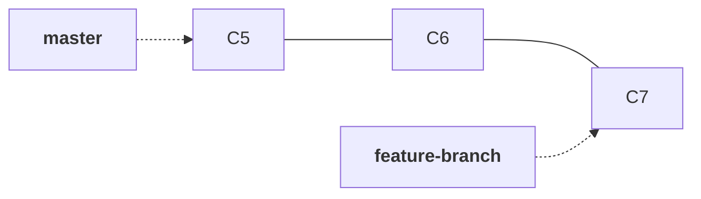
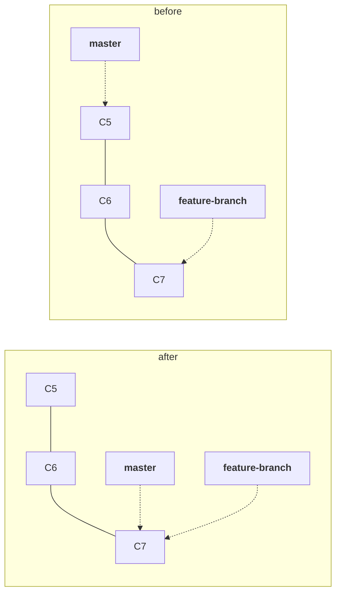
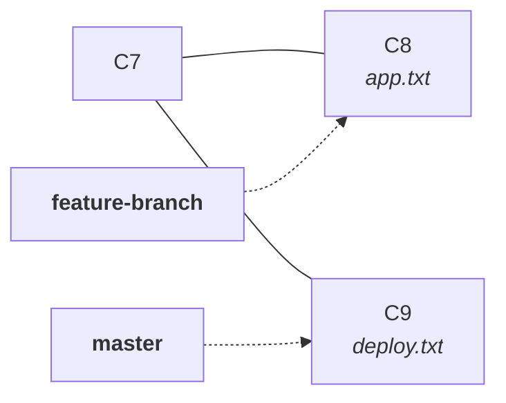
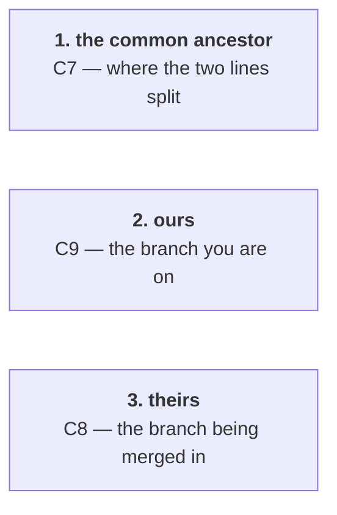
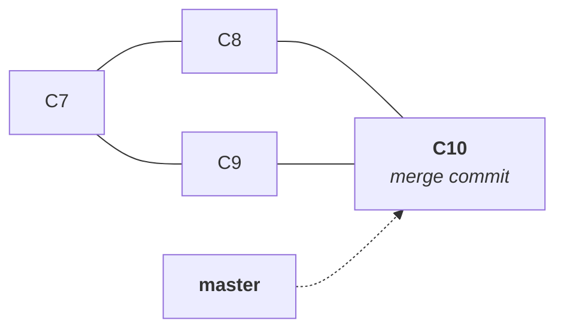
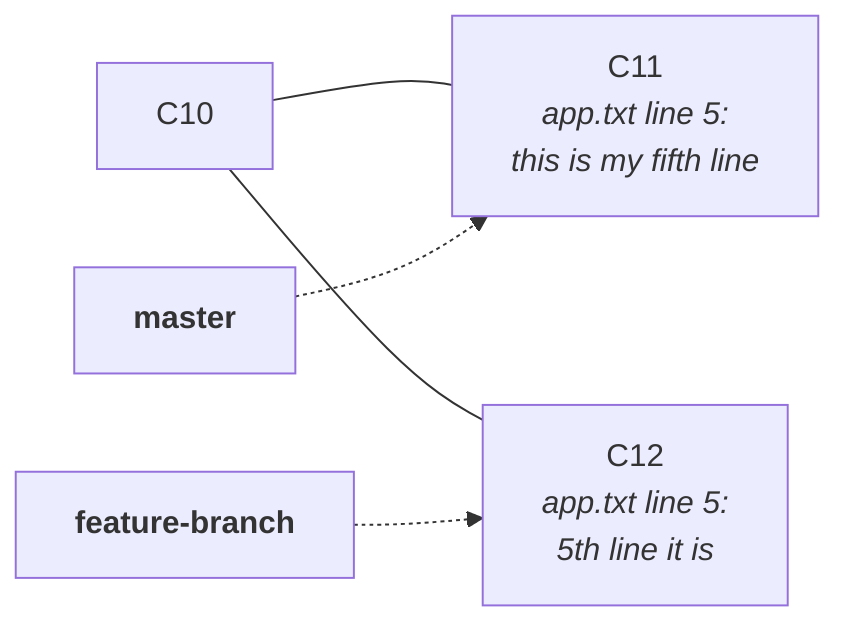
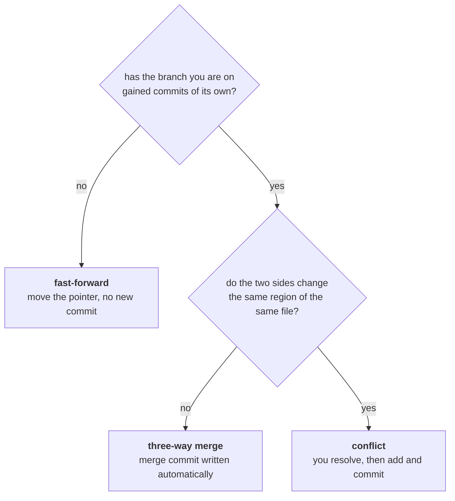

Note `07` left the repository in a deliberate state: two branches, and the work that matters is on the wrong one.



`feature-branch` has the finished feature. `master` is what deploys. Getting those two commits onto `master` is merging, and Git does it two completely different ways depending on what `master` has been doing in the meantime.

Start with the easy case, because the easy case is genuinely easy — and then break it.

---

## Fast-forward: when one branch never moved

Look carefully at the diagram above. **`master` has no commits of its own.** C5 is not just an ancestor of C7, it is on the same unbroken line. Every commit `master` has, `feature-branch` also has.

So combining them requires no thought at all. Nothing has to be reconciled, because nothing competes. `master` simply needs to end up further along a line it is already on.

Switch to the branch that should receive the work — **you merge into the branch you are standing on** — and merge:

```bash
git switch master
```

```bash
git merge feature-branch
```

```
Updating a110a3f..7e20b6d
Fast-forward
 deploy.txt | 2 ++
 1 file changed, 2 insertions(+)
```



> [!important] **A fast-forward merge creates no commit. It moves a pointer.**
>
> Git wrote no new object. It overwrote `.git/refs/heads/master` with C7's ID, and that was the entire operation. The two commits were already in the object database — note `04` and `05` showed that content lives in exactly one place — so there was nothing to copy.
>
> The name says what it does: `master` was behind on a line it was already on, so Git **fast-forwarded** it to the front.

> [!info] **What a fast-forward guarantees, and what it does not.** It guarantees the history stays one straight line with no extra commit, and that no content decision was made on your behalf. It does **not** guarantee the result works — Git checked that the histories were related, not that the code compiles. A fast-forward can absolutely put broken code on `master`; it only means there was nothing to reconcile.

Both branches now point at C7. Push, and the deployed branch finally carries the feature.

---

## Break it: make both sides move

Fast-forward worked because `master` sat still. In a real team `master` never sits still — someone else merges something, a hotfix goes out, and the branch you left behind moves on without you.

Recreate that on purpose. First, a commit on the feature branch touching `app.txt`:

```bash
git switch feature-branch
```

```bash
git commit -m "8th commit modified app.txt"
```

Then switch back and commit on `master`, touching a **different** file:

```bash
git switch master
```

```bash
git commit -m "9th commit modified deploy.txt"
```



The history has **diverged**. C8 and C9 are both children of C7, and neither branch contains the other's commit.

Now fast-forward is impossible, and the reason is worth stating precisely: **there is no line for `master` to move along.** Moving `master` forward to C8 would silently abandon C9, which is a commit `master` already has. Git will not throw work away to make a merge simpler.

---

## Three-way merge

```bash
git merge feature-branch
```

An editor opens with a message already filled in:

```
Merge branch 'feature-branch'
```

Save and close it, and Git reports:

```
Merge made by the 'ort' strategy.
 app.txt | 1 +
 1 file changed, 1 insertion(+)
```

What Git did is in the name **three-way**. It looked at three snapshots, not two:



Then it asked two questions — **what changed from the ancestor to ours**, and **what changed from the ancestor to theirs** — and combined the two sets of changes into a new commit.



> [!important] **Comparing against the ancestor is what makes merging possible at all.** Comparing C8 and C9 directly would only show that they differ; it could not tell which side introduced what. The ancestor turns two unrelated snapshots into two sets of **changes**, and changes can be combined.

> [!info] **`ort` is the name of the merge algorithm, and it is version-sensitive.** It became the default in **Git 2.34 (November 2021)**, replacing `recursive`. On older versions the same merge reports `Merge made by the 'recursive' strategy.` Same idea, different implementation — if you see `recursive`, your Git predates 2.34.

### The merge commit has two parents, and you can prove it

This is the part worth doing by hand, because `git cat-file` from note `05` makes it checkable.

Take C9, an ordinary commit:

```bash
git cat-file -p 4d3e91c7a58b0264fd93e17c8ab540926df1e73b
```

```
tree 5c8ba07e1d2f9034ab6e75c1908df34a2e6b0715
parent a110a3f9c2b47e5d8a1f06c9e3b285d7f4c61a08
author Your Name <you@example.com> 1755720000 +0530
committer Your Name <you@example.com> 1755720000 +0530

9th commit modified deploy.txt
```

One `parent` line, pointing at C7. Now C8, the commit on the other branch:

```bash
git cat-file -p 7e20b6d41f83c9a5e2074bd6183fa9c05e7b32d1
```

```
tree 2f9d10c47b53ae86f0d1927c34ba5e08d67f1c93
parent a110a3f9c2b47e5d8a1f06c9e3b285d7f4c61a08
author Your Name <you@example.com> 1755719000 +0530
committer Your Name <you@example.com> 1755719000 +0530

8th commit modified app.txt
```

**The same parent, `a110a3f…`.** That is the divergence, visible as data rather than as a drawing — two commits naming one parent is what a fork in history actually is.

Now the merge commit:

```bash
git cat-file -p HEAD
```

```
tree 8b1e40d7a2c56f39d0b47e2185ca3f607d9e21b4
parent 4d3e91c7a58b0264fd93e17c8ab540926df1e73b
parent 7e20b6d41f83c9a5e2074bd6183fa9c05e7b32d1
author Your Name <you@example.com> 1755721000 +0530
committer Your Name <you@example.com> 1755721000 +0530

Merge branch 'feature-branch'
```

**Two `parent` lines.**

> [!important] **A merge commit is an ordinary commit with one extra parent.** No new object type was invented for merging — note `05`'s object model already covered this. A commit stores a tree and its parents; usually there is one parent, and a merge has two.
>
> The order matters and is not arbitrary: **the first parent is the branch you were on** (`ours`, C9), **the second is the branch you merged in** (`theirs`, C8). That ordering is what lets tools reconstruct which side of a merge a commit came from long afterwards.

> [!info] **These commit IDs are illustrative.** As note `05` explained, a commit's ID hashes the author and the timestamp along with its content, so yours will differ. The blob and tree IDs in notes `04` and `05` were reproducible; commit IDs never are.

### Why that merge produced no conflict

C8 changed `app.txt`. C9 changed `deploy.txt`. **Different files, so there was nothing to decide** — Git took both changes and wrote the result.

That is worth pausing on, because it is the answer to a question asked directly in class and it sets up everything below. A three-way merge is not inherently difficult or dangerous. **Divergence causes a merge commit. Divergence does not cause a conflict.** Most merges of diverged branches complete on their own, without asking you anything.

A conflict needs something more specific.

---

## Break it again: the same file, the same place

Set it up deliberately. On `master`, add a fifth line to `app.txt`:

```
this is my fifth line
```

```bash
git commit -m "11th commit modified app.txt"
```

Then on `feature-branch`, add a fifth line to **the same file, in the same place**, with different text:

```
5th line it is
```

```bash
git commit -m "12th commit modified app.txt"
```



Merge, and Git stops:

```bash
git switch master
```

```bash
git merge feature-branch
```

```
Auto-merging app.txt
CONFLICT (content): Merge conflict in app.txt
Automatic merge failed; fix conflicts and then commit the result.
```

Read the three-way comparison again with this case in mind. Ancestor to ours: **a line was added at the end of `app.txt`**. Ancestor to theirs: **a line was added at the end of `app.txt`**. Both sides changed the same region of the same file, and Git has no basis for preferring either.

> [!important] **A conflict is not an error, and it is not Git failing.** It is Git declining to guess. It could pick one side, or concatenate them, or take the longer one — and any of those could silently destroy someone's work. Instead it stops and hands you a decision that only a human can make, because only a human knows what the code is supposed to do.

### What the conflicted file looks like

Git leaves the file on disk with both versions marked:

```
this is my fourth line
<<<<<<< HEAD
this is my fifth line
=======
5th line it is
>>>>>>> feature-branch
```

| Marker | Meaning |
|---|---|
| `<<<<<<< HEAD` | start of **your** side — the branch you are on |
| `=======` | the divider |
| `>>>>>>> feature-branch` | end of **their** side — the branch being merged in |

`git status` says the same thing in a different form:

```
On branch master
You have unmerged paths.
  (fix conflicts and run "git commit")
  (use "git merge --abort" to abort the merge)

Unmerged paths:
  (use "git add <file>..." to mark resolution)
	both modified:   app.txt
```

**`both modified`** is the phrase to recognise — that is a conflicted file, as opposed to the ordinary staged and unstaged states from note `02`.

### Resolving it

Resolution is plain text editing. Open the file and leave it holding **exactly what you want the final content to be**, markers removed.

Your options are genuinely all of them:

| Choice | When |
|---|---|
| **keep yours** | their change is obsolete or wrong |
| **keep theirs** | yours is |
| **keep both** | the two changes are independent and the tool merely could not tell |
| **write something else entirely** | both sides are half right and the correct result is neither |

In the class both lines were kept:

```
this is my fourth line
this is my fifth line
5th line it is
```

Then finish the merge with the commands you already know:

```bash
git add app.txt
```

```bash
git commit -m "13th commit merged app.txt"
```

> [!important] **`git add` on a conflicted file means resolved.** It is the same command from note `06`, doing the same thing — recording a specific blob against a filename in the index. What makes it a resolution is that the index had a conflict recorded for that path and now has one agreed version instead. That is also why `git status` phrases it as **mark resolution**: Git never checks whether your edit is correct, only whether you staged something.
>
> **Removing every conflict marker is your job, and nothing checks it.** Stage a file with `<<<<<<<` still in it and Git commits it happily. Those markers reaching production is a real and common outage.

The commit that ends a conflicted merge is still an ordinary merge commit with two parents — the conflict changed how the content was decided, not the shape of the result.

> [!warning] **Getting out of a merge you did not mean to start** — this command was not shown in class, and it is the one people most need on the day.
>
> ```bash
> git merge --abort
> ```
>
> This throws away the in-progress merge and returns the working directory to exactly where it was before you ran `git merge`. It is safe, it is what `git status` itself suggests during a conflict, and it is far better than trying to hand-edit your way out of a merge you should not have attempted.

---

## Merging the other direction

Merging is not something branches only do at the end. A long-lived feature branch falls behind `master` while other people's work lands there, and the further behind it drifts, the worse the eventual conflict.

The fix is to merge the other way — bring `master` into your branch, regularly:

```bash
git switch feature-branch
```

```bash
git merge master
```

If your branch has no commits `master` lacks, this fast-forwards exactly as before. If both have moved, you get a merge commit on the feature branch — where its conflicts are yours to resolve, on your own branch, without holding up anyone else.

> [!tip] **Merge direction is decided by which branch you are standing on.** `git merge X` always means bring X's work into the current branch. There is no argument for the destination, which is why forgetting to switch first is such an easy way to put work on the wrong branch — and why `git branch` before `git merge` is worth the two seconds.

### Would pulling first have helped?

A good question from the class: before merging into `master`, should you not pull first and avoid all this?

**It changes nothing about the divergence.** Note `03` established that:

```
git pull  =  git fetch  +  git merge
```

Pulling fetches the remote's commits and then merges them into your current branch. If the two lines have diverged, that merge faces the identical decision — same ancestor, same two sides, same conflict if the same region changed. Pulling can move *where* you resolve a conflict, and doing it early makes conflicts smaller and more frequent rather than rare and enormous. It cannot make the conflict not exist.

---

## Summary



| Command | What it does |
|---|---|
| `git merge <branch>` | merge that branch into the one you are on |
| `git merge --abort` | cancel a conflicted merge and restore the previous state |
| `git cat-file -p HEAD` | inspect a commit — a merge commit shows two `parent` lines |
| `git add <file>` | mark a conflicted file resolved |
| `git commit` | complete the merge |

| Term | Meaning |
|---|---|
| **fast-forward** | the branch moves along a line it is already on; no commit created |
| **three-way merge** | ancestor plus both sides, combined into a new commit with two parents |
| **ours** / **theirs** | the branch you are on / the branch being merged in |
| **conflict** | both sides changed the same region, so Git stops and asks |

The thing to carry forward: **merging never rewrites what already exists.** C8 and C9 stayed exactly as they were, keeping their IDs, and a new commit was added that points at both. The history now records that two lines existed and came back together.

That faithfulness has a cost. Every merge of a diverged branch leaves a merge commit, and a busy repository accumulates them until the graph is more merge than work. Which raises the question the class ended on: if merge already does the job, why does rebase exist?

---

*Source: class 5 — 2026-08-20, recording parts 1–2. Fast-forward and the three-way merge are in part 1; the conflict walkthrough is part 2.*
